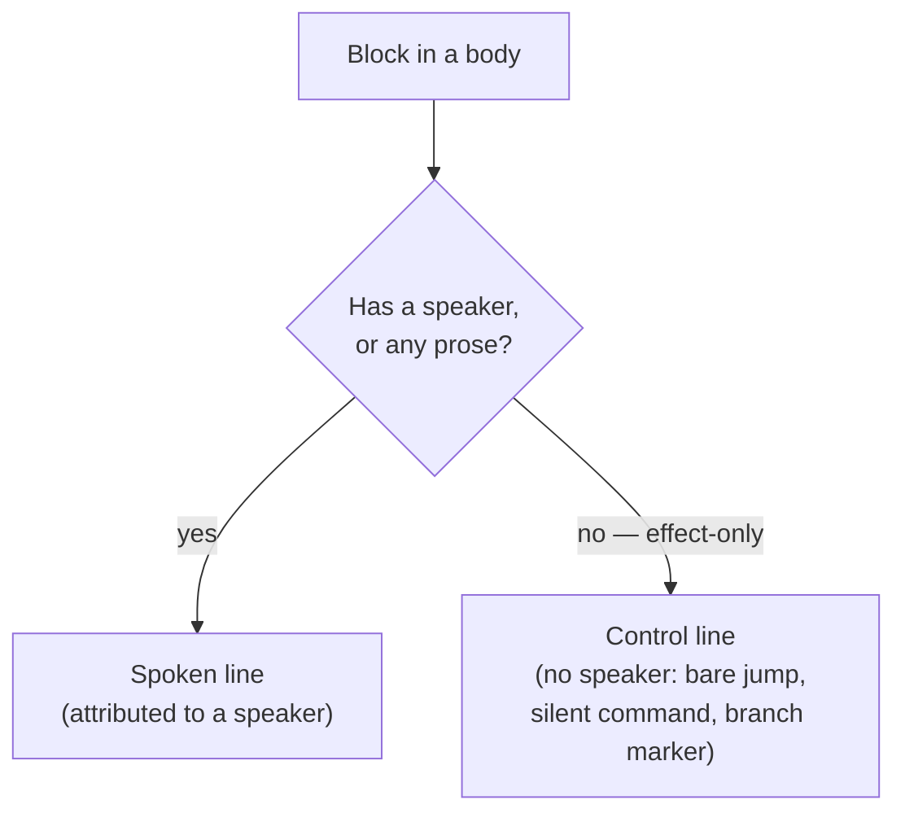

# Block controls

> [!NOTE]
> Status: **exploring**. This note is an **options-and-evaluation survey** for two
> related, not-yet-decided pieces of the language: a **block `if`/`elseif`/`else`**
> construct, and a **spoken vs. effect-only line** distinction that supports it. It
> deliberately **does not pick a design** — it records the alternatives and their
> tradeoffs so the choice can be made with the evidence in view. It builds on the
> **condition** primitive (`` `"key"?` ``) from the
> [Conditional Jump](./Conditional%20Jump.md),
> [Conditional Line](./Conditional%20Line.md), and
> [Conditional Choice](./Conditional%20Choice.md) notes, and on the flow model in
> the [Progression Order](./Progression%20Order.md) note; read those first.

## Table of contents

- [Block controls](#block-controls)
  - [Table of contents](#table-of-contents)
  - [Goal and scope](#goal-and-scope)
  - [Ubiquitous language](#ubiquitous-language)
  - [Guiding constraints](#guiding-constraints)
  - [Prior art](#prior-art)
  - [Design dimension 1 — container shape](#design-dimension-1--container-shape)
  - [Design dimension 2 — marker spelling](#design-dimension-2--marker-spelling)
  - [Design dimension 3 — grouping a branch body](#design-dimension-3--grouping-a-branch-body)
  - [Design dimension 4 — rendering in a stock Markdown preview](#design-dimension-4--rendering-in-a-stock-markdown-preview)
  - [A supporting distinction — spoken line vs. control line](#a-supporting-distinction--spoken-line-vs-control-line)
  - [Naming the effect-only node](#naming-the-effect-only-node)
  - [Open questions and decisions deferred](#open-questions-and-decisions-deferred)

## Goal and scope

A writer often wants a **group** of dialogue — several lines, a choice, a jump — to
play only under some game-state condition, and to fall back to an alternative
otherwise. The inline **condition** (`` `"key"?` ``) already guards a single
[jump](./Conditional%20Jump.md), [line](./Conditional%20Line.md), or
[choice option](./Conditional%20Choice.md), each **independently** and with **no
`else`**. A **block `if`/`elseif`/`else`** is the complementary construct the
Conditional Choice note anticipated: **grouped, mutually-exclusive** branches with
an optional fallback.

This note surveys the design space for that construct and for the **spoken vs.
effect-only line** distinction it leans on. It stays at the level of options and
evaluation.

In scope:

- The syntax space for a block conditional: how branches open, separate, and end.
- How a branch **groups** more than one block of content.
- How each candidate **renders** in a stock VS Code / GitHub Markdown preview.
- The modeling question of an **effect-only line** (a bare jump or a silent
  command, and later a branch marker) that is not attributed to a speaker.

Out of scope (deferred to the eventual decision and its own notes):

- A chosen syntax, grammar, or lowering.
- Runtime evaluation of a branch (which belongs to the graph/runtime).
- **Negation** and **in-script expressions** — unchanged from the condition
  primitive: a writer expresses "unless" through a game-defined inverse flag, and
  the game composes logic behind a single key.

## Ubiquitous language

| Term | Meaning |
| --- | --- |
| **Condition** | The existing game-state query read as a boolean, `` `"key"?` ``. |
| **Branch** | One arm of the construct: an `if`, an `elseif`, or the `else`. |
| **Marker** | The token that opens a branch (`if`/`elseif`/`else`) or closes the block. |
| **Branch body** | The grouped content a branch plays when taken. |
| **Group** | A bundle of one or more blocks treated as one unit — a branch body is a group. |
| **Spoken line** | A line attributed to a speaker (a named one, or the configured default). |
| **Control line** | An effect-only line with no speaker — a bare jump, a silent command, or a branch marker (working name; see [naming](#naming-the-effect-only-node)). |

## Guiding constraints

Three project constraints shape — and in places eliminate — options below.

- **Reuse the condition primitive.** A block conditional should test the same
  `` `"key"?` `` condition writers already know, not invent a second spelling.
- **Render well in a stock preview.** The raw script should read acceptably in a
  plain VS Code / GitHub Markdown preview, which has **no directive or admonition
  plugin** and applies **HTML sanitization**.
- **Keep the core engine-agnostic and the grammar collision-free.** A new marker
  must not clash with the existing code-span family — a query (`` `"key"` ``), a
  condition (`` `"key"?` ``), or a command (`` `Ident(args)` ``).

## Prior art

Six dialogue and scripting languages, plus the Markdown container ecosystem, were
surveyed from primary sources. Block conditionals divide into three
**terminator families**.

| Language | Open / separator / else | Terminator | Family |
| --- | --- | --- | --- |
| Yarn Spinner | `<<if>>` / `<<elseif>>` / `<<else>>` | `<<endif>>` | explicit terminator |
| SugarCube (Twine) | `<<if>>` / `<<elseif>>` / `<<else>>` | `<</if>>` | explicit terminator |
| AsciiDoc | `ifdef::[]` (no `elseif`) | `endif::[]` | explicit terminator |
| Ink | `{ cond:` / `- cond:` / `- else:` | `}` | bracket |
| Harlowe (Twine) | `(if:)[` / `(else-if:)[` / `(else:)[` | `]` per hook | bracket / hook |
| Ren'Py | `if:` / `elif:` / `else:` | dedent | indentation |
| Markdown `:::` directives | `:::name` (no branch separator) | `:::` | container fence |

Two lasting lessons:

- **A block conditional needs a defined boundary.** Every mature language marks
  the end explicitly (`<<endif>>`, `}`, closing `]`) or by indentation dedent. None
  leaves the last branch to run until the next unrelated content.
- **Markdown containers do not separate branches.** Markdig's
  `CustomContainerParser` (and the remark-directive family it mirrors) has **no
  branch-separator concept**: a `:::elseif` line inside a `:::if` opens a *nested*
  container rather than a sibling branch. A flat `if`/`elseif`/`else` chain in a
  single `:::` block would require a **custom parser**, confirmed against the
  Markdig source and a local parse.

## Design dimension 1 — container shape

Whether the whole construct is **one** unit or **several**.

| | Combined (one construct) | Separate (one per branch) |
| --- | --- | --- |
| Grouping cue | branches read as one mutually-exclusive unit | branches read as independent asides |
| Terminator | one boundary for the whole block | one per branch |
| Mutual-exclusion clarity | high | lower — a chain must be inferred |
| Interaction with shipped semantics | distinct from independent conditional lines | risks reading like today's independent conditional lines |

## Design dimension 2 — marker spelling

How a branch marker is written as a code span. Three candidates, testing the
`if` branch:

- **(a) command-style** — `` `If("Rich"?)` `` / `` `ElseIf("Poor"?)` `` / `` `Else` ``.
- **(b) dedicated, one span** — `` `if "Rich"?` `` / `` `elseif "Poor"?` `` / `` `else` ``.
- **(c) separated, two spans** — `` `if` `` `` `"Rich"?` `` / `` `elseif` `` `` `"Poor"?` `` / `` `else` ``.

| Metric | (a) `If(...)` | (b) `if "cond"?` | (c) `if` + `"cond"?` |
| --- | --- | --- | --- |
| Reads as | a function call / an action | a sentence | two chips |
| Chips rendered | one | one | two |
| Condition reuse | wrapped in parens (non-standard) | embeds the standard `` `"key"?` `` | the exact `` `"key"?` `` token, untouched |
| Grammar safety | **collides** with the command form `` `Ident(args)` `` | no collision | no collision |
| Editor projections | condition hidden in parens | projection reads inside the compound span | standalone condition span reuses existing highlighting and completion |

The command-style **(a)** also inverts the established distinction that a command
*acts* while a condition *reads*.

## Design dimension 3 — grouping a branch body

A branch body is often several utterances. In this language each utterance is its
own paragraph, **separated by a blank line** (soft wrapping stays within one
utterance), so a branch body spans several blank-line-separated blocks. That fact
eliminates some notations outright.

| Notation | Groups multi-utterance? | Non-intrusive to author? | Renders in a stock preview? |
| --- | --- | --- | --- |
| Blockquote wrapper (`>` per line) | yes (across blank lines) | no — `>` on every line, `> >` when nested | yes — an indented, visibly grouped block |
| Explicit terminator marker (`` `endif` ``) | yes | yes — ordinary lines, blank lines fine | yes — plain lines plus marker chips |
| Blank-line delimited (no wrapper, no end) | **no** — a natural blank line splits the branch | yes | the second utterance escapes the branch |
| 4-space indentation (Ren'Py style) | — | — | **no** — four spaces is a Markdown code block |
| `:::` container fence | yes (inside) | yes | **no** — `:::` shows as literal text |
| Fenced code block | condition detaches from body | mixed | renders as a gray code box (reads as code) |
| `
` / `
` | yes | no — verbose HTML per branch | collapses and **hides** the body; no `elseif` chaining |
| `<aside>` wrapper | — | no — verbose HTML | GitHub's sanitizer **strips** the tag; no grouping |

Two notations survive as viable, undecided options: the **blockquote wrapper** and
the **explicit terminator marker**. They trade off directly — the blockquote shows
nesting visually but taxes authoring with `>` (and `> >` when nested) and overloads
Markdown's *quotation* meaning; the terminator marker keeps authoring clean and
borrows no container, but renders flat, so nesting is read by matching `if`/`endif`
rather than by indentation.

> [!NOTE]
> If the terminator marker is chosen, its keyword should avoid clashing with the
> existing `#END` run terminator from the [Progression Order](./Progression%20Order.md)
> note — for example `` `endif` `` or a closing-tag `` `/if` `` rather than a bare
> `` `end` ``.

## Design dimension 4 — rendering in a stock Markdown preview

A stock preview has no directive or admonition plugin and sanitizes HTML, which
constrains the surface syntax more than the parser does.

- **`:::` directives** render as **literal** `:::if` … `:::` text — visual noise.
- **Fenced code blocks** render the condition as a detached gray **code box**.
- **`
`** renders a **collapsed** disclosure that hides the branch until
  clicked; **`<aside>`** is stripped by GitHub's sanitizer.
- **Code-span markers** (`` `if "cond"?` ``, `` `else` ``) render as clean
  monospace **chips** in every previewer, and a **blockquote** renders as an
  indented, visibly grouped block.

The construct's own richer view — indented branch tree, matched `if`/`endif` — can
also be supplied by DialogueDown's
[visualization report](./Semantic%20Model%20Visualization%20Tab.md), independent of
how the raw Markdown previews.

## A supporting distinction — spoken line vs. control line

A block marker is a control token, never spoken — which surfaces a pre-existing
modeling question worth resolving on its own.

Today a [`Jump`](./Conditional%20Jump.md) and the command nodes are
**inline fragments**, so a bare jump or a silent command on its own line becomes a
`Line` with **no speaker**, and the desugar step fills any speaker-less line with
the **configured default speaker**. That overloads the line's optional speaker to
mean two different things — *"spoken, speaker unspecified, use the default"*
(narration) and *"not spoken at all"* (an effect). When a game configures the
default speaker to a named character, jumps and commands are then attributed to
that character.

A cleaner model splits the type:

The boundary that preserves default-speaker **narration** is: a line is
effect-only when it names **no speaker** *and* its content is **entirely effect
fragments** (jumps and commands). A speaker-less line that still carries prose
stays a spoken line — narration by the default speaker, as intended.

This distinction is independent of the block conditional and valuable on its own
(it removes the jump/command misattribution), and the block markers reuse it: a
marker is a control line, so it is never modeled as default-speaker speech. An
alternative to a distinct type is a flag on the existing line (for example
`IsControl`); that keeps the overloaded speaker field and pushes a branch onto
every downstream consumer, where a distinct type lets the type system carry the
distinction.

## Naming the effect-only node

Two naming families are in play for the effect-only node and the block container.

| | **Control**Line / **Control**Block | **Directive**Line / **Directive**Block |
| --- | --- | --- |
| Fit for control-flow (jump, `if`) | strong — matches "control flow" | good — a jump or `if` directs the runtime |
| Fit for side-effect commands | weaker — a state mutation is not flow | strong — a command is literally a directive |
| Umbrella accuracy over both | leans control-flow | covers effects and flow uniformly |
| Ecosystem resonance | generic programming-language vocabulary | echoes Markdown **directives** (remark-directive, AsciiDoc) |
| Approachability | intuitive | slightly more abstract |

## Open questions and decisions deferred

The following are intentionally **not decided** in this note:

- **Container shape** — combined vs. separate ([D1](#design-dimension-1--container-shape)).
- **Marker spelling** — `If(...)` vs. `if "cond"?` vs. `if` + `"cond"?`
  ([D2](#design-dimension-2--marker-spelling)).
- **Grouping mechanism** — blockquote wrapper vs. explicit terminator marker
  ([D3](#design-dimension-3--grouping-a-branch-body)).
- **Terminator keyword** — if a terminator is chosen, `` `endif` ``, `` `/if` ``, or
  another spelling that avoids the `#END` clash.
- **Effect-only node naming** — Control vs. Directive
  ([naming](#naming-the-effect-only-node)).
- **Sequencing** — whether the spoken-vs-control distinction lands as its own
  construct before the block conditional builds on it.
