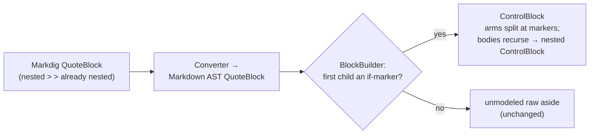

# Block controls

> [!NOTE]
> Status: **designed, not yet implemented**. It records the chosen shape (a condensed
> survey), then the grammar, AST, and transpile-time recognition ready to build.
> Runtime evaluation is deferred to the graph/runtime
> ([#45](https://github.com/pengzhengyi/dialoguedown/issues/45)).

## Table of contents

- [Block controls](#block-controls)
  - [Goal and scope](#goal-and-scope)
  - [Functionality checklist](#functionality-checklist)
  - [Ubiquitous language](#ubiquitous-language)
  - [Prior art](#prior-art)
  - [Chosen shape](#chosen-shape)
    - [Marker spelling — two spans](#marker-spelling--two-spans)
    - [Grouping — one connected blockquote](#grouping--one-connected-blockquote)
    - [Rendering in a stock preview](#rendering-in-a-stock-preview)
  - [Writer-facing behavior](#writer-facing-behavior)
  - [Grammar](#grammar)
  - [Architecture](#architecture)
  - [Interfaces and responsibilities](#interfaces-and-responsibilities)
  - [Key design decisions](#key-design-decisions)
    - [D1 — Recognize in the transpiler, from the blockquote structure](#d1--recognize-in-the-transpiler-from-the-blockquote-structure)
    - [D2 — The marker is the two-span form](#d2--the-marker-is-the-two-span-form)
    - [D3 — One connected blockquote, enforced; a severed chain is an error](#d3--one-connected-blockquote-enforced-a-severed-chain-is-an-error)
    - [D4 — `ControlBlock` / `Branch` mirror `Choices` / `Choice`](#d4--controlblock--branch-mirror-choices--choice)
    - [D5 — Editor support offsets the `>` authoring tax](#d5--editor-support-offsets-the--authoring-tax)
    - [D6 — A scene is a top-level unit; no heading inside a branch](#d6--a-scene-is-a-top-level-unit-no-heading-inside-a-branch)
    - [D7 — Separate every marker and utterance with a quoted blank line](#d7--separate-every-marker-and-utterance-with-a-quoted-blank-line)
  - [Markdown interaction](#markdown-interaction)
  - [Diagnostics](#diagnostics)
  - [Error and boundary cases](#error-and-boundary-cases)
  - [Testability](#testability)
  - [Alternatives not chosen](#alternatives-not-chosen)
  - [Open questions and deferred work](#open-questions-and-deferred-work)

## Goal and scope

A writer often wants a **group** of dialogue — several lines, a choice, a jump — to
play only under some game-state condition, and to fall back otherwise. The inline
**condition** (`` `key?` ``) already guards a single
[jump](./Conditional%20Jump.md), [line](./Conditional%20Line.md), or
[choice option](./Conditional%20Choice.md), each **independently** and with **no
`else`**. This construct is the complementary one: a **block `if`/`elseif`/`else`** —
**grouped, mutually-exclusive** branches with an optional fallback.

In scope: the surface **shape** (marker spelling and grouping), the **grammar**, the
**AST** and how it is recognized while transpiling, **diagnostics**, and source
**spans**.

Out of scope: **runtime evaluation** — choosing and playing a branch belongs to the
graph/runtime ([#45](https://github.com/pengzhengyi/dialoguedown/issues/45)) — and
**negation / in-script expressions**, unchanged from the condition primitive (a
writer composes logic behind a single game-defined key).

This note assumes the shipped [Unquoted Keys](./Unquoted%20Keys.md) and
[Control Line](./Control%20Line.md) notes and does not repeat them: a **condition** is
unquoted by default, and a branch **marker** is a *control line* (an effect-only,
speaker-less block). Read those, plus [Progression Order](./Progression%20Order.md),
first.

## Functionality checklist

Design targets for the implementation:

- [ ] Recognize a **connected blockquote** led by an `` `if` `` marker as a single
      `ControlBlock` with mutually-exclusive branches.
- [ ] Parse the **two-span marker** — `` `if` ``/`` `elseif` `` plus the verbatim
      condition span `` `cond?` ``, and a bare `` `else` `` — reusing the shipped
      condition reader.
- [ ] Group each **branch body** across blank-line-separated utterances, bounded by
      the blockquote (no terminator keyword).
- [ ] Nest via a nested `> >` blockquote, recursively.
- [ ] Report a **severed chain** (a `` `elseif` ``/`` `else` `` opening its own
      blockquote) and **malformed marker order** as errors; never silently re-pair.
- [ ] Report a **scene heading inside a branch** — a scene stays a top-level unit.
- [ ] Require a **quoted blank line** between markers/utterances and to close a nested
      branch; report a marker fused into content.
- [ ] Keep a **non-marker blockquote** an unmodeled raw aside, unchanged.
- [ ] Preserve source spans of the block, each branch, and each condition.
- [ ] Handle `ControlBlock` in every block switch (rewriter, traversal, projection,
      validation), enforced by the compiler.

## Ubiquitous language

| Term | Meaning |
| --- | --- |
| **Condition** | The shipped game-state boolean, `` `key?` `` (see [Unquoted Keys](./Unquoted%20Keys.md)). |
| **Marker** | The token that opens a branch: `` `if` `` / `` `elseif` `` (each with a condition) or `` `else` ``. A *control line* (see [Control Line](./Control%20Line.md)). |
| **Branch** | One arm — an `if`, an `elseif`, or the `else` — a guarding condition (none for `else`) plus its body. |
| **Branch body** | The blocks a branch plays when taken; may hold a nested control block. |
| **Control block** | The whole construct: an ordered list of branches, held in one connected blockquote. |
| **Connected blockquote** | A single `>` container holding every branch, continued across arm boundaries by a bare `>` line; a nested branch is a `> >` container. |

## Prior art

Surveyed from primary sources, block conditionals divide into three **terminator
families**.

| Language | Open / separator / else | Terminator | Family |
| --- | --- | --- | --- |
| Yarn Spinner | `<<if>>` / `<<elseif>>` / `<<else>>` | `<<endif>>` | explicit terminator |
| SugarCube (Twine) | `<<if>>` / `<<elseif>>` / `<<else>>` | `<</if>>` | explicit terminator |
| Ink | `{ cond:` / `- cond:` / `- else:` | `}` | bracket |
| Harlowe (Twine) | `(if:)[` / `(else-if:)[` / `(else:)[` | `]` per hook | bracket / hook |
| Ren'Py | `if:` / `elif:` / `else:` | dedent | indentation |
| Markdown `:::` directives | `:::name` (no separator) | `:::` | container fence |

Two lessons shaped the choice: a block conditional **needs a defined boundary**
(every mature language marks the end explicitly or by dedent), and **Markdown
containers do not separate branches** — Markdig's `CustomContainerParser` has no
branch-separator concept, so a flat `if`/`elseif`/`else` chain in one `:::` block
would need a custom parser (confirmed against the Markdig source). A **blockquote**,
by contrast, is a first-class Markdig container that already nests, so the structure
comes for free.

## Chosen shape

The evaluation behind each choice is condensed here; the alternatives weighed and
rejected are listed under [Alternatives not chosen](#alternatives-not-chosen).

### Marker spelling — two spans

A marker is written as **two code spans** — a keyword span and the verbatim condition
span — `` `if` `` `` `Rich?` `` / `` `elseif` `` `` `Poor?` `` / `` `else` ``.

**Unquoted keys make this decisive.** An unquoted key is *everything before the `?`
sigil, spaces included* (see [Unquoted Keys](./Unquoted%20Keys.md)), so a **one-span**
marker `` `if Rich?` `` would parse as a single condition on the key `if Rich`, not an
`if` guarding `Rich`. The two-span form sidesteps that: `` `if` `` is a bare,
sigil-less, quote-less span — a closed marker vocabulary that collides with nothing (a
condition needs a sigil, a value read needs quotes, a command needs parens) — and
`` `Rich?` `` is the *verbatim* shipped condition, reusing its reader, highlighting,
and completion. It composes even with spaces: `` `if` `` `` `Is Alice rich?` ``.

### Grouping — one connected blockquote

Every branch lives in **one connected blockquote**: `` `if` ``, each `` `elseif` ``,
and the `` `else` `` share a single `>` container, continued across arm boundaries by a
bare `>` line; a nested conditional is a nested `> >` blockquote.

**Chosen for readability and visuals.** A rendered comparison was decisive — three
*separate* blockquotes read as independent asides, while **one connected** blockquote
reads as a single mutually-exclusive construct: one left bar spans all arms, a nested
`if` is *visibly* nested, and a bare jump returning to the outer arm sits at the outer
bar, so a reader sees which branch owns it. The container also supplies the boundary
for free, so **no terminator keyword** (and no `#END` clash) is needed.

**The authoring cost is real but offset by editor support.** Connectedness couples the
arms through unbroken `>`, so each utterance's blank-line separator must be a bare `>`
line, and reflowing means maintaining `>` (and `> >` when nested). DialogueDown already
projects editor semantics from the compiler (see
[Compiler-Projected Editor Semantics](./Compiler-Projected%20Editor%20Semantics.md)
and [Source Editor Autocompletion](./Source%20Editor%20Autocompletion.md)); the same
seam maintains the `>` prefixes as the writer types, completes the markers, and
highlights them — so the friction is an editor affordance, not a manual chore.

### Rendering in a stock preview

The marker spans render as clean monospace **chips** in any previewer, and the
connected blockquote renders as one indented, visibly grouped block. A stock preview
has no directive/admonition plugin and sanitizes HTML, which rules out `:::`
directives (shown literally), `<details>` (collapsed, hidden), and `<aside>`
(sanitizer-stripped); the blockquote needs none of them. The construct's richer view —
an indented branch tree — is also supplied by DialogueDown's
[visualization report](./Semantic%20Model%20Visualization%20Tab.md).

## Writer-facing behavior

A gate guard reacts to the visitor's standing, and — only for the wealthy — to whether
they are armed:

```markdown
> `if` `Rich?`
>
> Guard: Ah — my lord. The gate is yours.
>
> > `if` `Armed?`
> >
> > Guard: But leave your blade at the post.
> >
> > `("disarm the visitor")`
>
> => [The courtyard](#the-courtyard)
>
> `elseif` `Poor?`
>
> Guard: Back to the gutter with you.
>
> `else`
>
> Guard: I don't know your face. What business have you?
```

The `` `if` `` opens the block; each `` `elseif` `` and the final `` `else` `` continue
the **same** blockquote (note the bare `>` separators). A branch body may hold several
utterances, a bare jump, a silent command, or a **nested** conditional (the `> >`
block above). Exactly one branch is taken at play time; that selection is the
runtime's job.

A blockquote that is **not** led by a marker is an ordinary raw aside, unchanged — the
construct claims only marker-headed blockquotes.

## Grammar

The construct is expressed over Markdown block structure: a blockquote whose blocks are
marker paragraphs and branch bodies.

```ebnf
(* One connected blockquote: an if-arm, then elseif-arms, then an optional else-arm. *)
ControlBlock = BlockQuote , IfArm , { ElseIfArm } , [ ElseArm ] ;

IfArm        = IfMarker     , BranchBody ;
ElseIfArm    = ElseIfMarker , BranchBody ;
ElseArm      = ElseMarker   , BranchBody ;

IfMarker     = "`" , "if" , "`"     , Condition ;   (* two spans: keyword + condition *)
ElseIfMarker = "`" , "elseif" , "`" , Condition ;
ElseMarker   = "`" , "else" , "`" ;                 (* no condition *)

Condition    = "`" , Key , "?" , "`" ;              (* the shipped condition; Unquoted Keys *)
BranchBody   = { Block } ;                          (* any blocks, incl. a nested ControlBlock *)
```

`BlockQuote` is the Markdown blockquote container; each marker is its own paragraph, a
`BranchBody` is the blocks between one marker and the next (or the block's end), and a
nested `ControlBlock` is a nested `> >` blockquote inside a `BranchBody`. `Condition`,
`Key`, and the effect fragments are unchanged from their notes.

## Architecture

Recognition happens **in the transpiler**, not in a desugar rule. A control block is a
*Markdown-level* shape — a marker-headed blockquote with nested blocks — so it must be
built where that structure is still in hand. (Contrast the [Control Line](./Control%20Line.md),
recognized in desugar because it needs jumps assembled first.) Two things change; the
rest of the pipeline recurses into branch bodies unchanged.



- **Markdown AST** gains a structural `QuoteBlock` block: the converter maps a Markdig
  `QuoteBlock` to it (holding its converted child blocks) instead of flattening it, so a
  nested `> >` is a nested `QuoteBlock`.
- **The transpiler's `BlockBuilder`** gains a `QuoteBlock` case. If the first child is an
  `` `if` `` marker, it builds a `ControlBlock` — splitting the quote's child blocks into
  branches at the `` `if` ``/`` `elseif` ``/`` `else` `` markers, each branch body
  recursing through the same `Build` (so a nested marker-headed quote becomes a nested
  `ControlBlock`), exactly as a list becomes `Choices` today. A non-marker quote falls
  back to the existing unmodeled raw-text handling.

The AST mirrors `Choices`/`Choice`:

```csharp
internal sealed record ControlBlock(IReadOnlyList<Branch> Branches, SourceSpan Span)
    : ScriptBlock(Span);

internal sealed record Branch(
    Condition? Condition, IReadOnlyList<ScriptBlock> Body, SourceSpan Span)
    : ScriptNode(Span), IConditional;   // if/elseif carry a Condition; else is null
```

Because a `Branch.Body` is a list of `ScriptBlock`, every downstream pass reaches inside
it by recursing — the `DialogueAstRewriter`, the `ScriptNodeExtensions` traversal, the
report projection, and the validation rules each gain a `ControlBlock` arm. Each switch
throws on an unknown kind, so the compiler will not build until all handle it — the
completeness the [Control Line](./Control%20Line.md) note relied on.

## Interfaces and responsibilities

| Component                       | Responsibility                                                                            | Change                                           |
| ------------------------------- | ----------------------------------------------------------------------------------------- | ------------------------------------------------ |
| `QuoteBlock` (Markdown AST)     | Hold a blockquote's child blocks structurally.                                            | New; converter stops flattening quotes.          |
| `MarkdigToMarkdownAstConverter` | Map a Markdig `QuoteBlock` to the new node.                                               | Add the case.                                    |
| `MarkerRecognition`             | Read a paragraph as an `` `if` ``/`` `elseif` `` + condition, or `` `else` ``.            | New; reuses the condition reader.                |
| `BlockBuilder`                  | On a marker-headed `QuoteBlock`, build a `ControlBlock`; else raw text.                   | Add the `QuoteBlock` case + `BuildControlBlock`. |
| `ControlBlock` / `Branch` (AST) | Model the construct and its arms; carry spans and each arm's condition.                   | New records.                                     |
| `DialogueAstRewriter`           | Rewrite a `ControlBlock` and each branch body.                                            | New hook (like `RewriteChoice`).                 |
| `ScriptNodeExtensions`          | Enumerate a `ControlBlock`'s branches and each branch's children.                         | New arms.                                        |
| `DialogueAstProjection`         | Project a `ControlBlock` to a report node.                                                | New arm.                                         |
| Validation rules                | Treat a branch condition as a bound guard; report severed chains and marker-order errors. | New/extended rules.                              |

## Key design decisions

### D1 — Recognize in the transpiler, from the blockquote structure

A control block is a Markdown structure (a marker-headed blockquote), so it is built in
`BlockBuilder` while that structure is present, not reconstructed later. This reuses the
existing "a container block becomes a grouped Dialogue block" path (a list → `Choices`)
rather than inventing a parser, and it keeps the nested-quote tree Markdig already built.

### D2 — The marker is the two-span form

`` `if` `` `` `cond?` `` — a bare keyword span plus the verbatim condition. Unquoted keys
make a one-span `` `if Rich?` `` ambiguous (it reads as a condition on the key
`if Rich`), so the keyword is kept a standalone span; the condition span is reused
untouched. See [Chosen shape](#marker-spelling--two-spans).

### D3 — One connected blockquote, enforced; a severed chain is an error

Every arm shares one blockquote. Because the arms are coupled by unbroken `>`, an
accidental plain (non-`>`) blank line **severs** the chain into separate blockquotes —
a break that is *source-invisible*. A severed `` `elseif` ``/`` `else` `` — one that
opens its own blockquote instead of continuing the `` `if` ``'s — is a **strict error**,
never silently re-paired, which turns the invisible break into a clear diagnostic.

### D4 — `ControlBlock` / `Branch` mirror `Choices` / `Choice`

A `ControlBlock` holds ordered `Branch`es; a `Branch` holds a `Body` of blocks and an
optional `Condition`, reusing `IConditional`. Nesting is a nested `ControlBlock` inside a
branch body — the same way a nested list nests inside a choice. No new traversal shape is
introduced; existing recursion reaches inside.

### D5 — Editor support offsets the `>` authoring tax

The connected blockquote's `>` prefix is maintained by the editor, not the writer: the
compiler-projected editor seam (see
[Compiler-Projected Editor Semantics](./Compiler-Projected%20Editor%20Semantics.md))
continues the container on a new line, completes the markers, and highlights them. The
raw preview stays readable without any of that; editor support only removes the typing
friction.

### D6 — A scene is a top-level unit; no heading inside a branch

`SceneBuilder` opens scenes only from **top-level** headings, so a heading nested in a
branch would build no scene and register no anchor — a silent no-op. Rather than support
a *conditional* scene (a conditional anchor would break deterministic jump resolution), a
scene heading inside a branch is a **diagnostic**. To choose a scene by condition, use a
conditional jump to a top-level scene; to make content conditional, keep it inline in the
branch. The same rule generalizes to a heading inside a choice body.

### D7 — Separate every marker and utterance with a quoted blank line

Inside the blockquote each marker and each utterance is its own paragraph, so — as
everywhere in the language — a blank line separates them; here that blank line is
**quoted** (a bare `>` at the current depth). This is less a new rule than the
blockquote form of the existing one, with one sharp corollary: a quoted blank line
is what **closes a nested branch** before the outer branch resumes or an
`elseif`/`else` begins.

The corollary matters because of CommonMark **lazy continuation**: with no blank
line, a later line keeps continuing the open paragraph at the depth it started, so a
missing quoted blank line silently **collapses a dedent** — outer content, or an
`elseif`/`else` marker, is pulled *into* the nested branch — or **fuses a marker with
its body**. The damaging form, a marker swallowed into a nested branch, is detectable
and reported ([Diagnostics](#diagnostics)); a content-only collapse cannot be
recovered once Markdig has merged it, so it is prevented by editor support
([D5](#d5--editor-support-offsets-the--authoring-tax)) maintaining the quoted-blank
separators and documented with a before/after example in the guide.

## Markdown interaction

A **marker-headed** blockquote becomes a `ControlBlock`; every other blockquote keeps
its current unmodeled raw-text handling (see
[Unmodeled Markdown Handling](./Unmodeled%20Markdown%20Handling.md)), so a plain
`> aside` is unchanged and a future spoken-aside construct is not foreclosed. Arms are
joined by a bare `>` line and nested by `> >` — both standard CommonMark, so no Markdig
extension is needed. The marker spans are ordinary inline code, so a stock preview
renders them as chips.

## Diagnostics

New codes — three at transpile, one at validation — plus two reused checks
(illustrative numbers; assigned at implementation):

- **Severed chain** (`DLG1108`) — a blockquote led by `` `elseif` `` or `` `else` ``
  with no connected `` `if` ``. Reported, never re-paired ([D3](#d3--one-connected-blockquote-enforced-a-severed-chain-is-an-error)).
- **Malformed marker order** (`DLG1109`) — an `` `elseif` `` after the `` `else` ``, a
  second `` `else` ``, or a marker the block builder cannot place.
- **Marker not standing alone** (`DLG1110`) — an `` `if` ``/`` `elseif` ``/`` `else` ``
  marker fused into a paragraph (mid-line, or with trailing speech) instead of alone on
  its line; the fix is a quoted blank line. Catches the nested lazy-continuation merge
  ([D7](#d7--separate-every-marker-and-utterance-with-a-quoted-blank-line)).
- **Orphan condition** (`DLG1106`, reused) — a branch's condition is a *bound* guard, not
  an orphan, exactly as for a conditional line or control line.
- **Unreachable after a jump** (reused) — the [Progression Order](./Progression%20Order.md)
  check still applies to a jump inside a branch.
- **Scene heading inside a branch** (`DLG2015`, validation) — a scene is a top-level unit;
  a heading nested in a branch is reported ([D6](#d6--a-scene-is-a-top-level-unit-no-heading-inside-a-branch)).

## Error and boundary cases

| Input | Reads as | Why |
| --- | --- | --- |
| a connected quote led by `` `if` `` | a `ControlBlock` | first child is an `if` marker |
| a nested `> >` quote led by `` `if` `` | a nested `ControlBlock` | Markdig nests it; `Build` recurses |
| `` `elseif` ``/`` `else` `` opening its own blockquote | severed-chain error | not connected to an `if` |
| a second `` `else` ``, or `` `elseif` `` after `` `else` `` | marker-order error | branches must be `if` , `elseif`* , `else`? |
| a scene heading inside a branch | scene-placement error (`DLG2015`) | a scene is a top-level unit |
| a marker fused into a paragraph (no quoted blank line) | marker-standalone error (`DLG1110`) | a marker must be alone on its line |
| a blockquote **not** led by a marker | raw aside (unchanged) | the construct claims only marker-headed quotes |
| `` `if Rich?` `` (one span) | a condition on the key `if Rich` | not a marker — see [D2](#d2--the-marker-is-the-two-span-form) |

## Testability

- **Marker recognition** — `` `if` ``/`` `elseif` `` + condition, and bare `` `else` ``;
  a one-span `` `if Rich?` `` stays a plain condition.
- **Transpile** — a connected blockquote builds a `ControlBlock` with ordered branches;
  a nested `> >` builds a nested `ControlBlock`; a non-marker quote stays raw text.
- **Diagnostics** — a severed `` `elseif` ``/`` `else` `` and a malformed marker order
  each report; a branch condition is not an orphan.
- **Spans** — the block, each branch, and each condition preserve their source spans.
- **Completeness** — an architecture test asserts every block switch handles
  `ControlBlock`; traversal, rewriting, and projection each cover it.

## Alternatives not chosen

- **Terminator marker** (`` `endif` ``) — clean to author and easy to reflow, but renders
  flat (nesting read by matching `if`/`endif`) and needs a terminator keyword that dodges
  the `#END` clash; the connected blockquote grouping was preferred for its visible
  nesting and free boundary.
- **Separate (disconnected) blockquotes per arm** — reads as independent asides and needs
  sibling-chain re-linking; the single connected blockquote reads as one construct
  ([D3](#d3--one-connected-blockquote-enforced-a-severed-chain-is-an-error)).
- **One-span marker** `` `if Rich?` `` — collides with an unquoted key
  ([D2](#d2--the-marker-is-the-two-span-form)).
- **Command-style marker** `` `If(Rich?)` `` — collides with the command form and inverts
  the "a command acts, a condition reads" distinction.

## Open questions and deferred work

- **Runtime evaluation** — selecting and playing a branch belongs to the graph/runtime
  ([#45](https://github.com/pengzhengyi/dialoguedown/issues/45)).
- **Branch content rules** — whether a branch may be empty or effect-only. (A scene
  heading inside a branch is settled: it is a diagnostic — see
  [D6](#d6--a-scene-is-a-top-level-unit-no-heading-inside-a-branch).)
- **Diagnostic wording and spans** — the exact messages and source spans for the
  severed-chain, marker-order, and marker-standalone errors.
