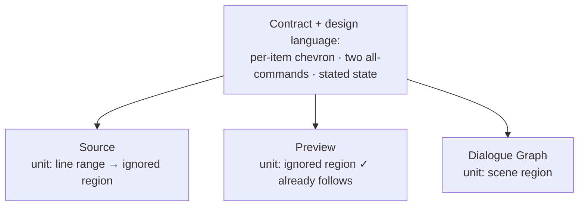

# Collapsing Across the Report

> [!IMPORTANT]
> Status: **partly implemented**. Component 1 has shipped: every surface now folds with the same
> glyph, and the Dialogue Graph can fold or open every scene at once. Component 2 is designed and
> not yet built. Reconciles [#285](https://github.com/pengzhengyi/dialoguedown/issues/285)
> (fold every scene at once) and [#286](https://github.com/pengzhengyi/dialoguedown/issues/286)
> (teach the Source editor about ignored regions) into one model, then sequences them as two
> components.

## Table of contents

- [Goal and scope](#goal-and-scope)
- [Vocabulary](#vocabulary)
- [The problem: one word, three units](#the-problem-one-word-three-units)
- [The collapse contract](#the-collapse-contract)
- [The design language](#the-design-language)
- [Component 1 — One language, and all-commands for scenes](#component-1--one-language-and-all-commands-for-scenes)
- [Component 2 — Ignored regions in Source](#component-2--ignored-regions-in-source)
- [Key design decisions](#key-design-decisions)
- [Boundary cases](#boundary-cases)
- [Testability](#testability)
- [Open questions](#open-questions)

## Goal and scope

Three surfaces of the report let a reader put something away: the Source editor folds line
ranges, the Preview hides ignored regions, and the Dialogue Graph folds scenes. Each arrived on
its own, so they share a word without sharing a shape — one offers two commands and a stated
mixed state, another offers no command at all, and a third names the same act differently.

This note settles **one contract and one design language** for collapsing, then applies them to
the surfaces that do not yet follow them. It deliberately does **not** synchronize state across
surfaces; the [measurement below](#the-problem-one-word-three-units) shows why that cannot work in
general, and [D1](#d1--unify-the-language-not-the-state) explains why the panes should differ even
where it could.

**In scope:** the shared contract and glyph set; the Dialogue Graph's missing all-at-once commands;
teaching Source the ignored-region unit so Source and Preview finally fold the same thing.

**Out of scope:** changing what the compiler ignores or which grouping a scene is; folding nested
scenes; serializing graph fold state across a reload.

## Vocabulary

One act, one set of words, on every surface.

| Term | Meaning |
| --- | --- |
| **Fold** | The act of putting an item away, and the act of bringing it back. The gesture, whatever the surface. |
| **Collapsed / expanded** | The state of one item. |
| **Item** | The thing a surface folds — a line range, an ignored region, or a scene. Each surface has exactly one. |
| **Per-item control** | The one focusable control that folds its item. |
| **All-command** | `Expand all` or `Collapse all` — a command over every item on that surface. |
| **Baseline** | The state an item has when the reader has not chosen otherwise. |
| **Override** | One item's deviation from the baseline. |

The report already says *a static mark states a status, a chevron performs an action*. That rule
is unchanged and now applies everywhere.

## The problem: one word, three units

The three surfaces fold genuinely different **units**, and the difference is not incidental:

| Surface | Unit | Why that unit |
| --- | --- | --- |
| Source | A line range | The editor edits lines; folding is an editing convenience. |
| Preview | An ignored region | Only content the compiler excluded may be hidden — the rest is the compiled result. |
| Dialogue Graph | A scene region | The only grouping the compiler owns, so folding it cannot make the drawing lie. |

Because the units differ, **state cannot be synchronized**. Measured on a representative script,
only 3 of 7 ignored regions were foldable in Source — a table and two fenced code blocks. The
other four cannot fold at all: a `---` divider is a single line, and an inline autolink is a span
*inside* a line. A rule that syncs the intersection is a rule a writer cannot predict.

What *can* be shared is the **contract and the look**: how folding is offered, not what is folded
or what each surface currently holds folded.

## The collapse contract

Every surface that folds anything offers all four of these.

1. **A per-item control.** One focusable control on the item, carrying `aria-expanded` and an
   accessible name that says what it will do. It **does not move** between states, so folding the
   same item twice needs no pointer movement.
2. **Two all-commands, never one toggle.** `Expand all` and `Collapse all`, both available
   whenever the surface has at least one item. They are *commands*: each adopts a baseline for the
   whole surface **and discards every override**. A single toggle cannot name its action from a
   mixed state, which is exactly when a reader needs it most.
3. **The state is stated exactly**, including mixed — `5 of 7 shown`, not a word that implies all
   or nothing. Each surface counts in its own terms: the Preview says how much is *shown*, because
   that is what a reader of the compiled result cares about, while the graph says how many scenes
   are *folded*, which is what its commands act on.
4. **Folding is not selecting.** A fold changes what is drawn, never what the reader has chosen,
   unless the fold hid the chosen thing.

Points 1–3 are already shipped in the Preview; point 4 is already shipped in the Dialogue Graph.
The contract simply says both apply everywhere.

Each surface keeps **its own** state and **its own** pair of all-commands. The contract is a shape
every surface honors, not a state they share — see [D1](#d1--unify-the-language-not-the-state).

## The design language

One act deserves one look. Today four different things render "fold this": CodeMirror's default
text characters in the Source gutter, a `circle-slash` codicon in the Preview, a hand-drawn SVG
path on a scene band, and a different codicon pair on the legend.

The report settles on one set of glyphs, all from the codicon font it already loads:

| Role | Glyph | Where |
| --- | --- | --- |
| **Action — expanded** | `chevron-down` | Every per-item control |
| **Action — collapsed** | `chevron-right` | Every per-item control |
| **All-commands** | `expand-all` / `collapse-all` | Every surface that folds more than one item |
| **Status — excluded from dialogue** | `circle-slash` | Ignored regions and the Preview footer |
| **Status — conditional dialogue** | `question` | Conditional blockquotes |

A status glyph is a static mark and never focusable; an action glyph is always a real control with
`aria-expanded`. Where an item has both a status and an action, they are two marks side by side.

The Dialogue Graph draws SVG rather than HTML, so its chevron becomes an SVG `<text>` node in the
codicon font instead of a path — the font is declared for the whole document, so this is the same
glyph, not a lookalike.

Two surfaces beyond the three named here turned out to fold something too, and both joined the
language: the legend's own group disclosure, and the file Explorer's folders. A submenu marker
keeps its own chevron, because it points at a menu opening beside it rather than at content that
folds away.

**One exception, deliberately.** A collapsed inline ignored region is a chip barely wider than one
glyph, and there is room for a status mark or an action mark, not both. It keeps `circle-slash`,
because inline the reader's first question is *what is missing here*, and a bare chevron in the
middle of a sentence reads as a stray character. The action stays reachable — the chip is still the
button, with its name and state on the control.

## Component 1 — One language, and all-commands for scenes

Closes [#285](https://github.com/pengzhengyi/dialoguedown/issues/285) and lands the design language
everywhere at once, so no surface spends a release speaking the old one.

The all-commands themselves are small: the per-scene chevron already exists, and the projection
already takes a *set* of collapsed region names, so this fills or empties that set rather than
adding fold machinery.

The contract answers the issue's three open questions:

| Open question | Answer |
| --- | --- |
| Where the control lives | Beside the legend's `Scene regions` group heading — the group that already lists exactly the items being folded, with their counts. |
| What "all" means in a mixed state | Two commands, per the contract. Neither has to guess. |
| Framing after the fold | Re-fit the camera on an **all-command** only. A single fold must leave the reader where they were; an all-command is a deliberate whole-view change, and collapsing every scene otherwise leaves the reader staring at empty canvas. |

Checklist:

- [x] Every per-item control across the report uses the shared chevron pair.
- [x] The Source gutter renders the shared chevrons rather than CodeMirror's defaults.
- [x] The scene band's chevron is the codicon glyph, drawn as SVG text.
- [x] `Expand all` / `Collapse all` beside the legend's region group, both enabled when the stage
      has at least one region.
- [x] Each command replaces the collapsed set outright.
- [x] The legend states the current view, including mixed, beside the group's own name.
- [x] An all-command re-fits the camera; a single chevron does not.
- [x] Selection survives, moving to the collapsed scene only when the fold hid it.

## Component 2 — Ignored regions in Source

> [!NOTE]
> Not yet implemented. Tracked by [#286](https://github.com/pengzhengyi/dialoguedown/issues/286).

The larger piece: Source
gains the **ignored region** as a unit it can fold, so both panes finally fold the same thing.

Block regions can use CodeMirror's fold machinery. Inline regions cannot — a span inside a line is
not a foldable range — so each needs a decoration that **replaces** the span with the same
`circle-slash` chip the Preview already shows. That asymmetry is inherent to the unit, not a
shortcut.

Checklist:

- [ ] Ignored block spans fold in Source from a per-item control, independent of line-range folding.
- [ ] Ignored inline spans collapse to a chip through a replacing decoration.
- [ ] Source offers its own pair of all-commands over its ignored regions.
- [ ] Folding survives the re-render that follows every keystroke, keyed as the Preview already
      keys regions.
- [ ] Editing inside a collapsed region is impossible or expands it first — never silently edits
      hidden text.
- [ ] Source and Preview fold independently; neither drives the other.

## Key design decisions

### D1 — Unify the language, not the state

Two things could be unified: how folding is *offered*, and what is *folded where*. Only the first
can be.

Synchronizing state would require a mapping between units that does not exist in either direction:
line ranges that are not ignored (a heading section) have no Preview counterpart, and ignored spans
that are not line ranges (a divider, an inline autolink) have no Source counterpart. Any partial
sync teaches the reader a rule with unpredictable exceptions.

Even where Component 2 makes the units match, Source and Preview keep **separate** state, because
the two panes answer different questions. Source is the editable truth: its ignored text is
deliberately dimmed but visible so a writer can find and change it. Hiding a region while *reading*
the compiled result must not remove the text the writer may need to *edit*. So each surface owns
its state and its own pair of all-commands — which also keeps the commands reachable in Zen mode,
where the Preview is hidden.

Unifying the language costs nothing at the boundaries and makes every surface behave the way the
reader already learned on the first one they used.

### D2 — Each surface keeps its own unit

A surface's unit follows from what that surface is *for*. Source edits text, so line ranges are a
real convenience there and stay. Preview shows the compiled result, so only excluded content may be
hidden. The graph draws flow, so only a compiler-owned grouping may be contracted without lying.

Component 2 does not *replace* Source's line-range folding; it **adds** the ignored-region unit
alongside it. Source is therefore the one surface with two units, and they are told apart by
**where the control sits**: line ranges fold from the **gutter**, which is CodeMirror's own
affordance for a range of lines, while an ignored region folds from a control **on the region
itself**. Different place, different unit — no ambiguity, and neither mechanism has to explain the
other.

Dropping line-range folding to leave one unit was rejected: folding a scene's prose while writing
is genuinely useful and has nothing to do with what the compiler ignores.

### D3 — All-commands override, single folds do not

An all-command is a statement about the whole surface, so it discards overrides and — on the graph
— re-fits the camera. A single fold is a local act, so it leaves the baseline, the other items, the
selection, and the camera alone. This is the rule that lets mixed state exist safely: however
scattered a view becomes, one command returns it to a state the reader can name.

### D4 — Persist a baseline, never the overrides

A baseline is a *preference* — how the reader wants to read this project — and is worth
remembering. An override is *working state* about one item in one sitting; persisting it would
accumulate entries for items that no longer exist and would restore a scattered view days later
with no visible cause.

The contract states that principle and lets each surface apply it. The Preview persists its
baseline in one guarded storage key. The Dialogue Graph persists nothing, because its fold rides
with a camera the report deliberately does not serialize so the offline file stays self-contained.
The two therefore differ across a reload, which is honest: their state means different things.

### D5 — `Fold` is the gesture; `shown`/`hidden` describes the Preview's result

The report keeps one word for the act. The Preview's prose still reports *visibility* (`5 of 7
shown in Preview`), because in that pane the outcome a reader cares about is whether the content is
there, not the mechanism that put it away.

## Boundary cases

| Case | Behavior |
| --- | --- |
| Surface has no items | Both all-commands disabled; the surface says so. |
| Mixed state | Stated exactly; both commands remain available. |
| An all-command when the view already matches | Still valid — it clears overrides. |
| Graph: collapse all with a selection inside a scene | Selection moves to that scene's box, per the existing rule. |
| Graph: collapse all, then navigate to a hidden node | The scene expands first, per the existing rule. |
| Source: edit inside a collapsed ignored region | Expands first; hidden text is never silently edited. |
| Source: an ignored span inside a folded heading section | The outer line-range fold wins; the region's own state is restored when it reappears. |
| Source: region edited so its key changes | Returns to the baseline, as the Preview already does. |
| Source folded, Preview not (or the reverse) | Expected: the two panes hold separate state by design. |
| Collapsed inline ignored chip | Shows `circle-slash`, not a chevron — the one documented exception. |
| Codicon font unavailable | Controls keep their accessible names and hit targets; only the glyph degrades. |

## Testability

- **Projection/unit tests** for the graph's collapse-all: filling and emptying the set, mixed
  state, and that the projection is unchanged for a set it already held.
- **Unit tests** for Source's ignored-region fold: block spans fold, inline spans decorate, state
  survives a document re-render, an edited region resets.
- **Browser tests** per surface: the per-item control keeps its box across a toggle, an
  all-command overrides individual choices, the stated view matches reality, and axe passes in a
  mixed view.
- **A design-language test** reads the sources and fails if any module outside the shared one
  names a chevron itself, so a new surface cannot quietly introduce another rendering. It covers
  behavior rather than stylesheets: a CSS `::before` cannot call a helper, so the legend group's
  disclosure names the codepoint directly.
- **A cross-surface state test** is deliberately *absent*: the language is a shape each surface
  honors, and the panes are meant to differ.

## Open questions

None blocking. Two settled points worth revisiting if the report grows:

1. **Folding nested scenes.** Regions are flat today, so a nested scene folds separately. If the
   compiler ever nests them, the all-commands need to say whether "all" means every region or only
   the top level.
2. **A fifth surface.** The Config tab folds TOML sections through its own fold service. It is out
   of scope here because it collapses neither dialogue content nor a compiler grouping, but it
   should adopt the design language if it ever grows all-commands.
