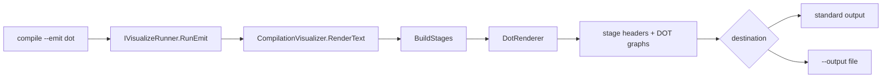

# Compile CLI — emit DOT

> [!NOTE]
> Status: **implemented**. `ddown compile --emit dot` writes every compiler
> stage as Graphviz DOT text. It began on `compile` and moved to `compile`,
> where the other non-interactive exports live.

## Table of contents

- [Goal and scope](#goal-and-scope)
- [Functionality checklist](#functionality-checklist)
- [Design](#design)
- [CLI surface](#cli-surface)
- [Key design decisions](#key-design-decisions)
- [Error and boundary cases](#error-and-boundary-cases)
- [Integration](#integration)
- [Testability](#testability)

## Goal and scope

Emit compiler-stage graphs as portable Graphviz DOT text without opening the
interactive report. The command writes every stage to standard output or one
requested file, with a comment header that identifies each stage.

This is a diagnostics export over the report's `DisplayGraph`; it is not a
stable dialogue interchange format. Future exporters such as Yarn Spinner or
Mermaid belong after a stable serialized dialogue/runtime IR exists.

In scope:

- `--emit dot` on `compile`.
- Standard-output and `--output` file destinations.
- A `RenderText` seam that renders every current stage through `DotRenderer`.
- Helpful validation for missing scripts, unknown formats, and the retired
  `mermaid` value.

Out of scope:

- Rendering DOT in the browser.
- One file per stage.
- Dialogue/runtime serialization or third-party dialogue-language exporters.
- Mermaid stage graphs. Fenced Mermaid authoring aids render in the report's
  Markdown previews; see
  [Mermaid authoring diagrams](./Mermaid%20Authoring%20Diagrams.md).

## Functionality checklist

- [x] `compile <script> --emit dot` writes every stage as DOT to standard
      output.
- [x] `--emit dot -o <file>` writes the same text to a file.
- [x] Each stage begins with a `// <stage title>` comment.
- [x] An unknown format fails validation and names `dot` as the valid format.
- [x] `--emit mermaid` fails with migration guidance and writes no output.
- [x] A missing or invalid script exits nonzero before emitting partial text.

## Design



`CompilationVisualizer.RenderText(source, EmitFormat.Dot)` builds the same
stages as the HTML report. It renders each `DisplayGraph` with `DotRenderer` and
joins them under `//` stage headers. `EmitMode` validates the document before it
writes anything, then selects standard output or the requested file.

## CLI surface

```bash
# Emit every stage to standard output
ddown compile scene.dialogue.md --emit dot

# Write the same multi-stage text to a file
ddown compile scene.dialogue.md --emit dot -o scene.dot
```

The output is one stream containing several `digraph` definitions. A consumer
that needs separate files splits on the stage headers.

For one release, the retired value gives a specific migration message:

```text
Mermaid stage emission was removed. Use '--emit dot' for compiler graphs;
fenced `mermaid` blocks render in the HTML report.
```

## Key design decisions

### D1 — Keep emission non-interactive

`--emit` behaves like static `--output`: it requires a script, returns a process
exit code, and never starts the launcher or loopback server. The command checks
emission before HTML export, so `--emit dot -o scene.dot` cannot accidentally
write a report.

### D2 — Keep DOT on the display graph

DOT remains useful for diagnostics and external graph-layout tools. It is a thin
formatter over `DisplayGraph` and does not claim to serialize executable
dialogue. The boundary stays explicit so future runtime exporters do not inherit
the report's presentation model.

### D3 — Do not preserve a speculative Mermaid exporter

The report's D3 stage views already provide the interactive compiler
visualization. Authors use Mermaid for a different purpose: diagrams written
inside the dialogue Markdown. If a future stable IR needs a Mermaid exporter, it
can add one with a concrete consumer and format contract.

## Error and boundary cases

| Case | Behavior |
| --- | --- |
| Unknown format | Usage error naming `dot` as the valid format. |
| `--emit mermaid` | Usage error with migration guidance; no output. |
| No script | Usage error: `--emit` requires a script. |
| Missing or invalid document | Nonzero exit with the validation message; no partial output. |
| Empty stage | Emit its header and valid sparse `digraph`. |
| Output path supplied | Write only to the file, not standard output. |
| Special characters in labels | Escape them for DOT quoted strings. |

## Integration

- **`VisualizeSettings`** — validates `dot` and the Mermaid migration case.
- **`VisualizeCommand`** — routes a valid emit before HTML export or served
  modes.
- **`IVisualizeRunner` / `VisualizeRunner`** — carry the format and destination
  to `EmitMode`.
- **`CompilationVisualizer`** — builds stages and joins rendered text.
- **`DotRenderer`** — formats one `DisplayGraph`.
- **README / CLI docs / changelog** — advertise DOT only.

## Testability

- **CLI settings/command** — DOT routes to `RunEmit`; Mermaid and unknown values
  fail without invoking a runner; no-script validation remains.
- **`CompilationVisualizer`** — every stage has a `//` header and `digraph`
  body.
- **`DotRenderer`** — nodes, edges, attributes, and escaping.
- **`EmitMode`** — standard output versus file output, plus no partial output on
  validation failure.
