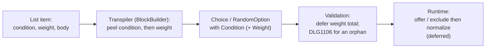

# Conditional choice

> [!NOTE]
> Status: **implemented**. A **conditional choice option** — a player choice or a
> random option — is offered only when its condition is true. Offering, hiding,
> and re-normalizing options at play time is part of the planned
> [runtime](https://github.com/pengzhengyi/dialoguedown/issues/45).

Assumes [Conditions](./Conditions.md) — the primitive, its grammar, resolution, and decisions — and covers only what is specific to guarding a **choice option**.

## Table of contents

- [Goal and scope](#goal-and-scope)
- [Functionality checklist](#functionality-checklist)
- [Ubiquitous language](#ubiquitous-language)
- [Writer-facing behavior](#writer-facing-behavior)
- [Grammar](#grammar)
- [Condition resolution](#condition-resolution)
- [Prior art](#prior-art)
- [Architecture](#architecture)
- [Interfaces and responsibilities](#interfaces-and-responsibilities)
- [Key design decisions](#key-design-decisions)
  - [D1 — The option guard is a list-item peel, and it takes precedence](#d1--the-option-guard-is-a-list-item-peel-and-it-takes-precedence)
  - [D2 — Condition first, then weight](#d2--condition-first-then-weight)
  - [D3 — A conditional random option defers the weight total](#d3--a-conditional-random-option-defers-the-weight-total)
  - [D4 — A false option is removed; an independent guard](#d4--a-false-option-is-removed-an-independent-guard)
  - [D5 — Reuse the condition primitive and its rule](#d5--reuse-the-condition-primitive-and-its-rule)
- [Relation to a future block `if`/`elseif`/`else`](#relation-to-a-future-block-ifelseifelse)
- [Markdown interaction](#markdown-interaction)
- [Diagnostics](#diagnostics)
- [Error and boundary cases](#error-and-boundary-cases)
- [Testability](#testability)
- [Implementation crosscheck](#implementation-crosscheck)
- [Alternatives not chosen](#alternatives-not-chosen)
- [Open questions and deferred work](#open-questions-and-deferred-work)

## Goal and scope

A writer often wants an option to appear only under some game-state condition — a
dialogue choice that shows *Use the key* only once the key is found, or a random
reaction that enters the pool only when a character is angry. Today every option
in a [choice](../../guide/structure-and-flow.md#choices) or a
[random choice](./Random%20Choice.md) is always present.

The [Conditional Jump](./Conditional%20Jump.md) and
[Conditional Line](./Conditional%20Line.md) notes applied the **condition**
primitive to a jump and a line. This note applies the *same* condition to a
**choice option**: a condition placed *before* an option guards the whole option.
When the condition is true the option is offered; when it is false the option is
**removed** — hidden from a player menu, or excluded from a random pool.

Scope:

- The **conditional player option**: a condition that guards one option in a
  player choice.
- The **conditional random option**: a condition that guards one option in a
  random choice, written *before* the option's weight
  (``- `"cond"?` `50%` <choice>``).
- Compile-time recognition, preservation, and diagnostics — including deferring
  the static weight total when any option is conditional.

Out of scope for this version (see [deferred work](#open-questions-and-deferred-work)):

- **Runtime resolution** — offering or hiding a player option and excluding then
  re-normalizing a random pool belong to the graph/runtime.
- **Block `if`/`elseif`/`else`** — a future construct for grouped,
  mutually-exclusive branches with a fallback. It reuses this note's condition
  primitive but is designed separately (see
  [Relation to a future block `if`/`elseif`/`else`](#relation-to-a-future-block-ifelseifelse)).
- **Negation** and **in-script expressions** — unchanged: a writer expresses
  "unless" through a game-defined inverse flag, and the game composes logic behind
  a single key.

## Functionality checklist

- [x] Recognize a leading `` `"key"?` `` condition on a list item — *before* its
      weight and body — and peel it off as the option's guard.
- [x] Model the condition as an optional `Condition` on `Choice` and on
      `RandomOption`, each with an `IsConditional` predicate.
- [x] Keep classifying a list as a random choice when an option leads with a
      condition *then* a weight, by peeking past the condition for the weight.
- [x] Build the option's body from the content *after* the peeled condition, so a
      condition on an option guards the whole option, not its first line.
- [x] Defer the static weight-total check for a random choice when any option is
      conditional, as a dynamic query weight already does.
- [x] Preserve the source span of the condition, the weight, and the option.
- [x] Generalize `DLG1106` so a condition guards a jump, a line, **or** a choice
      option, detecting a bound guard by identity.
- [x] Leave an ordinary unconditional option unchanged when no condition precedes
      it.
- [x] Add the construct to the writer-facing specification, the gallery, and the
      report projection.

## Ubiquitous language

The domain term is **condition** everywhere, as in the sibling notes. This note
adds two terms and reuses the rest.

| Term                       | Meaning                                                                                                                                                  |
| -------------------------- | -------------------------------------------------------------------------------------------------------------------------------------------------------- |
| **Conditional option**     | A choice option preceded by a condition; it is offered only when the condition is true, and removed when it is false.                                    |
| **Exclude then normalize** | The runtime rule for a conditional random option: drop the options whose condition is false, then re-normalize the remaining weights so they sum to one. |

**Condition**, **check**, **guard-first**, **weight**, and **normalization** carry
over unchanged.

## Writer-facing behavior

A condition is the game-state [query](../../guide/game-state.md#queries) with
a `?`, from the [query-and-sigil family](./Conditions.md#writer-facing-behavior).
Place it at the *start of an option* and the whole option becomes conditional.

**A player option** appears only when its condition is true:

```markdown
- `"HasKey"?` Use the key on the lock.
- Search for another way in.
```

If `HasKey` is true the reader sees both options; if it is false only *Search for
another way in* is offered. The condition guards the **whole option**, including
any nested content beneath it — not merely its first line.

**A random option** enters the pool only when its condition is true. The condition
comes **first, before the weight**:

```markdown
- `"IsAngry"?` `50%` The guard glares and blocks your path.
- `30%` The guard waves you through.
- `20%` The guard ignores you.
```

When `IsAngry` is true the engine picks among all three by weight; when it is
false the first option is excluded and the remaining two are re-normalized (30 and
20 become roughly 60% and 40%). This is the one construct that gives a random pool
a *dynamic set of options*.

**No else.** As with a conditional jump or line, there is no inline *else*: each
option's condition is independent. For grouped, mutually-exclusive options with a
fallback, a future block `if`/`elseif`/`else` is the intended home (see
[Relation to a future block `if`/`elseif`/`else`](#relation-to-a-future-block-ifelseifelse)).

A conditional option inherits every rule of an ordinary option: a player option
still needs no weight, and a random option still needs a weight (the condition
does not replace it).

## Grammar

A conditional option is a condition immediately after the list marker, before an
optional weight and the option's content.

```ebnf
ConditionalOption = ListMarker , { Whitespace } , Condition ,
                    { Whitespace } , [ Weight , { Whitespace } ] , OptionContent ;
Condition         = "`" , '"' , QueryKey , '"' , "?" , "`" ;
Weight            = "`" , ( Number | Query ) , "%" , "`" | "`" , "%" , "`" ;
```

`Condition`, `QueryKey`, and `Weight` are unchanged from the sibling notes; the
option reuses their recognition. The condition guards the option only when it is
**first** — a code span after the weight is part of the body, not the option's
guard.

## Condition resolution

Resolution runs at runtime, through the shared contract in
[Conditions](./Conditions.md#condition-resolution). An option's false behavior
depends on the kind of choice:

- **Player option.** A `false` result removes it. Whether a removed option is
  hidden or shown disabled is a runtime/presentation choice.
- **Random option.** The runtime excludes every option whose condition is false,
  then re-normalizes the remaining weights so they sum to one
  ([exclude then normalize](#ubiquitous-language)). If every option is excluded,
  no option can be selected — the same error shape as a zero weight total.

## Prior art

See [Conditions](./Conditions.md#prior-art). Ink's `* {has_key} [Use the key]`
and Ren'Py's `"Use the key" if has_key:` are the closest models for an option:
the condition gates the menu entry itself.

## Architecture

An option's condition sits at the very start of the list item, before the weight
and the body. So it is recognized and **peeled in the transpiler** — where the
random-choice weight is already peeled — and attached to the option as a property.



- **Transpiler.** Before an option's body is built, a leading condition code span
  is peeled off the list item through a shared
  `TryPeel(inlines, out condition, out remainder)` — the same helper the
  conditional line uses. For a player choice the condition attaches to the
  `Choice`; for a random choice it attaches to the `RandomOption`, peeled *before*
  the weight. Peeling at the list-item level — rather than letting the inner line
  builder see it — is what makes the condition guard the whole option (see
  [D1](#d1--the-option-guard-is-a-list-item-peel-and-it-takes-precedence)).
- **Random-vs-player classification.** A list becomes a random choice when any
  option carries a weight. The check peeks *past* an optional leading condition to
  find the weight, so a condition-first option is still recognized as weighted
  (see [D2](#d2--condition-first-then-weight)).
- **Validation.** The weight-total rule defers when any option is conditional,
  because a conditional option may be excluded at runtime
  (see [D3](#d3--a-conditional-random-option-defers-the-weight-total)). The
  orphan-condition rule and the tree traversal extend to recognize an option's
  condition as bound.
- **Runtime.** Offering or hiding an option and excluding then re-normalizing a
  random pool are deferred to the graph/runtime, alongside the conditional jump
  and line.

## Interfaces and responsibilities

| Element                       | Responsibility                                                                                                                                                                                                                                                                                                    |
| ----------------------------- | ----------------------------------------------------------------------------------------------------------------------------------------------------------------------------------------------------------------------------------------------------------------------------------------------------------------- |
| `Condition`                   | Unchanged — the spanned, reusable primitive a jump, line, or option guards.                                                                                                                                                                                                                                       |
| `Choice`                      | Gains an optional `Condition` and an `IsConditional` predicate; an unconditional option leaves it absent.                                                                                                                                                                                                         |
| `RandomOption`                | Gains an optional `Condition` and an `IsConditional` predicate, alongside its required `Weight`.                                                                                                                                                                                                                  |
| Shared leading-condition peel | A `bool TryPeel(inlines, out condition, out remainder)` that recognizes and peels a leading `` `"key"?` `` off a Markdown inline sequence — the same helper the conditional line uses. The line and the choice both call it, each applying its own binding policy; the jump keeps its inline-and-desugar binding. |
| `RandomChoiceRecognition`     | `HasLeadingWeight` peeks past an optional leading condition to find the weight; `Resolve` peels the condition and then the weight.                                                                                                                                                                                |
| `WeightTotalRule`             | Defers the static total check when any option is conditional, as it already does for a dynamic query weight.                                                                                                                                                                                                      |
| `OrphanConditionRule`         | `IsBound` gains `Choice` and `RandomOption` cases, so a condition bound to an option is not reported.                                                                                                                                                                                                             |
| Report projection             | Shows an option's condition (its key) as the option's first child, guard-first, mirroring a conditional jump and line.                                                                                                                                                                                            |

## Key design decisions

### D1 — The option guard is a list-item peel, and it takes precedence

A jump's condition is an inline fragment bound in desugar; a line's condition is
peeled in the line builder. An option's condition is peeled one level higher — at
the **list item**, before the option's body is built — and attached to the
`Choice` or `RandomOption`. This placement is what makes the condition guard the
*whole option*, and it deliberately **takes precedence** over the inner line and
jump handling:

| Option written           | Peeled at the list item (this design)             | If left to the inner line or jump handling                                                 |
| ------------------------ | ------------------------------------------------- | ------------------------------------------------------------------------------------------ |
| ``- `"c"?` Bob: Attack`` | conditional **option** (removes the whole option) | conditional **line** inside the option (only its first line hidden)                        |
| ``- `"c"?` => [x]``      | conditional **option** whose body is a plain jump | option holding a **conditional jump** (the line builder leaves the condition for the jump) |

Guard-first at the outermost level wins: the option is what a condition on a menu
item should remove, so the list-item peel runs first and the inner builders never
re-bind the condition.

The line and the option **share the peel itself** — a common
`bool TryPeel(inlines, out condition, out remainder)` that recognizes and removes a
leading condition — and each applies its own policy: the line declines a condition that
a jump should claim, while the option always takes it. The jump does not peel at
all; its condition can sit mid-line, so it stays an inline fragment bound in
desugar. Recognition of the `` `"key"?` `` code span is the `ConditionReader`, shared
by all three.

### D2 — Condition first, then weight

For a random option the condition is written **before** the weight,
``- `"c"?` `50%` …``, matching guard-first placement. Two consequences:

- The random-vs-player classifier must **peek past** the leading condition to find
  the weight; otherwise a condition-first option would look weight-less and the
  list would be misread as a player choice. The condition is orthogonal to
  random-vs-player — only the weight decides.
- A code span *after* the weight is part of the body, not the option's guard, so
  the ordering is unambiguous: the option guard is the code span that comes first.

### D3 — A conditional random option defers the weight total

A random choice's explicit weights normally must total 100%, reported by
`DLG3003`. A conditional option may be **excluded** at runtime, so its weight
cannot be counted at compile time — the achievable total is unknown until the game
resolves the conditions. The weight-total rule therefore **defers** when any
option is conditional, exactly as it already defers for a dynamic query weight
whose value is unknown until runtime. The runtime re-normalizes whatever options
remain, so a static total is neither required nor meaningful.

### D4 — A false option is removed; an independent guard

A false condition removes its one option — the same "false skips the conditional
element" rule the conditional jump and line establish (a jump is skipped, a line
falls through, an option is removed). Each option's condition is **independent**:
``- `"c1"?` A`` and ``- `"c2"?` B`` are two separate guards, not an
"if/else". Whether a removed player option is hidden or shown disabled is left to
the runtime; the compiler only attaches the condition.

### D5 — Reuse the condition primitive and its rule

A conditional option introduces no new primitive. It reuses the `Condition` node,
the `` `"key"?` `` shape, and the query-and-sigil family, and it extends the same
orphan-condition rule (`DLG1106`) that guards a jump and a line. The domain keeps
a single word — **condition** — for the condition on every construct.

## Relation to a future block `if`/`elseif`/`else`

A block `if`/`elseif`/`else` is a planned separate construct for **grouped,
mutually-exclusive** branches with a fallback. It and the inline per-option
condition are **complementary**, not competing:

|           | Inline condition (``- `"c"?` A``)                           | Block `if`/`elseif`/`else`                           |
| --------- | ----------------------------------------------------------- | ---------------------------------------------------- |
| Unit      | one option                                                  | a group of options or blocks                         |
| Semantics | **independent** — each option offered iff its own condition | **mutually exclusive** — one branch, with a fallback |
| Fallback  | none (query an inverse flag)                                | the `else` branch                                    |

The inline form owns the concise, independent, single-option case — including "add
this option to the random pool if …", which a block form expresses only by
restating the unconditional options. The block form owns the `else` that inline
conditions deliberately lack. Both build on the **same** `Condition` primitive, so
the block construct reuses this note's node rather than inventing another; nothing
here forecloses it.

## Markdown interaction

An option's condition is an inline code span at the start of a Markdown list item,
so Markdig parses it as inline code before the option text, and an ordinary
preview shows `"HasKey"?` as code — readable, and clearly not part of the option's
words. It sits beside the existing weight code span (`` `50%` ``) that the random
choice already uses, so the two compose without new Markdown. A condition is
peeled before the body is built, so it never becomes option text.

## Diagnostics

| Code      | Meaning                    | Kind   | Severity | When                                                                                                          |
| --------- | -------------------------- | ------ | -------- | ------------------------------------------------------------------------------------------------------------- |
| `DLG1106` | A condition guards nothing | Syntax | Error    | A `` `"key"?` `` condition guards neither a jump, a line, nor a choice option — it is not a recognized guard. |

`DLG1106` keeps its code and generalizes its message to name all three guards
(jump, line, choice). The existing random-choice diagnostics are unchanged and
still apply: a random option without a weight is `DLG1104`, an invalid weight is
`DLG1105`, and a single-option random choice is `DLG3004`. A conditional option
still needs a weight in a random choice, so a condition does not exempt it from
`DLG1104`. The static-total diagnostics (`DLG3003`, `DLG2010`) are deferred when
any option is conditional (see [D3](#d3--a-conditional-random-option-defers-the-weight-total)).

## Error and boundary cases

| Case                                                    | Behavior                                                                                                                                                             |
| ------------------------------------------------------- | -------------------------------------------------------------------------------------------------------------------------------------------------------------------- |
| Condition before a player option (``- `"K"?` Use it.``) | Conditional player option; the whole option is conditional.                                                                                                          |
| Condition then weight (``- `"K"?` `50%` …``)            | Conditional random option; the option carries both the condition and the weight.                                                                                     |
| Weight then condition (``- `50%` `"K"?` …``)            | The weight is peeled (random); the `` `"K"?` `` sits at the body start and guards the body's first line, not the option.                                             |
| Plain option, no condition                              | Unchanged option.                                                                                                                                                    |
| Condition on an option whose body is a jump             | Conditional option with a plain jump body (the list-item peel precedes the jump handling — [D1](#d1--the-option-guard-is-a-list-item-peel-and-it-takes-precedence)). |
| Condition on a nested line inside an option's body      | Guards that line (a conditional line), not the option — a condition is bound to the element it fronts.                                                               |
| Every option in a random choice conditional             | Accepted; the weight total is deferred, and an all-false pool is a runtime no-selection.                                                                             |
| Condition key unknown to the game                       | `Check` defaults to `false`, so the option is removed or excluded.                                                                                                   |

## Testability

- **Recognition:** a `` `"key"?` `` before an option becomes the option's
  condition; a condition then a weight yields both on a `RandomOption`; an option
  with no leading condition has none.
- **Classification:** a list whose only weighted option leads with a condition is
  still a random choice (the weight is found past the condition).
- **Precedence:** ``- `"c"?` Bob: Attack`` guards the option, and its body line
  carries no condition; ``- `"c"?` => [x]`` guards the option and its jump is
  unconditional.
- **Weight total:** a random choice with a conditional option does not report
  `DLG3003`, even when the visible weights do not total 100%.
- **Diagnostics:** a condition bound to an option reports nothing; a stray
  condition still reports `DLG1106`.
- **Projection:** the report shows an option's condition key.

Use multi-line raw string literals for script fixtures so the option, its
condition, and its weight are visible.

## Implementation crosscheck

The construct shipped as designed; the runtime resolution remains deferred.

| Bucket       | Result                                                                                                                                                                                                                                                                                                                                                                                                                                                                                                                                                                                  |
| ------------ | --------------------------------------------------------------------------------------------------------------------------------------------------------------------------------------------------------------------------------------------------------------------------------------------------------------------------------------------------------------------------------------------------------------------------------------------------------------------------------------------------------------------------------------------------------------------------------------- |
| **Achieved** | `Choice` and `RandomOption` gained an optional `Condition` and an `IsConditional` predicate; `ChoiceConditionRecognition.Peel` binds the condition at the list-item level before the body — and, for a random option, its weight — via the shared `ConditionReader.TryPeel`; `HasLeadingWeight` peeks past a leading condition; the weight total defers when any option is conditional; the orphan-condition rule and the tree traversal extend to a choice guard (guard-first, condition before weight); and the report projection, writer spec, and gallery match the design (D1–D5). |
| **Changed**  | The shared leading-condition peel was extracted to `ConditionReader.TryPeel(inlines, out condition, out remainder)` and the conditional line's `LineBuilder` was refactored to call it, unifying the two block-start guards. A generic `ReadOnlyListExtensions.ReplaceOrRemoveAt` now backs both the condition peel and the random weight's block rebuild. The weight recognizer kept its `Resolve` name: it validates and recovers a required weight, so it is a resolution, not the pure structural peel a condition uses.                                                            |
| **Deferred** | Offering or hiding a player option and excluding then re-normalizing a random pool are the runtime's job ([issue #45](https://github.com/pengzhengyi/dialoguedown/issues/45)). A block `if`/`elseif`/`else` remains a separate future construct that reuses this primitive; consolidating the condition notes, negation, and expressions remain follow-up.                                                                                                                                                                                                                              |

## Alternatives not chosen

| Alternative                                                      | Why not                                                                                                                              |
| ---------------------------------------------------------------- | ------------------------------------------------------------------------------------------------------------------------------------ |
| Guard only the option's first line (a conditional line inside)   | Leaves a half-visible menu entry when false; a menu needs the *whole* option removed (D1).                                           |
| Weight before condition (``- `50%` `"c"?` …``)                   | Breaks guard-first and reads the condition as inner-line content; the option guard is the code span that comes first (D2).           |
| Defer all conditional options to the future block `if`           | Loses the concise per-option and dynamic-random-pool cases the inline form expresses best; the two are complementary, not redundant. |
| Commit the compiler to "hide" (versus "disable") a player option | Hide-versus-disable is a runtime/presentation choice; the compiler only attaches the condition (D4).                                 |
| A new option-guard node distinct from the jump/line condition    | Splits one domain concept into three; reusing `Condition` keeps a single word and a single reader (D5).                              |

## Open questions and deferred work

- **Runtime resolution of a conditional option** — the compiler recognizes and
  preserves the condition, but offering or hiding a player option and excluding then
  re-normalizing a random pool need the runtime. Tracked with the
  [runtime work](https://github.com/pengzhengyi/dialoguedown/issues/45).
- **Block `if`/`elseif`/`else`** — the grouped, mutually-exclusive sibling of the
  inline condition, reusing this note's primitive. Designed separately (see
  [Relation to a future block `if`/`elseif`/`else`](#relation-to-a-future-block-ifelseifelse)).
- **Hide versus disable** — whether a false player option is hidden or shown
  disabled is a runtime/presentation policy, not fixed by the compiler.
- **Consolidating the condition notes** — with a jump, a line, and now a choice
  guard sharing one primitive, the notes may be worth folding into a single
  "Conditions" note. Revisit now that the third guard has landed.
- **Negation** and **expressions** — unchanged and still deferred: a game-defined
  inverse flag covers "unless," and the game composes logic behind a single key.
