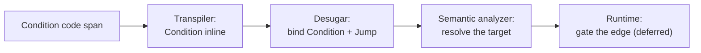

# Conditional jump

> [!NOTE]
> Status: **implemented**. The compiler recognizes and preserves a **condition**
> primitive (`` `"key"?` ``) and its first application, the **conditional jump** —
> a jump that fires only when the condition is true. Gating the edge at play time
> (and the `IGameSystem.Check` read it will use) is part of the planned
> [runtime](https://github.com/pengzhengyi/godot-dialoguedown/issues/45).

## Table of contents

- [Conditional jump](#conditional-jump)
  - [Table of contents](#table-of-contents)
  - [Goal and scope](#goal-and-scope)
  - [Functionality checklist](#functionality-checklist)
  - [Ubiquitous language](#ubiquitous-language)
  - [Writer-facing behavior](#writer-facing-behavior)
  - [Grammar](#grammar)
  - [Condition resolution](#condition-resolution)
  - [Prior art](#prior-art)
  - [Architecture](#architecture)
  - [Interfaces and responsibilities](#interfaces-and-responsibilities)
  - [Key design decisions](#key-design-decisions)
    - [D1 — A condition is a query read, not a command](#d1--a-condition-is-a-query-read-not-a-command)
    - [D2 — The `?` sigil joins the query-and-sigil family](#d2--the--sigil-joins-the-query-and-sigil-family)
    - [D3 — Guard-first placement](#d3--guard-first-placement)
    - [D4 — A dedicated boolean read on `IGameSystem`](#d4--a-dedicated-boolean-read-on-igamesystem)
    - [D5 — Negation is deferred](#d5--negation-is-deferred)
    - [D6 — False falls through; no inline else](#d6--false-falls-through-no-inline-else)
    - [D7 — Recognize in the transpiler, bind in desugar](#d7--recognize-in-the-transpiler-bind-in-desugar)
    - [D8 — A condition is a spanned, reusable node](#d8--a-condition-is-a-spanned-reusable-node)
    - [D9 — No in-script expression language](#d9--no-in-script-expression-language)
  - [Markdown interaction](#markdown-interaction)
  - [Diagnostics](#diagnostics)
  - [Error and boundary cases](#error-and-boundary-cases)
  - [Testability](#testability)
  - [Implementation crosscheck](#implementation-crosscheck)
  - [Alternatives not chosen](#alternatives-not-chosen)
  - [Open questions and deferred work](#open-questions-and-deferred-work)

## Goal and scope

A writer often wants a jump to happen only under some game-state condition — take
a shortcut once a key is found, greet a returning player differently, skip a
scene already visited. Today a jump is unconditional: `=> [Label](#anchor)`
always fires.

This note adds a **condition** — a game-state query read as a boolean, written
`` `"key"?` `` — and applies it to a jump: a condition placed *before* a jump
makes that jump **optional**. When the condition is true the jump fires; when it
is false the jump is skipped and the dialogue continues with the next block.

Scope:

- The **condition** primitive: a query plus a `?`, the boolean the game answers
  for it, and its source span.
- The **conditional jump**: a condition that guards a single jump.
- Compile-time recognition, preservation, and diagnostics.

Out of scope for this version (see [deferred work](#open-questions-and-deferred-work)):

- **Runtime gating** — actually evaluating the condition and taking or skipping
  the edge belongs to the graph/runtime.
- **Negation** — "jump unless X." A writer expresses it now through a
  game-defined inverse flag (`` `"NotRainy"?` ``).
- **Conditions on lines and choices** — the same guard-first prefix is designed
  to front them later, but only the jump is wired now.
- **In-script expressions** — no `&&`, `||`, or comparisons; the game computes
  the boolean behind the key.

## Functionality checklist

- [x] Recognize a `` `"key"?` `` code span as a `Condition` — the query grammar
      plus a trailing `?` — carrying the key and its exact source span.
- [x] Bind a condition that immediately precedes a jump to that jump during jump
      assembly, so a `Jump` carries an optional `Condition`.
- [x] Report `DLG1106` when a condition does not precede a jump.
- [x] Preserve the source span of the condition, its query key, and the guarded
      jump.
- [x] Leave an ordinary unconditional jump unchanged when no condition precedes
      it.
- [x] Add the construct to the writer-facing specification, the gallery, and the
      report projection.

## Ubiquitous language

| Term                 | Meaning                                                                                                                                             |
| -------------------- | --------------------------------------------------------------------------------------------------------------------------------------------------- |
| **Condition**        | A game-state query read as a boolean: `` `"key"?` `` — the query key, delimited by quotes, followed by a `?`.                                       |
| **Conditional jump** | A jump preceded by a condition; it fires only when the condition is true.                                                                           |
| **Optional jump**    | The same jump described by its false behavior: when the condition is false, the jump is skipped and the dialogue falls through to the next block.   |
| **Guard-first**      | The condition is written *before* the element it guards, so it reads "if … then …" and one placement rule serves future line and choice guards too. |
| **Check**            | The boolean the game answers for a condition's key, through `IGameSystem.Check`; an unknown key is `false`.                                         |

The domain term is **condition** everywhere: the AST node, the diagnostics, the
specification, commits, and the changelog. The guarded jump is a **conditional
jump**.

## Writer-facing behavior

A condition is the game-state [query](../../guide/script-language.md#queries) you
already write, with a `?` added inside the code span. Place it before a jump and
the jump becomes optional:

```markdown
`"FoundKey"?` => [Open the vault](#the-vault)

The door stays shut. You look for another way.
```

If `FoundKey` is true the reader jumps to *The Vault*; if it is false the jump is
skipped and reading continues with "The door stays shut."

The condition is the third member of the **query-and-sigil** family, so a writer
who knows queries and weights already knows its shape:

| Syntax         | Meaning                                     |
| -------------- | ------------------------------------------- |
| `` `"key"` ``  | Insert the query's value into speech.       |
| `` `"key"%` `` | Weight a random-choice option by the value. |
| `` `"key"?` `` | Read the value as a boolean condition.      |

Because the key is quoted, a key that itself contains a `?` is unambiguous — the
operator is the `?` after the closing quote:

```markdown
`"Rainy?"?` => [Wait out the storm](#the-inn)
```

Here the query key is `Rainy?` and the condition tests it.

**Negation.** There is no `not` operator yet. To branch when a flag is *false*,
query a game-defined inverse:

```markdown
`"NotRainy"?` => [Set off across the moor](#the-moor)
```

**No else.** A condition guards exactly one jump. For an alternative, write the
next line — a plain jump, another conditional jump, or ordinary dialogue:

```markdown
`"FoundKey"?` => [Open the vault](#the-vault)
=> [Search the study](#the-study)
```

If the key is found the reader takes the vault; otherwise the unconditional jump
to the study runs.

A conditional jump inherits every rule of an ordinary
[jump](../../guide/script-language.md#jumps): it lives on one line, the pieces
may be separated by spaces but not a line break, and it cannot appear inside a
heading.

## Grammar

A condition is a code span whose content is a quoted query key followed by `?`. A
conditional jump is a condition immediately preceding a jump on the same line.

```ebnf
Condition       = "`" , '"' , QueryKey , '"' , "?" , "`" ;
ConditionalJump = Condition , { Whitespace } , JumpIndicator , { Whitespace } , Link ;
JumpIndicator   = "=>" ;
```

`QueryKey` is the same key a [query](../../guide/script-language.md#queries) uses,
recognized by the same grammar; a condition reuses that recognition rather than
re-deriving that a query is quoted.

## Condition resolution

Resolution runs at **runtime**, not compile time — the game state a condition
reads is unknown until the game runs. The compiler only recognizes and preserves
the condition; the contract below is what the runtime will honor.

1. The runtime reads the key through `IGameSystem.Check`, which returns a boolean.
2. A `true` result fires the guarded jump; a `false` result skips it and the
   dialogue continues with the next block.

An unknown key is the game's default `false`, so a flag that was never set simply
does not fire the jump. Because the game answers with a real boolean, there is no
string parsing and no invalid-value case to report.

## Prior art

Two models dominate conditional flow in dialogue languages:

- **Inline conditional divert** — Ink writes `{has_key: -> unlocked}`: a
  condition immediately in front of a divert, falling through when false. This is
  the model here: compact, inline, and guard-first.
- **Block `if` wrapping a jump** — Yarn Spinner writes
  `<<if $c>> <<jump Node>> <<endif>>`; Ren'Py writes `if c: jump label`. Powerful
  (`elseif`/`else`, multiple statements) but a block statement, not a
  Markdown-native inline.

The lasting lessons:

- **A condition reads; it does not act.** Ink, Yarn, and Ren'Py all keep a
  condition (a read) distinct from a command (a side effect). A DialogueDown
  condition is a read (`Check`), never a command.
- **Fall-through is the natural false behavior.** Ink's inline divert simply
  continues when the condition is false; a conditional jump does the same, which
  is why it reads as an *optional* jump.
- **Expressions belong to the host, not the script.** Ren'Py leans on Python and
  Yarn/Ink on their own expression languages. DialogueDown deliberately delegates
  the logic to `IGameSystem`: the script names a boolean, the game computes it.

## Architecture

A condition threads through the front of the pipeline and is bound to its jump
where jumps are already assembled.



- **Transpiler.** When an inline code span's content is a query followed by `?`,
  the transpiler produces a `Condition` fragment (its key and span) instead of a
  game call — parallel to how a bare `` `"key"` `` becomes a `Query`.
- **Desugar.** Jump assembly already pairs a `JumpIndicator` (`=>`) with the
  `Link` that follows. It is extended to also bind a `Condition` that immediately
  precedes the indicator, producing a `Jump` that carries an optional
  `Condition`. A condition left unbound is reported (`DLG1106`).
- **Semantic analyzer.** Unchanged: it resolves the jump's target as before and
  preserves the condition.
- **Runtime.** Evaluating the condition and taking or skipping the edge is
  deferred to the graph/runtime, alongside dynamic-weight resolution and jump
  edges.

## Interfaces and responsibilities

| Element                          | Responsibility                                                                                                                                                                           |
| -------------------------------- | ---------------------------------------------------------------------------------------------------------------------------------------------------------------------------------------- |
| `Condition`                      | A spanned `ScriptNode` carrying the query `Key` and its source span; the reusable primitive a jump (and, later, a line or choice) guards.                                                |
| `Jump`                           | Gains an optional `Condition`; an unconditional jump leaves it absent.                                                                                                                   |
| `ConditionReader`                | Recognizes a `` `"key"?` `` code span by reusing `GameCallParser.Query` through `TryParseAll`, producing a `Condition`.                                                                  |
| `JumpAssembler`                  | Folds the guard-first condition into the jump with a small Pidgin grammar over the fragment stream, sharing the `FragmentParsers.OfType<T>()` combinator.                                |
| `IGameSystem.Check` *(deferred)* | The `bool Check(string key)` the runtime will call to resolve a condition (an unknown key is `false`); not added yet — it lands with the runtime.                                        |
| `OrphanConditionRule`            | Reports `DLG1106` for a condition that guards nothing (it is not the guard its parent references).                                                                                       |
| `DiagnosticCatalog`              | Owns `DLG1106` (a condition does not precede a jump).                                                                                                                                    |
| Report projection                | Shows a jump's condition (its key) in the Dialogue AST report. A condition is a code span, so the editor colors it through Markdown highlighting; no dedicated semantic token is needed. |

## Key design decisions

### D1 — A condition is a query read, not a command

A condition reads game state, so it belongs on the **read side** of `IGameSystem`
(resolved by `Check` — see D4), not the command lane (`Execute`, which performs
side effects). Syntactically it still reuses the quoted-query *form* the writer
already knows.

### D2 — The `?` sigil joins the query-and-sigil family

DialogueDown already reads a query and applies a sigil: `` `"key"` `` inserts the
value and `` `"key"%` `` weights an option. `` `"key"?` `` reads the value as a
boolean — a consistent third member, with the family's escaping already solved
(the quotes delimit the key; the sigil follows the closing quote).

### D3 — Guard-first placement

The condition is written *before* the jump it guards. It reads "if … then …", it
is scannable at the start of the construct, and one placement rule will front a
future conditional line or choice too — matching Ink's `{cond} …` and
`{cond: -> target}`.

### D4 — A dedicated boolean read on `IGameSystem`

A condition resolves through a new `bool Check(string key)` on `IGameSystem`,
beside `Query` (a value) and `Execute` (an effect). The game returns a real
boolean, so the runtime never parses a string into a truth value and there is no
truthiness ladder — an unknown key is simply the game's default `false`. Forcing
a boolean through the string `Query` (returning `"true"`/`"false"`) was rejected
as an inelegant second indirection. Dynamic weights still reuse `Query`, since a
number in a string is natural where a boolean in a string is not.

### D5 — Negation is deferred

"Jump unless X" is expressed today through a game-defined inverse flag
(`` `"NotRainy"?` ``). A prefix `!` was considered and rejected for now as
cryptic for non-technical writers; it can be added later without changing the
positive `?`.

### D6 — False falls through; no inline else

A false condition skips its one guarded jump and continues with the next block.
There is no inline else-target; the writer places the alternative on the next
line. This keeps the construct Markdown-native and avoids a branching syntax.

### D7 — Recognize in the transpiler, bind in desugar

The condition is recognized as an inline fragment in the transpiler, then bound
to its jump during desugar's jump assembly — the same stage that already pairs a
`=>` with its link. Recognition and binding stay where their neighbors already
live.

### D8 — A condition is a spanned, reusable node

`Condition` is its own spanned `ScriptNode`, not a flag on `Jump`, so tooling can
point at the exact condition and the same node fronts a future line or choice
guard. `Jump` references it through an optional property.

### D9 — No in-script expression language

A condition is exactly one boolean query. There are no operators or comparisons
in the script; the game computes the meaning behind the key. This matches
DialogueDown's delegation of logic to `IGameSystem`.

## Markdown interaction

A condition is an inline code span, so Markdig parses it as inline code and an
ordinary Markdown preview shows `"FoundKey"?` as code before the link — readable,
and clearly not spoken text. It does not collide with any existing Markdown or
DialogueDown syntax: a quoted string followed by `?` inside a code span is not a
valid game call today (it is reported as `DLG1102` and kept as literal text), so
the condition claims an otherwise-unused shape and removes no valid expressibility.

## Diagnostics

| Code      | Meaning                             | Kind   | Severity | When                                                                                                      |
| --------- | ----------------------------------- | ------ | -------- | --------------------------------------------------------------------------------------------------------- |
| `DLG1106` | A condition does not precede a jump | Syntax | Error    | A `` `"key"?` `` condition is not immediately followed by a jump (its line and choice uses are deferred). |

`DLG1106` sits in the `DLG11xx` inline-surface band beside the other
inline-syntax diagnostics (`DLG1102` not-a-game-call, `DLG1104`/`DLG1105` choice
weights).

A malformed condition — a code span that is not a clean quoted query followed by
`?` — is not a condition at all; it falls back to game-call recognition and, if
that also fails, is reported as `DLG1102` and kept as literal text.

There is no invalid-value diagnostic: `Check` returns a boolean, so a condition
always resolves to true or false at runtime, and an unknown key defaults to
false.

## Error and boundary cases

| Case                                                | Behavior                                                                                                              |
| --------------------------------------------------- | --------------------------------------------------------------------------------------------------------------------- |
| Condition before a jump (`` `"K"?` `` `=> [L](#a)`) | Conditional jump; the jump carries the condition.                                                                     |
| Plain jump, no condition                            | Unchanged unconditional jump.                                                                                         |
| Key containing `?` (`` `"Rainy?"?` ``)              | Key is `Rainy?`; the trailing `?` is the operator.                                                                    |
| Condition not before a jump                         | `DLG1106`; recovered so the rest of the line still builds.                                                            |
| Malformed code span (`` `"a" "b"?` ``)              | Not a condition; falls back to game-call recognition → `DLG1102`, literal text.                                       |
| Condition inside a choice-body jump                 | Allowed: the guarded jump is an ordinary jump within the choice body.                                                 |
| Condition in a heading                              | A heading marks a scene and cannot contain a jump, so the pieces read as heading text (inherited from the jump rule). |
| Condition key unknown to the game                   | `Check` defaults to `false`, so the jump is skipped.                                                                  |

## Testability

- **Recognition:** a `` `"key"?` `` code span becomes a `Condition` with the
  right key and span; a bare `` `"key"` `` stays a `Query`.
- **Binding:** a condition immediately before a jump attaches to it; the `Jump`
  exposes the condition; an ordinary jump has none.
- **Diagnostics:** a condition that guards no jump reports `DLG1106` at its span.
- **Spans:** the condition, its key, and the guarded jump keep their source
  spans.
- **Projection:** the report shows a conditional jump's condition key.

Use multi-line raw string literals for script fixtures so the condition and the
jump are visible.

## Implementation crosscheck

The construct shipped as designed; the runtime read and gating remain deferred.

| Bucket       | Result                                                                                                                                                                                                                                                                                                                                                             |
| ------------ | ------------------------------------------------------------------------------------------------------------------------------------------------------------------------------------------------------------------------------------------------------------------------------------------------------------------------------------------------------------------ |
| **Achieved** | The spanned `Condition` node and `IsConditional` predicate; recognition by `ConditionReader` (reusing `GameCallParser.Query` via a new `TryParseAll`); guard-first binding in `JumpAssembler`; `DLG1106` from `OrphanConditionRule`; the report projection; and the writer spec, gallery, and error-codes entry all match the design.                              |
| **Changed**  | `JumpAssembler`'s fold became a small **Pidgin** grammar over the fragment stream (Pidgin is a new core dependency), with a shared `FragmentParsers.OfType<T>()` combinator; the orphan-condition diagnostic lives in a structural rule (`OrphanConditionRule`), not in `JumpAssembler`; and `TryParseAll` was extracted and shared with the choice-weight reader. |
| **Deferred** | `IGameSystem.Check` is not added yet — resolving a condition and gating the edge are the runtime's job ([issue #45](https://github.com/pengzhengyi/godot-dialoguedown/issues/45)). Conditions on lines and choices, their interaction with random choices, and negation remain follow-up.                                                                          |

## Alternatives not chosen

| Alternative                                                 | Why not                                                                                                                                                                                                                         |
| ----------------------------------------------------------- | ------------------------------------------------------------------------------------------------------------------------------------------------------------------------------------------------------------------------------- |
| A reserved command form, `` `If("Rainy")` ``                | Borrows the command grammar (`Name(args)`) for a *read*; it would have to reserve `If`/`Unless` out of the game's command names, and it tempts an in-script expression language DialogueDown avoids (D1).                       |
| A block `if` wrapping a jump (Yarn/Ren'Py)                  | Powerful but not Markdown-native; a block statement is at odds with DialogueDown's inline, sigil-based style.                                                                                                                   |
| Condition *after* the jump (`=> [L](#a)` then `` `"K"?` ``) | Reads naturally in English but hides the guard at the line's end and does not generalize to a future line or choice guard (D3).                                                                                                 |
| Prefix `!` negation now (`` `!"Rainy"?` ``)                 | Cryptic for non-technical writers; deferred in favor of a game-defined inverse flag, and addable later without changing `?` (D5).                                                                                               |
| Reuse `Query` for the condition (string `"true"`/`"false"`) | Keeps the surface at two methods and matches the dynamic weight, but forces a boolean through a string — a truthiness ladder, an invalid-value error, and an awkward read for the game author; a typed `Check` is cleaner (D4). |
| An inline else-target (a second divert on the same line)    | Denser and less Markdown-native than writing the alternative on the next line as its own paragraph (D6).                                                                                                                        |

## Open questions and deferred work

- **Runtime gating of a condition** — the compiler recognizes and preserves a
  condition, but reading the key through `Check` and taking or skipping the edge
  need the runtime. Tracked with the
  [runtime work](https://github.com/pengzhengyi/godot-dialoguedown/issues/45).
- **Conditions on lines and choices** — the guard-first prefix is designed to
  front a line or a choice, but only the jump is wired now. Its **interaction with
  random choices** — a condition on or inside a random option, and how a skipped
  option affects the weights — is deferred follow-up that needs its own design.
- **`IGameSystem.Check` as a public-API change** — adding `Check` breaks existing
  implementers, so whether to ship it as a required method (a clean break,
  acceptable before the runtime exists) or a default interface method
  (backward-compatible, falling back to parsing `Query`) is an implementation
  choice.
- **Negation** — a `not` form (`` `!"key"?` `` or another shape) may follow once
  writer feedback shows the inverse-flag workaround is insufficient.
- **Expressions** — combining conditions (`and`/`or`) is intentionally excluded;
  the game composes them behind a single key for now.
