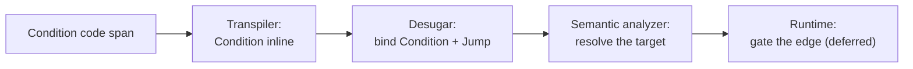

# Conditional jump

> [!NOTE]
> Status: **implemented**. A **conditional jump** fires only when its condition is
> true. Gating the edge at play time is part of the planned
> [runtime](https://github.com/pengzhengyi/dialoguedown/issues/45).

This note assumes the [Conditions](./Conditions.md) note and does not repeat it:
the condition primitive, its grammar, how it resolves, and the decisions behind it
live there. Read it first. This note covers only what is specific to guarding a
**jump**.

## Table of contents

- [Goal and scope](#goal-and-scope)
- [Functionality checklist](#functionality-checklist)
- [Ubiquitous language](#ubiquitous-language)
- [Writer-facing behavior](#writer-facing-behavior)
- [Grammar](#grammar)
- [Condition resolution](#condition-resolution)
- [Prior art](#prior-art)
- [Architecture](#architecture)
- [Interfaces and responsibilities](#interfaces-and-responsibilities)
- [Key design decisions](#key-design-decisions)
  - [D1 — False falls through; no inline else](#d1--false-falls-through-no-inline-else)
  - [D2 — Recognize in the transpiler, bind in desugar](#d2--recognize-in-the-transpiler-bind-in-desugar)
- [Diagnostics](#diagnostics)
- [Error and boundary cases](#error-and-boundary-cases)
- [Testability](#testability)
- [Implementation crosscheck](#implementation-crosscheck)
- [Alternatives not chosen](#alternatives-not-chosen)
- [Open questions and deferred work](#open-questions-and-deferred-work)

## Goal and scope

A writer often wants a jump to happen only under some game-state condition — take
a shortcut once a key is found, greet a returning player differently, skip a
scene already visited. Today a jump is unconditional: `=> [Label](#anchor)`
always fires.

This note applies the [condition](./Conditions.md) to a jump: a condition placed
*before* a jump makes that jump **optional**. When the condition is true the jump
fires; when it is false the jump is skipped and the dialogue continues with the
next block.

In scope: where a jump's guard attaches, how it is bound, and its diagnostics.

Out of scope: **runtime gating** — evaluating the condition and taking or skipping
the edge belongs to the graph/runtime — and everything the
[Conditions](./Conditions.md) note owns, including negation and expressions.

## Functionality checklist

- [x] Recognize a `` `"key"?` `` code span as a `Condition` — the query grammar
      plus a trailing `?` — carrying the key and its exact source span.
- [x] Bind a condition that immediately precedes a jump to that jump during jump
      assembly, so a `Jump` carries an optional `Condition`.
- [x] Report `DLG1106` when a condition does not precede a jump.
- [x] Preserve the source span of the condition, its query key, and the conditional
      jump.
- [x] Leave an ordinary unconditional jump unchanged when no condition precedes
      it.
- [x] Add the construct to the writer-facing specification, the gallery, and the
      report projection.

## Ubiquitous language

**Condition**, **guard-first**, and **check** carry over unchanged from
[Conditions](./Conditions.md#ubiquitous-language). This note adds two terms.

| Term                 | Meaning                                                                                                                                           |
| -------------------- | ------------------------------------------------------------------------------------------------------------------------------------------------- |
| **Conditional jump** | A jump preceded by a condition; it fires only when the condition is true.                                                                         |
| **Optional jump**    | The same jump described by its false behavior: when the condition is false, the jump is skipped and the dialogue falls through to the next block. |

## Writer-facing behavior

Place a condition before a jump and the jump becomes optional:

```markdown
`"FoundKey"?` => [Open the vault](#the-vault)

The door stays shut. You look for another way.
```

If `FoundKey` is true the reader jumps to *The Vault*; if it is false the jump is
skipped and reading continues with "The door stays shut."

For an alternative, write the next line — a plain jump, another conditional jump,
or ordinary dialogue:

```markdown
`"FoundKey"?` => [Open the vault](#the-vault)
=> [Search the study](#the-study)
```

If the key is found the reader takes the vault; otherwise the unconditional jump
to the study runs.

A conditional jump inherits every rule of an ordinary
[jump](../../guide/structure-and-flow.md#jumps): it lives on one line, the pieces
may be separated by spaces but not a line break, and it cannot appear inside a
heading.

## Grammar

A conditional jump is a [condition](./Conditions.md#grammar) immediately preceding
a jump on the same line:

```ebnf
ConditionalJump = Condition , { Whitespace } , JumpIndicator , { Whitespace } , Link ;
JumpIndicator   = "=>" ;
```

## Condition resolution

Resolution runs at runtime, through `IGameSystem.Check` — see
[Conditions](./Conditions.md#condition-resolution). For a jump, a `true` result
fires it; a `false` result skips it and the dialogue continues with the next
block.

## Prior art

See [Conditions](./Conditions.md#prior-art). Ink's `{has_key: -> unlocked}` is
the closest model: a condition immediately in front of a divert, falling through
when false.

## Architecture

A condition threads through the front of the pipeline and is bound to its jump
where jumps are already assembled.



- **Transpiler.** When an inline code span's content is a query followed by `?`,
  the transpiler produces a `Condition` fragment (its key and span) instead of a
  game call — parallel to how a bare `` `"key"` `` becomes a `Query`.
- **Desugar.** Jump assembly already pairs a `JumpIndicator` (`=>`) with the
  `Link` that follows. It is extended to also bind a `Condition` that immediately
  precedes the indicator, producing a `Jump` that carries an optional
  `Condition`. A condition left unbound is reported (`DLG1106`).
- **Semantic analyzer.** Unchanged: it resolves the jump's target as before and
  preserves the condition.
- **Runtime.** Evaluating the condition and taking or skipping the edge is
  deferred to the graph/runtime, alongside dynamic-weight resolution and jump
  edges.

## Interfaces and responsibilities

| Element                          | Responsibility                                                                                                                                                                           |
| -------------------------------- | ---------------------------------------------------------------------------------------------------------------------------------------------------------------------------------------- |
| `Condition`                      | A spanned `ScriptNode` carrying the query `Key` and its source span; the reusable primitive a jump (and, later, a line or choice) guards.                                                |
| `Jump`                           | Gains an optional `Condition`; an unconditional jump leaves it absent.                                                                                                                   |
| `ConditionReader`                | Recognizes a `` `"key"?` `` code span by reusing `GameCallParser.Query` through `TryParseAll`, producing a `Condition`.                                                                  |
| `JumpAssembler`                  | Folds the condition-first condition into the jump with a small Pidgin grammar over the fragment stream, sharing the `FragmentParsers.OfType<T>()` combinator.                            |
| `IGameSystem.Check` *(deferred)* | The `bool Check(string key)` the runtime will call to resolve a condition (an unknown key is `false`); not added yet — it lands with the runtime.                                        |
| `OrphanConditionRule`            | Reports `DLG1106` for a condition that guards nothing (it is not the condition its parent references).                                                                                   |
| `DiagnosticCatalog`              | Owns `DLG1106` (a condition does not precede a jump).                                                                                                                                    |
| Report projection                | Shows a jump's condition (its key) in the Dialogue AST report. A condition is a code span, so the editor colors it through Markdown highlighting; no dedicated semantic token is needed. |

## Key design decisions

The decisions behind the condition itself — that it is a read rather than a
command, the `?` sigil, guard-first placement, the `Check` contract, the spanned
reusable node, and deferred negation and expressions — live in
[Conditions](./Conditions.md#key-design-decisions). Two are specific to the jump.

### D1 — False falls through; no inline else

A false condition skips its one conditional jump and continues with the next
block. There is no inline else-target; the writer places the alternative on the
next line — a plain jump, another conditional jump, or ordinary dialogue. This
keeps the construct Markdown-native and avoids a branching syntax. A writer who wants
branches that are grouped and mutually exclusive reaches for a
[block control](./Block%20Controls.md) instead.

### D2 — Recognize in the transpiler, bind in desugar

A jump's condition is an inline fragment, recognized in the transpiler and bound
to its jump during desugar's jump assembly — the same stage that already pairs a
`=>` with its link. Recognition and binding stay where their neighbors live.

This is the guard-attachment choice that distinguishes a jump from its siblings:
a jump can appear *mid-line*, so its condition travels with it through the inline
stream. A [line](./Conditional%20Line.md) guard and a
[choice option](./Conditional%20Choice.md) guard always sit at the start of their
block, so both are peeled at block level instead.

## Diagnostics

A condition that guards nothing reports `DLG1106` — see
[Conditions](./Conditions.md#diagnostics) for the code and its band. For a jump,
that means a condition not immediately followed by `=>`.

## Error and boundary cases

| Case                                                | Behavior                                                                                                              |
| --------------------------------------------------- | --------------------------------------------------------------------------------------------------------------------- |
| Condition before a jump (`` `"K"?` `` `=> [L](#a)`) | Conditional jump; the jump carries the condition.                                                                     |
| Plain jump, no condition                            | Unchanged unconditional jump.                                                                                         |
| Key containing `?` (`` `"Rainy?"?` ``)              | Key is `Rainy?`; the trailing `?` is the operator.                                                                    |
| Condition not before a jump                         | `DLG1106`; recovered so the rest of the line still builds.                                                            |
| Malformed code span (`` `"a" "b"?` ``)              | Not a condition; falls back to game-call recognition → `DLG1102`, literal text.                                       |
| Condition inside a choice-body jump                 | Allowed: the conditional jump is an ordinary jump within the choice body.                                             |
| Condition in a heading                              | A heading marks a scene and cannot contain a jump, so the pieces read as heading text (inherited from the jump rule). |
| Condition key unknown to the game                   | `Check` defaults to `false`, so the jump is skipped.                                                                  |

## Testability

- **Recognition:** a `` `"key"?` `` code span becomes a `Condition` with the
  right key and span; a bare `` `"key"` `` stays a `Query`.
- **Binding:** a condition immediately before a jump attaches to it; the `Jump`
  exposes the condition; an ordinary jump has none.
- **Diagnostics:** a condition that guards no jump reports `DLG1106` at its span.
- **Spans:** the condition, its key, and the conditional jump keep their source
  spans.
- **Projection:** the report shows a conditional jump's condition key.

Use multi-line raw string literals for script fixtures so the condition and the
jump are visible.

## Implementation crosscheck

The construct shipped as designed; the runtime read and gating remain deferred.

| Bucket       | Result                                                                                                                                                                                                                                                                                                                                                             |
| ------------ | ------------------------------------------------------------------------------------------------------------------------------------------------------------------------------------------------------------------------------------------------------------------------------------------------------------------------------------------------------------------ |
| **Achieved** | The spanned `Condition` node and `IsConditional` predicate; recognition by `ConditionReader` (reusing `GameCallParser.Query` via a new `TryParseAll`); guard-first binding in `JumpAssembler`; `DLG1106` from `OrphanConditionRule`; the report projection; and the writer spec, gallery, and error-codes entry all match the design.                              |
| **Changed**  | `JumpAssembler`'s fold became a small **Pidgin** grammar over the fragment stream (Pidgin is a new core dependency), with a shared `FragmentParsers.OfType<T>()` combinator; the orphan-condition diagnostic lives in a structural rule (`OrphanConditionRule`), not in `JumpAssembler`; and `TryParseAll` was extracted and shared with the choice-weight reader. |
| **Deferred** | `IGameSystem.Check` is not added yet — resolving a condition and gating the edge are the runtime's job ([issue #45](https://github.com/pengzhengyi/dialoguedown/issues/45)). Conditions on lines and choices, their interaction with random choices, and negation remain follow-up.                                                                                |

## Alternatives not chosen

The alternatives weighed for the condition itself — a reserved `` `If(…)` ``
command form, condition-after placement, prefix `!` negation, and reusing `Query`
for a boolean — are recorded in
[Conditions](./Conditions.md#key-design-decisions). Two were weighed for the jump.

| Alternative                                              | Why not                                                                                                                  |
| -------------------------------------------------------- | ------------------------------------------------------------------------------------------------------------------------ |
| A block `if` wrapping a jump (Yarn/Ren'Py)               | Powerful but not Markdown-native. DialogueDown offers that shape separately as a [block control](./Block%20Controls.md). |
| An inline else-target (a second divert on the same line) | Denser and less Markdown-native than writing the alternative on the next line as its own paragraph (D1).                 |

## Open questions and deferred work

Deferred work on the condition itself — runtime evaluation, the
`IGameSystem.Check` public-API question, negation, and expressions — is tracked in
[Conditions](./Conditions.md#deferred-work). Nothing further is outstanding for
the jump: its guard is bound, diagnosed, and projected, and gating the edge at
play time arrives with the
[runtime](https://github.com/pengzhengyi/dialoguedown/issues/45).
