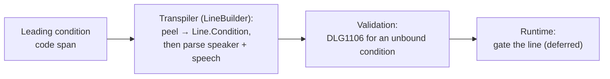

# Conditional line

> [!NOTE]
> Status: **implemented**. The compiler recognizes a **conditional line** — a line
> fronted by the **condition** primitive (`` `"key"?` ``) that plays only when the
> condition is true — reusing the condition designed in the
> [Conditional Jump](./Conditional%20Jump.md) note; read that first. Gating the
> line at play time (and the `IGameSystem.Check` read it will use) is part of the
> planned [runtime](https://github.com/pengzhengyi/dialoguedown/issues/45).

## Table of contents

- [Conditional line](#conditional-line)
  - [Table of contents](#table-of-contents)
  - [Goal and scope](#goal-and-scope)
  - [Functionality checklist](#functionality-checklist)
  - [Ubiquitous language](#ubiquitous-language)
  - [Writer-facing behavior](#writer-facing-behavior)
  - [Grammar](#grammar)
  - [Condition resolution](#condition-resolution)
  - [Prior art](#prior-art)
  - [Architecture](#architecture)
  - [Interfaces and responsibilities](#interfaces-and-responsibilities)
  - [Key design decisions](#key-design-decisions)
    - [D1 — The line guard is a peeled property, not an inline fragment](#d1--the-line-guard-is-a-peeled-property-not-an-inline-fragment)
    - [D2 — Guard-first, before the speaker](#d2--guard-first-before-the-speaker)
    - [D3 — Reuse the condition primitive and its reader](#d3--reuse-the-condition-primitive-and-its-reader)
    - [D4 — `DLG1106` generalizes from "without a jump" to "guards nothing"](#d4--dlg1106-generalizes-from-without-a-jump-to-guards-nothing)
    - [D5 — A false line is skipped whole; no else](#d5--a-false-line-is-skipped-whole-no-else)
    - [D6 — A lone condition guards nothing](#d6--a-lone-condition-guards-nothing)
  - [Markdown interaction](#markdown-interaction)
  - [Diagnostics](#diagnostics)
  - [Error and boundary cases](#error-and-boundary-cases)
  - [Testability](#testability)
  - [Implementation crosscheck](#implementation-crosscheck)
  - [Alternatives not chosen](#alternatives-not-chosen)
  - [Open questions and deferred work](#open-questions-and-deferred-work)

## Goal and scope

A writer often wants a single line to appear only under some game-state
condition — a condition who mutters a threat only when angry, a narrator who adds a
sentence only on a return visit, a companion whose aside depends on a flag.
Today a [line](./Markdown%20to%20Dialogue%20AST%20Transpiler.md) is
unconditional: it always plays.

The [Conditional Jump](./Conditional%20Jump.md) note added the **condition**
primitive — a game-state query read as a boolean, written `` `"key"?` `` — and
applied it to a jump. This note applies the *same* condition to a **line**: a
condition placed *before* a line makes that line **conditional**. When the
condition is true the line plays; when it is false the line is skipped and the
dialogue continues with the next block.

Scope:

- The **conditional line**: a condition that guards a single line, including a
  line that names a speaker.
- Compile-time recognition, preservation, and diagnostics.
- Generalizing the orphan-condition diagnostic (`DLG1106`) so a condition may now
  guard a jump *or* a line.

Out of scope for this version (see [deferred work](#open-questions-and-deferred-work)):

- **Runtime gating** — actually evaluating the condition and playing or skipping
  the line belongs to the graph/runtime, alongside the conditional jump.
- **Conditions on choices** — the next construct; a condition guarding a player
  or random-choice option is designed separately and wired after this note.
- **Negation** and **in-script expressions** — unchanged from the conditional
  jump: a writer expresses "unless" through a game-defined inverse flag, and the
  game composes logic behind a single key.

## Functionality checklist

- [x] Recognize a leading `` `"key"?` `` condition code span on a line, *before*
      the speaker is parsed, and peel it off as the line's guard.
- [x] Model the condition as an optional `Condition` on `Line`, with an
      `IsConditional` predicate; an unconditional line leaves it absent.
- [x] Parse the speaker and speech from the content *after* the peeled condition,
      so `` `"Angry"?` Guard: Leave.`` still names the speaker `Guard`.
- [x] Preserve the source span of the condition, its query key, the speaker, and
      the speech.
- [x] Generalize `DLG1106` so a condition that guards neither a jump nor a line
      is reported, and detect "conditional" by identity, not by parent type alone.
- [x] Leave an ordinary unconditional line unchanged when no condition precedes
      it.
- [x] Add the construct to the writer-facing specification, the gallery, and the
      report projection.

## Ubiquitous language

The domain term is **condition** everywhere, exactly as in the
[Conditional Jump](./Conditional%20Jump.md#ubiquitous-language) note. This note
adds one term and reuses the rest.

| Term                 | Meaning                                                                                                                                                                                                   |
| -------------------- | --------------------------------------------------------------------------------------------------------------------------------------------------------------------------------------------------------- |
| **Conditional line** | A line preceded by a condition; it plays only when the condition is true, and is skipped whole when it is false.                                                                                          |
| **Peel**             | Removing the leading guard code span from a block before the rest is parsed, so the condition becomes a property rather than content — the same move the random-choice weight already makes on an option. |

The **condition**, **check**, and **guard-first** terms carry over unchanged.

## Writer-facing behavior

A condition is the game-state [query](../../guide/game-state.md#queries) you
already write, with a `?` added inside the code span (see the
[query-and-sigil family](./Conditional%20Jump.md#writer-facing-behavior)). Place
it at the *start of a line* and the whole line becomes conditional:

```markdown
`"Angry"?` Guard: You again? Get out.

The guard says nothing and waves you through.
```

If `Angry` is true the condition's line plays; if it is false that line is skipped
and reading continues with "The guard says nothing." The condition sits **before
the speaker** — `Condition` is still recognized as the speaker of the conditional line.

A conditional line needs no speaker; the condition fronts any line:

```markdown
`"Returned"?` Welcome back. It has been too long.
```

**Negation** and **no else** work exactly as for a
[conditional jump](./Conditional%20Jump.md#writer-facing-behavior): query a
game-defined inverse for "unless," and write the alternative as its own line.

```markdown
`"Angry"?` Guard: You again? Get out.
`"NotAngry"?` Guard: Back so soon? Go on through.
```

A conditional line inherits every rule of an ordinary line: it may carry a
speaker, tags, and styling, and the condition is not spoken text.

## Grammar

A conditional line is a condition immediately preceding the rest of a line — the
optional speaker prefix and the speech — on the same line.

```ebnf
ConditionalLine = Condition , { Whitespace } , [ SpeakerPrefix ] , Speech ;
Condition       = "`" , '"' , QueryKey , '"' , "?" , "`" ;
```

`Condition` and `QueryKey` are unchanged from the
[conditional jump grammar](./Conditional%20Jump.md#grammar); the condition reuses
the same recognition rather than re-deriving it.

## Condition resolution

Resolution runs at **runtime**, identical to the
[conditional jump](./Conditional%20Jump.md#condition-resolution): the runtime
reads the key through `IGameSystem.Check`; a `true` result plays the conditional
line, a `false` result skips it and the dialogue continues with the next block.
An unknown key defaults to `false`, so a flag that was never set simply hides the
line. The compiler only recognizes and preserves the condition.

## Prior art

The same models that shaped the
[conditional jump](./Conditional%20Jump.md#prior-art) shape the conditional line,
now applied to a *line* rather than a *divert*:

- **Inline conditional text** — Ink writes `{angry: You again?}`: a condition
  immediately in front of the text it gates, showing nothing when false. This is
  the model here: compact, inline, guard-first.
- **Block `if` wrapping a line** — Yarn Spinner writes
  `<<if $angry>> Guard: You again? <<endif>>`; Ren'Py writes `if angry: "…"`.
  Powerful but a block statement, not a Markdown-native inline.

The lasting lessons are unchanged: a condition **reads, it does not act**;
**fall-through is the natural false behavior** (a false line simply does not
appear); and **expressions belong to the host, not the script**.

## Architecture

Unlike the jump — whose condition is an inline fragment bound during desugar,
because a jump can sit mid-line — a line's condition sits at the very *start* of
the block, before the speaker. So it is recognized and **peeled in the
transpiler**, exactly where the random-choice weight is already peeled off an
option, and attached to the `Line` as a property. No desugar binding step is
needed.



- **Transpiler.** `LineBuilder` builds a `Line` from a group of Markdown inlines.
  Today it splits an optional speaker off the leading text, then builds the
  speech. It gains a first step: if the group's leading inline is a condition code
  span (recognized by the shared `ConditionReader`) *and* content follows it, peel
  the condition onto `Line.Condition` and parse the speaker and speech from the
  remainder. A bare condition with nothing after it is left in place as an
  ordinary inline fragment, so validation reports it (see
  [D6](#d6--a-lone-condition-guards-nothing)).
- **Validation.** The orphan-condition rule generalizes: a condition is *bound*
  when it is the condition of the jump *or* line it precedes. One that guards neither
  is reported (`DLG1106`).
- **Runtime.** Evaluating the condition and playing or skipping the line is
  deferred to the graph/runtime, alongside the conditional jump and dynamic-weight
  resolution.

## Interfaces and responsibilities

| Element                          | Responsibility                                                                                                                                            |
| -------------------------------- | --------------------------------------------------------------------------------------------------------------------------------------------------------- |
| `Condition`                      | Unchanged — the spanned, reusable primitive a jump or a line guards. Reused as-is from the conditional jump.                                              |
| `Line`                           | Gains an optional `Condition` and an `IsConditional` predicate; an unconditional line leaves it absent.                                                   |
| `LineBuilder`                    | Peels a leading condition off the inline group *before* speaker parsing, attaches it to the `Line`, and builds the speaker and speech from the remainder. |
| `ConditionReader`                | Unchanged — recognizes a `` `"key"?` `` code span. Reused by `LineBuilder` for the peel.                                                                  |
| `OrphanConditionRule`            | Renamed from `ConditionWithoutJumpRule`; reports `DLG1106` for a condition that guards neither a jump nor a line, detecting a condition by identity.      |
| `DiagnosticCatalog`              | `DLG1106` generalizes from "a condition does not precede a jump" to "a condition guards nothing."                                                         |
| Report projection                | Shows a conditional line's condition (its key) as the line's first child, mirroring how a conditional jump shows its condition.                           |
| `IGameSystem.Check` *(deferred)* | Unchanged — the `bool Check(string key)` the runtime will call to resolve a condition; lands with the runtime.                                            |

## Key design decisions

### D1 — The line guard is a peeled property, not an inline fragment

A jump's condition is modeled as an inline `Condition` fragment and bound to the
jump during desugar, because a jump can appear *mid-line* and its condition travels
with it through the inline stream. A line's condition is different: it always
sits at the **start of the block**, before the speaker, which the transpiler
parses at block level from the leading text. So the line guard is **peeled in the
transpiler** and attached to `Line` as an optional property — exactly the move the
random-choice **weight** already makes on an option (`RandomOption` carries a
`ChoiceWeight` peeled off its leading code span).

This is a deliberate asymmetry with the jump, and the right one: the same
`Condition` node and the same guard-first reading serve both, but a block-start
guard is a property of its block, not a fragment inside its content. Forcing the
line guard through the jump's inline/desugar path would mean teaching the speaker
parser to skip a leading inline fragment — more convoluted than a clean peel, and
inconsistent with the weight it sits beside.

### D2 — Guard-first, before the speaker

The condition is written *before* the whole line, speaker included:
`` `"Angry"?` Guard: Leave.`` The guard reads "if … then …", it is scannable at
the start of the line, and it matches the condition-first placement the conditional
jump established and the conditional choice will reuse. Placing it after the
speaker (``Guard: `"Angry"?` Leave.``) was rejected: it buries the guard and
breaks the one placement rule shared across jump, line, and choice.

### D3 — Reuse the condition primitive and its reader

A conditional line introduces no new syntax primitive. It reuses the `Condition`
node, the `` `"key"?` `` shape, the `ConditionReader`, and the query-and-sigil
family from the conditional jump. Only the *attachment point* is new (a line
rather than a jump), so the writer who knows one knows the other, and the domain
keeps a single word — **condition** — for the condition everywhere.

### D4 — `DLG1106` generalizes from "without a jump" to "guards nothing"

Today `DLG1106` fires when a condition does not precede a jump, and the rule
decides "bound" by checking that the condition's parent node is a `Jump`. That
test no longer suffices: a line's condition and a stray condition *in a line's
speech* both have the `Line` as their parent. The rule instead decides a
condition is **bound by identity** — it is bound when it is exactly the
`Condition` its parent jump or line references, not merely when its parent is of
a guarding type. Any condition that is not the condition of its parent is unbound and
reported.

The diagnostic generalizes accordingly — from "a condition does not precede a
jump" to "a condition guards nothing" — and its message names the current guards
(a jump or a line). The conditional-choice note will extend the same rule and
message to a third guard.

### D5 — A false line is skipped whole; no else

A false condition skips its one conditional line and continues with the next block —
the same fall-through as the conditional jump, and the same "no inline else." The
writer places any alternative on the next line (often a second conditional line
querying the inverse flag). This keeps the construct Markdown-native and avoids a
branching syntax.

### D6 — A lone condition guards nothing

A condition with no speaker and no speech after it — a paragraph that is only
`` `"Angry"?` `` — guards nothing and is reported as `DLG1106`, not silently
accepted as an empty conditional line. Concretely, `LineBuilder` peels the
condition onto the line **only when content follows it**; a lone condition is left
as an ordinary inline fragment, which the generalized rule then reports. This
catches the likely mistake — a writer who wrote the condition but forgot the line —
rather than compiling a line that can only ever show nothing.

## Markdown interaction

A condition is an inline code span, so Markdig parses `` `"Angry"?` Guard: …`` as
inline code followed by text, and an ordinary Markdown preview shows the condition as
code before the line — readable, and clearly not spoken. It does not collide with
any existing Markdown or DialogueDown syntax, for the same reason the conditional
jump does not: a quoted string followed by `?` inside a code span is not a valid
game call, so the condition claims an otherwise-unused shape and removes no valid
expressibility. A leading condition is peeled before speaker parsing, so it never
becomes part of a speaker name or speech text.

## Diagnostics

| Code      | Meaning                    | Kind   | Severity | When                                                                                                                                                 |
| --------- | -------------------------- | ------ | -------- | ---------------------------------------------------------------------------------------------------------------------------------------------------- |
| `DLG1106` | A condition guards nothing | Syntax | Error    | A `` `"key"?` `` condition guards neither a jump nor a line — it is not immediately before a `=>` jump, and not at the start of a line with content. |

`DLG1106` keeps its code and its place in the `DLG11xx` inline-surface band; only
its title and message generalize (its choice use will follow). A malformed
condition — a code span that is not a clean quoted query followed by `?` — is not
a condition at all; it falls back to game-call recognition and, failing that, is
reported as `DLG1102` and kept as literal text. There is no invalid-value
diagnostic: `Check` returns a boolean, so a condition always resolves at runtime,
and an unknown key defaults to false.

## Error and boundary cases

| Case                                                     | Behavior                                                                                           |
| -------------------------------------------------------- | -------------------------------------------------------------------------------------------------- |
| Condition before a line (`` `"K"?` Guard: Hi``)          | Conditional line; the line carries the condition, and `Guard` is still the speaker.                |
| Condition before a speaker-less line (`` `"K"?` Hello``) | Conditional line with a default speaker; `Hello` is the speech.                                    |
| Plain line, no condition                                 | Unchanged unconditional line.                                                                      |
| Lone condition on its own line (`` `"K"?` ``)            | `DLG1106`; the condition guards nothing (see [D6](#d6--a-lone-condition-guards-nothing)).          |
| Condition mid-speech (``Guard: You `"K"?` there``)       | `DLG1106`; a condition inside speech guards nothing and is not a line guard.                       |
| Key containing `?` (`` `"Rainy?"?` Guard: Hi``)          | Key is `Rainy?`; the trailing `?` is the operator, inherited from the condition grammar.           |
| Malformed code span (`` `"a" "b"?` Guard: Hi``)          | Not a condition; falls back to game-call recognition → `DLG1102`, literal text; line is unguarded. |
| Condition key unknown to the game                        | `Check` defaults to `false`, so the line is skipped at runtime.                                    |

## Testability

- **Recognition:** a `` `"key"?` `` before a line becomes the `Line`'s condition
  with the right key and span; a line with no leading condition has none.
- **Speaker after the guard:** `` `"K"?` Guard: Hi`` yields speaker `Guard`,
  speech `Hi`, and the condition — the peel does not disturb speaker parsing.
- **Diagnostics:** a lone condition and a mid-speech condition each report
  `DLG1106`; a well-formed conditional line does not.
- **Spans:** the condition, its key, the speaker, and the speech keep their source
  spans.
- **Projection:** the report shows a conditional line's condition key as the
  line's first child.

Use multi-line raw string literals for script fixtures so the condition and the
line are visible.

## Implementation crosscheck

The construct shipped as designed; the runtime read and gating remain deferred.

| Bucket       | Result                                                                                                                                                                                                                                                                                                                                                                                                                                            |
| ------------ | ------------------------------------------------------------------------------------------------------------------------------------------------------------------------------------------------------------------------------------------------------------------------------------------------------------------------------------------------------------------------------------------------------------------------------------------------- |
| **Achieved** | `Line` gained an optional `Condition` and an `IsConditional` predicate; `LineBuilder` peels a leading condition before the speaker, only when content follows it; the orphan-condition rule generalized to `OrphanConditionRule`, detecting a bound condition by identity across a jump or a line; a line's condition is traversed guard-first; and the report projection, writer spec, gallery, and `DLG1106` docs all match the design (D1–D6). |
| **Changed**  | `LineBuilder` was restructured into a thin wrapper over a single-use `Assembler` that consumes the front of the line's inlines, and a shared `ISpanned` interface with a `SourceSpan.Covering` overload replaced the repeated first-and-last-span idiom — refinements beyond the note. The `DLG1106` fix example now moves the condition to the line's start rather than dropping the `?`, preserving the writer's intent.                        |
| **Deferred** | Reading the condition through `IGameSystem.Check` and playing or skipping the line are the runtime's job ([issue #45](https://github.com/pengzhengyi/dialoguedown/issues/45)). Conditions on choices are the next construct; consolidating the condition notes, negation, and expressions remain follow-up.                                                                                                                                       |

## Alternatives not chosen

| Alternative                                                                    | Why not                                                                                                                                                                                                                  |
| ------------------------------------------------------------------------------ | ------------------------------------------------------------------------------------------------------------------------------------------------------------------------------------------------------------------------ |
| Model the line guard as an inline fragment bound in desugar (as the jump does) | A line guard is at the block start, before the speaker; making it an inline fragment forces the speaker parser to skip it and diverges from the weight it sits beside. A peeled property is simpler and consistent (D1). |
| Condition *after* the speaker (``Guard: `"K"?` Hi``)                           | Reads acceptably but buries the guard mid-line and breaks the one guard-first rule shared across jump, line, and choice (D2).                                                                                            |
| Accept a lone condition as an empty conditional line                           | Compiles a line that can only ever show nothing and hides a likely writer mistake; reporting `DLG1106` is safer (D6).                                                                                                    |
| A new line-guard node distinct from the jump's condition                       | Splits one domain concept into two; reusing `Condition` keeps a single word and a single reader (D3).                                                                                                                    |

## Open questions and deferred work

- **Runtime gating of a conditional line** — the compiler recognizes and
  preserves the condition, but reading the key through `Check` and playing or skipping
  the line need the runtime. Tracked with the
  [runtime work](https://github.com/pengzhengyi/dialoguedown/issues/45).
- **Conditions on choices** — the next construct. A condition guarding a player or
  random-choice option, and its interaction with random weights, is designed
  separately and builds on this note's peel and the generalized `DLG1106`.
- **Consolidating the condition notes** — with a jump, a line, and soon a choice
  guard sharing one primitive, the three notes may be worth folding into a single
  "Conditions" note (primitive plus per-construct application). Revisit once the
  choice guard lands.
- **Negation** and **expressions** — unchanged and still deferred from the
  [conditional jump](./Conditional%20Jump.md#open-questions-and-deferred-work): a
  game-defined inverse flag covers "unless," and the game composes logic behind a
  single key.
