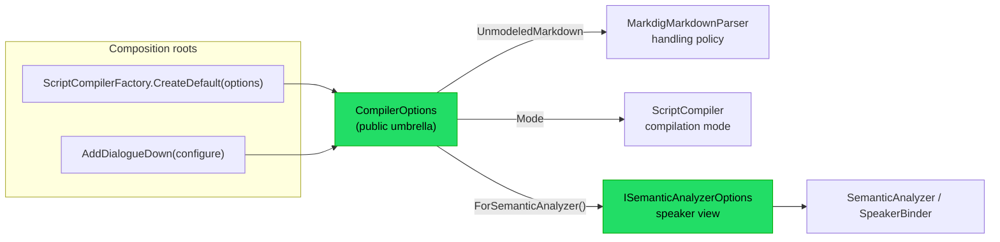

# Implementation note: Configuration

> [!IMPORTANT]
> Status: **implemented**. Configuration is a
> **cross-cutting concern**: the seam through which a consumer tunes how DialogueDown
> compiles a script, without editing the script itself. `CompilerOptions` currently
> carries the compilation mode, the configured speaker registry, and
> unmodeled-Markdown handling overrides. The public configuration graph is deeply
> immutable with structural value equality.

## Table of contents

- [Implementation note: Configuration](#implementation-note-configuration)
  - [Table of contents](#table-of-contents)
  - [Goal and scope](#goal-and-scope)
  - [Where it sits](#where-it-sits)
  - [Ubiquitous language](#ubiquitous-language)
  - [Functionality checklist](#functionality-checklist)
  - [Interfaces and abstractions](#interfaces-and-abstractions)
  - [Key design decisions](#key-design-decisions)
    - [DD1 — A plain immutable options record, not `IOptions<T>`](#dd1--a-plain-immutable-options-record-not-ioptionst)
    - [DD2 — A `Configuration` foundation namespace](#dd2--a-configuration-foundation-namespace)
    - [DD3 — Project options into each stage at the composition roots](#dd3--project-options-into-each-stage-at-the-composition-roots)
    - [DD4 — A configured speaker registry with layered default precedence](#dd4--a-configured-speaker-registry-with-layered-default-precedence)
    - [DD5 — Configured speakers as edge data, bridged to the AST](#dd5--configured-speakers-as-edge-data-bridged-to-the-ast)
    - [DD6 — Deeply immutable configuration values with structural equality](#dd6--deeply-immutable-configuration-values-with-structural-equality)
  - [Error and boundary cases](#error-and-boundary-cases)
  - [Integration](#integration)
  - [Testability](#testability)
  - [Deferred knobs](#deferred-knobs)
  - [Configuration format](#configuration-format)

## Goal and scope

This component provides a **configuration seam** — a deeply immutable
**`CompilerOptions`** umbrella that the composition roots unpack into the
specific values and collaborators each stage reads. A consumer can tune the
compiler without editing the script or replacing a whole pipeline stage, and
can compare, cache, and share equivalent options as values.

**Configured speakers.** A consumer may supply speakers
(`CompilerOptions.Speakers`) the compiler binds alongside a script's own. One entry may
carry the reserved **default** tag; when a script declares no in-file default,
speakerless lines resolve to that configured default instead of the anonymous one, and
a configured speaker whose name also appears in the script is the **same speaker**.

**In scope:** the `CompilerOptions` umbrella (`Mode`, `Speakers`, and
`UnmodeledMarkdown`); deeply immutable configured speakers and tag collections;
structural equality and stable hashing; the semantic-analyzer view; both
composition roots threading options into the parser, compiler session, and
semantic analyzer; and the configured-speaker binding with default-speaker
precedence. **Out of scope
(deferred, tracked as issues):** remaining knobs such as DSL syntax tokens, slug
normalization, runtime settings, and command-layer policy (see
[Deferred knobs](#deferred-knobs)). Reading options from a file is handled by the separate
[configuration loader](./Configuration%20Loader.md); the core stays binding-agnostic and
takes a `CompilerOptions` directly. The project's config format is settled as **TOML**
(`dialogue.toml`) — see [Configuration format](#configuration-format).

## Where it sits

Configuration is not a pipeline stage; it is a value the composition roots build and
hand to the stages.



`CompilerOptions` and the per-stage options it exposes live in a new
**`DialogueDown.Configuration`** foundation namespace (a dependency leaf, like
`Common`), so both the semantic analyzer (upstream) and the compilation orchestrator
(downstream) may depend on them without breaking the core's one-directional layering — a
boundary an architecture test guards (see [Integration](#integration)).

## Ubiquitous language

| Term                           | Meaning                                                                                                                      |
| ------------------------------ | ---------------------------------------------------------------------------------------------------------------------------- |
| **Compiler options**           | The immutable `CompilerOptions` value that configures one compile: mode, speakers, and unmodeled-Markdown overrides.         |
| **Configuration value graph**  | `CompilerOptions` and every nested configured speaker, tag list, and handling map, owned immutably and compared by content.  |
| **Stage projection**           | The value or collaborator a composition root derives from the umbrella for one stage.                                        |
| **Configured speaker**         | A speaker supplied through `CompilerOptions.Speakers` (a `ConfiguredSpeaker`) the binder seeds alongside a script's own.     |
| **Handling override**          | A `keep` or `ignore` setting for one `UnmodeledNodeKind`; omitted kinds keep their built-in defaults.                        |
| **Configured default**         | The one configured speaker marked with the reserved `default` tag; the fallback when the script declares no in-file default. |
| **In-file default**            | A speaker the script itself marks default with the reserved `##default` tag.                                                 |
| **Anonymous default**          | The nameless fallback speaker the binder synthesizes when nothing else names a default (today's behavior).                   |
| **Default-speaker precedence** | The order the binder picks the default: **in-file `##default` › configured default › anonymous**.                            |

## Functionality checklist

- [x] A **`CompilerOptions`** immutable umbrella record carries the configured
      `Mode`, `Speakers`, and `UnmodeledMarkdown` overrides with a shared
      `Default` instance.
- [x] The umbrella exposes a per-stage **`ISemanticAnalyzerOptions`** view
      (`ForSemanticAnalyzer()`), so the analyzer depends only on the options it uses.
- [x] Both composition roots accept options:
      `ScriptCompilerFactory.CreateDefault(CompilerOptions?)` and
      `AddDialogueDown(this IServiceCollection, CompilerOptions?)`, defaulting to
      `CompilerOptions.Default`.
- [x] The root constructs the **`SemanticAnalyzer`** from that view; the analyzer seeds
      the **`SpeakerBinder`**'s configured layer with the configured speakers.
- [x] The roots pass `Mode` to the compiler session and build the Markdown
      parser's handling policy from `UnmodeledMarkdown`.
- [x] An **architecture test** asserts `DialogueDown.Configuration` is a foundation
      leaf with no dependency on other core layers.
- [x] Public collection properties use immutable collection types; assigning
      caller-owned sequences snapshots their contents.
- [x] `ConfiguredSpeaker` compares name, id, and both ordered tag lists by
      content.
- [x] `CompilerOptions` compares mode and ordered speakers by content, and
      handling overrides independent of dictionary insertion order.
- [x] Equal configuration values produce equal, stable hash codes; mutating a
      source collection after construction cannot change either value or hash.
- [x] With **no `##default` and a configured default**, speakerless lines resolve to
      that speaker; if its name also appears in the script, they are the **same
      speaker** (unified, referable).
- [x] With **no `##default` and no configured default**, the **anonymous default**
      still applies (unchanged behavior).
- [x] An **in-file `##default` always wins** over a configured default.

## Interfaces and abstractions

| Type                       | Visibility | Responsibility                                                                                           | Collaborators                                 |
| -------------------------- | ---------- | -------------------------------------------------------------------------------------------------------- | --------------------------------------------- |
| `CompilerOptions`          | public     | immutable options: mode, speakers/map, structural equality, `Default`, and stage projections             | composition roots, `ISemanticAnalyzerOptions` |
| `CompilationMode`          | public     | how far compilation proceeds after an error                                                              | compiler session, CLI, loader                 |
| `UnmodeledNodeKind`        | public     | the configuration vocabulary of unmodeled Markdown kinds                                                 | options, loader, Markdown policy              |
| `UnmodeledNodeHandling`    | public     | the `Keep` / `Ignore` outcome for an unmodeled kind                                                      | options, loader, Markdown policy              |
| `UnmodeledMarkdownNames`   | public     | canonical kebab-case names shared by author-facing surfaces                                              | loader and display tools                      |
| `ConfiguredSpeaker`        | public     | immutable speaker value: name, optional id, and immutable ordered custom/reserved tags                   | `CompilerOptions`, `ConfiguredTag`            |
| `ConfiguredTag`            | public     | a config tag: a name and optional value, serving a custom or reserved tag                                | `ConfiguredSpeaker`                           |
| `ReservedTagNames`         | public     | the closed vocabulary of reserved tag names (`default`, …) that config validates against                 | loader, binder, tag validator                 |
| `ISemanticAnalyzerOptions` | internal   | the per-stage view the analyzer reads (the configured speakers)                                          | `CompilerOptions`, `SemanticAnalyzer`         |
| `SemanticAnalyzerOptions`  | internal   | the default `ISemanticAnalyzerOptions` over the configured speakers                                      | `CompilerOptions`                             |
| `ScriptCompilerFactory`    | public     | `CreateDefault(CompilerOptions? = null)` wires the stages from the options                               | `CompilerOptions`, stages                     |
| `AddDialogueDown`          | public     | `AddDialogueDown(this IServiceCollection, CompilerOptions? = null)` registers the stages                 | `CompilerOptions`, stages                     |
| `SemanticAnalyzer`         | internal   | constructed from `ISemanticAnalyzerOptions`; seeds the binder's configured layer                         | `ISemanticAnalyzerOptions`, `SpeakerBinder`   |
| `ConfiguredSpeakerBuilder` | internal   | bridges a `ConfiguredSpeaker` to the AST `SpeakerDeclaration` the binder consumes                        | `ConfiguredSpeaker`, `SpeakerDeclaration`     |
| `SpeakerBinder`            | internal   | binds configured and script speakers in two layers with default precedence                               | `SpeakerSymbol`                               |

`CompilerOptions`, `ConfiguredSpeaker`, `ConfiguredTag`, and `ReservedTagNames` are
**public** — the consumer-facing contract and the shared reserved-tag vocabulary; the
per-stage view and the stages that read it stay internal.

## Key design decisions

### DD1 — A plain immutable options record, not `IOptions<T>`

`CompilerOptions` is a plain immutable `record` in the core (the public umbrella over
the stage projections in
[DD3](#dd3--project-options-into-each-stage-at-the-composition-roots)), not
`Microsoft.Extensions.Options`. This is the documented best practice for reusable
libraries: an engine consumer (Godot, a test, a console tool) uses it with **no DI
container and no forced `Microsoft.Extensions.Options` dependency**, while the
`AddDialogueDown` extension remains an optional adapter that can bind
`IConfiguration` for app consumers. The core exposes only its own contract and leaks
no third-party abstraction.

### DD2 — A `Configuration` foundation namespace

`CompilerOptions` and the per-stage options it exposes live in
`DialogueDown.Configuration`, a new **dependency leaf** (no dependency on other core
layers), because both the semantic analyzer (upstream) and the compilation orchestrator
(downstream) must read it. Placing it in `Compilation` would force `Semantics` to depend
on `Compilation` — a backward dependency the core-layering architecture tests forbid. A
dedicated namespace (over folding it into the `Common` grab-bag) names the cross-cutting
concern and gives the deferred knobs a home.

### DD3 — Project options into each stage at the composition roots

No stage receives the whole umbrella. The composition roots project
`CompilerOptions` into the narrowest contract each collaborator needs:

- `Mode` is already a stable value object, so it goes directly to
  `ScriptCompiler`.
- the Markdown front end receives an `IUnmodeledNodeHandlingPolicy` built by
  `UnmodeledNodeHandlingPolicies` from the override map;
- semantic analysis receives `ISemanticAnalyzerOptions`, a dedicated view over
  the configured speakers.

This keeps dependencies explicit without manufacturing an interface for every
single enum or map. The Markdown policy factory lives in the Markdown layer,
not on `CompilerOptions`, because `Configuration` is a foundation namespace
that must not depend on a pipeline stage. Making the semantic view an interface
remains valuable because the analyzer consumes a richer collection and its
tests substitute that collaborator directly.

The alternatives — passing the whole `CompilerOptions` to every stage or using
an ambient/global context — let stages read unrelated knobs and hide their
dependencies. Projection at the roots keeps each surface honest and the
configuration layer dependency-free.

### DD4 — A configured speaker registry with layered default precedence

Configuration supplies a **registry** of speakers, not a bare default name. The binder
binds them in **two layers** — the configured speakers first, then the script's own —
sharing one name/`@id` map, so a configured speaker whose name also appears in the
script converges on a **single identity** (a name denotes one speaker, DDD). The
default is chosen by **layer precedence**: an **in-file `##default`** wins, else the
**configured default** (the configured speaker marked with the reserved `default` tag),
else the **anonymous** fallback — the configured layer's default sitting between the
in-file and anonymous ones.

Marking the configured default with the **reserved `default` tag**, rather than a
separate default-name field, keeps every speaker in one registry and reuses the same
`##default` vocabulary the DSL already carries, so the configured default is inherently
referable and unified.

### DD5 — Configured speakers as edge data, bridged to the AST

A `ConfiguredSpeaker` is **plain, unvalidated data** — a name, an optional id, and its
tags already partitioned into `CustomTags` and `ReservedTags` — mirroring the
transpiler's `SpeakerPrefixData` precedent. Two typed tag lists (over one flag per
reserved tag) let the reserved vocabulary grow — `default` today, `voice` later —
without the record's shape churning. The semantic stage turns each `ConfiguredSpeaker`
into an AST `SpeakerDeclaration` through an internal `ConfiguredSpeakerBuilder`, the one
place that knows the declaration's shape (as `SpeakerBuilder` does for a parsed prefix);
the binder then treats a configured speaker exactly like a declared one. Validation
lives at the **edge** (the configuration loader), so the data reaching the binder is
already well-formed, and the binder keeps its single concern: speaker semantics.

### DD6 — Deeply immutable configuration values with structural equality

Configuration values may be shared across compilers, compared to suppress a
redundant recompile, or used as cache keys. The whole graph must therefore be
both **owned immutably** and **equal by content**:

- `ConfiguredSpeaker.CustomTags` and `ReservedTags`, and
  `CompilerOptions.Speakers`, are `ImmutableArray<T>`.
- `CompilerOptions.UnmodeledMarkdown` is an
  `ImmutableDictionary<UnmodeledNodeKind, UnmodeledNodeHandling>`.
- constructors accept general sequences where compatibility and ergonomics
  benefit, then snapshot them into the immutable representation.
- typed equality compares ordered arrays element by element and dictionaries by
  key/value content, independent of insertion order.
- generated hash codes use the same ordered/unordered semantics. They are stable
  for the lifetime of an immutable value within one process, not persistent
  cross-process identifiers.

Immutable collections solve ownership, not equality: two separately allocated
`ImmutableArray<T>` or `ImmutableDictionary<TKey, TValue>` values do not compare
equal merely because their contents match. `ConfiguredSpeaker` and
`CompilerOptions` therefore use
[`Generator.Equals`](https://github.com/diegofrata/Generator.Equals) to generate
typed equality and matching hash codes from property-level semantics:

- `[OrderedEquality]` on speaker and tag arrays preserves order.
- `[UnorderedEquality]` on the handling map ignores dictionary insertion order.
- scalar properties use their default equality.
- private backing fields use `[IgnoreEquality]`, so the public properties are
  the single equality surface.

The MIT-licensed generator is a private build dependency; its 18 KB runtime
comparer/attribute assembly is the only package dependency exposed to
consumers. This avoids repeated handwritten collection folds while keeping the
generated C# inspectable, reflection-free, and covered by domain tests.

The public immutable types are intentional even though they are a larger API
change than hidden defensive copies. They state the domain invariant directly,
prevent callers from observing a mutable configuration graph, and provide a
sound base for incremental compilation, caching, overlays, and concurrent
sharing. DialogueDown is pre-1.0, so this is the right point to make the
contract honest.

## Error and boundary cases

| Case                                              | Behavior                                                                 |
| ------------------------------------------------- | ------------------------------------------------------------------------ |
| No configured speakers (empty registry)           | anonymous default (unchanged).                                           |
| A configured speaker, not marked default          | seeded into the binder; usable if referenced, but not the default.       |
| Configured default, name **not** in the script    | that configured speaker is the default for speakerless lines.            |
| Configured default, name **is** in the script     | unified with that speaker; it becomes the default (referable).           |
| Configured default **and** an in-file `##default` | the in-file default wins; the configured default yields.                 |
| Two configured speakers marked default            | rejected as a speaker conflict (also caught earlier at the loader edge). |
| One unmodeled kind overridden                     | that kind changes; every omitted kind keeps its built-in handling.       |
| Empty unmodeled override map                      | the shared default handling policy is reused; no allocation.             |
| `null` options passed to a composition root       | falls back to `CompilerOptions.Default` for every knob.                  |
| `null` collection assigned to config              | rejected at construction or initialization.                              |
| Source collection mutated after construction      | the immutable configuration value and its hash remain unchanged.         |
| Equivalent maps with different insertion order    | options compare equal and produce the same hash code.                    |

## Integration

- **Core** (`DialogueDown`): the `DialogueDown.Configuration` namespace holds
  `CompilerOptions`, the mode and unmodeled-Markdown vocabulary,
  `ConfiguredSpeaker`, `ConfiguredTag`, `ReservedTagNames`, and the
  `ISemanticAnalyzerOptions` seam.
- **Composition roots**: `ScriptCompilerFactory.CreateDefault(CompilerOptions?)` and
  `AddDialogueDown(this IServiceCollection, CompilerOptions?)` project the
  umbrella into the Markdown parser, compiler session, and semantic analyzer;
  both default to `CompilerOptions.Default`.
- **Configuration loader** (`DialogueDown.ConfigurationLoader`): the separate satellite
  that reads a `dialogue.toml` into a `CompilerOptions` — see
  [Configuration loader](./Configuration%20Loader.md).
- **Architecture tests**: a `Configuration_IsAFoundationLeaf` test asserts the
  namespace has no dependency on other core layers, mirroring the `Common` layering
  test.
- **CLI / visualization**: config discovery and `--config` load the umbrella
  before constructing the compiler and report.

## Testability

- **`CompilerOptions` and projections**: unit-test defaults, semantic speaker
  projection, configured handling layered over built-in defaults, structural
  equality, and stable hashing.
- **`ConfiguredSpeaker`**: equal content in separately allocated tag sequences
  compares equal; tag order remains significant; source-sequence mutation does
  not affect the speaker.
- **Collection ownership**: mutate each caller-owned source collection after
  construction and assert the configuration value and hash are unchanged.
- **`SpeakerBinder`**: the precedence cases each get a test — in-file default wins;
  configured default when no in-file; unified when a configured name is in the script;
  anonymous when neither is present.
- **`ConfiguredSpeakerBuilder`**: a configured speaker maps to the expected declaration
  (name, id, reserved and custom tags).
- **`SemanticAnalyzer`**: the configured speakers reach the binder (they appear in the
  resolved model), driven through a mocked `ISemanticAnalyzerOptions`.
- **Composition roots**: `CreateDefault(options)` and configured
  `AddDialogueDown` compilers honor speakers and unmodeled handling over the
  real pipeline; mode has its own stage-boundary tests.
- **Architecture**: the `Configuration_IsAFoundationLeaf` test above.
- Construction goes through the shared test factory; inputs are multi-line raw string
  literals so the parsed shape is visible.

## Deferred knobs

The survey surfaced further knobs; each becomes its own later component and a tracked
issue rather than riding in this seam:

| Knob                                                 | Where                                 | Note                                                            |
| ---------------------------------------------------- | ------------------------------------- | --------------------------------------------------------------- |
| Configurable `##default` **tag name**                | `ReservedTagNames`, binder, validator | Reserved-tag vocabulary; a natural next step on this same seam. |
| Missing-default **strict mode** (error vs anonymous) | binder                                | An authoring-strictness policy.                                 |
| DSL **syntax tokens** (`@`, `:`, `=>`, `#`/`##`)     | parser, tokenizer                     | Deep and risky; touches the grammar.                            |
| Other **Markdig** pipeline features                  | Markdown front-end                    | Unmodeled handling is configurable; parser extensions are not.  |
| **Slug** normalization (trim/collapse)               | `Slug`                                | Anchor policy.                                                  |
| Live-server **port / host / debounce**               | `DialogueDown.Visualization.Live`     | A different assembly's settings.                                |
| **CLI** output paths / defaults                      | `DialogueDown.Cli`                    | Command-layer policy.                                           |

## Configuration format

The **format** for reading these knobs from disk is settled as **TOML** — a
`dialogue.toml` at the project root, decided in the
[Unmodeled Markdown Handling](./Unmodeled%20Markdown%20Handling.md#configuration-format)
note (explicit `[section]` headers, comments, a published standard, first-class .NET
parsing via Tomlyn). The separate
[configuration loader](./Configuration%20Loader.md) reads it into a `CompilerOptions`,
so the core stays binding-agnostic and takes a `CompilerOptions` object directly.

The speaker registry lives **inline** as a `[[speakers]]` array-of-tables (no separate
speakers file for now — a referenced file can be added later if casts grow). The
**default speaker is one registry entry flagged `default = true`**:

```toml
# dialogue.toml

[[speakers]]
name    = "Narrator"
id      = "narrator"
default = true          # the default speaker — at most one, as with in-script ##default

[[speakers]]
name = "Alice"
id   = "A"
tags = ["main"]
```

A `default = true` flag keeps every speaker in **one registry** (a name denotes one
speaker), marks the default with a **typed** field rather than a stringly-typed
`##default` tag or a separate name reference, and leaves `tags` for plain content tags. It
carries the same "at most one default" rule as the in-script `##default`, enforced by the
loader. Because the default is itself a registry speaker, it is inherently referable and
unified (per [DD4](#dd4--a-configured-speaker-registry-with-layered-default-precedence)).

The same file carries the other implemented knobs:

```toml
mode = "best-effort"

[markdown.unmodeled]
table = "keep"
```

See the user-facing [project configuration guide](../../guide/configuration.md)
for the complete schema.
