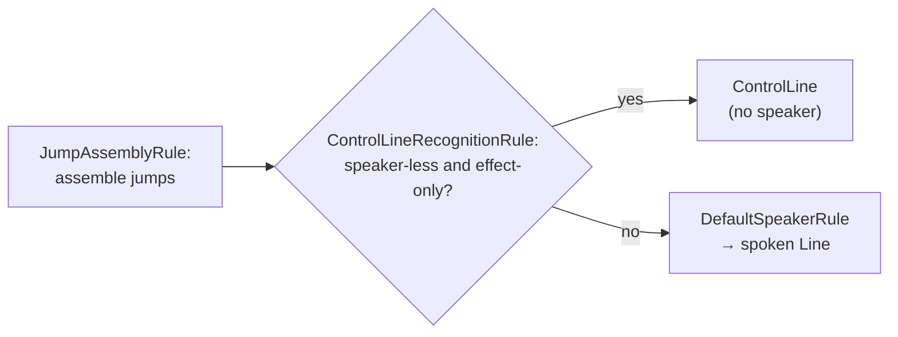

# Control line

> [!NOTE]
> Status: **implemented**. The compiler recognizes a **control line** — an
> *effect-only* block with no speaker, distinct from a spoken
> [line](./Conditional%20Line.md). It models what a bare jump and a silent command
> already are (control and effect, not speech), so neither is attributed to the
> configured default speaker. It grows out of the
> [Block Controls](./Block%20Controls.md) survey and reuses the jump and command
> fragments from the
> [Markdown to Dialogue AST Transpiler](./Markdown%20to%20Dialogue%20AST%20Transpiler.md)
> and the condition from the [Conditional Jump](./Conditional%20Jump.md) note.
> Executing an effect at play time is part of the planned
> [runtime](https://github.com/pengzhengyi/dialoguedown/issues/45).

## Table of contents

- [Control line](#control-line)
  - [Table of contents](#table-of-contents)
  - [Goal and scope](#goal-and-scope)
  - [Functionality checklist](#functionality-checklist)
  - [Ubiquitous language](#ubiquitous-language)
  - [Writer-facing behavior](#writer-facing-behavior)
  - [Grammar](#grammar)
  - [Architecture](#architecture)
  - [Interfaces and responsibilities](#interfaces-and-responsibilities)
  - [Key design decisions](#key-design-decisions)
    - [D1 — A distinct sibling type, conditional through `IConditional`](#d1--a-distinct-sibling-type-conditional-through-iconditional)
    - [D2 — The boundary is speaker-less and effect-only](#d2--the-boundary-is-speaker-less-and-effect-only)
    - [D3 — Recognize as a rule in the desugar pipeline](#d3--recognize-as-a-rule-in-the-desugar-pipeline)
    - [D4 — The default-speaker fill no longer covers effects](#d4--the-default-speaker-fill-no-longer-covers-effects)
    - [D5 — A control line reuses the effect fragments and may carry a condition](#d5--a-control-line-reuses-the-effect-fragments-and-may-carry-a-condition)
    - [D6 — Every block switch handles the new kind](#d6--every-block-switch-handles-the-new-kind)
  - [Markdown interaction](#markdown-interaction)
  - [Diagnostics](#diagnostics)
  - [Error and boundary cases](#error-and-boundary-cases)
  - [Testability](#testability)
  - [Alternatives not chosen](#alternatives-not-chosen)
  - [Open questions and deferred work](#open-questions-and-deferred-work)

## Goal and scope

A [line](./Conditional%20Line.md) is *spoken*: it belongs to a speaker who says its
speech. Two constructs, however, are not speech at all — they are **effects**:

- a **bare jump** on its own line (`=> [The cave](#cave)`), which diverts the
  reading;
- a **silent command** on its own line (`` `("open the gate")` ``), which changes
  game state.

Today both are modeled as a `Line` that **names no speaker**, and the desugarer
fills every speaker-less line with the **configured default speaker**. That
overloads the line's optional speaker to mean two different things — *"spoken,
speaker unspecified, use the default"* (narration) and *"not spoken at all"* (an
effect). When a game configures the default speaker to a named character, a bare
jump or a silent command is then attributed to that character, as if they had
"said" it.

This note introduces the **control line**: an effect-only block with **no speaker**,
so an effect is never attributed to a speaker. It is the smallest coherent step
toward the [Block Controls](./Block%20Controls.md) survey — a later **control
block** (`if`/`elseif`/`else`) reuses this same "control, not speech" substrate for
its markers.

Scope:

- The **control line** node: an effect-only block holding jump and command
  fragments, with an optional condition, and no speaker.
- Compile-time recognition, preservation, spans, and the traversal, validation, and
  report seams a new block kind touches.

Out of scope (see [deferred work](#open-questions-and-deferred-work)):

- **Runtime execution** — diverting on a jump and calling the game system for a
  command belong to the graph/runtime.
- **The control block** (`if`/`elseif`/`else`) — the next construct, which builds
  on this one.

## Functionality checklist

- [x] Add a `ControlLine` block: an ordered list of effect fragments, a span, and
      an optional `Condition`; it has **no speaker**.
- [x] Extract an `IConditional` interface (a `Condition?`) with an `IsConditional`
      extension method, implemented by `Line`, `ControlLine`, `Choice`,
      `RandomOption`, and `Jump` — a small refactor removing today's duplicated
      predicate.
- [x] Recognize a speaker-less, effect-only line as a `ControlLine` — a bare jump
      or one or more silent commands — after jumps are assembled.
- [x] Keep a speaker-less line that carries **prose** as a spoken `Line` (default
      narration), and keep a line with a speaker a spoken `Line`.
- [x] Leave the `DefaultSpeaker` fill to spoken lines only, so an effect is never
      attributed to a speaker.
- [x] Preserve the source spans of the control line and its effects, and carry a
      guarding condition when present.
- [x] Handle `ControlLine` in every block switch — the AST rewriter, the traversal
      helper, the report projection, and the affected validation rules.
- [x] Update the writer-facing specification so a silent command and a bare jump are
      documented as effect-only, not spoken by the default speaker.

## Ubiquitous language

The domain term is **control line**, the effect-only counterpart to a spoken
**line**. The **condition**, **jump**, and **command** terms carry over unchanged.

| Term                | Meaning                                                                                                                                                                     |
| ------------------- | --------------------------------------------------------------------------------------------------------------------------------------------------------------------------- |
| **Spoken line**     | A `Line` attributed to a speaker — a named one, or the configured default (narration).                                                                                      |
| **Control line**    | An effect-only block with no speaker: a bare jump, or one or more silent commands.                                                                                          |
| **Effect fragment** | A fragment that acts rather than speaks — a `Jump` (control flow) or a command (`DefaultCommand`/`CustomCommand`). A `Query` is **not** an effect: it produces spoken text. |

## Writer-facing behavior

Nothing new is typed. A writer already writes a bare jump and a silent command on
their own line; this note only changes what they *mean* in the model:

```markdown
Guide: The gate is open. Go on through.

`("open the gate")`

=> [The courtyard](#courtyard)
```

The command and the jump are **effects**, not lines the guide (or a configured
default speaker) speaks. A line that carries prose but no speaker is still
**narration** by the default speaker, unchanged:

```markdown
The gate swings open with a groan.
```

A control line follows the same guarding rule as a
[conditional jump](./Conditional%20Jump.md): a leading condition guards the effect.

```markdown
`"GateJammed"?` => [Force the gate](#forced)
```

## Grammar

There is **no new surface syntax**. A control line is recognized from an existing
speaker-less line whose content is entirely effects:

```ebnf
ControlLine = [ Condition ] , { Whitespace } , Effect , { Effect | Whitespace } ;
Effect      = Jump | Command ;
```

`Condition`, `Jump`, and `Command` are unchanged from their notes; a control line
reuses their recognition rather than re-deriving it.

## Architecture

Recognition is one **rule in the desugar pipeline**. Desugar runs an ordered list
of rules, each rewriting the whole tree (see the [Desugar](./Desugar.md) note):
jump assembly, then **control-line recognition**, then the default-speaker fill.
Recognition sits between the other two on purpose — after jump assembly, so a bare
`=>` run is already a `Jump` and "effect-only" is decidable; and before the fill,
so a control line is never given a speaker.



A `ControlLine` is a `ScriptBlock`, so it flows through the pipeline beside `Line`,
`Choices`, and `SceneHeading`. Because the block switches are exhaustive and throw
on an unknown kind, adding the type forces every one of them to handle it — a
completeness the compiler enforces.

## Interfaces and responsibilities

| Component                      | Responsibility                                                                                  |
| ------------------------------ | ----------------------------------------------------------------------------------------------- |
| `ControlLine` (new AST block)  | Hold the effect fragments, the span, and an optional `Condition`; expose no speaker.            |
| `IConditional` (new interface) | Expose a `Condition?` across conditional nodes; `IsConditional` is an extension method over it. |
| `ControlLineRecognitionRule`   | Recognize a speaker-less, effect-only line as a `ControlLine`, after jump assembly.             |
| `DefaultSpeakerFiller`         | Fill the default speaker on spoken lines only; never see a control line.                        |
| `DialogueAstRewriter`          | Rewrite a `ControlLine` (its effects and condition) with a new block hook.                      |
| `ScriptNodeExtensions`         | Enumerate a `ControlLine`'s children (its effects) for traversal.                               |
| `DialogueAstProjection`        | Project a `ControlLine` to a report node with a control category.                               |
| `OrphanConditionRule`          | Treat a `ControlLine`'s condition as a bound guard, not an orphan.                              |
| `UnreachableAfterJumpRule`     | Apply the after-a-jump reachability check to a jump on a control line.                          |

## Key design decisions

### D1 — A distinct sibling type, conditional through `IConditional`

The root smell is that `Line.Speaker` is nullable and **overloaded**: `null` means
both *"spoken, default speaker"* and *"not spoken."* A boolean such as
`Line.IsControl` would keep that overload and push a branch onto every consumer. A
distinct `ControlLine` type carries the distinction in the type system: a control
line simply **has no speaker field**, so "an effect has no speaker" is
unrepresentable otherwise — the SOLID, domain-driven choice.

`ControlLine` is a **sibling** of `Line` under `ScriptBlock`, not a derived class
under a new shared line base. The two share almost no *behavior* to hoist — every
block consumer switches and diverges per concrete type — and the one field they do
share, an optional `Condition`, is **not** line-specific: it already recurs on
`Choice`, `RandomOption`, and `Jump`. So the condition is modeled as a small capability
interface, `IConditional` (a `Condition?`), implemented by all of them, with
`IsConditional` extracted as an **extension method** over the interface — which
also removes today's duplicated predicate. A shared abstract line base, by
contrast, would rename the most common domain word, invent a base with no natural
name, and still miss that cross-cutting guard (see
[alternatives](#alternatives-not-chosen)). The `IConditional` extraction is a
small, self-contained refactor landed alongside this change.

### D2 — The boundary is speaker-less and effect-only

A line becomes a control line only when it names **no speaker** *and* its content is
**entirely effect fragments** (`Jump`, `DefaultCommand`, `CustomCommand`) plus
whitespace. This preserves two spoken cases:

- **Narration** — a speaker-less line with prose stays a `Line` filled with the
  default speaker, as intended.
- **An inline effect in speech** — `Guide: Follow me. => [Cave](#cave)` keeps its
  speaker, so it stays a spoken `Line` that happens to carry an effect.

A `Query` is deliberately **not** an effect: it reads state to produce spoken text,
so a line containing one is speech.

### D3 — Recognize as a rule in the desugar pipeline

Desugar composes its normalizations as an ordered pipeline of rules (see the
[Desugar](./Desugar.md) note), so recognition is its own
`ControlLineRecognitionRule` rather than logic woven into the desugarer. It is
ordered after jump assembly — a bare jump is assembled from raw `=>` text and a
link first, so "effect-only" is decidable without duplicating jump-precursor
detection — and before the default-speaker fill, so a recognized control line is
never given a speaker.

### D4 — The default-speaker fill no longer covers effects

`DefaultSpeakerFiller` today notes that "a lone command line is just a speaker-less
line, so this same fill also covers the DSL's silent command." That special case
goes away: a silent command (and a bare jump) is now a `ControlLine` the filler
never sees. This is a deliberate **behavior change** — effects stop being
attributed to the default speaker — and the writer-facing specification is updated
to match.

### D5 — A control line reuses the effect fragments and may carry a condition

A `ControlLine` holds an ordered `IReadOnlyList<InlineFragment>` of effects, reusing
the existing `Jump` and command nodes rather than inventing effect types, and keeps
their spans. It carries an optional `Condition`, so a conditional bare jump or a
conditional silent command is a conditional control line; the condition follows the same
rule as a [conditional jump](./Conditional%20Jump.md).

### D6 — Every block switch handles the new kind

Adding a `ScriptBlock` kind touches every exhaustive block switch — the AST
rewriter, the traversal helper, the report projection, and the validation rules
that inspect blocks. Each throws on an unknown kind, so the compiler will not build
until all handle a `ControlLine` — the architecture makes the change complete by
construction.

## Markdown interaction

None changes. A bare jump and a silent command are the same Markdown paragraphs
they are today; only their modeling downstream changes.

## Diagnostics

No new diagnostic is introduced. Two existing rules generalize to the new kind:

- **Orphan condition** — a condition that guards a control line's effect is a bound
  guard, detected by identity, not an orphan.
- **Unreachable after a jump** — the [Progression Order](./Progression%20Order.md)
  reachability check applies to a jump whether it sits on a spoken line or a control
  line.

## Error and boundary cases

- A lone condition with no following effect or prose still guards nothing and is
  reported, unchanged.
- A line mixing prose and an effect keeps its speaker (or the default) and stays a
  spoken line; it is not a control line.
- Several silent commands on one line form one control line holding each command in
  source order.

## Testability

- **Recognition** — a bare jump and a silent command become a `ControlLine`;
  speaker-less prose stays default-narration `Line`; a speaker plus an effect stays
  a spoken `Line`.
- **Desugar** — a `ControlLine` receives no default speaker; a narration line still
  does.
- **Completeness** — traversal, rewriting, and projection each handle a
  `ControlLine`; an architecture test asserts **no `ControlLine` exposes a speaker**.
- **Validation** — a control line's condition is not reported as an orphan, and an
  unreachable effect after a jump is still caught.
- **Spans** — the control line and each effect preserve their source spans.

## Alternatives not chosen

- **A flag on `Line`** (`IsControl`) — rejected in [D1](#d1--a-distinct-sibling-type-conditional-through-iconditional):
  it keeps the overloaded speaker and scatters branches across consumers.
- **A shared abstract line base** (`SpokenLine`/`ControlLine` under a new base) —
  rejected in [D1](#d1--a-distinct-sibling-type-conditional-through-iconditional): the
  two share little behavior to hoist, it renames the most common domain word, its
  base has no natural name, and it still misses the cross-cutting guard that the
  `IConditional` interface captures.
- **A "system" speaker sentinel** — attributing effects to a reserved non-character
  speaker keeps them inside the speaker model, which is exactly the coupling this
  note removes.
- **Recognizing in the transpiler** — rejected in [D3](#d3--recognize-as-a-rule-in-the-desugar-pipeline):
  a jump is not yet assembled there, so it would duplicate jump-precursor detection.

## Open questions and deferred work

- **Control block** — the `if`/`elseif`/`else` construct from the
  [Block Controls](./Block%20Controls.md) survey reuses this "control, not speech"
  substrate for its markers; it is designed separately.
- **Runtime** — executing a jump (a divert) and a command (a game-system call)
  belongs to the graph/runtime, alongside the conditional constructs.
