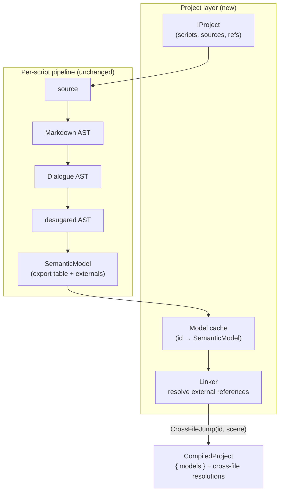

# Cross-file jump resolution

> [!NOTE]
> Status: **Explored** — a proposed design, not yet implemented. The single-file
> compiler already parses a cross-file jump
> target and defers it — `JumpResolver` marks any target that names a file as a
> `FileScopedJump` rather than resolving or rejecting it
> ([issue #59](https://github.com/pengzhengyi/godot-dialoguedown/issues/59)). This
> note designs the **linker** that resolves those targets across a **project** of
> scripts. Executing a resolved jump still belongs to the planned
> [runtime](https://github.com/pengzhengyi/godot-dialoguedown/issues/45); this
> note stops at compile-time resolution and diagnostics.

## Table of contents

- [Goal and scope](#goal-and-scope)
- [Ubiquitous language](#ubiquitous-language)
- [Writer-facing behavior](#writer-facing-behavior)
- [Worked example](#worked-example)
- [Prior art](#prior-art)
- [The model: separate compilation and link](#the-model-separate-compilation-and-link)
- [Architecture](#architecture)
- [Interfaces and responsibilities](#interfaces-and-responsibilities)
- [Script identity and path semantics](#script-identity-and-path-semantics)
- [Seeding: which scripts a compile loads](#seeding-which-scripts-a-compile-loads)
- [Key design decisions](#key-design-decisions)
- [Markdown interaction](#markdown-interaction)
- [Diagnostics](#diagnostics)
- [Error and boundary cases](#error-and-boundary-cases)
- [Testability](#testability)
- [Runtime and visualization](#runtime-and-visualization)
- [Alternatives not chosen](#alternatives-not-chosen)
- [Decisions](#decisions)

## Goal and scope

A story rarely fits in one file. A writer splits it into chapters, scenes, or
routes, and jumps between them:

```markdown
=> [Meet Bob](chapter-02.md#meet-bob)
```

Today the compiler *recognizes* that target but cannot *resolve* it. Jump
resolution runs per script: a same-file anchor resolves against the script's
`AnchorTable`, a missing local anchor is reported (`DLG2009`), and any target
that names a file becomes a `FileScopedJump` — deferred, neither resolved nor
diagnosed. A typo in a cross-file path or anchor therefore ships silently.

This note designs the component that closes that gap: a **linker** that resolves
each cross-file jump against the target script's exported anchors across a
**project** of scripts, reporting a missing file or a missing cross-file
anchor with the same rigor as a local one.

**In scope:** the project model, the linker stage, the engine-agnostic `IProject`
seam, cross-file diagnostics, path and identity semantics, and how a
compile decides which scripts to load.

**Out of scope (deferred):** *executing* a resolved jump (the planned
[runtime](https://github.com/pengzhengyi/godot-dialoguedown/issues/45)); a
multi-script project view in the visualization; and any change to the jump
*syntax*, which already ships and is documented in the
[script language guide](../../guide/script-language.md).

## Ubiquitous language

| Term | Meaning |
| --- | --- |
| **Script** | One DialogueDown script — the per-file unit the current compiler compiles into a `CompilationResult` and `SemanticModel`. |
| **Project** | A set of scripts compiled and linked together, rooted at a **project root** (the existing `--root` / nearest-`dialogue.toml` directory). |
| **Script id** | A script's **opaque** identity (`ScriptId`); the core never parses it as a path. A filesystem project backs it with a normalized project-relative path — two references that normalize to the same id name the same script. |
| **Export table** | The anchors a script exposes as jump targets — its existing `AnchorTable` (slug → scene), viewed in its cross-file role. |
| **External reference** | A jump whose target names another script (its `JumpTarget` has a file part). The linker's input; it resolves to a `CrossFileJump` or a diagnostic. |
| **Linker** | The stage that resolves external references against export tables across the project, producing cross-file resolutions and diagnostics. |
| **Cross-file jump** | A jump whose target names another script — the writer-facing concept. Unresolved it is an *external reference* (`FileScopedJump`); resolved it is a `CrossFileJump(ScriptId, Scene)`. |
| **`IProject`** | The seam that abstracts a project's storage — enumerate scripts, read a script's source by id, and resolve a cross-file reference to a `ScriptId`. `InMemoryProject` backs tests; `FileSystemProject` (an edge) reads disk, so the core never touches the filesystem. |
| **Model cache** | A memoized `ScriptId → SemanticModel`, so each script compiles at most once and reference cycles terminate. |
| **Seeding** | How the project's script set is populated: **eager** (enumerate the root) or **lazy** (follow references from an entry). |
| **Entry script** | The script a compile starts from — the file a writer opened or passed to the CLI. |
| **Root scene** | A script's implicit top-of-tree scene (`SemanticModel.SceneRoot`) — the start of that script; a bare script target lands here. |

Throughout, a script is **compiled**; a scene within it is **referenced**. The
linker **resolves** references; it never merges script content.

## Writer-facing behavior

The syntax is unchanged — a cross-file jump is a Markdown link whose target is a
relative path with an optional `#anchor`:

```markdown
=> [Meet Bob](chapter-02.md#meet-bob)   # a scene in another script
=> [Back to the crossroads](#crossroads)  # a same-file anchor (already works)
=> [Chapter two](chapter-02.md)          # the other script's root scene (see below)
```

What changes is that a cross-file target now **resolves or diagnoses**:

- The path is resolved **relative to the referring script**, within the
  project root.
- If the script exists and exports the anchor, the jump resolves to that scene.
- If the script is missing, or exists but has no such anchor, the writer gets a
  located error — the same quality of feedback a bad local anchor already gets.
- A target that names a script **without** an anchor jumps to that script's
  **root scene** (`SemanticModel.SceneRoot`, the top of its scene tree) — the
  natural "go to the start of chapter two."
- **Cycles are fine.** Chapter A may jump to chapter B, which jumps back to A.
  Cross-file jumps are references, like hyperlinks, not textual includes, so a
  cycle is ordinary dialogue flow, never an error.

The set of scripts a single compile validates depends on **what the writer
targets** — one file or a whole directory — described under
[Seeding](#seeding-which-scripts-a-compile-loads).

## Worked example

Two scripts under a project root:

```markdown
<!-- act-1/prologue.dialogue.md -->
## The crossroads

Guide: Two paths lie ahead.
- => [Meet Bob](chapter-02.md#meet-bob)
- => [Enter the vault](chapter-02.md#the-vault)
```

```markdown
<!-- act-1/chapter-02.md -->
## Meet Bob

Bob: You made it.
```

Compiling `prologue.dialogue.md` is a single-file target, so it seeds lazily and
links its two cross-file jumps against `act-1/chapter-02.md`:

- `chapter-02.md#meet-bob` → resolved to `CrossFileJump("act-1/chapter-02.md", «Meet Bob»)`.
- `chapter-02.md#the-vault` → **`DLG2012`**: the script exists but exports no
  `the-vault` anchor.
- Had the path read `chapter-99.md#meet-bob`, it would be **`DLG2011`**: no such
  script.

Each diagnostic points at the offending `=>` in `prologue.dialogue.md`, never
into `chapter-02.md`.

## Prior art

Dialogue engines and general languages sit on a spectrum from *merge everything
into one global namespace* to *separately compile and link by reference*.

| System | Model | Namespace | Lesson for DialogueDown |
| --- | --- | --- | --- |
| **Ink** | `INCLUDE file.ink` folds files into one story at compile time | Global knots, dotted stitch scope | Explicit inclusion + one global namespace forces unique knot names across files. |
| **Yarn Spinner** | Compiles all project `.yarn` files into one program | Flat, global node titles | Duplicate node titles across files are an error — the collision tax of a global namespace. |
| **Twine / Ren'Py** | One story / global labels | Global passage or label names | Simple, but no per-file scoping; every name shares one space. |
| **C / C++ + linker** | Separate compile → object with a symbol table → link | Per-unit symbols, resolved externs | The canonical model: compile units independently, resolve references at link time, report undefined symbols. |
| **.NET assemblies** | Compile per assembly; the loader resolves references | Rich identity metadata | Each unit exposes exports and references and is resolved by identity. |
| **ES modules / bundlers** | Follow `import`s from an entry; tree-shake the unused | Per-module | The demand-driven, load-only-what-is-reachable model. |
| **Markdown link checkers** (e.g. `lychee`, already used here) | Resolve a relative path + `#fragment`, load the target, check the anchor exists | Per-script anchors | **DialogueDown's syntax exactly** — validating it *is* link checking. |

Two lessons drive the design:

1. **A global namespace is a tax, not a feature.** Yarn and Ren'Py make node and
   label names globally unique, so authors prefix names to avoid collisions.
   DialogueDown's `file#anchor` already scopes anchors per script — two chapters
   can each have a `## Introduction`. Keeping that per-file scope is worth more
   than the simplicity of one flat table.
2. **The nearest analog is a hyperlink, not a textual include.** `chapter-02.md#meet-bob`
   is a relative-path-plus-fragment link. That framing explains why cycles are
   legal and why resolution means "load the target, check the anchor exists" —
   the job of a link checker, realized inside the compiler.

## The model: separate compilation and link

Each script already compiles independently into a `SemanticModel` that carries
both halves a linker needs:

- an **export table** — the `AnchorTable` (slug → scene) it exposes; and
- its **external references** — the `FileScopedJump`s left deferred today.

So a script *is already* a separately compiled unit with exports and unresolved
externals. Cross-file support is therefore **additive**: keep per-script
compilation exactly as it is, and add a **link** step above it that resolves each
external reference against the target script's export table.

Three properties define the model:

- **Compile whole scripts, not sections.** A scene is not self-contained:
  delimiting `#meet-bob` needs the target's heading structure, and its meaning
  needs the target's speaker table, anchors, and configuration. The sound unit is
  the whole script → its `SemanticModel`. The linker **references** one scene
  from it but **compiles** the whole script. (The linker only *needs* the
  target's export table; computing that table is most of the analysis, so the simple,
  correct choice is to compile — and cache — the full per-script model.)
- **Memoize; stay cycle-safe.** Each script compiles at most once, held in a
  `ScriptId → SemanticModel` cache. This is mandatory, not an optimization:
  legal reference cycles would otherwise loop forever.
- **Link by reference, never by inlining.** A resolved external reference becomes
  a `CrossFileJump(ScriptId, Scene)` edge; scripts keep their own identity. A
  "multi-file compile" is a **set** of per-script models plus a cross-file
  resolution table — never one merged tree. Inlining would loop on cycles,
  duplicate shared targets, and destroy per-script incrementality.

## Architecture

The per-script pipeline is unchanged. A new **project layer** sits above it: it
owns the `IProject` seam and the model cache, runs the existing pipeline per
script, then links.



The linker's loop is small: for each script in the set, for each `FileScopedJump`,
normalize the file part to a `ScriptId`, obtain that script's `SemanticModel`
from the cache (compiling it through `IProject` on first touch), and look the
anchor up in its export table — resolving to a `CrossFileJump` or reporting a
diagnostic. A bare-file target resolves to the target's root scene.

The existing single-file entry point, `IScriptCompiler.Compile(string source)`,
**stays** — it is the common case, the live editor's per-keystroke path, and the
embedding API. The project layer is a separate facade that *composes* it, so the
core stays dependency-light and a caller that never needs cross-file never pays
for it.

## Interfaces and responsibilities

Proposed seams (names indicative; finalized during implementation):

| Type | Visibility | Responsibility | Depends on |
| --- | --- | --- | --- |
| `IProject` | public | Abstracts a project's storage: enumerate scripts, read a script's source by id, and resolve a cross-file reference to a `ScriptId`. `InMemoryProject` for tests; `FileSystemProject` (an edge) reads the root. The **only** new filesystem seam. | — |
| `ScriptId` | public | A script's **opaque** identity and value equality — the core never parses it as a path. | — |
| `IProjectCompiler` | public | The cross-file entry point: compile from an entry script (lazy) or a directory (eager), returning a project model. | `IScriptCompiler`, `IProject` |
| `CompiledProject` | public | The linked result: the per-script `CompilationResult`s plus the cross-file resolution table and located diagnostics. | — |
| `Linker` | internal | Resolve every file-part jump (external reference) in the set against export tables; emit `CrossFileJump`s and diagnostics. | model cache, `AnchorTable` |
| `CrossFileJump` | internal | A `JumpResolution` case: a reference resolved to a `(ScriptId, Scene)` in another script. | `Scene` |

`CrossFileJump` **replaces** the deferred `FileScopedJump` in the sealed
`JumpResolution` hierarchy (today `SceneJump`, `FileScopedJump`,
`UnresolvedJump`, `TerminalJump`). The linker resolves a file-part target directly
to a `CrossFileJump(ScriptId, Scene)` or a diagnostic, so the deferred
`FileScopedJump` is retired. A file-part jump seen by the per-script compiler
alone (no project) stays an `UnresolvedJump`, still recognizable by its parsed
`JumpTarget.HasFilePart`, pending a project compile.

Indicative shapes (illustrative, not final):

```csharp
public interface IProject
{
    // The scripts to compile eagerly (a directory / whole-project target).
    IEnumerable<ScriptId> Scripts { get; }

    // Read a script's source; false when the project has no such script.
    bool TryReadSource(ScriptId id, out string source);

    // Resolve a written reference ("chapter-02.md") from a referring script into
    // a target id; false when it names nothing in the project (the linker turns
    // that into DLG2011). Never throws for a missing script.
    bool TryResolveReference(ScriptId from, string reference, out ScriptId to);
}

public interface IProjectCompiler
{
    // Lazy: compile an entry script and every script it reaches.
    CompiledProject CompileReachable(IProject project, ScriptId entry);

    // Eager: compile and link every script the project enumerates.
    CompiledProject CompileAll(IProject project);
}
```

`CompiledProject` holds the per-script `CompilationResult`s keyed by `ScriptId`,
the cross-file resolution table (each `FileScopedJump` → a `CrossFileJump` or a
diagnostic), and the project's aggregated `LocatedDiagnostic`s.

**Architecture boundary:** `IProject` is the seam that keeps the core
engine-agnostic. The core must never call `File.ReadAllText`; it depends only on
`IProject`. This is the same discipline the compiler already applies
to configuration, and it should be guarded by the project's architecture tests.

## Script identity and path semantics

Correct linking hinges on turning a written file part into a stable
`ScriptId`. The rules:

- **Relative to the referrer.** `chapter-02.md` in `act-1/prologue.dialogue.md`
  means `act-1/chapter-02.md`, like a Markdown link or a relative import.
- **Explicit extension.** A target names the file with its extension
  (`chapter-02.md`); the linker never infers or appends one, so a reference reads
  exactly like a Markdown link.
- **Normalized against the project root.** The id is the target's path relative to
  the root, normalized (resolve `.`/`..`, unify separators) so two spellings of
  one script share an id and one export table.
- **Confined to the root.** A path that escapes the project root
  (`../../secrets.md`) is a **hard error** (`DLG2013`), not a silent load — the
  root is the project boundary.
- **A path to the current script links to itself.** The compiler already treats
  a self-naming path as a file target and defers it; the linker resolves it
  against the current script's own export table.
- **Configuration is per project root.** One `dialogue.toml` governs the whole
  project — the linker roots on the same directory configuration discovery
  already uses.
- **Symlinks and case** follow the project. The live tooling already has a
  `SymlinkResolver` for its launcher root (a tooling concept); `FileSystemProject` should canonicalize
  consistently so aliases don't split one script into two ids.

## Seeding: which scripts a compile loads

The linker's resolution mechanism is identical no matter how many scripts are
in play; only **which** scripts get loaded differs. That is a **seeding
policy**, chosen by what the writer targets — the hybrid the design settles on:

| Target | Seeding | Scripts validated | Rationale |
| --- | --- | --- | --- |
| **A single file** (`compile prologue.dialogue.md`, the live editor) | **Lazy** | The entry and the scripts reachable from it by following cross-file jumps | Fast, focused feedback while writing one file; matches the editor's per-file loop. |
| **A directory** (`compile ./script`, a project/CI build) | **Eager** | Every script under the root | Validates files nothing references *yet* — a common mid-writing state — so CI catches every dangling link. |

Both share one `IProject` and one model cache; they differ only in how the cache is
**seeded** — a lazy work-list from the entry, or an eager enumeration of the
root. Neither is a different compiler. Memoization and cycle safety hold either
way.

This directly answers "compile on-need, or compile everything?": **both, by
target.** A file target compiles on need around that file; a directory target
compiles the whole project.

## Key design decisions

- **Keep per-script anchor scope.** Resolve by `(script, anchor)`, never a
  single global anchor table — this is DialogueDown's advantage over Yarn/Ren'Py
  global names, and a global table would collide same-named scenes across files.
- **Link by reference, not inline.** Preserves cycles, avoids duplicating shared
  targets, and keeps per-script incrementality (below).
- **One new filesystem seam.** `IProject` is the sole disk dependency,
  so the core stays engine-agnostic and unit-testable with an in-memory `IProject`.
- **Hybrid seeding by target.** File → lazy reachable; directory → eager
  whole-project. One mechanism, two seed strategies.
- **Speaker identity stays per-script.** A jump carries no speaker identity across
  scripts; a cast shared across scripts is declared once in `dialogue.toml` (the
  existing configured-speaker registry), keeping cross-file resolution about
  scenes, not speakers.
- **Incremental relinking.** Editing one script recompiles *that* script and
  relinks. If its export table (its headings) is unchanged, inbound cross-file
  jumps from other scripts stay valid with **no** recompilation of those
  scripts — their models are cached; only the cheap anchor lookup reruns. This
  dovetails with the existing hot-reload and autosave work: never recompile the
  world on a keystroke.

## Markdown interaction

Nothing new to parse. A cross-file jump is `=>` plus an ordinary Markdown link
whose destination happens to be `path#fragment`. In a plain Markdown preview it
renders as a normal hyperlink, and the report's Source preview already links
same-file anchors this way. The linker reads the already-parsed target string; it
adds no syntax and consumes no new literal characters, so the construct needs no
new escaping story.

## Diagnostics

Cross-file resolution failures are meaning-level, so they extend the semantic
range (`DLG2xxx`; local jump resolution is `DLG2009 MissingScene`):

| Code | Severity | When | Notes |
| --- | --- | --- | --- |
| `DLG2011` | Error | The target names a script the project cannot find | Message names the resolved path; the span covers the jump's link. |
| `DLG2012` | Error | The script exists but exports no such anchor | The cross-file sibling of `DLG2009`; may suggest near-miss anchors later. |
| `DLG2013` | Error | A target path escapes the project root | The root is the project boundary; escaping it is not allowed. |
| `DLG2014` | Error | A referenced script has its own compile errors | A **pointer** to the target's diagnostics — the referrer does not surface (duplicate) them. |

Every cross-file diagnostic carries the referring jump's source span, so the
error points at the `=>` the writer typed, not into the target script.

## Error and boundary cases

| Case | Result |
| --- | --- |
| Same-file anchor (`#crossroads`) | Unchanged — resolves via the local `AnchorTable`. |
| Cross-file anchor that exists | Resolves to a `CrossFileJump(id, scene)`. |
| Cross-file script missing | `DLG2011`, left unresolved; analysis continues. |
| Cross-file script exists, anchor missing | `DLG2012`, left unresolved. |
| Bare script target (no `#anchor`) | Resolves to the target script's root scene (its entry). |
| Path names the current script | Resolves against the current script's own export table. |
| Reference cycle (A → B → A) | Legal; each script compiles once and the cache breaks the loop. |
| Path escaping the project root | Hard error (`DLG2013`); not loaded. |
| Duplicate anchors in the target | The target's own `DLG2001` applies; the linker resolves to the first, mirroring local behavior. |

## Testability

The linker is pure over an **in-memory `IProject`** (id → string),
needing no disk — so the pyramid stays bottom-heavy:

- **Unit (most):** resolution outcomes (hit, missing file, missing anchor,
  bare-file entry, self-reference, cycle termination, escape-root), path
  normalization, and single-compile memoization, all against a fake `IProject`.
- **Integration (few):** the real `FileSystemProject` over a temp directory; eager
  directory seeding vs. lazy entry seeding reaching the same set.
- **End-to-end (minimal):** one CLI compile of a small multi-file project
  asserting a cross-file diagnostic and a clean link.

Architecture tests assert the core takes no filesystem dependency outside the
`IProject` seam.

## Runtime and visualization

Both are deferred, but the model leaves clean seams:

- **Runtime** ([#45](https://github.com/pengzhengyi/godot-dialoguedown/issues/45)):
  a `CrossFileJump` is a graph edge into another script. Because linking is by
  reference, the runtime can follow the edge and **load the next script on
  demand** — the lazy seeding policy, applied at play time. No script is merged
  ahead of time.
- **Visualization:** the report renders one script today. A project view — a
  script list, cross-file edges, jump-to-file navigation — is future work, and
  the linker's project model is the data it would project.

## Alternatives not chosen

- **Compile everything into one global namespace (Yarn/Ink-style).** Merging all
  scenes into a single anchor table is simpler but throws away per-script
  scope: two files with a `## Introduction` would collide, forcing globally
  unique names. The `file#anchor` syntax exists precisely to avoid this.
- **Textual inclusion / inlining (`#include`-style).** Copying a target subtree
  into the referrer loops forever on legal cycles, duplicates shared targets, and
  destroys per-script identity and incrementality.
- **Lazy-only resolution.** Loading solely what an entry reaches is the right
  *runtime* policy, but as the *only* compile policy it never validates
  unreferenced files — so a half-written chapter nothing links to yet would skip
  all checks. Hence, eager seeding for directory/CI builds.

## Decisions

The design's open questions are settled:

1. **Explicit extension.** A cross-file target writes the file extension
   (`chapter-02.md`); the linker never infers or appends one.
2. **Escaping the root is a hard error** (`DLG2013`) — the project root is the
   boundary; a target may not resolve outside it.
3. **A target with its own errors gets a pointer.** The referrer reports a single
   `DLG2014` pointing at the target's diagnostics rather than surfacing
   (duplicating) them.
4. **Speaker identity is per-script.** Identities do not travel across a jump; a
   cast shared across scripts is declared in `dialogue.toml` (the configured
   speaker registry), not inferred cross-file.
5. **Configuration is per project root.** One `dialogue.toml` governs the whole
   project — the same discovery boundary the linker roots on.
6. **`CrossFileJump` replaces `FileScopedJump`.** The linker resolves a file-part
   target directly to a `CrossFileJump` or a diagnostic; the deferred
   `FileScopedJump` resolution is retired.

**Still deferred** (out of this note's scope): executing a resolved jump (the
[runtime](https://github.com/pengzhengyi/godot-dialoguedown/issues/45)) and a
multi-script project view in the visualization.
