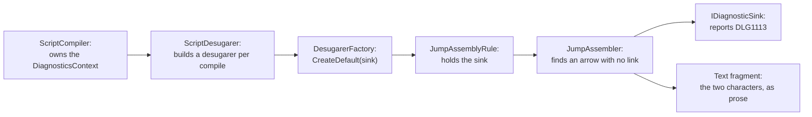

# Dangling arrow diagnostic

> [!NOTE]
> Status: **implemented**
> ([issue #227](https://github.com/pengzhengyi/dialoguedown/issues/227)).
> Warns when a `=>` has no link after it, so the jump the writer intended is
> silently degraded to the literal characters `=>`.

## Table of contents

- [Goal and scope](#goal-and-scope)
- [Functionality checklist](#functionality-checklist)
- [Ubiquitous language](#ubiquitous-language)
- [Writer-facing behavior](#writer-facing-behavior)
- [Where the knowledge lives](#where-the-knowledge-lives)
- [Architecture](#architecture)
- [Interfaces and responsibilities](#interfaces-and-responsibilities)
- [Key design decisions](#key-design-decisions)
- [Error and boundary cases](#error-and-boundary-cases)
- [Integration](#integration)
- [Testability](#testability)
- [Alternatives not chosen](#alternatives-not-chosen)

## Goal and scope

A jump is `=>` followed by a Markdown link. When the link is missing —

```markdown
=> The market
```

— the arrow is **dangling**. Desugar degrades it to the plain characters `=>`, so
the script still compiles and the line simply reads "=> The market". The writer
sees no error, no warning, and no jump. That silent degradation is the worst
failure mode for an author: nothing looks wrong, but the intended flow is gone.

This note adds a **warning** at the moment desugar drops the arrow, so the writer
learns their jump did not become a jump.

**In scope:** a `Syntax` diagnostic with `Warning` severity reported by the
**desugar** stage, threading a diagnostic sink into the jump assembler, the
writer-facing guidance, and the generated error-code entry.

**Out of scope:** changing how a dangling arrow *behaves* (it still degrades to
text — we warn, we do not fail the compile or invent a jump target); the second
half of [#227](https://github.com/pengzhengyi/dialoguedown/issues/227) (a
front-end diagnostic for ignored unmodeled Markdown), which is a separate component
and the prerequisite for [#47](https://github.com/pengzhengyi/dialoguedown/issues/47).

## Functionality checklist

- [x] Add a `Syntax` diagnostic with `Warning` severity for a dangling arrow.
- [x] Report it from **desugar**, at the point the arrow is degraded to text.
- [x] Point the diagnostic at the arrow's own span (the `=>` characters).
- [x] Report a **conditional** dangling arrow too (`` `Ready?` => `` with no link),
      pointing at the arrow rather than the condition.
- [x] Report **every** dangling arrow in a document, not just the first.
- [x] Do **not** report when the arrow is part of a well-formed jump.
- [x] Report a literal `=>` typed in prose too: it cannot be told apart from a lost
      jump, and no script in this repository triggers it.
- [x] Keep the existing degradation behavior byte-for-byte (still `Text("=>")`).
- [x] Add the generated error-code reference entry and writer-facing guidance.

## Ubiquitous language

| Term | Meaning |
| --- | --- |
| **Jump indicator** | The `=>` token, modeled as `JumpIndicator` before assembly. |
| **Dangling arrow** | A `JumpIndicator` with no `Link` after it, so no `Jump` can be folded. |
| **Degrade** | Replacing the dropped indicator with the literal `Text("=>")` it came from. |
| **Jump assembly** | The desugar step that folds `[condition] => link` into one `Jump`. |

## Writer-facing behavior

Given a script:

```markdown
# The Crossroads

=> The market
```

The compiler reports `DLG1113` — title **Dangling jump arrow**, category
`Syntax`, severity `Warning`:

```text
scene.dialogue.md(3,1): warning DLG1113: `=>` makes a jump only when a link
follows it. With no link here it is read literally, staying as the characters
"=>". If you meant to jump, add a target: `=> [The market](#the-market)`.
```

The line still renders as `=> The market`; the warning explains why.

The message states the rule before the remedy, and offers the fix conditionally
("if you meant to jump"), because the same arrow can be a mistake or a
deliberate piece of prose. A `Warning` is still right for the deliberate case:
it never fails a compile, and the writer whose flow silently vanished is the one
this diagnostic exists for.

## Where the knowledge lives

`JumpAssembler` expresses jump assembly as a small parser grammar. The branch
that matches a lone indicator is the last place that still knows the arrow was
an arrow, so it both reports and degrades:

```csharp
private InlineFragment ReportAndDegrade(JumpIndicator indicator)
{
    _diagnostics.Report(new Diagnostic(DiagnosticCatalog.DanglingJumpArrow, indicator.Span, []));
    return new Text("=>", indicator.Span);
}
```

`ScriptDesugarer` has always been handed a `DiagnosticsContext`; this component
is the first to read it, making desugar a diagnostic **producer** alongside the
transpiler.

## Architecture

The sink threads from the stage entry point down to the assembler that owns the
knowledge. Desugar becomes a diagnostic **producer**, joining the transpiler.



Because `ScriptDesugarer` is a DI singleton, the per-compilation sink cannot live
on a long-lived rule. The desugarer is therefore **built per compilation** with
the sink injected into the reporting rule — see
[DD2](#dd2--construct-the-reporting-rule-per-compilation-not-per-process).

## Interfaces and responsibilities

| Type | Responsibility | Collaborators |
| --- | --- | --- |
| `DiagnosticCatalog` | Owns the `DLG1113` descriptor. | — |
| `ScriptDesugarer` | Builds a desugarer per compile, wired to `context.Diagnostics`. | `DesugarerFactory`, `DiagnosticsContext` |
| `DesugarerFactory` | Creates the rule pipeline for one compilation, wiring the sink into the reporting rule. | rules |
| `JumpAssemblyRule` | Holds the sink for one compile and hands it to the assembler. | `JumpAssembler` |
| `JumpAssembler` | Reports a dangling arrow as it degrades it. | `IDiagnosticSink` |

## Key design decisions

### DD1 — Report at the drop site, not from a later rule

The diagnostic is produced by `JumpAssembler` at the moment it degrades the
arrow, rather than by a `StructuralValidator` rule afterwards.

Validation runs **after** desugar, and by then a dangling arrow is
indistinguishable from a writer who literally typed `=>` in prose — both are
`Text("=>")`. A later rule could only guess. Reporting where the knowledge exists
keeps the diagnostic exact and needs no new model state to carry the signal.

The cost is that the assembler becomes diagnostic-aware, which
[DD2](#dd2--construct-the-reporting-rule-per-compilation-not-per-process) keeps contained.

### DD2 — Construct the reporting rule per compilation, not per process

`ScriptDesugarer` is registered as a **DI singleton** and holds its rules in a
field built once by `DesugarerFactory.CreateDefault()`, so a rule instance
outlives any single compilation. Storing a per-compilation sink on a long-lived
rule would leak one compile's sink into the next.

Threading the sink as an *argument* is the transpiler's precedent
(`BlockBuilder.Build(blocks, diagnostics)`), but desugar's rules extend
`DialogueAstRewriter`, whose ~14 `protected virtual` hooks take no sink. Adding
one to each would ripple through every rewriter in the codebase for the benefit
of a single rule.

Instead, **build the desugarer per compilation** and give the reporting rule its
sink at construction:

```csharp
public DesugaredScriptDocument Desugar(ScriptDocument document, DiagnosticsContext context)
{
    var desugarer = DesugarerFactory.CreateDefault(context.Diagnostics);
    return new DesugaredScriptDocument(desugarer.Desugar(document));
}
```

`JumpAssemblyRule` then holds the sink for exactly one compile, and the rewriter
hierarchy is untouched. The rules are cheap, stateless value-like objects, so
constructing them per compile costs nothing measurable and removes the shared
mutable state a singleton rule would otherwise carry. The sink is required
rather than optional: `ScriptDesugarer` is the factory's only caller, so a
sink-less overload would be dead API and would force every rule to handle a
missing sink.

### DD3 — Warning, not error

A dangling arrow still compiles and still renders — the script runs, only the
jump is missing. A `Warning` tells the writer without failing a build that works
today, matching the severity of the other "silently degraded" diagnostics
(`DLG1003` unreachable content, `DLG1107` styled speaker prefix).

### DD4 — Point at the arrow, not the condition

A conditional dangling arrow (`` `Ready?` => ``) reports at the **arrow's** span.
The condition is valid; the arrow is what failed to become a jump, so that is where
the writer must act.

## Error and boundary cases

| Case | Behavior |
| --- | --- |
| `=> [Label](#target)` | Well-formed jump. No diagnostic. |
| `=> The market` | Dangling. One warning at the `=>`. |
| `` `Ready?` => `` (no link) | Dangling. One warning at the `=>`, not the condition. |
| Two dangling arrows in one document | Two warnings, one per arrow. |
| A literal `=>` typed in prose | Warned, like any other dangling arrow — the two are indistinguishable by the time desugar runs. |
| `` `=>` `` in a code span | Read as a game call, so `DLG1102` is reported instead of this diagnostic. |
| `\=>` | Still warned: Markdown consumes the backslash before DialogueDown tokenizes, so the arrow survives. Only the entity `&#61;>` stays quiet. |
| `=>` inside a heading | Never reaches desugar, so nothing is reported; the arrow stays heading text. |
| Arrow inside a choice option or control branch | Reported — the rewriter reaches nested sequences. |
| `=>` followed by a link on the **next line** | Already dangling today (a jump is single-line); now warned. |

## Integration

- **Compilation modes.** The diagnostic is a warning, so it never halts a
  stage-boundary compile; `ScriptCompiler` needs no new checkpoint.
- **CLI.** Rendered by the existing errata renderer with no change.
- **Report and LSP.** Flow through the shipped diagnostics overlay and projection.
- **Docs.** The generated error-code reference gains a `DLG1113` entry; the
  language guide's jump section explains that an arrow without a link is read
  literally and that the compiler warns about it. Following the guide's own
  convention, that page names no diagnostic code — `error-codes.md` is the only
  place codes appear.

## Testability

- **Unit — assembler:** a dangling arrow reports once and still degrades to
  `Text("=>")`; a well-formed jump reports nothing; two arrows report twice.
- **Unit — conditional:** the reported span is the arrow's, not the condition's.
- **Integration — pipeline:** compiling a document with a dangling arrow surfaces
  exactly one `DLG1113`, located at the arrow, and the compile still succeeds.
- **Docs test:** the diagnostic-catalog Markdown test regenerates the reference
  page, and the reader-facing example is compiled — the broken script must
  report `DLG1113` and the fixed one must not.

Every type this component touches — `JumpAssembler`, `JumpAssemblyRule`,
`DesugarerFactory`, and `ScriptDesugarer` — ends at 100% line and branch
coverage.

## Alternatives not chosen

| Alternative | Why not |
| --- | --- |
| A validation rule after desugar | Cannot distinguish a degraded arrow from prose `=>`; would need new model state purely to carry the signal ([DD1](#dd1--report-at-the-drop-site-not-from-a-later-rule)). |
| Keep the `JumpIndicator` in the tree and report later | Breaks the desugared-tree invariant that no `JumpIndicator` survives, and every downstream consumer would need to handle it. |
| Make it an error | Fails scripts that compile and render today ([DD3](#dd3--warning-not-error)). |
| Guess the target from the following text | Inventing a jump the writer did not write is worse than saying nothing. |
