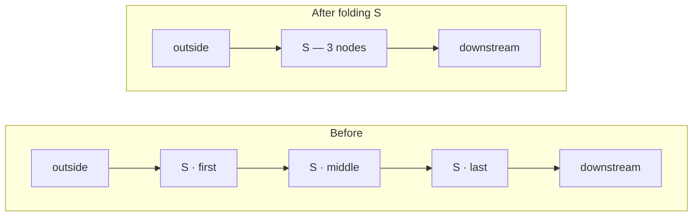

# Dialogue Graph — Region Fold

> [!NOTE]
> Status: **implemented**. Folding is offered by the Dialogue Graph tab, the only
> stage whose nodes carry regions.

Folding a scene collapses it to a single box that shows only what crosses its
border. A long script is mostly scenes the reader is not currently reading; being
able to shut one lets the flow *between* scenes become the picture, instead of
being buried under the lines inside them.

## Table of contents

- [Why a region folds when a node may not](#why-a-region-folds-when-a-node-may-not)
- [Two gestures, not one](#two-gestures-not-one)
- [What a collapsed scene means](#what-a-collapsed-scene-means)
- [The projection](#the-projection)
- [Keeping the drawing legal](#keeping-the-drawing-legal)
- [What selection does across a fold](#what-selection-does-across-a-fold)
- [Testability](#testability)
- [Tradeoffs](#tradeoffs)
- [Open questions and deferred work](#open-questions-and-deferred-work)

## Why a region folds when a node may not

The Dialogue Graph tab deliberately turns **node** folding off. Its parent/child
relation is not the document's — it is whichever route happened to reach a node
first while building the spanning tree that lets `d3.stratify` draw a graph at
all. Folding such a node hides lines other routes still lead to, and the picture
that is left is not true.

A **region** has no such problem. Scene membership is decided by the compiler
from the document, not by the drawing: every node carries the scene it was
written in, and no traversal order can change that. So a region is exactly the
group a reader may collapse without the graph telling a lie about itself.

## Two gestures, not one

Clicking a scene band already means something — *select this scene* — and fills
the inspector with the scene's border tables. Folding is a different kind of act:
it changes what is drawn and where everything sits, while selection only changes
what the reader is looking at.

Overloading one click with both would make an inspection gesture silently
rearrange the drawing. So the band keeps its click, and folding gets a control of
its own: a small chevron in the band's top-left corner, beside the scene's name.

| Gesture | Effect |
| --- | --- |
| Click the band (or its name) | Select the scene; the inspector shows its border |
| Click the chevron | Collapse or expand the scene; selection is left alone |
| <kbd>Enter</kbd> / <kbd>Space</kbd> | Fold or open the scene the reader is **on as a thing** — the box under the pointer, or the scene they chose |

The chevron sits in the band's padded corner *above* the first node's dot rather than
beside it, because a folded band closes to one node's width: a control on the node's
own row would sit on top of it.

The keyboard rule is deliberately narrow. Hovering a *line* and pressing
<kbd>Space</kbd> does not fold the scene around it — a reader resting on a line must
not lose the scene they are reading. Folding an open scene from the keyboard is a
two-step act: choose the band, then press the key.

This also matches the visual language the report settled on for ignored Markdown:
a **static mark states a status, a chevron performs an action**.

## What a collapsed scene means

When a scene collapses, control still **passes through** it: everything
downstream stays exactly where it was, and only the scene's own interior
disappears. The alternative — collapsing everything the scene could reach — was
rejected because it conflates two different ideas. Scene membership is ownership;
reachability is flow. In a script with cross-scene jumps and loops, "everything
this scene reaches" is most of the document, so a single fold would blank the
drawing.

Formally the fold is a **quotient**: the scene's nodes are contracted to one
supernode, edges that crossed the border are re-pointed at it, and edges wholly
inside vanish with the interior they joined.



## The projection

The fold is a **pure function over the display graph**, not a pass that hides SVG
elements. `region-fold.ts` takes the stage's nodes and edges plus the set of
collapsed region names, and returns a new graph:

```ts
foldRegions(nodes, edges, collapsed): { nodes, edges }
```

- Every node of a collapsed region is replaced by **one** synthetic region node,
  placed where the region's first node stood so the drawing's reading order is
  unchanged.
- Every edge has both ends mapped through that replacement. An edge whose ends
  now coincide was interior, and is dropped.
- Edges that collapse onto the same pair are merged into one, because the
  renderer keys an edge by the pair it joins and cannot draw two lines between
  the same two nodes.
- With nothing collapsed the function returns its input unchanged, so the
  ordinary graph pays nothing for a feature it is not using.

The synthetic node keeps the region name so its band is still drawn around it,
and carries the interior's node count as its label — the fold says *how much* it
is hiding, not merely that it is hiding something.

## Keeping the drawing legal

The client draws a graph by naming one parent per node and treating every other
edge as a cross-link. The compiler guarantees that shape on the way in. **A
quotient can break it**, in two ways that both have to be repaired inside the
projection:

- **Two parents.** Two routes that entered a scene at different lines now enter
  the same box, so a node acquires a second parent edge.
- **A cycle.** Scene *A* leads into *B* and *B* leads back into *A* at another
  line. Neither is a cycle over nodes; both together are a cycle over scenes.

So the projection re-derives the spanning tree over the folded graph: a breadth-
first walk from the root claims the edge that first reaches each node as its tree
edge, and every other edge becomes a cross-link. That is the same rule the
compiler's own `SpanningTree` follows, applied to the graph the reader is
actually looking at.

## What selection does across a fold

Folding is not a selection gesture, so it leaves the reader's current object
alone — unless the fold hid it. The rules:

- The selected node, edge, or region **survives** a fold that does not hide it.
- A fold that hides the selected node or edge moves the selection to the
  collapsed scene, which is where that node now is.
- Deliberate navigation to a node inside a collapsed scene — a search hit, a
  neighbor row, a **Jump to** from the Source tab — **expands** the scene first,
  the same way navigating into a folded subtree opens it.

Fold state is remembered per graph alongside the camera and the node fold, and
**Revert** clears it with the rest.

## Testability

- **Projection unit tests** are the bulk: the identity case, one scene, several
  scenes, interior edges dropped, crossing edges re-pointed and merged, a
  two-scene cycle, a collapsed scene holding the root, an unknown region name,
  and a scene whose nodes are not adjacent.
- **View tests** cover the chevron's presence and `aria-expanded`, that folding
  does not change the selection, that hiding the selection moves it to the
  region, that revealing a hidden node expands its scene, that the chevron's
  target clears the node beneath it, and that the fold key opens a hovered box
  but never a scene the reader is merely resting on a line of.
- **A browser test** folds a scene in a real report and asserts the interior is
  gone, the box is drawn, and the flow through it still connects.

## Tradeoffs

- **Merged crossings lose their color.** Two routes into one scene become one
  line, and only the first one's meaning can be drawn. The scene's inspector
  still lists every crossing at both ends, so the detail is a click away — the
  drawing simplifies, the inspector stays true.
- **The spanning tree is re-derived, so lines can move.** Folding a scene can
  change which edge is drawn as the backbone and which as a cross-link elsewhere
  in the graph. That is inherent to quotienting a graph, and unfolding restores
  the original exactly.
- **A fold is a view, not a filter.** The legend's region rows still dim by
  category, independently. Dimming a folded scene dims its box.

## Open questions and deferred work

- **Folding every scene at once.** A "collapse all scenes" control would turn the
  graph into a scene-level map in one gesture. The per-scene chevron is the
  primitive it would be built from.
- **Folding a scene's subscenes with it.** Regions are flat today, so a nested
  scene is its own region and folds separately.
- **Remembering folds across a reload.** Fold state lives with the in-memory
  camera store, which is deliberately not serialized so the offline report stays
  self-contained.
