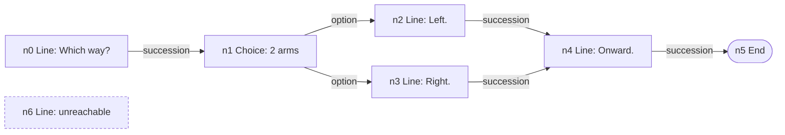

# Dialogue graph visualization tab

> [!NOTE]
> Status: **proposed**. Adds the report's fifth stage tab: the
> [dialogue graph](./Dialogue%20Graph.md) — the compiler's final artifact — rendered
> beside the four stages already shown.

## Table of contents

- [Goal and scope](#goal-and-scope)
- [Ubiquitous language](#ubiquitous-language)
- [Functionality checklist](#functionality-checklist)
- [What already exists](#what-already-exists)
- [Design](#design)
  - [Every node, in document order](#every-node-in-document-order)
  - [Node projection](#node-projection)
  - [Edge projection](#edge-projection)
  - [The region overlay](#the-region-overlay)
- [Key design decisions](#key-design-decisions)
- [Error and boundary cases](#error-and-boundary-cases)
- [Integration](#integration)
- [Testability](#testability)
- [Open questions and deferred work](#open-questions-and-deferred-work)

## Goal and scope

The report shows four compiler stages — Markdown AST, Dialogue AST, Desugared AST,
and Semantic Model — and stops one stage short. The [dialogue
graph](./Dialogue%20Graph.md) is the artifact a runtime actually walks, and it is
the first stage where a writer can *see the flow*: where a choice leads, which
scene a jump enters, and which lines nothing reaches.

This component projects a `DialogueGraph` into the report's existing
`DisplayGraph` payload and adds it as a fifth tab. It is a **projection**: the
graph, the compiler, and the report shell are unchanged.

**Out of scope:** playing the graph (that is the
[runtime](https://github.com/pengzhengyi/dialoguedown/issues/45)), new client
rendering modes, and graph-analysis diagnostics such as reachability warnings.

## Ubiquitous language

The tab speaks the graph's language, so a reader moves between the note, the code,
and the screen without translating.

| Term | Meaning in the tab |
| --- | --- |
| **Node** | One unit of flow — a line, a control line, a choice, a branch, or the End sentinel. |
| **Edge kind** | What an edge *means*: succession, divert, option, random option, or branch. Drives the edge's label and color. |
| **Guard** | A `key?` condition shown on the edge or node it withholds. |
| **Weight** | A random arm's share of the pool, shown on its edge. |
| **Orphan** | A node no edge reaches — unreachable content the writer likely did not intend. |
| **Region** | The scene a node belongs to, shown as node metadata rather than as flow. |

## Functionality checklist

- [ ] Add a **Dialogue Graph** tab as the fifth stage, after Semantic Model.
- [ ] Emit **one display node per graph node**, in the graph's own order.
- [ ] Label each node by kind and content — a line by its speech, a choice by its arm count.
- [ ] Carry each node's **source span**, so the existing jump-to-source works unchanged.
- [ ] Emit **one display edge per graph edge**, labeled by kind with its guard or weight.
- [ ] Show a node's **scene** and its **guard** as attributes.
- [ ] Show an **orphan** — a node nothing reaches — so unreachable content is visible.
- [ ] Render the tab as **unavailable** when the compile produced no graph.
- [ ] Cross-link a divert to its target scene with the existing `scene:<anchor>` key.

## What already exists

This component is small because the report already has the parts it needs. Worth
stating explicitly, since the natural instinct is to build more than is required:

| Need | Already provided by |
| --- | --- |
| Rendering a cyclic graph | `GraphWalk`'s visited set and `Reference` edges |
| A fifth tab in the client | `app.ts` iterates `report.stages` generically — no client change |
| Access to the internal `DialogueGraph` | `InternalsVisibleTo("DialogueDown.Visualization")` |
| A disabled tab with a reason | `DisplayGraph.ForUnavailableStage` |
| Jump-to-source from a node | `DisplayNode.Span`, already carried per node |
| Cross-stage color | `Category`, shared across stages |

So the work is one projection class and one wiring line.

## Design

### Every node, in document order

The other stage tabs walk a **tree** from its root. The dialogue graph is a flat
list where `Nodes[0]` is the entry, and a node can be **unreachable** — content
after an unguarded divert, which the compiler already warns about as `DLG1003`.

Walking from the entry would silently drop those nodes. The graph tab is exactly
where a writer should *see* unreachable content, so the projection emits **every
node in `graph.Nodes` order** and lets an orphan appear as a node with no incoming
edge.



Emitting in graph order also keeps a display node's id aligned with its `NodeId`,
so what the report shows and what the compiler logged are the same `n4`.

### Node projection

Each node kind maps to a label that leads with what a reader recognizes:

| Node | Label | Category |
| --- | --- | --- |
| `LineNode` | the speaker and speech (`Alice: Which way?`) | `speech` |
| `ControlNode` | its effects, or `(jump)` when it only diverts | `call` |
| `ChoiceNode` | `Choice (2 options)` | `structure` |
| `RandomChoiceNode` | `Random choice (2 options)` | `structure` |
| `BranchNode` | `Conditional (if / else)` | `structure` |
| `EndNode` | `End` | `terminal` |

Categories reuse the names other stages already use, so a line is the same color
on every tab. Attributes carry the node's **scene** and, when guarded, its
**guard**.

### Edge projection

Every edge becomes a `DisplayEdge`. Because the target may be any node — including
an earlier one — the projection maps a `NodeId` straight to its display id rather
than discovering targets by traversal, so a cycle needs no special case.

| Edge | Label |
| --- | --- |
| `SuccessionEdge` | *(unlabeled — the default flow)* |
| `DivertEdge` | `=>`, plus its guard when guarded |
| `OptionEdge` | `option`, plus its guard |
| `RandomOptionEdge` | the weight (`80%`), plus its guard |
| `BranchEdge` | `if` / `elseif` / `else` by order and guard |

### The region overlay

A region is **metadata, not flow** — the graph note is explicit about this — so a
region must not become an edge. Each node instead carries its scene as an
attribute, which is enough to read "which scene is this line in?" without
implying control flows into a region.

## Key design decisions

- **Show every node, not only reachable ones.** The tab's distinct value is making
  flow visible, and that includes flow that *does not arrive*. An orphan node is a
  writer-facing signal, so hiding it would remove the tab's best feature.
- **Display ids mirror `NodeId`.** Emitting in graph order makes `n4` on screen the
  same `n4` the compiler reasons about — a small alignment that pays off whenever a
  reader compares the tab against a diagnostic or a future debugger.
- **Edges resolve by id, not by traversal.** The projection looks a target up in an
  id map, so a back-edge to an earlier node is an ordinary edge rather than a
  special "reference" case. Cycles need no handling at all.
- **A region is an attribute, not an edge.** Regions describe grouping, and drawing
  them as flow would misrepresent the graph.
- **No client change.** The report already renders `report.stages` generically, so
  a fifth stage arrives by adding one entry to the payload. Resisting the urge to
  touch the client keeps the component to one projection.

## Error and boundary cases

| Case | Behavior |
| --- | --- |
| Compile produced no graph (errors) | The tab renders as **unavailable** with the stage's reason, like the Semantic tab when analysis never ran. |
| Empty document | One node — the End sentinel — and no edges. |
| Unreachable node | Emitted with no incoming edge, so it reads as an orphan. |
| A cycle (a divert back to an earlier scene) | An ordinary edge to an earlier node; nothing special. |
| A node whose guard is false at play time | Not a display concern: the tab shows structure, not a run. |
| The End node | Emitted last with no outgoing edges. |

## Integration

`CompilationVisualizer.BuildContent` gains one stage. The graph is available only
on a `CompilationSuccess`, so the tab follows the same reached-or-unavailable shape
the Desugared and Semantic tabs already use.

```csharp
IReadOnlyList<DisplayGraph> stages =
[
    // … the four existing stages …
    graph is null
        ? GraphProjection.Unavailable(StageUnavailableReason)
        : new GraphProjection().Project(graph, source),
];
```

## Testability

- **Projection unit tests** drive real compiled scripts through the projection and
  assert nodes, edges, labels, and attributes — one file per source file.
- **Boundary tests** cover the empty document, an orphan node, a cycle, and each
  edge kind's label.
- **A visualizer test** asserts the fifth stage appears, and that it is unavailable
  when the compile produced no graph.
- No new client tests: the client is unchanged.

## Open questions and deferred work

- **Rendering an orphan distinctly.** The projection makes an orphan visible; giving
  it a dashed border or a legend entry is a client change and is deliberately not
  part of this component.
- **Region grouping in the layout.** Showing regions as visual containers (a box per
  scene) would need client work; the attribute is enough to start.
- **Playing the graph from the tab.** Stepping through the flow belongs to the
  [runtime](https://github.com/pengzhengyi/dialoguedown/issues/45) and its debugger.
