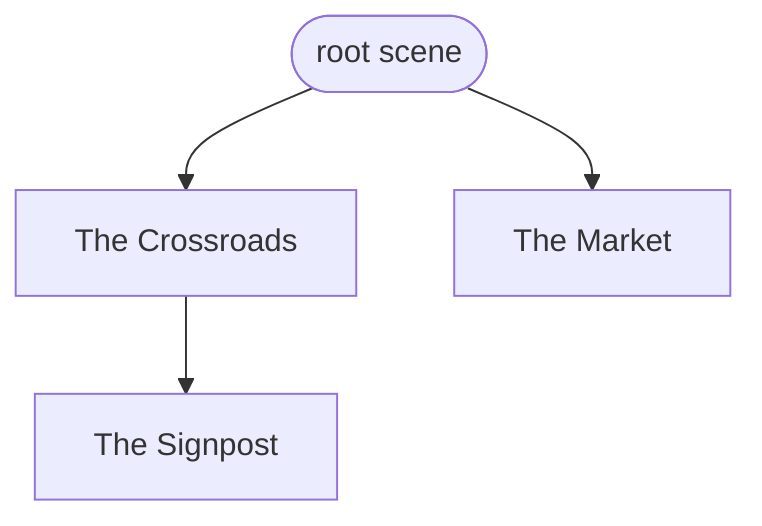
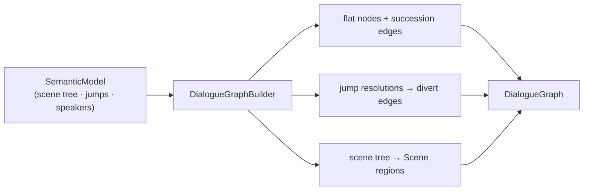
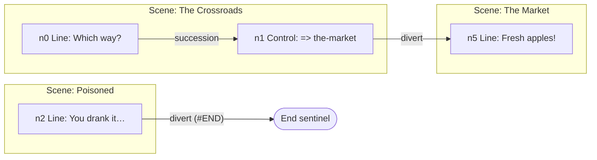

# Dialogue graph

> [!NOTE]
> Status: **proposed**. The compiler's next stage: lower the
> [Semantic Analyzer](./Semantic%20Analyzer.md)'s **semantic model** into an immutable
> **dialogue graph** — a directed graph a runtime can walk. This note designs the
> **compile-time** half of the deferred
> [dialogue graph and runtime](https://github.com/pengzhengyi/dialoguedown/issues/45):
> the graph's shape and the builder that produces it. It realizes the flow *meaning*
> that [Progression Order](./Progression%20Order.md) already fixed (succession, divert,
> the End sentinel) as concrete nodes and edges. **Play-time traversal** — walking the
> graph — is a separate later component and is out of scope here.

## Table of contents

- [Dialogue graph](#dialogue-graph)
  - [Table of contents](#table-of-contents)
  - [Goal and scope](#goal-and-scope)
  - [Ubiquitous language](#ubiquitous-language)
  - [Prior art and the hand-rolled decision](#prior-art-and-the-hand-rolled-decision)
  - [Functionality checklist](#functionality-checklist)
  - [Design](#design)
    - [Modules and the seam](#modules-and-the-seam)
    - [The intermediate representation](#the-intermediate-representation)
    - [Lowering flow](#lowering-flow)
    - [Interfaces and abstractions](#interfaces-and-abstractions)
  - [Key design decisions](#key-design-decisions)
  - [Error and boundary cases](#error-and-boundary-cases)
  - [Integration](#integration)
  - [Testability](#testability)
  - [Open questions and deferred work](#open-questions-and-deferred-work)
  - [Implementation checklist](#implementation-checklist)

## Goal and scope

The semantic model answers *what a script means* — its speakers, its scene tree, and
what each jump resolves to — but keeps the shape of a **document**: a tree of scenes
owning blocks. A runtime needs the shape of a **flow**: "from here, where can control
go?" This component builds that flow — the **dialogue graph** — so a later runtime can
walk it, and the report can render it.

The same script takes two shapes. The semantic analyzer produces a **scene tree** —
a hierarchy for *naming and scope*. This stage produces a **dialogue graph** — a flat
*flow* whose nesting is flattened into document order, with the grouping kept as a
**region overlay** (the dashed boxes). The output is a **graph, not a tree**: diverts
add cross-cutting and cyclic edges a tree cannot express.

*Scene tree* (what analysis produced — hierarchy):



*Dialogue graph* (what this stage produces — flow, with a Scene-region overlay):


The `Signpost` region still nests inside `Crossroads` (grouping preserved), yet the
flow is one document-order chain that reads straight through the nesting — the shape a
runtime walks.

The graph is **directed** and supports every branching shape the language needs:
**cycles** (a divert back to an earlier scene), **conditional edges** (a `key?` guard),
**dynamic edges** (a `key%`/weighted random pick), and **grouping** (a scene, and later
an `if`/`else` branch or a whole file, as a named region).

**In scope:** the immutable dialogue-graph IR, and the **builder** (the graph
compiler) that lowers a `SemanticModel` into it for the constructs that ship today —
reading-order succession, the non-returning divert, choices and random choices, control
lines, `#END`, and the `key?` guard on a conditional line, jump, or choice. The builder
plugs into the compiler facade as the stage after semantic analysis.

**Out of scope (deferred, with seams left here):**

- **Play-time traversal** — walking the graph, evaluating guards/weights, running
  effects — is the runtime half of [#45](https://github.com/pengzhengyi/dialoguedown/issues/45).
  This note reserves the `IEdgeSelector` seam it will plug into.
- **The returning detour** and its call stack — reserved as the `Detour`/`Return` edge
  kinds; its syntax and return boundary are [Progression Order](./Progression%20Order.md) follow-ups.
- **Block controls** (`if`/`elseif`/`else`) — reserved as the `Branch` region kind and a
  guarded branch edge; the construct is the [Block Controls](./Block%20Controls.md) note.
- **Cross-file links** — reserved by letting a `NodeId` widen to a project-qualified id
  and a `File` region kind; resolution is the [Cross-File Jump Resolution](./Cross-File%20Jump%20Resolution.md) note.

## Ubiquitous language

| Term | Meaning |
| --- | --- |
| **Dialogue graph** | The directed graph of a script's flow: nodes joined by typed edges, with a grouping overlay. The stage's output. |
| **Node** | A unit of flow — one script block (a line, a control line, a choice), plus the terminal **End** node. Carries content and its outgoing edges. |
| **Edge** | A directed connection from one node to a target, of a specific **kind**. |
| **Succession** | The default edge: fall-through to the next block in document order (see [Progression Order](./Progression%20Order.md)). |
| **Divert** | A non-returning `=>` edge. A **guarded** divert (a `key?` condition) fires only when its guard reads true. |
| **Detour** / **Return** | *(seam)* A returning jump edge and its pop marker; the runtime keeps a call stack. Deferred. |
| **Option** | One arm of a choice: a target with a label, an optional guard, and an optional weight. |
| **Guard** | An opaque `key?` condition — the AST `Condition` — carried on an edge; the host decides its truth at play time. |
| **Weight** | An opaque option weight — the AST `ChoiceWeight` (`key%`, numeric, or auto); the host resolves the random pick. |
| **Effect** | A game-system call — the AST `GameCall` (`GiveGold("5")`) — a node runs when it plays. |
| **Region** | A named grouping of nodes overlaid on the flat graph — a scene now; a branch or a file later. Metadata, not flow. |
| **End sentinel** | The terminal node; the `#END` divert and reaching the last block both lead here. |
| **Edge selector** | *(runtime seam)* The strategy that picks one outgoing edge at a node — evaluating guards/weights in production, or forcing a path in a debugger. |
| **Node id** | A node's stable identity; edges reference targets by id, so cycles need no object back-references. |

One vocabulary spans code, tests, docs, and commits.

## Prior art and the hand-rolled decision

Two camps informed the model. **Compiler control-flow graphs** — Roslyn's
`ControlFlowGraph` and LLVM IR — model a **flat list of basic blocks** with **typed
successor edges** (conditional vs. fall-through) and a **separate region hierarchy**
(try/catch, loops) layered on top. **Story engines** — Inkle's Ink, Articy:draft — use
**typed node kinds** and **containers**; Ink's flow *is* a container tree walked with a
pointer and a call stack (tunnels). DialogueDown sits with the compilers: its flow is
flat reading order with **arbitrary cross-boundary diverts**, and it already declared
scene nesting to be *scope, not flow*.

**We hand-roll the IR rather than take a graph library.** The maintained .NET option,
**QuikGraph** (MS-PL, last release ~2020), models a flat generic graph with no
hierarchical grouping and mutable-by-default storage — it would fight both the grouping
requirement and the immutable core. The algorithms a dialogue graph actually needs —
reachability, cycle detection, topological order — are small and self-contained. This
keeps the engine-agnostic core dependency-light, as the repo requires. If deeper
analysis (strongly-connected components, min-cut) is ever wanted, QuikGraph fits later
as an **optional adapter** (project the IR into it, run the algorithm, discard), never a
core dependency.

## Functionality checklist

- [ ] Lower a `SemanticModel` into an immutable `DialogueGraph` of nodes and typed edges.
- [ ] Emit one **node per block**: `LineNode`, `ControlNode`, `ChoiceNode`, and the single `EndNode`.
- [ ] Wire a **Succession** edge from each block to the next block in document order (fall-through).
- [ ] Lower a jump to a **Divert**: `SceneJump` → the target scene's entry node; `TerminalJump` → `EndNode`.
- [ ] Carry a `key?` condition as a **Guard** on the divert/branch edge, with a fall-through sibling that skips the guarded content.
- [ ] Lower `Choices`/`RandomChoices` to a **ChoiceNode** fanning out **Option** edges; a random option carries its **Weight**; both weave back to the enclosing region's exit.
- [ ] Carry a block's inline game calls as ordered **Effects** on its node.
- [ ] Build the **region overlay** from the scene tree: one **Scene** region per scene, nested, each exposing its **entry** and **exit** node.
- [ ] Reference every target by **node id**, so cycles and cross-region diverts are ordinary edges.
- [ ] Leave clean seams: the `IEdgeSelector` runtime hook, the `Detour`/`Return` edge kinds, and `Branch`/`File` region kinds.
- [ ] Plug into the compiler facade as the stage after semantic analysis; expose the graph on the `CompilationResult`.

## Design

### Modules and the seam

One focused module in the core, mirroring the other stages' shape (`IScriptTranspiler`,
`IScriptDesugarer`, `ISemanticAnalyzer`):

- **`IDialogueGraphBuilder`** — the stage seam: `DialogueGraph Build(SemanticModel model,
  DiagnosticsContext context)`. The builder emits no diagnostics today, but every sibling
  stage takes the context, so the seam is threaded in now (reserved for planned reachability
  and cycle diagnostics) rather than bolted on with a later signature change.
  A `DialogueGraphBuilder` walks the semantic model and assembles the graph.
- **The IR types** — the immutable `DialogueGraph` and its node, edge, and region
  records, in the `DialogueDown.Graph` namespace. These replace the earlier primitive
  `INode`/`IEdge` sketch, which predates the semantic model.

Because the node payload reuses the AST and semantic model (see the
[node-payload decision](#key-design-decisions)), `DialogueDown.Graph` is **a late
pipeline stage above the semantic analyzer, not a foundation leaf**: it may depend on
`Script.Ast`, `Script.Semantics`, `Common`, and `Diagnostics`, but never on the
`Compilation` orchestrator (which drives it) or the earlier `Markdown`/`Transpiler`
stages. An architecture test guards that direction.

The builder is a pure function of the semantic model: same model in, same graph out, no
I/O and no engine dependency.

### The intermediate representation

```csharp
// ── Identity ── edges reference targets by id, so cycles need no object back-refs.
readonly record struct NodeId(int Value);     // v1 local; cross-file seam widens the id
readonly record struct RegionId(int Value);

// ── Graph ── a flat immutable node list, a canonical entry, the End sentinel, and the overlay.
// A `Node(NodeId)` lookup is backed by an id-keyed dictionary, so the id is a handle, not an index.
sealed class DialogueGraph(
    IReadOnlyList<DialogueNode> Nodes, NodeId Entry, NodeId End, RegionTree Regions);

// ── Nodes ── one per block; content plus ordered outgoing edges. Payload reuses the
//    semantic model and AST (bind, don't copy): a resolved SpeakerSymbol, the line's
//    displayable InlineFragments, and its GameCalls as effects.
abstract record DialogueNode(NodeId Id, IReadOnlyList<Edge> Out);
sealed record LineNode   (NodeId Id, SpeakerSymbol Speaker, IReadOnlyList<InlineFragment> Speech,
                          IReadOnlyList<GameCall> Effects, IReadOnlyList<Edge> Out) : DialogueNode;
sealed record ControlNode(NodeId Id, IReadOnlyList<GameCall> Effects,
                          IReadOnlyList<Edge> Out) : DialogueNode;  // effect-only, no speaker
sealed record ChoiceNode (NodeId Id, IReadOnlyList<Edge> Out) : DialogueNode;  // fan-out via Option edges
sealed record EndNode    (NodeId Id) : DialogueNode;                            // the #END sentinel

// ── Edges ── sealed kinds; each names its target by id. A guard reuses the AST Condition
//    and a weight the AST ChoiceWeight — both opaque, the host decides them at play time.
abstract record Edge(NodeId Target);
sealed record Succession(NodeId Target)                          : Edge(Target);  // fall-through
sealed record Divert    (NodeId Target, Condition? Guard = null) : Edge(Target);  // => (conditional if guarded)
sealed record Option    (NodeId Target, IReadOnlyList<InlineFragment> Label,
                         Condition? Guard, ChoiceWeight? Weight)  : Edge(Target);
sealed record Detour    (NodeId Target)                          : Edge(Target);  // SEAM: runtime pushes a continuation
sealed record Return    ()                                       : Edge(default); // SEAM: runtime pops the call stack

// ── Grouping overlay ── metadata over the flat graph, not part of its topology.
sealed record RegionTree(IReadOnlyList<Region> Roots);
sealed record Region(
    RegionId Id, RegionKind Kind, string? Label, string? Anchor,
    NodeId Entry, NodeId Exit,                       // named entry enables dynamic entry; exit drives weave-back
    IReadOnlySet<NodeId> Members, IReadOnlyList<Region> Children, Condition? Guard);
enum RegionKind { Scene, Branch, File }              // v1 emits Scene; Branch and File are seams
```

### Lowering flow

The builder walks the scene tree in **document order** (the pre-order of the heading
outline), emits a node per block wiring `Succession` to the next block, then turns each
jump's resolution into a `Divert`. Scenes become the region overlay.



A divert crosses region boundaries with no ceremony — it is a node id, and the region
overlay is untouched:



### Interfaces and abstractions

| Type / seam | Responsibility | Collaborators |
| --- | --- | --- |
| `IDialogueGraphBuilder` | The stage seam: `SemanticModel` → `DialogueGraph`. | `ScriptCompiler`, DI |
| `DialogueGraphBuilder` | Maps each script block to its graph node in document order; emits succession/divert edges and Scene regions, resolving every target through the id map. | `SemanticModel`, `INodeIdBuilder`, `Scene.DocumentOrder` |
| `INodeIdBuilder` | Strategy that assigns a `NodeId` to each block and the End node (a `NodeIdMap`). `IndexNodeIdBuilder` numbers by document position; a source-derived strategy for incremental/JIT plugs in here. | `NodeIdMap` |
| `DialogueGraph` | The immutable result: nodes, entry, End sentinel, region overlay. | consumed by the runtime and the report |
| `DialogueNode` / `Edge` | The sealed node and edge unions (the flow). | — |
| `Region` / `RegionTree` | The grouping overlay projected from the scene tree. | `Scene` |
| `IEdgeSelector` | *(runtime seam)* Picks one outgoing edge at a node — evaluate in production, force in a debugger. | deferred runtime |

## Key design decisions

- **Grouping is an overlay, not topology (flat graph + region tree).** Nodes and flow
  edges form one flat graph; a separate `RegionTree` says which nodes belong to which
  scene. This matches Roslyn's basic-block-plus-region model and the language's own rule
  that *scene nesting is scope, not flow*. It keeps the common case — a divert into the
  middle of another scene — a plain edge, where a nested subgraph model would force a
  divert to pierce a container's single entry. The overlay also carries the grouping the
  report and diagnostics want without complicating traversal. Branch and file grouping
  land later as new region **kinds**, not a new structure.
- **Conditions and dynamics ride edges, not synthetic nodes.** A `key?` guard sits on
  the edge it guards (`Divert(target, Guard)` with a fall-through sibling); a random pick
  is a `ChoiceNode` whose `Option` edges carry a `Weight`. This keeps the IR compact and
  every stop **source-mapped** to a block the writer wrote — decisive for a step-through
  debugger, where "force this path" and "override this condition" become one uniform
  action over a node's `Out` list, at real nodes rather than synthetic decision diamonds.
  The runtime's `IEdgeSelector` is the single hook that a debugger swaps to force paths;
  the graph tab can still *render* a guarded edge as a decision glyph — a projection
  concern, not the IR's.
- **Block-level nodes.** One node per block. An inline jump ending a line makes that
  `LineNode`'s outgoing edge a `Divert` rather than a `Succession`; inline game calls
  become the node's `Effects`. A conditional block is reached through a **guarded entry
  edge** with a fall-through sibling that skips it — the predecessor chooses to enter or
  skip, exactly Roslyn's conditional-versus-fall-through shape.
- **The node payload reuses the semantic model and AST (bind, don't copy).** A `Line`'s
  inline fragments partition three ways, and each part is kept as the type that already
  models it rather than copied into a parallel value hierarchy — matching how the semantic
  model annotates the tree it analyzed rather than duplicating it:

  | A line's inline fragment | Becomes | Kept as |
  | --- | --- | --- |
  | `Text`, `StyledText`, `Image`, `Link`, `LineBreak` | the node's **speech** | the AST `InlineFragment`s |
  | `GameCall` | an **Effect** on the node | the AST `GameCall` |
  | `Jump` → a `Divert` edge; `Condition` → an edge **Guard** | control, lifted out of the payload | the AST `Condition` / `JumpResolution` |

  The speaker is the resolved `SpeakerSymbol` from the `SpeakerTable`, and a weight is the
  AST `ChoiceWeight`. The tradeoff: the graph references AST types rather than standing
  fully alone — acceptable, since the core already ships the AST and this avoids a
  redundant projection (YAGNI).
- **Immutable IR addressed by an opaque node id.** The graph is immutable; edges hold a
  `NodeId`, never an object reference. Ids make cycles trivial (an edge to an earlier id)
  and let a builder assemble a cyclic graph without mutable back-references, matching the
  repo's value-object grain. `NodeId` is an **opaque handle**, not a list index: callers
  resolve a node through `DialogueGraph.Node`, backed by an id-keyed dictionary, so the
  value can later become a **source-derived, stable id** (a scene anchor plus an intra-scene
  ordinal, or the source span) for **incremental or just-in-time** compilation — where an
  unchanged node must keep its id across rebuilds — without touching any caller. A random
  UUID is deliberately *not* used: it adds uniqueness without the reuse-matching stability
  incrementality needs, and it would make structural tests non-deterministic. Cross-file
  ids widen to `(ScriptId, local)` rather than a global id, keeping *which script* explicit.
- **Conditions and weights stay opaque.** A `Guard` (the AST `Condition`) carries a key
  and a `Weight` (the AST `ChoiceWeight`) a number or a key — the core never evaluates
  them; the host does at play time. This keeps the engine-agnostic core free of an
  expression language it does not yet need, mirroring the DSL's single-key `?`/`%`.
- **Dynamic entry falls out for free.** Because every node is addressable and each region
  exposes a named `Entry`, a debugger or test can start a run at any node or named scene
  (the `AnchorTable` maps a slug to its scene). The graph's canonical `Entry` stays the
  document top; a `#START` sentinel is a Progression Order follow-up.

## Error and boundary cases

| Case | Behavior |
| --- | --- |
| Empty document (root scene, no blocks) | A graph whose `Entry` is the `EndNode`; no error. |
| Heading-only scene (no blocks) | Its region `Entry`/`Exit` is the fall-through target — the next block in document order (or `EndNode`). |
| Content after a divert | The divert is the node's only outgoing edge; the unreachable content already drew `DLG1003` at analysis, so the builder simply does not wire it. |
| `UnresolvedJump` (empty target) | The semantic analyzer already reported it; the builder emits no divert (a dead end), never throwing on a resolution the analyzer admitted. |
| `FileScopedJump` | Not lowered in v1 — reserved for the cross-file seam; the builder leaves the node without a cross-file divert rather than failing. |
| Cycle (divert back to an earlier scene) | An ordinary edge to an earlier id — cycles are a feature, not an error. |
| Last block of the document | Its `Succession` leads to the `EndNode` (reaching the end terminates the run). |

## Integration

The builder is stage six, after semantic analysis. `ScriptCompiler` gains an
`IDialogueGraphBuilder`, calls `Build(semantics, session.Context)` once analysis succeeds, and
carries the graph on `CompilationResult.Complete(...)` beside the semantic model.
`AddDialogueDown` registers the builder as a singleton like the other stages. Nothing earlier
in the pipeline changes; a
halted compile (which never produces a semantic model) produces no graph, exactly as it
produces no model today.

The report's existing display graph (`DisplayGraph`/`DisplayNode`/`DisplayEdge`) stays a
**visualization projection**; once this stage ships, that projection can be sourced from
the real dialogue graph instead of the AST, but that is a later visualization change, not
part of this component.

## Testability

- **Pure and deterministic.** `Build` is `SemanticModel` → `DialogueGraph` with no I/O, so
  a unit test compiles a small script (through the existing pipeline test helpers), builds
  the graph, and asserts its nodes, edges, and regions against multi-line script literals —
  the same style as the semantic-analyzer tests.
- **Shape assertions.** Cover each lowering rule: succession chains a line to the next
  block; a divert points at the target scene's entry; a `#END` divert reaches the End node;
  a guarded line has a guarded entry edge plus a fall-through; a choice fans out and weaves
  back; a cycle is an edge to an earlier id; effects ride their node.
- **Boundary tests.** The empty document, a heading-only scene, content after a divert, an
  unresolved jump, and a file-scoped jump each assert the table above.
- **Seams by construction.** Reserve the `IEdgeSelector`, `Detour`/`Return`, and
  `Branch`/`File` kinds with a compiling type and a placeholder test, so the runtime and
  the future constructs plug in without reshaping the IR.
- Mirror the source layout, one test file per source file, and target the usual high,
  meaningful coverage.

## Open questions and deferred work

- **Reachability and cycle diagnostics.** A graph makes "no path reaches this scene" and
  "a cycle with no exit" detectable. Both are more valuable with the runtime and are left
  out of v1; the line-level unreachable-after-divert warning already ships. Revisit as a
  graph-analysis pass (optionally via a QuikGraph adapter).
- **The detour's return boundary.** `Detour`/`Return` are reserved, but *where* a detour
  returns from is a Progression Order follow-up; the call stack itself is the runtime's.
- **`#START` / entry point.** The canonical entry is the document top; a reserved start
  sentinel and cross-file entry semantics are deferred.
- **Cross-file node ids.** `NodeId` widens to a project-qualified id for cross-file
  diverts; the [Cross-File Jump Resolution](./Cross-File%20Jump%20Resolution.md) linker owns resolution.
- **Choice weave-back target.** The enclosing region's `Exit` is the intended rejoin point;
  the exact node for nested choices is a builder detail settled in TDD.

## Implementation checklist

- [ ] IR records: `DialogueGraph`, the node union, the edge union (guards/weights reuse the AST `Condition`/`ChoiceWeight`), `Region`/`RegionTree`, `NodeId`/`RegionId`.
- [ ] `IDialogueGraphBuilder` + `DialogueGraphBuilder`: document-order walk, succession wiring, jump-to-divert lowering, guarded-entry lowering, choice fan-out and weave-back, effects, and the Scene region overlay.
- [ ] Retire the primitive `DialogueDown.Graph` `INode`/`IEdge` sketch it supersedes, and reframe the `Graph` layering architecture test from a foundation leaf to a stage above the semantic analyzer.
- [ ] Wire into `ScriptCompiler` and `AddDialogueDown`; expose the graph on `CompilationResult`.
- [ ] Reserve the `IEdgeSelector` runtime seam and the `Detour`/`Return` and `Branch`/`File` kinds with placeholder coverage.
- [ ] Unit tests per lowering rule and boundary case; reading-guide and `CHANGELOG` entries.
