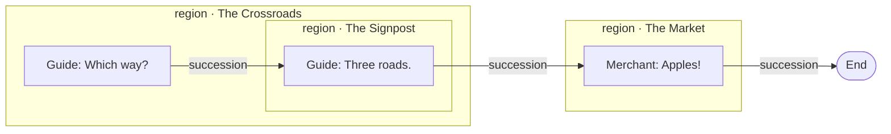
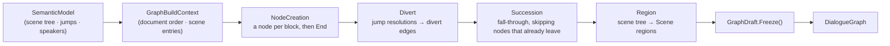

# Dialogue graph

> [!NOTE]
> Status: **implemented**. The compiler's sixth stage: lower the
> [Semantic Analyzer](./Semantic%20Analyzer.md)'s **semantic model** into an immutable
> **dialogue graph**. It realizes the flow *meaning* that
> [Progression Order](./Progression%20Order.md) already fixed — succession, divert, the
> End sentinel — as concrete nodes and edges. Every construct the language has lowers,
> and the stage runs inside the compiler, so a clean compile carries its graph on the
> [compilation outcome](./Compilation%20Outcome.md).
>
> This note covers **building** the graph, and stops there. Walking it — evaluating a
> guard, picking an edge, keeping a detour's call stack — belongs to the
> [runtime](https://github.com/pengzhengyi/dialoguedown/issues/45), which owns those
> shapes so the code that needs them can settle them.

## Table of contents

- [Dialogue graph](#dialogue-graph)
  - [Table of contents](#table-of-contents)
  - [Goal and scope](#goal-and-scope)
  - [Ubiquitous language](#ubiquitous-language)
  - [Prior art and the hand-rolled decision](#prior-art-and-the-hand-rolled-decision)
  - [Functionality checklist](#functionality-checklist)
  - [Design](#design)
    - [Modules and the seam](#modules-and-the-seam)
    - [The intermediate representation](#the-intermediate-representation)
    - [Lowering flow](#lowering-flow)
    - [Interfaces and abstractions](#interfaces-and-abstractions)
  - [Key design decisions](#key-design-decisions)
  - [Error and boundary cases](#error-and-boundary-cases)
  - [Integration](#integration)
  - [Testability](#testability)
  - [Outcome](#outcome)
  - [Open questions and deferred work](#open-questions-and-deferred-work)
  - [Implementation checklist](#implementation-checklist)

## Goal and scope

The semantic model answers *what a script means* — its speakers, its scene tree, and
what each jump resolves to — but keeps the shape of a **document**: a tree of scenes
owning blocks. A runtime needs the shape of a **flow**: "from here, where can control
go?" This component builds that flow — the **dialogue graph** — so a later runtime can
walk it, and the report can render it.

The same script takes two shapes. The semantic analyzer produces a **scene tree** —
a hierarchy for *naming and scope*. This stage produces a **dialogue graph** — a flat
*flow* whose nesting is flattened into document order, with the grouping kept as a
**region overlay** (the dashed boxes). The output is a **graph, not a tree**: diverts
add cross-cutting and cyclic edges a tree cannot express.

*Scene tree* (what analysis produced — hierarchy):


*Dialogue graph* (what this stage produces — flow, with a Scene-region overlay):



The `Signpost` region still nests inside `Crossroads` (grouping preserved), yet the
flow is one document-order chain that reads straight through the nesting — the shape a
runtime walks.

The graph is **directed** and supports every branching shape the language needs:
**cycles** (a divert back to an earlier scene), **conditional edges** (a `key?` guard),
**dynamic edges** (a `key%`/weighted random pick), and **grouping** (a scene, and later
an `if`/`else` branch or a whole file, as a named region).

**In scope:** the immutable dialogue-graph IR, and the **builder** (the graph
compiler) that lowers a `SemanticModel` into it for the constructs that ship today —
reading-order succession, the non-returning divert, choices and random choices, control
lines, `#END`, and the `key?` guard on a conditional line, jump, or choice. The builder
plugs into the compiler facade as the stage after semantic analysis.

**Out of scope:**

- **Everything at play time** — walking the graph, evaluating a guard or a weight,
  running effects, picking an edge, and the returning detour's call stack. That is the
  [runtime](https://github.com/pengzhengyi/dialoguedown/issues/45), which shapes its own
  hooks and edge kinds against a consumer rather than inheriting a guess from here.
- **Block controls** (`if`/`elseif`/`else`) — lowered here to a **Branch** node whose
  guarded, ordered **Branch** edges the first satisfied one wins among; the construct
  itself is the [Block Controls](./Block%20Controls.md) note.
- **Cross-file links** — reserved by letting a `NodeId` widen to a project-qualified id;
  a file grouping arrives with it. Resolution is the [Cross-File Jump Resolution](./Cross-File%20Jump%20Resolution.md) note.

## Ubiquitous language

| Term | Meaning |
| --- | --- |
| **Dialogue graph** | The directed graph of a script's flow: nodes joined by typed edges, with a grouping overlay. The stage's output. |
| **Node** | A unit of flow — one script block (a line, a control line, a choice), plus the terminal **End** node. Carries content and its outgoing edges. |
| **Edge** | A directed connection from one node to a target, of a specific **kind**. |
| **Succession** | The default edge: fall-through to the next block in document order (see [Progression Order](./Progression%20Order.md)). |
| **Divert** | A non-returning `=>` edge. A **guarded** divert (a `key?` condition) fires only when its guard reads true. |
| **Option** | One arm of a choice: a target with a label, an optional guard, and an optional weight. |
| **Guard** | An opaque `key?` condition — the AST `Condition` — carried on an edge; the host decides its truth at play time. |
| **Weight** | An opaque option weight — the AST `ChoiceWeight` (`key%`, numeric, or auto); the host resolves the random pick. |
| **Effect** | A game-system call — the AST `GameCall` (`GiveGold("5")`) — a node runs when it plays. |
| **Region** | A named grouping of nodes overlaid on the flat graph — a scene now; a branch or a file later. Metadata, not flow. Its **own nodes** are the ones it holds directly, and its **subregions** are the groupings nested in it. |
| **Entry block** | The block reaching a scene lands on: its own first block, or — when it owns no content — the next block in reading order. |
| **Draft** | The mutable graph under construction that passes add to; `Freeze` validates it and yields the immutable graph. |
| **Pass** | One construction concern over the draft — node creation, diverts, succession, regions — run in dependency order. |
| **End sentinel** | The terminal node; the `#END` divert and reaching the last block both lead here. |
| **Node id** | A node's stable identity; edges reference targets by id, so cycles need no object back-references. |

One vocabulary spans code, tests, docs, and commits.

## Prior art and the hand-rolled decision

Two camps informed the model. **Compiler control-flow graphs** — Roslyn's
`ControlFlowGraph` and LLVM IR — model a **flat list of basic blocks** with **typed
successor edges** (conditional vs. fall-through) and a **separate region hierarchy**
(try/catch, loops) layered on top. **Story engines** — Inkle's Ink, Articy:draft — use
**typed node kinds** and **containers**; Ink's flow *is* a container tree walked with a
pointer and a call stack (tunnels). DialogueDown sits with the compilers: its flow is
flat reading order with **arbitrary cross-boundary diverts**, and it already declared
scene nesting to be *scope, not flow*.

**We hand-roll the IR rather than take a graph library.** The maintained .NET option,
**QuikGraph** (MS-PL, last release ~2020), models a flat generic graph with no
hierarchical grouping and mutable-by-default storage — it would fight both the grouping
requirement and the immutable core. The algorithms a dialogue graph actually needs —
reachability, cycle detection, topological order — are small and self-contained. This
keeps the engine-agnostic core dependency-light, as the repo requires. If deeper
analysis (strongly-connected components, min-cut) is ever wanted, QuikGraph fits later
as an **optional adapter** (project the IR into it, run the algorithm, discard), never a
core dependency.

## Functionality checklist

- [x] Lower a `SemanticModel` into an immutable `DialogueGraph` of nodes and typed edges.
- [x] Emit one **node per block**: `LineNode`, `ControlNode`, `ChoiceNode`, `RandomChoiceNode`, `BranchNode`, and the single `EndNode`. A `SceneHeading` names a scene rather than playing, so it is no node.
- [x] Wire a **Succession** edge from each block to the next block in document order (fall-through).
- [x] Lower a jump to a **Divert**: `SceneJump` → the target scene's entry node; `TerminalJump` → `EndNode`.
- [x] Carry a `key?` condition as a **Guard**: on an edge when it withholds a route (a divert, a choice arm, a branch), on the **node** when it withholds a block's content. Either way a fall-through sibling is the path left.
- [x] Lower `Choices`/`RandomChoices` to a **Choice** or **Random choice** node fanning out **Option** edges; a random option carries its **Weight**; both arms weave back through the walk's continuations, not through a region.
- [x] Carry a block's inline game calls as ordered **Effects** on its node.
- [x] Build the **region overlay** from the scene tree: one **Scene** region per scene, nested, each exposing its **entry** and **exit** node. Only an *addressable* grouping earns a region, so a block control's branch does not.
- [x] Carry each node's **source span**, so a tool can point back at the script.
- [x] Reference every target by **node id**, so cycles and cross-region diverts are ordinary edges.
- [x] Plug into the compiler facade as the stage after semantic analysis; expose the graph on a `CompilationSuccess`.

## Design

### Modules and the seam

One focused module in the core, mirroring the other stages' shape (`IScriptTranspiler`,
`IScriptDesugarer`, `ISemanticAnalyzer`):

- **`IDialogueGraphBuilder`** — the stage seam: `DialogueGraph Build(SemanticModel model,
  DiagnosticsContext context)`. The builder emits no diagnostics today, but every sibling
  stage takes the context, so the seam is threaded in now (reserved for planned reachability
  and cycle diagnostics) rather than bolted on with a later signature change.
  A `DialogueGraphBuilder` walks the semantic model and assembles the graph.
- **The IR types** — the immutable `DialogueGraph` and its node, edge, and region
  records, in the `DialogueDown.Graph` namespace. These replace the earlier primitive
  `INode`/`IEdge` sketch, which predates the semantic model.

Because the node payload reuses the AST and semantic model (see the
[node-payload decision](#key-design-decisions)), `DialogueDown.Graph` is **a late
pipeline stage above the semantic analyzer, not a foundation leaf**: it may depend on
`Script.Ast`, `Script.Semantics`, `Common`, and `Diagnostics`, but never on the
`Compilation` orchestrator (which drives it) or the earlier `Markdown`/`Transpiler`
stages. An architecture test guards that direction.

The builder is a pure function of the semantic model: same model in, same graph out, no
I/O and no engine dependency.

### The intermediate representation

```csharp
// ── Identity ── edges reference targets by id, so cycles need no object back-refs.
readonly record struct NodeId(int Value);     // local today; the cross-file seam widens it
readonly record struct RegionId(int Value);

// ── Graph ── a flat immutable node list, a canonical entry, the End sentinel, and the overlay.
// A `Node(NodeId)` lookup is backed by an id-keyed dictionary, so the id is a handle, not an index.
sealed class DialogueGraph(
    IReadOnlyList<DialogueNode> Nodes, NodeId Entry, NodeId End, RegionTree Regions);

// ── Nodes ── one per block; content plus ordered outgoing edges. Payload reuses the
//    semantic model and AST (bind, don't copy): a resolved SpeakerSymbol and the line's
//    displayable InlineFragments. A line's Effects are a derived view of its speech.
abstract record DialogueNode(NodeId Id, IReadOnlyList<Edge> Out);
sealed record LineNode   (NodeId Id, SpeakerSymbol Speaker, IReadOnlyList<InlineFragment> Speech,
                          IReadOnlyList<Edge> Out) : DialogueNode
{
    IReadOnlyList<GameCall> Effects => [.. Speech.OfType<GameCall>()];   // the calls it runs
}
sealed record ControlNode(NodeId Id, IReadOnlyList<GameCall> Effects,
                          IReadOnlyList<Edge> Out) : DialogueNode;  // effect-only, no speaker
sealed record ChoiceNode (NodeId Id, IReadOnlyList<Edge> Out) : DialogueNode;  // fan-out via Option edges
sealed record EndNode    (NodeId Id) : DialogueNode;                            // the #END sentinel

// ── Edges ── sealed kinds; each names its target by id. A guard reuses the AST Condition
//    and a weight the AST ChoiceWeight — both opaque, the host decides them at play time.
abstract record Edge(NodeId Target);
sealed record Succession(NodeId Target)                          : Edge(Target);  // fall-through
sealed record Divert    (NodeId Target, Condition? Guard = null) : Edge(Target);  // => (conditional if guarded)
sealed record Option    (NodeId Target, IReadOnlyList<InlineFragment> Label,
                         Condition? Guard, ChoiceWeight? Weight)  : Edge(Target);

// ── Grouping overlay ── metadata over the flat graph, not part of its topology. The kind is
//    the type, so each grouping carries only the metadata it owns.
sealed record RegionTree(IReadOnlyList<Region> Roots);   // .Of(roots) folds the empty case
abstract record Region(
    RegionId Id,
    NodeId Entry, NodeId Exit,                   // the named entry a divert lands on
    IReadOnlySet<NodeId> OwnNodes,               // the nodes it owns directly, not its subregions'
    IReadOnlyList<Region> Subregions);
sealed record SceneRegion(..., IReadOnlyList<InlineFragment> Label, string Anchor) : Region;
```

### Lowering flow

The builder is a **pipeline of passes** over one mutable `GraphDraft`, not a single walk.
Each pass owns one concern, so a new construct adds a pass instead of growing a monolith —
the same shape as the desugarer's rule list. The draft freezes into the immutable graph.



**Diverts run before succession.** A node that leaves unconditionally must not also fall
through, and it is simpler to *withhold* an edge than to add one and remove it later — so
succession skips any node that already carries an unguarded divert. A **guarded** divert
leaves the fall-through in place, and that sibling edge *is* the "skip" path taken when the
guard reads false.

The context computes the two reading-order views once per build — the document-order blocks
and each scene's **entry block** — so no pass recomputes them.

A divert crosses region boundaries with no ceremony — it is a node id, and the region
overlay is untouched:


### Interfaces and abstractions

| Type / seam | Responsibility | Collaborators |
| --- | --- | --- |
| `IDialogueGraphBuilder` | The stage seam: `SemanticModel` → `DialogueGraph`. | `ScriptCompiler`, DI |
| `DialogueGraphBuilder` | Orchestrates one build: a fresh id session and draft, each pass in order, then freeze. `DialogueGraphBuilderFactory` composes the default pass list. | `INodeIdBuilderFactory`, `IGraphBuildPass`, `GraphDraft` |
| `GraphBuildContext` | The input every pass shares: the semantic model, the diagnostic sink, and the reading-order views computed once — document-order blocks and each scene's entry block. | `SemanticModel`, `Scene.DocumentOrder`, `Scene.EntryBlocks` |
| `IGraphBuildPass` / `GraphBuildPass` | One construction concern over the draft; the base guards the shared inputs. `NodeCreationPass`, `DivertPass`, `ChoicePass`, `BranchPass`, `SuccessionPass`, and `RegionPass` implement it, in that order. | `GraphDraft`, `GraphBuildContext` |
| `GraphDraft` | The mutable construction boundary: tracks node drafts and edges, derives the entry and End, validates on `Freeze()`, and returns the immutable graph. | `NodeDraft`, `INodeIdBuilder`, `Region` |
| `INodeIdBuilder` | Strategy that assigns a `NodeId` incrementally as blocks are added, freezing into a `NodeIdMap`. `IndexNodeIdBuilder` numbers by arrival; a source-derived strategy for incremental/JIT plugs in here, created per build by `INodeIdBuilderFactory`. | `NodeIdMap` |
| `DialogueGraph` | The immutable result: nodes, entry, End sentinel, region overlay. | consumed by the runtime and the report |
| `DialogueNode` / `Edge` | The sealed node and edge unions (the flow). | — |
| `Region` / `RegionTree` | The grouping overlay projected from the scene tree. | `Scene` |

## Key design decisions

- **Grouping is an overlay, not topology (flat graph + region tree).** Nodes and flow
  edges form one flat graph; a separate `RegionTree` says which nodes belong to which
  scene. This matches Roslyn's basic-block-plus-region model and the language's own rule
  that *scene nesting is scope, not flow*. It keeps the common case — a divert into the
  middle of another scene — a plain edge, where a nested subgraph model would force a
  divert to pierce a container's single entry. The overlay also carries the grouping the
  report and diagnostics want without complicating traversal. A grouping's **kind is its
  type**, not a discriminator field: `SceneRegion` carries a heading's label and anchor, a
  file grouping will carry its path, and each new grouping is a new subclass rather than
  another nullable column on one record.
- **A region groups what can be addressed.** A grouping earns a region only when something
  outside it can **name it and enter it** — a scene by its anchor, later a file by its path.
  That naming metadata is precisely what the edges cannot recover, which is why it is
  overlaid rather than derived. A block control's branch is the counter-example: it has no
  name, and control reaches it only by falling in from its own block, so nothing can address
  it. Its extent is also fully recoverable from the flow — the branch node's arm edges bound
  it and the block's continuation is where it rejoins — so grouping a branch is a **query
  over the graph, not an overlay on it**, and no `BranchRegion` is produced.
- **The builder is a pass pipeline over a mutable draft.** Construction and the result are
  separate types: passes add node drafts, edges, and regions to a `GraphDraft`, which
  validates and freezes into the immutable `DialogueGraph`. Each pass owns one concern, so
  a construct lands as a new pass rather than another branch in a growing walk — the shape
  the desugarer's rule list already uses here. Ordering is the pipeline's contract: every
  pass that gives a node a route of its own — diverts, choice arms, branches — runs before
  succession, so fall-through is *withheld* from a node that already leaves rather than
  added and then removed.
- **Reading order is a semantic-layer rule, not a graph one.** *Which block reaching a
  scene lands on* is the same fall-through idea document order already encodes, so it
  lives beside it as `Scene.EntryBlocks`: a scene is entered at its own first block, or —
  when it owns no content — at the next block in reading order, and a scene with nothing
  after it ends the run. The graph layer only maps those blocks to nodes, and the rule
  stays testable without building a graph at all.
- **Conditions and dynamics ride edges, not synthetic nodes.** A `key?` guard sits on
  the edge it guards (`Divert(target, Guard)` with a fall-through sibling); a random pick
  is a `ChoiceNode` whose `Option` edges carry a `Weight`. This keeps the IR compact and
  every stop **source-mapped** to a block the writer wrote — decisive for a step-through
  debugger, where "force this path" and "override this condition" become one uniform
  action over a node's `Out` list, at real nodes rather than synthetic decision diamonds.
  The graph tab can still *render* a guarded edge as a decision glyph — a projection
  concern, not the IR's.
- **A guard binds at the level it is written.** A guard on a **jump** rides that jump's
  divert, so the node keeps its fall-through as the path taken when the guard reads false.
  A guard on the **block** itself guards the block's whole content, so it needs an edge
  that skips the block — a different lowering, and the builder rejects a guarded block
  rather than silently dropping the guard until that lands.
- **Block-level nodes.** One node per block. An inline jump ending a line adds a `Divert`
  to that `LineNode` and withholds its `Succession`; inline game calls become the node's
  `Effects`. A conditional block is reached through a **guarded entry edge** with a
  fall-through sibling that skips it — the predecessor chooses to enter or skip, exactly
  Roslyn's conditional-versus-fall-through shape.
- **The node payload reuses the semantic model and AST (bind, don't copy).** A `Line`'s
  inline fragments partition three ways, and each part is kept as the type that already
  models it rather than copied into a parallel value hierarchy — matching how the semantic
  model annotates the tree it analyzed rather than duplicating it:

  | A line's inline fragment | Becomes | Kept as |
  | --- | --- | --- |
  | `Text`, `StyledText`, `Image`, `Link`, `LineBreak` | the node's **speech** | the AST `InlineFragment`s |
  | `GameCall` | an **Effect** on the node | the AST `GameCall` |
  | `Jump` → a `Divert` edge; `Condition` → an edge **Guard** | control, lifted out of the payload | the AST `Condition` / `JumpResolution` |

  The speaker is the resolved `SpeakerSymbol` from the `SpeakerTable`, and a weight is the
  AST `ChoiceWeight`. The tradeoff: the graph references AST types rather than standing
  fully alone — acceptable, since the core already ships the AST and this avoids a
  redundant projection (YAGNI).
- **Immutable IR addressed by an opaque node id.** The graph is immutable; edges hold a
  `NodeId`, never an object reference. Ids make cycles trivial (an edge to an earlier id)
  and let a builder assemble a cyclic graph without mutable back-references, matching the
  repo's value-object grain. `NodeId` is an **opaque handle**, not a list index: callers
  resolve a node through `DialogueGraph.Node`, backed by an id-keyed dictionary, so the
  value can later become a **source-derived, stable id** (a scene anchor plus an intra-scene
  ordinal, or the source span) for **incremental or just-in-time** compilation — where an
  unchanged node must keep its id across rebuilds — without touching any caller. A random
  UUID is deliberately *not* used: it adds uniqueness without the reuse-matching stability
  incrementality needs, and it would make structural tests non-deterministic. Cross-file
  ids widen to `(ScriptId, local)` rather than a global id, keeping *which script* explicit.
- **Conditions and weights stay opaque.** A `Guard` (the AST `Condition`) carries a key
  and a `Weight` (the AST `ChoiceWeight`) a number or a key — the core never evaluates
  them; the host does at play time. This keeps the engine-agnostic core free of an
  expression language it does not yet need, mirroring the DSL's single-key `?`/`%`.
- **Dynamic entry falls out for free.** Because every node is addressable and each region
  exposes a named `Entry`, a debugger or test can start a run at any node or named scene
  (the `AnchorTable` maps a slug to its scene). The graph's canonical `Entry` stays the
  document top; a `#START` sentinel is a Progression Order follow-up.

## Error and boundary cases

| Case | Behavior |
| --- | --- |
| Empty document (root scene, no blocks) | A graph whose `Entry` is the `EndNode`; no error. |
| Heading-only scene (no blocks) | It bounds no region, since it owns no nodes. A divert to it lands on its fall-through target — the next block in document order, or the `EndNode` when nothing follows. |
| Leading content before the first heading | Ordinary nodes that belong to no region; the root scene has no heading, so it is not itself a region. |
| Content after a divert | An unguarded divert is the node's only outgoing edge; the unreachable content already drew `DLG1003` at analysis, so the builder simply does not wire it. |
| `UnresolvedJump` (empty target, or a missing scene) | The semantic analyzer already reported it; the builder emits no divert (a dead end), never throwing on a resolution the analyzer admitted. |
| `FileScopedJump` (another file, or a URL) | Analysis reports `DLG2016` and the builder wires no divert, so the line reads on. Cross-file resolution is [#59](https://github.com/pengzhengyi/dialoguedown/issues/59). |
| A `SceneHeading` nested in a branch or an option body | Already reported (`DLG2015`) and left among the blocks, so the builder passes over it rather than failing on a script analysis admitted. |
| A construct not yet lowered | The builder throws, so an unimplemented lowering is loud rather than a silently wrong graph. Every construct the language has today is lowered, so this guards the next one. |
| A script with any error | No graph at all: the compile is a `CompilationFailure`, since a model analysis had to recover no longer describes what the writer wrote. |
| Cycle (divert back to an earlier scene) | An ordinary edge to an earlier id — cycles are a feature, not an error. |
| Last block of the document | Its `Succession` leads to the `EndNode` (reaching the end terminates the run). |

## Integration

The builder is stage six, after semantic analysis. `ScriptCompiler` takes an
`IDialogueGraphBuilder` and calls `Build(semantics, session.Context)`, carrying the result on
a `CompilationSuccess` beside the semantic model. Both composition roots — the container-free
`ScriptCompilerFactory` and the `AddDialogueDown` registration — wire the same builder.

No condition guards the build. A compile that reported an error has already returned a
[failure](./Compilation%20Outcome.md) by that point, so reaching the builder means the model
still describes the script — which is why the graph is a non-null member of a success rather
than an optional one behind a flag.

The report's existing display graph (`DisplayGraph`/`DisplayNode`/`DisplayEdge`) stays a
**visualization projection**; once this stage ships, that projection can be sourced from
the real dialogue graph instead of the AST, but that is a later visualization change, not
part of this component.

## Testability

- **Pure and deterministic.** `Build` is `SemanticModel` → `DialogueGraph` with no I/O, so
  a unit test compiles a small script (through the existing pipeline test helpers), builds
  the graph, and asserts its nodes, edges, and regions against multi-line script literals —
  the same style as the semantic-analyzer tests.
- **A pass at a time.** Each pass is tested on its own: a shared helper runs a chosen pass
  chain over a fresh draft and freezes it, so a test names only the passes its behavior
  needs. The orchestrator is tested separately for pass order and per-build isolation.
- **Reading-order rules without a graph.** `Scene.DocumentOrder` and `Scene.EntryBlocks`
  are semantic-layer functions, so their boundary cases — an empty scene, a heading-only
  document — are asserted directly, with no draft or pass involved.
- **Shape assertions.** Cover each lowering rule: succession chains a line to the next
  block; a divert points at the target scene's entry; a `#END` divert reaches the End node;
  a guarded jump keeps its fall-through sibling; a choice fans out and weaves back; a cycle
  is an edge to an earlier id; effects ride their node.
- **Boundary tests.** The empty document, a heading-only scene, content after a divert, an
  unresolved jump, and a file-scoped jump each assert the table above.
- Mirror the source layout, one test file per source file, and target the usual high,
  meaningful coverage.

## Outcome

| Outcome | Result |
| --- | --- |
| **Achieved** | Every construct the language has lowers to nodes and typed edges: lines, control lines, player and random choices, block conditionals, jumps, and the End sentinel. Guards, weights, effects, source spans, and the scene overlay all ride along, and the stage runs inside the compiler so a clean compile carries its graph. |
| **Changed** | Three shapes moved once the code pushed back. A guard on a **block** belongs on the node, not on an edge — an edge withholds a route, a node withholds content — which needed `IGuardedNode` beside the planned `IGuardedEdge`. Choice arms weave back through the **block walk's continuations**, not through a region's `Exit`, which made nesting fall out for free and left regions purely descriptive. And a `BranchRegion` was designed but never built: a region groups what can be **addressed**, and nothing can name a branch. |
| **Also built** | Two things the design did not anticipate. Every node carries its **source span**, since the graph was otherwise a closed artifact a debugger could not map back to the script. And `DLG2016` warns that a jump outside the script leads nowhere — without it, wiring the stage in would have turned a documented cross-file jump into a compiler crash. |
| **Scope returned** | An earlier draft reserved runtime shapes here — an edge-selector hook and `Detour`/`Return` edge kinds. None were built, because none had a producer or a consumer; this component deleted an unused `BranchRegion` for the same reason. They now belong to the [runtime](https://github.com/pengzhengyi/dialoguedown/issues/45), which will shape them against real use. |

## Open questions and deferred work

- **Reachability and cycle diagnostics.** A graph makes "no path reaches this scene" and
  "a cycle with no exit" detectable, as a graph-analysis pass over the built graph
  (optionally through a QuikGraph adapter). Both are more valuable alongside the runtime
  and are tracked with it ([#45](https://github.com/pengzhengyi/dialoguedown/issues/45));
  the line-level unreachable-after-divert warning already ships.
- **`#START` / entry point.** The canonical entry is the document top; a reserved start
  sentinel and cross-file entry semantics are deferred.
- **Cross-file node ids.** `NodeId` widens to a project-qualified id for cross-file
  diverts; the [Cross-File Jump Resolution](./Cross-File%20Jump%20Resolution.md) linker owns resolution.

## Implementation checklist

- [x] IR records: `DialogueGraph`, the node union, the edge union (guards/weights reuse the AST `Condition`/`ChoiceWeight`), `Region`/`RegionTree`, `NodeId`/`RegionId`.
- [x] `IDialogueGraphBuilder` + `DialogueGraphBuilder`: the draft, the pass abstraction, and the orchestrator that runs a pass list and freezes.
- [x] Node creation and succession wiring, including the fall-through to the End node.
- [x] Jump-to-divert lowering: `#END`, scene jumps with their reading-order entry, and a jump's guard.
- [x] The Scene region overlay from the scene tree.
- [x] Retire the primitive `DialogueDown.Graph` `INode`/`IEdge` sketch it supersedes, and reframe the `Graph` layering architecture test from a foundation leaf to a stage above the semantic analyzer.
- [x] Choice, random-choice, and branch fan-out with weave-back, and a guard on a block itself.
- [x] Wire into `ScriptCompiler` and both composition roots; expose the graph on a `CompilationSuccess`.
- [x] Unit tests per lowering rule and boundary case; reading-guide and `CHANGELOG` entries.
