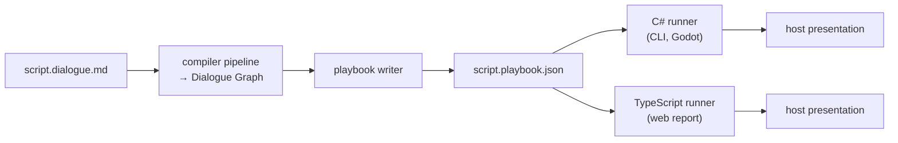
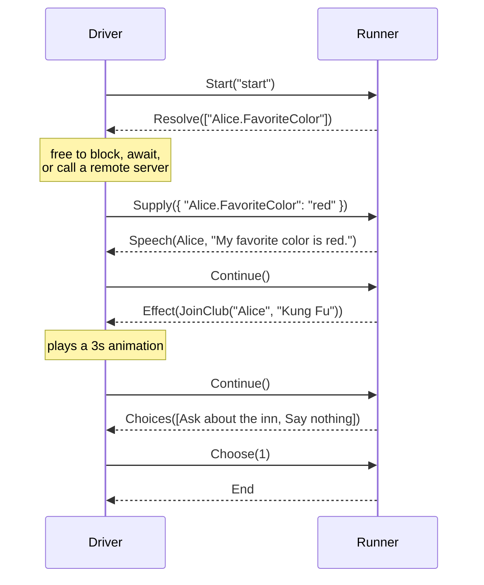
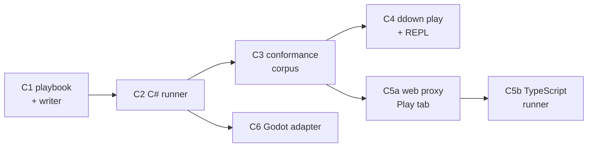

# Dialogue runtime architecture

> [!NOTE]
> Status: **proposed** — an umbrella architecture, not yet implemented. This note
> fixes the cross-cutting shape of everything after the
> [Dialogue Graph](./Dialogue%20Graph.md): the portable **playbook** a compile
> emits, the **runner** that plays one, the **protocol** between a runner and its
> driver, and the **conformance corpus** that keeps more than one runtime honest.
> It settles decisions that would otherwise be re-litigated in every component;
> each component note below then owns its own details.

## Table of contents

- [Goal and scope](#goal-and-scope)
- [Ubiquitous language](#ubiquitous-language)
- [Prior art](#prior-art)
- [The model: compile once, play anywhere](#the-model-compile-once-play-anywhere)
- [The playbook](#the-playbook)
- [Compatibility](#compatibility)
- [The runner](#the-runner)
- [Reading the world](#reading-the-world)
- [State, saves, and history](#state-saves-and-history)
- [Porting](#porting)
- [Key design decisions](#key-design-decisions)
- [Extension points](#extension-points)
- [Components and sequencing](#components-and-sequencing)
- [Testability](#testability)
- [Alternatives not chosen](#alternatives-not-chosen)
- [Open questions and deferred work](#open-questions-and-deferred-work)

## Goal and scope

The compiler ends at a `DialogueGraph`, and that graph is `internal`. Nothing can
yet **ship** a compiled script or **play** one. This note designs the last third
of the project:

1. **Serialize** the graph into a portable, versioned artifact — the *playbook*.
2. **Play** a playbook through a small runner with clean seams into a host.
3. **Keep runtimes honest** with a shared, data-driven conformance corpus.

The governing constraint is that one compiler must serve a **CLI**, the **web
report**, and **Godot**, while each host keeps complete freedom over presentation
— and the host may sit in **another process**, reachable only over a network.
That is the Unix split: the compiler produces a text artifact, and anything that
can read it can play it.

In scope: the artifact's purpose and compatibility policy, the runner's execution
model and protocol, read consistency against external state, what a save holds,
and how many runtimes exist.

Out of scope, each with its own note: every component's internals, exporters to
other engines ([#269](https://github.com/pengzhengyi/dialoguedown/issues/269)),
the compile-time linker
([Cross-File Jump Resolution](./Cross-File%20Jump%20Resolution.md)), and the
configuration surface for capability targeting (see
[Compatibility](#compatibility)).

## Ubiquitous language

| Term                   | Meaning                                                                                                                                         |
| ---------------------- | ----------------------------------------------------------------------------------------------------------------------------------------------- |
| **Script**             | The authored source, a `*.dialogue.md` file. Unchanged.                                                                                         |
| **Playbook**           | The compiled, portable artifact for **one script**: nodes, edges, tables, and a compatibility header. What a compile emits and a runtime loads. |
| **Runner**             | The pure function that advances play: given a playbook, a `PlayState`, and one input, it returns the next state and the events it emitted.      |
| **`PlayState`**        | An immutable value: where play is — position, call stack, effect ordinal, and what input it awaits. It *is* the save.                           |
| **`PlaySession`**      | The stateful shell around the runner: holds the current `PlayState`, talks to the driver, records the transcript.                               |
| **Driver**             | The party that drives a session — a CLI, the report, a game, a debugger. It sends commands and answers reverse requests.                        |
| **World**              | The game state a script asks about. A **role behind the driver**, not a separate protocol party.                                                |
| **Event**              | Something the runner emits: speech, a menu, an effect, the end.                                                                                 |
| **Effect**             | A game call the host performs. Already the graph's word for a `GameCall`.                                                                       |
| **Query**              | A pure read of the world — a guard, a weight, or a value spliced into speech.                                                                   |
| **Transcript**         | The rendered history of a playthrough: what was said, what was offered, what was chosen.                                                        |
| **Capability**         | A named construct a runtime must understand — the unit of compatibility.                                                                        |
| **Conformance corpus** | Language-neutral fixtures every runtime must reproduce.                                                                                         |

Deliberately avoided: *interpreter* and *virtual machine*. Both promise a
bytecode execution engine, and [D1](#d1--the-playbook-is-declarative-not-bytecode)
explains why this project needs neither.

## Prior art

| System                                                                                                                    | What we take                                                                                                                                                                                              | What we avoid                                                                                                |
| ------------------------------------------------------------------------------------------------------------------------- | --------------------------------------------------------------------------------------------------------------------------------------------------------------------------------------------------------- | ------------------------------------------------------------------------------------------------------------ |
| [Ink](https://github.com/inkle/ink)                                                                                       | The pull loop; two independent version lines (`inkVersionCurrent` / `inkVersionMinimumCompatible`, and a separate save-state pair); `StoryState` as one serializable value holding pointer and call stack | Synchronous external functions, and the `lookaheadSafe` flag they force to stop double-invoking side effects |
| [Yarn Spinner](https://github.com/YarnSpinnerTool/YarnSpinner)                                                            | The localization split; `[disabled]` options in its test plans; pre-fetch hints (`PrepareForLinesHandler`)                                                                                                | Push-style handlers, which impose re-entrancy discipline on every host                                       |
| [LSP](https://microsoft.github.io/language-server-protocol/) / [DAP](https://microsoft.github.io/debug-adapter-protocol/) | **Reverse requests** as a named concept, capability negotiation at handshake, and DAP's `Invalidated` "your snapshot is stale" event                                                                      | —                                                                                                            |
| [glTF 2.0](https://registry.khronos.org/glTF/)                                                                            | `extensionsUsed` / `extensionsRequired`: advisory versus **must-understand**; text now, binary later                                                                                                      | —                                                                                                            |
| [CommonMark](https://spec.commonmark.org/)                                                                                | A data-driven conformance suite every implementation runs                                                                                                                                                 | —                                                                                                            |
| [Ren'Py](https://www.renpy.org/)                                                                                          | A capped history log as a first-class feature                                                                                                                                                             | Rollback: even its ambitious implementation cannot undo file I/O and needs opt-outs                          |

The most useful lesson is a negative one. **Neither ink nor Yarn Spinner has a
cross-language conformance suite.** inkjs tracks the C# runtime by hand, and
drift surfaces as user bug reports. A project that plans more than one runtime
should close that gap while there is still only one runtime to make conformant.

## The model: compile once, play anywhere



Three properties define the model:

- **The playbook is the only contract.** A runtime never references the compiler.
  A shipped game embeds a small runner and its playbooks — not Markdig, not
  Tomlyn, not the diagnostics engine.
- **A playbook is per script, never merged.** The
  [linker](./Cross-File%20Jump%20Resolution.md) already settled this: cross-file
  links resolve *by reference*, so a project is a **set** of playbooks plus a
  manifest, and a runner loads the next script on demand. Merging would loop on
  legal reference cycles and destroy incremental recompiles.
- **Presentation belongs to the host.** The playbook carries **structured** speech
  fragments — styled runs, links, images, line breaks — never pre-rendered text.
  Godot renders [BBCode](./BBCode%20Rendering.md), the report renders HTML, the
  CLI renders ANSI, all from the same artifact.

## The playbook

A playbook holds what *playing* needs and nothing else.

```json
{
  "$schema": "./playbook-0.schema.json",
  "playbookVersion": 0,
  "requires": ["core"],
  "uses": [],
  "script": "chapter-01.dialogue.md",
  "entries": { "start": 0 },
  "anchors": { "the-inn": 4 },
  "nodes": [
    {
      "id": 0,
      "kind": "line",
      "speaker": { "name": "Alice" },
      "needs": ["Alice.FavoriteColor"],
      "speech": [
        { "kind": "text", "text": "My favorite color is " },
        { "kind": "query", "key": "Alice.FavoriteColor" },
        { "kind": "text", "text": "." }
      ],
      "out": [{ "kind": "succession", "to": 1 }]
    },
    {
      "id": 1,
      "kind": "choice",
      "ordered": false,
      "needs": ["IsCurious"],
      "out": [
        {
          "kind": "option",
          "to": 2,
          "label": [{ "kind": "text", "text": "Ask about the inn" }],
          "guard": { "kind": "key", "key": "IsCurious" }
        },
        {
          "kind": "option",
          "to": 3,
          "label": [{ "kind": "text", "text": "Say nothing" }]
        }
      ]
    }
  ]
}
```

Three fields carry more weight than they look:

- **`needs`** lists every query key required to leave a node. Because guards and
  interpolations are known at compile time, a runner asks **once per node, in one
  batch** — and a node with no queries costs no round trip at all.
- **`label`** is the option's menu text, compiled rather than discovered. See
  [D7](#d7--options-carry-a-compiled-label).
- **`to`** is a node reference: a **number** for a local node, or a **string** in
  the authored `script#anchor` notation for a scene in another script. The union
  exists from version 0 so every reader handles both shapes. A number is an index
  into `nodes`, validated on load by the invariant `nodes[i].id == i`, which keeps
  local resolution O(1) while the explicit `id` keeps the file readable.

The string form is deliberate: it is **the notation the writer already wrote** —
`=> [Meet Bob](chapter-02.md#meet-bob)` — normalized to a `ScriptId` per the
[linker](./Cross-File%20Jump%20Resolution.md)'s path semantics. One concept keeps
one spelling from source through artifact to diagnostic to debugger. Numbers stay
numbers for local edges because nearly every edge is local, and an integer is
already an index; making those strings would add bytes and a parse to the common
case, and `#4` would collide with a scene slugged from a heading titled "4".

What it deliberately **excludes**:

| Excluded                       | Why                                                                                | Where it goes instead                                 |
| ------------------------------ | ---------------------------------------------------------------------------------- | ----------------------------------------------------- |
| Source spans                   | They churn on every edit and bloat a shipped artifact                              | An opt-in sidecar source map, on the JavaScript model |
| Diagnostics                    | A playbook is only emitted for a clean compile                                     | The compile result                                    |
| Semantic symbols, regions, AST | Compiler internals; welding them to the format makes every refactor a format break | Stay `internal`                                       |
| History and visit counts       | Derived, unbounded, and the host's business                                        | [Transcript](#state-saves-and-history) and the world  |

## Compatibility

A story that plays *wrongly* is worse than one that refuses to play. Unknown
constructs therefore cannot be skipped: unlike most formats, **graceful
degradation is not available to us**, because a dropped guard does not error — it
silently tells the wrong story. That leaves two honest options: refuse, or catch
it at compile time. The design does both.

### Capabilities carry compatibility, not version numbers

A single monotonic version couples every feature together: add one construct, bump
the number, and every old runner refuses **every** playbook — including the ones
that never use it. So capabilities are the primary mechanism.

```text
Load succeeds  ⟺  playbook.requires ⊆ runner.supported
```

Adding detours does not bump the version; it adds the capability `detour`. Old
runners keep playing every playbook that does not use detours. **Compatibility
becomes per-playbook rather than per-release.**

| Change                                   | Example                       | Mechanism                  | Effect on an old runner                             |
| ---------------------------------------- | ----------------------------- | -------------------------- | --------------------------------------------------- |
| New construct                            | `detour`                      | new capability name        | Refuses *only* playbooks that use it                |
| New optional metadata                    | a source-map link             | unknown fields are ignored | No effect                                           |
| Changed meaning of an existing construct | fall-through semantics change | `playbookVersion` bump     | Refuses everything — rare, and near-never after 1.0 |

Following glTF, the header carries **two** lists: `requires` is must-understand,
while `uses` is advisory — present, but a runner that ignores it still plays the
story correctly. Without `uses`, every additive nicety becomes a hard gate.

### Three version coordinates

Semantic versioning versions a package's API; it cannot version a data format,
because a data file has no callers to break. Ink keeps these separate and so do
we:

| Coordinate          | Type       | Moves when                             | Who reads it                       |
| ------------------- | ---------- | -------------------------------------- | ---------------------------------- |
| `playbookVersion`   | integer    | existing semantics change — near-never | runtime authors                    |
| `requires` / `uses` | string set | any new construct                      | the loader, per playbook           |
| package version     | semver     | the library API changes                | game developers, via NuGet and npm |

The compiler **writes** one `playbookVersion`; a runner **accepts a range** and
refuses outside it. Published alongside them is a **compatibility matrix** mapping
library versions to supported capabilities, so a team with a varied fleet asks the
useful question — *does my runtime support `detour` yet?* — rather than comparing
version numbers.

### Compile-time targeting is opt-in

Capabilities fix compatibility at *load* time, but discovering "your shipped
runtime cannot play chapter 7" inside a released game is still terrible. The fix
is to move the failure into the writer's editor, exactly as `LangVersion`,
`--release`, and `browserslist` do.

```toml
# dialogue.toml — both sections optional
[compatibility]
target = ["core", "conditions"]    # ceiling: refuse anything beyond

[features]
detour = true                      # gate: opt into a preview construct
```

These are **inverses** — a target restricts to an older set, a feature flag
unlocks a newer one — but they resolve into one rule:

```text
available(construct) = (construct is stable OR its feature flag is enabled)
                   AND (no target is set    OR its capability ∈ target)
```

Both are **opt-in**, so `ddown` stays plug-and-play: with no configuration the
compiler emits everything stable and `requires` reports what was actually used.
Critically, **targeting is never load-bearing for correctness** — the playbook
always declares `uses`/`requires`, so runtime refusal remains the safety net and
targeting only moves the failure earlier.

Using a gated or out-of-target construct is an **error**, never a warning, for the
same reason degradation is unavailable. It must be a specific, actionable error
that names the construct and the fix, not a generic parse failure.

Initial guidance for the dedicated note:

- **One capability registry** in the core, consumed by the compiler, the target
  check, the feature gate, the runtime's supported set, and the docs — the same
  single-source-of-truth pattern as `UnmodeledMarkdownNames`.
- **`core` is the 1.0 baseline.** Everything shipping at 1.0 is one capability,
  not fifty; new constructs after 1.0 get their own names.
- **Name capabilities after the construct a writer recognizes** —
  `detour`, `random-choice`, `cross-file-jump` — never after a release. Finer
  granularity means old runners reject less.
- **A target takes an explicit capability list** at first; a friendlier version
  alias needs a version-to-capability map that goes stale, so it is deferred.

## The runner

### A functional core and an imperative shell

The runner is a **total transition function over immutable state**. It performs no
I/O, holds no reference to a host, and never calls out.

```csharp
// Functional core — total, deterministic, no I/O, no mutation.
public static StepResult Step(Playbook playbook, PlayState state, DriverCommand command);

public sealed record StepResult(PlayState State, IReadOnlyList<RunnerEvent> Events);
```

`PlayState` declares what it awaits, so `Step` is total and the shell always knows
what may be sent next. `PlaySession` is the imperative shell: it holds the current
state, performs transport, and records the transcript.

Dialogue advances at human speed — a few steps per second, not per frame — so
allocating a small record per step costs nothing measurable. This is the case
where readability wins outright.

### The protocol

Because the core never calls out, every interaction is a message, and the runner
behaves identically whether those messages are method calls, `postMessage` to a
worker, or HTTP across a network.

There are **two parties**: the **driver** (client) and the **runner** (server).
The world is a role *behind* the driver — in a CLI the same program, in a
client/server game an HTTP call the driver makes. LSP and DAP both solve this by
naming the message **direction** rather than inventing a third party, and so do
we.

| Direction       | Kind                | Examples                                                  |
| --------------- | ------------------- | --------------------------------------------------------- |
| driver → runner | **command**         | `Continue`, `Choose(i)`, `Restore(state)`                 |
| runner → driver | **event**           | `Speech`, `Choices`, `Effect`, `ChoiceInvalidated`, `End` |
| runner → driver | **reverse request** | `Resolve(keys)`, answered by `Supply(answers)`            |
| driver → runner | **query**           | `Describe()`, answered with the current location          |

`Resolve` is exactly LSP's `workspace/configuration`: *the server knows what it
needs; the client knows where to find it.*



All waiting — network, animation, a player deliberating — happens *between*
messages, where it belongs. Drivers declare **capabilities** at session start, as
in LSP and DAP, so optional behavior stays optional.

### Describe: the query half

`Step` changes; `Describe` explains. `Describe` is pure — a function of playbook
and state — returning the current node, its properties, and each outgoing edge
with its guard and whether the last snapshot satisfied it. This is what the
[Line Debugger](./Live%20Visualization%20-%20Line%20Debugger%20UI.md) needs to
answer a writer's real question: *why was this edge not taken?*

### Ergonomics: drivers

The protocol is the contract, not the API most hosts should write. The runtime
package ships thin **drivers** that restore an ordinary loop:

- a **synchronous driver** that answers `Resolve` from an in-process world;
- an **asynchronous driver** that awaits one.

CLI and simple Godot hosts use a driver and never see the protocol.

## Reading the world

### The world seam

Because effects are events, the world seam only **reads**. Three questions with
three answers cannot share one stringly method — a guard needs a `bool`, a weight
a number, and interpolation text:

```csharp
public interface IGameWorld
{
    bool IsSatisfied(string key);   // guards
    double GetWeight(string key);   // dynamic weights
    string GetValue(string key);    // speech interpolation
}
```

Above it sits the layer hosts actually use — registration rather than a
hand-written `switch`, as ink and Yarn Spinner both settled on:

```csharp
var world = new GameBindings()
    .OnQuery("Alice.FavoriteColor", () => "red")
    .OnCondition("IsAngry", () => bob.Mood == Mood.Angry);
```

Unbound keys follow an explicit policy, reusing the **Keep / Ignore** vocabulary
already established for
[unmodeled Markdown](./Unmodeled%20Markdown%20Handling.md). The default is
permissive, so a script plays with **no** bindings at all — the property that
makes a preview useful before any game exists, and the same idea as ink's
fallback functions.

`IGameWorld` replaces the placeholder `IGameSystem`, whose `Query`/`Execute` pair
implied it performed work it no longer does. The rename lands with C2 and updates
[game state](../../guide/game-state.md), which documents the placeholder today.

### Read consistency

The world is a store that other actors may write concurrently, so the standard
database vocabulary applies. A per-node `needs` batch is a **snapshot**:

- **within** one node's evaluation — repeatable read, so a menu is internally
  consistent;
- **between** nodes — read committed, so the world may change as the story
  progresses, which is correct and desired.

Honestly stated: this is **snapshot isolation**, which prevents dirty and
non-repeatable reads but permits **write skew**. Serializability is not available
to us and is not worth wanting.

### Choices and stale truth

A menu is checked when it is shown and acted on when the player picks — seconds
later. That is **time-of-check to time-of-use**, and real games hit it: *Baldur's
Gate 3* displays "Dialogue option is no longer valid" because it re-checks the
predicate on selection. No dialogue middleware offers this as a feature, so it is
a gap worth filling.

The mitigation is the HTTP `ETag` / `If-Match` pattern, gated by driver
capability:

| Driver capability                      | Behavior on `Choose`                                                                      |
| -------------------------------------- | ----------------------------------------------------------------------------------------- |
| supplies a version token with `Supply` | Compare tokens. Match → traverse. Mismatch → `ChoiceInvalidated`, re-snapshot, re-present |
| no token                               | **Trust** — traverse on the snapshot                                                      |

Comparing one token is free in the common case, since most games freeze the world
during dialogue. A world that knows when it changed may instead **push**
invalidation, as DAP's `Invalidated` event does.

Revalidation narrows the window; it does not close it. Write skew remains
possible, and that is inherent rather than a defect.

## State, saves, and history

### What the runner keeps

`PlayState` is small, because the host owns the game: a **position**, a **call
stack**, an **effect ordinal**, and the **playbook fingerprint** it belongs to.
The position is a **qualified** node reference — the same `number | string` union
the playbook uses — because once play crosses into another script, a bare index
cannot say *which* playbook it indexes.

The fingerprint turns "loaded a save against a recompiled script" — the classic
way this class of engine corrupts a playthrough — into a clean, loud failure. The
save carries its **own** version number, independent of `playbookVersion`, exactly
as ink versions `StoryState` separately.

**Visit counts stay out.** A host that wants "only once" answers a query it owns;
adding a counter to the core would grow the save and duplicate the world's job.

### Two ways to save

| Shape        | Contents                       | Size | History after load        |
| ------------ | ------------------------------ | ---- | ------------------------- |
| **Snapshot** | `PlayState`                    | O(1) | none — position only      |
| **Journal**  | `PlayLog` — the ordered inputs | O(n) | **regenerated by replay** |

Replaying `(playbook, PlayLog)` reproduces the transcript *and* the current state,
because `Step` is deterministic and supplied answers were recorded. A `PlayLog` is
therefore also a **perfect bug report**: a player sends their log and it replays
exactly. Replay is safe because a replaying driver runs in `Simulate`, so no
effect fires twice.

```text
SaveEnvelope { saveVersion, playbookFingerprint, playState, transcript?, log? }
```

### History is a shell-side fold

A backlog is a standard requirement — Ren'Py ships one, capped by
`config.history_length` (250 by default). But history is **derived** data, so it
belongs in the shell, not in `PlayState`, which would otherwise grow without
bound.

`Transcript` is an optional fold over the event stream, provided by the runtime
package and bounded by a capacity:

```text
TranscriptEntry = Said      { speaker, fragments, nodeRef }
                | Asked     { options[], chosenIndex, nodeRef }
                | Performed { effect, nodeRef }
```

Three details are easy to get wrong:

- **Store resolved fragments.** A line spoken as "…is red" must be *recorded* that
  way. Re-resolving at render time would show today's answer for yesterday's line.
- **Record the menu and the selection.** The roads not taken are most of a
  backlog's value, and all of a writer preview's.
- **Keep fragments, never flat strings.** A backlog is a re-render, so flattening
  would lock in one presentation.

Effects are recorded but filtered at render: a player backlog hides them, the
debugger shows them.

### Effects, restore, and why nothing is compensated

The runner rewinds *itself* for free, because state is a value. Whether the
**world** rewinds with it is the host's business, and the runner must not pretend
otherwise. Two words, deliberately distinguished:

- **Restore** — state and world return together. Deterministic; the transcript
  reproduces. This is save/load.
- **Explore** — state returns but the world did not. Sound only when effects are
  simulated; non-deterministic against a live world.

| Need                                      | Mechanism                               |
| ----------------------------------------- | --------------------------------------- |
| Save and load                             | `PlayState` *is* the save               |
| Explore another branch                    | keep prior states, restore one          |
| Do not fire real effects while previewing | `EffectPolicy: Simulate │ Perform`      |
| Exactly-once effects over a wire          | the **effect ordinal**                  |
| Detect a state/world mismatch             | compare ordinal and fingerprint on load |

The effect ordinal does three jobs for one integer: it is the idempotency key that
stops a retrying transport running `JoinClub` twice, the world-clock that makes "at
effect 47" checkable, and the mismatch detector on load.

**The runner never compensates.** Inverses are usually wrong or meaningless — what
un-does `PlaySound`, and is the inverse of `JoinClub` really `LeaveClub` if the
player was already a member? Compensating transactions are correct only when a
genuine inverse exists, which is a domain property we cannot assume. Ren'Py, the
most ambitious rollback in this space, still cannot undo file I/O and requires
opt-outs. A host that genuinely can roll back its world already has the seam it
needs: restore its own snapshot and hand the runner the matching state and
ordinal.

## Porting

Godot 4 runs .NET, so the C# runner serves **CLI and Godot directly**, the way
`godot-ink` embeds `Ink.Runtime.dll` — no port, no drift. Everything else is a
question of *how far* a porter wants to go, and the answer is a ladder rather than
a binary.

| Level | What a porter does                                                                                                                    | Owner                                          |
| ----- | ------------------------------------------------------------------------------------------------------------------------------------- | ---------------------------------------------- |
| 0     | **Do not port the compiler.** Use `ddown` as a CLI tool — nobody rewrites a compiler in order to consume it                           | this repo                                      |
| 1     | **Thin frontend.** Reimplement presentation only; delegate play to the official C# runner over a socket                               | community; cheap                               |
| 2     | **Subprocess REPL.** Drive the runner over stdio, the way a debugger like `pdb` is driven. **The recommended route for most porters** | this repo ships the REPL                       |
| 3     | **Full port.** For engines such as Unreal, where a bundled runtime beats subprocess latency. Conform to the specification             | **community-owned; never an official concern** |

What makes the ladder work is that levels 1 and 2 are **the same message stream
over different transports** — a socket, or stdin and stdout. Only level 3
reimplements the state machine, and that is exactly what the conformance corpus
exists to verify. **The protocol is the portability strategy.**

This repository provides the full C# toolchain as the reference implementation,
plus the visualization client. Support beyond C# and TypeScript is out of scope
here.

### The web client is staged

The visualization client arrives in two stages rather than as one port:

| Stage                           | How it plays                                                     | What works                                                                                                                                        |
| ------------------------------- | ---------------------------------------------------------------- | ------------------------------------------------------------------------------------------------------------------------------------------------- |
| **Proxy** (level 1)             | Talks to the C# runner over the live server's existing transport | The served report — including the [Line Debugger](./Live%20Visualization%20-%20Line%20Debugger%20UI.md), which already assumes a server transport |
| **TypeScript runner** (level 3) | Plays a playbook in the browser                                  | The **exported** report, which has no server, becomes fully playable                                                                              |

The staging matters because the exported single-file report is static: a proxy
cannot serve it, so the TypeScript runner is what makes a shipped playbook
playable offline. Until then the exported report simply has no Play tab.

### Conformance

The insurance against drift is the **conformance corpus** — a `PlayLog` plus the
transcript it must produce:

```json
{
  "name": "a false guard marks a player option unavailable",
  "playbook": { "…": "…" },
  "inputs": [ { "supply": { "IsCurious": false } }, "continue", { "choose": 1 } ],
  "transcript": [
    { "said": { "speaker": "Alice", "text": "My favorite color is red." } },
    { "asked": [ { "label": "Ask about the inn", "available": false },
                 { "label": "Say nothing", "available": true } ] }
  ]
}
```

A runtime is conformant when it reproduces every transcript. That turns a level-3
port from an act of faith into a bounded, verifiable exercise — the gap CommonMark
closed and ink never did. With one official runner the corpus is still worth its
keep as a regression suite and as the format's executable specification; the day a
community port appears, it becomes the only thing standing between that port and
silent divergence.

## Key design decisions

### D1 — The playbook is declarative, not bytecode

Ink and Yarn Spinner compile to instruction streams because both embed a scripting
language with variables, arithmetic, and expressions. **DialogueDown has none.** A
`Condition` is a key the world answers; a `ChoiceWeight` is a number or a key.

So the artifact is a **declarative node-and-edge document** and the runner is a
**graph walker with a cursor** — no eval stack, no opcodes, no variable table.
That single fact makes a second runtime cheap, and it is worth protecting: a future
construct that would require a stack machine deserves scrutiny first.

### D2 — JSON, with a formal schema

JSON parses natively in the browser and in Godot, and `System.Text.Json` is in the
BCL, so the core takes **no new dependency**. `System.Text.Json` polymorphism
(`[JsonDerivedType]`) round-trips the node and edge unions with no custom
converters; the discriminator is spelled **`kind`**, because the format is a public
contract rather than a .NET serialization detail. JSON Schema then gives editor
autocomplete and CI validation, and `jq` gives shell inspection — neither of which
any alternative offers.

**KDL is the strongest counterargument**: designed for exactly this shape, more
readable, better diffs. It loses because there is no KDL schema standard, which
costs the validation a public contract needs, and its parser ecosystem is weaker in
both our languages. **proto3** — Yarn Spinner's choice — buys compactness and field-number
versioning at the price of a `protoc` build dependency and the "any language can
just parse it" property that keeps future runtimes cheap. Following glTF and Yarn,
a binary encoding stays available later behind a CLI flag, because the writer is a
seam.

No graph interchange language fits. DOT, GraphML, GEXF, TGF, GML, and Mermaid are
**topology-first and payload-minimal**; our playbook is the opposite. Cypher and
GQL are query languages, not file formats, and RDF is a knowledge model. JSON Graph
Format is JSON plus a naming convention, so it adds nothing to adopt.

### D3 — Capabilities carry compatibility

See [Compatibility](#compatibility). Version numbers gate releases; capabilities
gate playbooks, which is the granularity that keeps old runtimes useful.

### D4 — The runner is a functional core

The decisive test is dependency direction: the core must not call the shell. An
async core that `await`s the world inverts it, entangling every decision with I/O.
A pure `Step` over immutable state keeps the dependency one-way, and yields save,
restore, replay, and deterministic tests as consequences rather than features.

### D5 — Two parties; `Resolve` is a reverse request

The driver both sends commands and answers requests. LSP and DAP show this is
normal and that the fix is to name the **direction**, not invent a third party. It
also keeps deployment free: the runner may sit with the UI and query a remote
world, or sit with the server and stream events to a thin client.

### D6 — Queries are pure reads; effects change the world

Command–query separation at the world boundary, and it settles several questions at
once:

|                      | **Query** (read)             | **Effect** (write)              |
| -------------------- | ---------------------------- | ------------------------------- |
| Purity               | must not change the world    | changes the world               |
| Cardinality          | may be asked 0..n times      | **exactly once**                |
| Ordering             | order-independent, batchable | strictly ordered                |
| On restore           | re-ask freely                | must not re-run                 |
| On transport failure | retry is safe                | needs an ack or idempotency key |

Batching reads is therefore legitimate and batching effects would not be. A world
that implements a query by mutating breaks the runner's guarantees; that contract
can be documented and conformance-tested, not enforced.

### D7 — Options carry a compiled label

An option's arm is a block body, so a runner could derive its menu label by peeking
at the option's first node. Ink does exactly that and pays for it: lookahead can
invoke a side-effecting external function twice, which is why `BindExternalFunction`
needs `lookaheadSafe`.

The compiler already knows the text, so the playbook carries an explicit `label`
and the runner never peeks. Combined with [D6](#d6--queries-are-pure-reads-effects-change-the-world),
presenting a menu is pure by construction even when a label contains a query. This
restores the `Label` the [Dialogue Graph](./Dialogue%20Graph.md) note specified on
`Option`.

### D8 — A menu shows unavailable options

A guarded option that fails its guard is reported **unavailable**, not filtered out.
Hiding versus disabling is presentation policy, which
[Conditional Choice](./Conditional%20Choice.md) leaves to the runtime — and a runner
that drops the option removes the host's ability to choose. Yarn Spinner encodes the
same distinction as `[disabled]` in its test plans.

### D9 — The runner restores; it never compensates

See [effects and restore](#effects-restore-and-why-nothing-is-compensated).

### D10 — History is a shell-side fold

A transcript is derived from the event stream, so it is recomputable and does not
belong in core state. Keeping it out holds the runner lean and the save bounded,
while a standard `Transcript` shape still lets conformance fixtures assert it.

## Extension points

Everything the notes and issues already promise, and the insurance each needs in
version 0. The cost column is what a retrofit would break.

| Expansion                     | Source                                                       | Retrofit cost                   | Insurance in v0                                                                                                          |
| ----------------------------- | ------------------------------------------------------------ | ------------------------------- | ------------------------------------------------------------------------------------------------------------------------ |
| Cross-file jumps              | [#59](https://github.com/pengzhengyi/dialoguedown/issues/59) | None — the widening is additive | A playbook using them declares `cross-file-jump`, so an older runner refuses it whole rather than misreading a reference |
| Negation, expressions         | [Conditional Jump](./Conditional%20Jump.md) D5               | Every playbook                  | A guard is an object with a `kind`, never a bare string, so `not` and `and` are additive                                 |
| Detour and return             | [Progression Order](./Progression%20Order.md)                | Every save file                 | `PlayState` carries a **call stack** from v0, though nothing pushes to it yet                                            |
| `#START`, cross-file entry    | [Progression Order](./Progression%20Order.md)                | The runner API                  | `entries` is a **table**, not a single field                                                                             |
| Hide versus disable an option | [Conditional Choice](./Conditional%20Choice.md)              | The host API                    | [D8](#d8--a-menu-shows-unavailable-options)                                                                              |
| Weight re-rolls on replay     | [Random Choice](./Random%20Choice.md)                        | Saves and conformance           | Entropy is a seam; the draw cursor lives in `PlayState`                                                                  |
| Localization                  | —                                                            | Every script                    | An optional `lineId` is reserved in the schema and left unpopulated; the identity scheme gets its own note               |
| Binary encoding               | —                                                            | Nothing                         | The writer is a seam; text and binary differ only in encoding                                                            |

Anything this table misses is still recoverable through
[capabilities](#compatibility) — an old runner refuses rather than misplays. That
is what the header buys in version 0.

## Components and sequencing



| #   | Component                            | Delivers                                                            | Issues                                                                                                                                |
| --- | ------------------------------------ | ------------------------------------------------------------------- | ------------------------------------------------------------------------------------------------------------------------------------- |
| C1  | **Playbook format and writer**       | The schema, the compatibility header, and `ddown compile --output`  | [#46](https://github.com/pengzhengyi/dialoguedown/issues/46), part of [#269](https://github.com/pengzhengyi/dialoguedown/issues/269)  |
| C2  | **C# runner**                        | `Step`, `PlayState`, the protocol, drivers, `IGameWorld`, saves     | [#45](https://github.com/pengzhengyi/dialoguedown/issues/45); unblocks [#217](https://github.com/pengzhengyi/dialoguedown/issues/217) |
| C3  | **Conformance corpus**               | Fixtures plus a harness, owned as data                              | —                                                                                                                                     |
| C4  | **`ddown play` and the REPL**        | A terminal player, plus a raw stdio mode another language can drive | [Interactive Playthrough](./Interactive%20Playthrough.md) A                                                                           |
| C5a | **Web proxy Play tab**               | The served report plays through the C# runner (level 1)             | [Interactive Playthrough](./Interactive%20Playthrough.md) B, [#63](https://github.com/pengzhengyi/dialoguedown/issues/63)             |
| C5b | **TypeScript runner**                | The exported report plays a playbook offline (level 3), held to C3  | —                                                                                                                                     |
| C6  | **Godot adapter and sample**         | BBCode presentation and a demo scene                                | —                                                                                                                                     |
| C7  | **Compatibility and feature gating** | `[compatibility]` and `[features]`, the registry, diagnostics       | —                                                                                                                                     |
| C8  | **Exporters**                        | Yarn, DOT, and Mermaid projected from the playbook                  | rest of [#269](https://github.com/pengzhengyi/dialoguedown/issues/269)                                                                |

`DialogueDown.Runtime` ships as its own package that **must not reference the
compiler**, guarded by an architecture test — the dependency rule that makes
[#217](https://github.com/pengzhengyi/dialoguedown/issues/217) worth adopting.

> [!IMPORTANT]
> The format stays **unstable at `playbookVersion: 0`** until a runner actually
> plays it. Designing a format with no consumer is how formats go wrong; version
> `1` freezes only once C2 ships, which buys the freedom to fix what the first
> runner uncovers with no migration story.

## Testability

| Level         | What it covers                                                                                                     |
| ------------- | ------------------------------------------------------------------------------------------------------------------ |
| Unit          | Writer and reader round-trips; one test per node and edge kind; each guard and weight path.                        |
| Compatibility | **Negative** fixtures: an unknown `requires` must be refused; an unknown `uses` must still play.                   |
| Golden        | A committed transcript per example script, giving `examples/*.dialogue.md` the regression coverage it lacks today. |
| Conformance   | The corpus, run by **every** runtime in its own language.                                                          |
| Property      | With a deterministic core: no input sequence leaves state invalid; every playthrough terminates.                   |

A transcript is the right golden file because it is **semantic**. Renumbering every
node or restructuring the graph internally leaves it byte-identical unless
*behavior* changed — unlike a DOT dump, where a one-line edit churns thousands of
positional lines. Because the core is pure, a failing fixture also *shrinks*: the
input list can be minimized to the smallest reproduction.

The corpus doubles as the format's executable specification, so C1's prose can
never quietly drift from what the runtimes do.

## Alternatives not chosen

- **Serialize `DialogueGraph` directly.** Fastest to build, and exactly the
  coupling [#269](https://github.com/pengzhengyi/dialoguedown/issues/269) warns
  against: the format would inherit `SourceSpan`, `SpeakerSymbol`, and every future
  refactor of compiler internals as a breaking change.
- **One merged bundle per project.** Contradicts the linker's settled
  link-by-reference model, loops on legal reference cycles, and destroys
  incremental recompilation.
- **An async core.** Inverts the FCIS dependency direction, taxes every runtime for
  a need most hosts do not have, and still fails to decouple the runner from its
  host.
- **Push-style handlers (Yarn Spinner).** Impose re-entrancy discipline on every
  host and fight `async` in both JavaScript and Godot.
- **Effect compensation.** See [D9](#d9--the-runner-restores-it-never-compensates).
- **One .NET runtime everywhere, via WebAssembly.** Removes the port and all drift,
  but adds megabytes to a single-file report measured in kilobytes.
- **A GDScript runner.** Unnecessary while Godot targets .NET, and a level-3 port
  is community-owned by policy; the corpus keeps the door open at a known cost.

## Open questions and deferred work

- **Line identity for localization.** A node reference is positional and therefore
  *not* a localization key. A scheme stable across edits — Yarn writes `#line:`
  tags back into the source — is a feature, not a field, and needs its own note.
- **Entropy: specified generator or supplied values?** A specified generator costs
  one round trip fewer but must match bit-for-bit across languages; host-supplied
  values are simpler to conform. Decide in C2.
- **Detour syntax and return boundary** stay owned by
  [Progression Order](./Progression%20Order.md); this note only reserves the call
  stack the construct will need.
- **Consolidating the condition notes** into one *Conditions* note, as
  [Conditional Choice](./Conditional%20Choice.md) suggests, would give C2 a single
  reference for guard evaluation.
