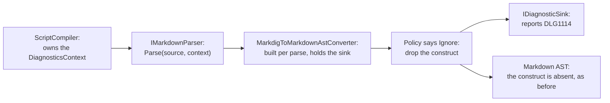

# Dropped Markdown diagnostic

> [!NOTE]
> Status: **proposed**
> ([issue #227](https://github.com/pengzhengyi/dialoguedown/issues/227)).
> Notes each Markdown construct the front end drops, so a table or divider that
> never reaches the script does not disappear without a word.

## Table of contents

- [Goal and scope](#goal-and-scope)
- [Functionality checklist](#functionality-checklist)
- [Ubiquitous language](#ubiquitous-language)
- [Writer-facing behavior](#writer-facing-behavior)
- [Where the knowledge lives](#where-the-knowledge-lives)
- [Architecture](#architecture)
- [Interfaces and responsibilities](#interfaces-and-responsibilities)
- [Key design decisions](#key-design-decisions)
- [Error and boundary cases](#error-and-boundary-cases)
- [Integration](#integration)
- [Testability](#testability)
- [Alternatives not chosen](#alternatives-not-chosen)

## Goal and scope

DialogueDown models the Markdown a dialogue needs. Everything else is an
**unmodeled construct**, and an
[`IUnmodeledNodeHandlingPolicy`](./Unmodeled%20Markdown%20Handling.md) decides
whether it survives as raw speech text or is **dropped**. By default a code
block, a thematic break, and a table are dropped — they are authoring aids, not
speech.

Dropping is the right behavior; doing it in total silence is not. A writer who
lays out a table of rumors, or separates two beats with `---`, gets a script
where that content simply is not there, with nothing to explain why.

This note makes the front end **say what it dropped**: one `Info` diagnostic per
dropped construct, naming the kind and pointing at it.

**In scope:** an `Info` diagnostic reported by the Markdown front end, widening
the parser seam so it can report, and the reference entry.

**Out of scope:** changing *what* is dropped (the default policy is unchanged);
reading the policy from `dialogue.toml`, which is
[#47](https://github.com/pengzhengyi/dialoguedown/issues/47); and the dangling
arrow, which shipped as
[Dangling Arrow Diagnostic](./Dangling%20Arrow%20Diagnostic.md).

## Functionality checklist

- [ ] Add a diagnostic with `Info` severity for a dropped unmodeled construct.
- [ ] Report it from the **Markdown front end**, where the construct is dropped.
- [ ] Name the construct in the message in a writer's words ("table", not `Table`).
- [ ] Point the diagnostic at the dropped construct's own span.
- [ ] Report **block** and **inline** drops alike.
- [ ] Report **every** drop, including several of the same kind.
- [ ] Do **not** report a construct the policy keeps as raw text.
- [ ] Do **not** report front matter or an HTML comment, which never reach the
      policy.
- [ ] Keep the dropping behavior itself unchanged.
- [ ] Widen the `Syntax` category summary to cover Markdown that never
      becomes dialogue.
- [ ] Add the generated error-code reference entry.

## Ubiquitous language

| Term | Meaning |
| --- | --- |
| **Unmodeled construct** | Markdown DialogueDown does not model as dialogue, classified as an `UnmodeledNodeKind`. |
| **Handling** | What the policy decides for a kind: `AsRawText` or `Ignore`. |
| **Drop** | Carrying out `Ignore` — the construct never reaches the script. |
| **Front end** | The Markdown stage: `IMarkdownParser` and the Markdig-to-AST converter behind it. |

## Writer-facing behavior

Given a script:

```markdown
# The Tavern

| Rumor | Source |
| --- | --- |
| The bridge is out | The miller |

Innkeeper: Ask around.
```

The compiler reports `DLG1114` — title **Markdown left out of the script**,
category `Syntax`, severity `Info`:

```text
scene.dialogue.md(3,1): info DLG1114: A table is not dialogue, so it was left
out of the script. That is expected for notes and diagrams; write it as
dialogue text if it should be spoken.
```

`Info` is deliberate. Unlike a dangling arrow, a drop is usually exactly what
the writer wanted — a code block can never be speech, so dropping it is the
whole point. The compiler cannot read intent, so it states the fact without
implying a mistake. This is the catalog's first `Info`, which is what the
severity was defined for: "a neutral note".

## Where the knowledge lives

`MarkdigToMarkdownAstConverter` consults the policy and drops a construct by
returning `null` for it, at two sites — one for blocks, one for inlines:

```csharp
private MarkdownBlock? HandleUnmodeledBlock(MarkdigBlock block) =>
    HandlingForBlock(block) switch
    {
        UnmodeledNodeHandling.Ignore => null,
        _ => FlattenBlock(block), // AsRawText: keep the construct as raw text.
    };
```

The converter is already built per parse, holding the source and the policy, so
it is the natural place to hold a sink as well. What it lacks is a way to be
given one: `IMarkdownParser.Parse` takes only the source.

## Architecture

The front end becomes a diagnostic **producer**, joining the transpiler and
desugar. The context reaches it the same way it reaches every other stage.



## Interfaces and responsibilities

| Type | Responsibility | Collaborators |
| --- | --- | --- |
| `DiagnosticCatalog` | Owns the `DLG1114` descriptor. | — |
| `IMarkdownParser` | Widened to `Parse(string, DiagnosticsContext)`, matching the other stages. | `ScriptCompiler` |
| `MarkdigMarkdownParser` | Passes the compilation's sink to the converter it already builds per parse. | `MarkdigToMarkdownAstConverter` |
| `MarkdigToMarkdownAstConverter` | Reports each construct as it drops it. | `IUnmodeledNodeHandlingPolicy`, `IDiagnosticSink` |
| `UnmodeledNodeKind` naming | Maps a kind to the words a writer would use. | — |

## Key design decisions

### DD1 — Widen the parser seam rather than return a record

`IMarkdownParser.Parse` grows a `DiagnosticsContext`, exactly like
`IScriptTranspiler.Transpile` and `IScriptDesugarer.Desugar`. The front end then
reports for itself instead of handing back a list of drops for `ScriptCompiler`
to translate.

The alternative — returning the dropped constructs as data on the parse result —
keeps `Parse` a pure function, which is genuinely attractive for a stage whose
job is to isolate a third-party library. It was rejected because it makes the
front end the one stage that cannot report, forces a second type to carry the
record, and puts knowledge of the front end's internals in the compiler.

The churn is contained: tests reach the parser through
`MarkdigMarkdownParserTestBase` and `DiagnosticsContextFactory`, which exists so
"the stage signature change touches only this file".

### DD2 — One code, with the kind as a message argument

A single `DLG1114` carries the kind as `{0}` rather than a code per kind
(`DLG1114` table, `DLG1115` code block, …). A writer looks up "why did my
Markdown vanish" once, and a per-kind code would multiply the catalog every time
`UnmodeledNodeKind` grows.

The kind is stored as a message argument, not baked into a formatted string, so
the message text stays a rendering concern — the convention every other
diagnostic follows.

### DD3 — Info, not Warning

A drop is usually intended, so a warning would nag by design: every code block
in every script would raise one. `Info` states what happened and leaves the
judgment to the writer. Nothing about the compile changes — `Info` never affects
`HasErrors` or an exit code.

### DD4 — Report inline drops too

The converter drops inlines as well as blocks, though the default policy keeps
every inline kind as raw text. Reporting both sites means a project that
configures the policy through [#47](https://github.com/pengzhengyi/dialoguedown/issues/47)
gets the same account of its inline drops, with no second pass over this code.

### DD5 — `Syntax`, with the category summary widened

The diagnostic belongs to `Syntax` (`DLG1xxx`). That category's summary is
narrower than the category itself has become — "a line's surface does not parse
as intended" describes a malformed line, whereas a dropped table is well-formed
Markdown that simply is not dialogue.

Rather than invent a fourth category for a single diagnostic, the summary is
widened to cover both: the script's **surface** — text that does not parse as
intended, or Markdown that never becomes dialogue. `Syntax` is already the home
for surface-level, pre-analysis findings, which is exactly what this is, and a
new category would fragment the `DLG####` numbering for no gain to a reader.

The summary lives in two places that must agree: the `DiagnosticCategory` enum's
documentation and the section header rendered onto the error-code page.

## Error and boundary cases

| Case | Behavior |
| --- | --- |
| A table, code block, or `---` divider | Dropped by the default policy. One `Info` at the construct. |
| Several drops in one document | One `Info` each, in source order. |
| A construct the policy keeps as raw text | Not dropped, so nothing is reported. |
| YAML front matter | Skipped before the policy is consulted. Not a drop, and not reported. |
| An HTML comment | Skipped before the policy is consulted. Not a drop, and not reported. |
| A dropped construct inside a list item or blockquote | Reported — the converter recurses into nested blocks. |
| An empty document | Nothing to drop, nothing reported. |

## Integration

- **Compilation modes.** `Info` never halts a compile, so `ScriptCompiler` needs
  no new checkpoint. The front end runs before the transpile checkpoint, so its
  notes are already collected when an early halt renders them.
- **CLI.** The errata renderer already maps `Info`; this is the first diagnostic
  to exercise that path.
- **Report and LSP.** Flow through the shipped diagnostics overlay and
  projection, which style `Info` already.
- **Docs.** The generated error-code reference gains a `DLG1114` entry, and its
  `Syntax` section summary is widened per
  [DD5](#dd5--syntax-with-the-category-summary-widened).

## Testability

- **Unit — converter:** each dropped kind reports once, with the kind named and
  the span pointing at the construct; a kept construct reports nothing.
- **Unit — exclusions:** front matter and an HTML comment report nothing.
- **Unit — nesting:** a drop inside a list item or blockquote is reported.
- **Integration — pipeline:** compiling a script with a table surfaces exactly
  one `DLG1114`, and the compile still succeeds.
- **Docs test:** the reader-facing example is compiled, so the documented
  triggering script must actually report `DLG1114`.

## Alternatives not chosen

| Alternative | Why not |
| --- | --- |
| Return the drops as data and report from `ScriptCompiler` | Makes the front end the only stage that cannot report, and moves its internals into the compiler ([DD1](#dd1--widen-the-parser-seam-rather-than-return-a-record)). |
| A code per dropped kind | Multiplies the catalog as `UnmodeledNodeKind` grows, for one question a writer asks once ([DD2](#dd2--one-code-with-the-kind-as-a-message-argument)). |
| Warning severity | Fires on every deliberate authoring aid ([DD3](#dd3--info-not-warning)). |
| Keep the construct in the AST and report downstream | The point of the policy is that dropped material never reaches the script; carrying it further would undo that. |
