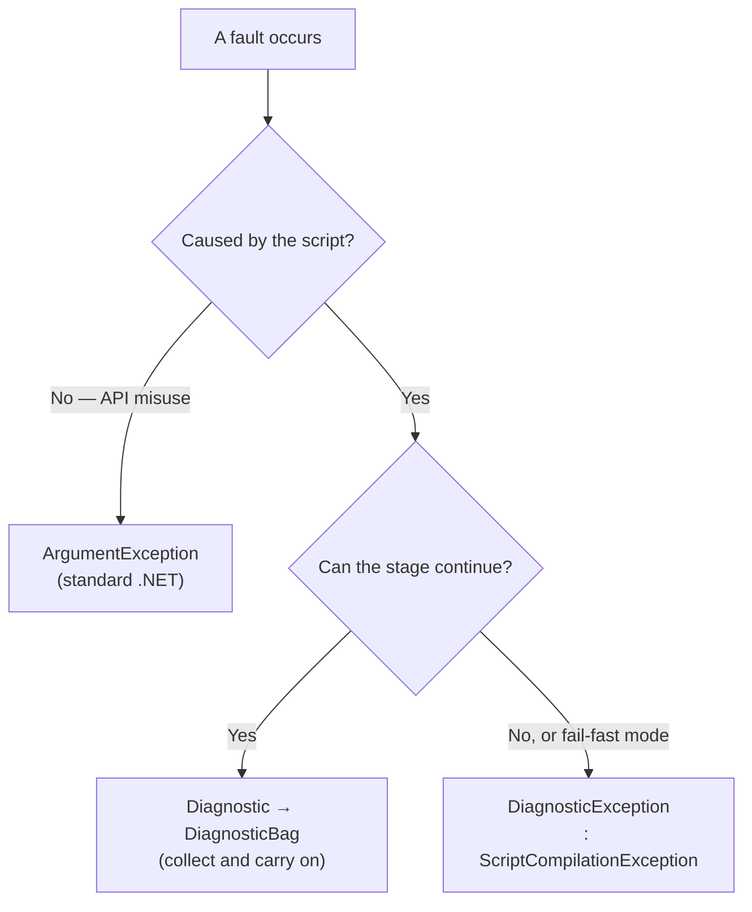

# Implementation note: Error model

> [!NOTE]
> Status: **implemented**. This note records the cross-cutting convention every
> component follows when something goes wrong. It is the *convention*; the
> [Diagnostics and Validation](./Diagnostics%20and%20Validation.md) note is the
> deep design of the machinery that carries it.

The compiler lowers a script through stages — **source → Markdown AST → Dialogue
AST → desugared AST → semantic model**. A fault can occur at any of them, and both
a script author and a calling game need to tell *what kind* of fault happened and
*where*.

## Table of contents

- [Three channels](#three-channels)
- [Principles](#principles)
- [The diagnostic channel](#the-diagnostic-channel)
- [The throw channel](#the-throw-channel)
- [Domain faults vs usage errors](#domain-faults-vs-usage-errors)
- [Every fault carries a location](#every-fault-carries-a-location)
- [Message conventions](#message-conventions)

## Three channels

Faults are partitioned by whether the compiler can **keep going**, not by which
stage raised them. That is the single most important thing to know here.

| Channel | For | Carrier |
| --- | --- | --- |
| **Collect** | A recoverable, author-facing problem — a malformed jump, a dangling `=>`, an unresolved jump target. Compilation continues so the author sees every problem at once. | a `Diagnostic` in a `DiagnosticBag` |
| **Throw** | An unrecoverable fault — a stage genuinely cannot build its artifact — and every fault under a fail-fast compile mode. Rare by design. | `ScriptCompilationException`, usually a `DiagnosticException` |
| **Standard .NET** | A developer misusing the API: a `null` argument, a broken AST invariant. Not a script problem at all. | `ArgumentException` and friends |

Collecting is the **default** path for author-facing problems. A script with five
mistakes should report five diagnostics, not stop at the first.

## Principles

- **Two axes.** Classify every script fault by **category** (`Syntax` — the text
  does not parse as intended; `Semantic` — it parsed but does not mean anything
  valid; `Style` — valid but worth a note) and by **severity** (`Info`,
  `Warning`, `Error`).
- **Syntax is not semantics.** They are distinct categories so tools and readers
  can react differently.
- **One base to catch them all.** Every domain fault that throws derives from
  `DialogueDownException`, so a caller can catch broadly or narrowly.
- **Locate everything.** Every script fault carries a `SourceSpan`.
- **Fail with intent.** Messages say what is wrong, where, and how to fix it —
  never a bare "parse error".
- **Usage errors are not domain faults.** Programmer mistakes use standard .NET
  exceptions and stay outside this model.

## The diagnostic channel

A `Diagnostic` is the structured record of one problem: a `DiagnosticDescriptor`
(its stable code, title, category, and default severity), the `SourceSpan` it
occurred at, and any message arguments. Stages report into an `IDiagnosticSink`
threaded through the pipeline by a `DiagnosticsContext`; a `DiagnosticBag`
collects them.

Every diagnostic has a **stable code** in the `DLG####` namespace, declared once
in `DiagnosticCatalog`. The ranges group codes by origin:

| Range | Origin |
| --- | --- |
| `DLG1###` | The Markdown front end and the transpiler — surface syntax |
| `DLG2###` | Desugar and the semantic analyzer — meaning and resolution |
| `DLG3###` | Configuration and project loading |

Codes are a public contract: the user-facing
[error-code reference](../../guide/error-codes.md) documents each one, so a code
must not be renumbered or repurposed once released.

Because the model is offset-based, rendering a diagnostic to a line and column is
a separate concern, handled by a `LineMap` at the surface that displays it. See
[CLI Diagnostic Rendering](./CLI%20Diagnostic%20Rendering.md) for the terminal
projection and [Diagnostics Overlay](./Diagnostics%20Overlay.md) for the editor
one.

## The throw channel

Two exception types are all this needs:

| Type | Role |
| --- | --- |
| `DialogueDownException` | Abstract base for every domain fault. Catch it to handle any DialogueDown error broadly. |
| `ScriptCompilationException` | Abstract, derives from the base, and carries the `SourceSpan` of the offending text. |
| `DiagnosticException` | The concrete throw: it wraps a whole `Diagnostic`, so a caller gets the code, span, and arguments rather than a bare string. |

Wrapping the diagnostic rather than flattening it to a message is what keeps the
two channels honest — a fail-fast compile and a collecting compile report the
*same* structured problem, so a caller can render either identically.

## Domain faults vs usage errors

| Situation | Raised as | Why |
| --- | --- | --- |
| A script has a malformed jump, an unknown speaker, or a dangling `=>` | a collected `Diagnostic` | The author can fix it, and should see every such problem at once. |
| A stage cannot produce its artifact at all, or the compile mode is fail-fast | `DiagnosticException` | Nothing further is meaningful to compute. |
| An AST invariant is violated in code — a heading level outside 1–6, an empty text run, a non-positive span length | `ArgumentException` / `ArgumentOutOfRangeException` | An internal construction bug, caught by tests, not something an author can cause. |

Rule of thumb: if a **script author** can trigger it by writing a bad
`.dialogue.md`, it belongs to the diagnostic channel. If only a **developer** can
trigger it by misusing the API, it is a standard argument exception.

## Every fault carries a location

Both channels locate a problem with a `SourceSpan` — a start offset and a length
into the original source, the same type every AST node carries. Producers report
with spans they already hold, and nothing computes a line or column on the hot
path; that projection happens once, at the surface that renders it.

## Message conventions

A good message answers three questions: **what** is wrong, **where**, and **how**
to fix it.

- Lead with the problem, not the mechanics ("jump target not found", not
  "null reference in ResolveJump").
- Name the **offending token** and its location.
- Suggest a fix, or show the expected form when it is short.
- Use plain language an author understands; avoid internal type names.

| Weak | Strong |
| --- | --- |
| `Invalid jump.` | `A jump must be '=> [label](target)'; found '=> play-tennis' with no link.` |
| `Unknown speaker.` | `Unknown speaker 'Alicia' — declare it inline or add it to dialogue.toml (did you mean 'Alice'?).` |
| `Bad jump.` | `Jump target '#play-tennis' does not match any section heading in this file.` |
