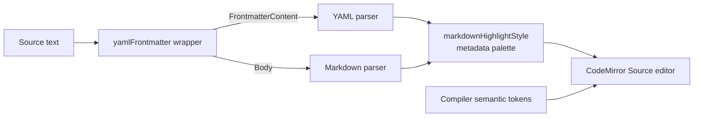

# Front Matter Source Highlighting

> [!NOTE]
> Status: **implemented** ([issue #264](https://github.com/pengzhengyi/dialoguedown/issues/264)).
> Teach the Source editor that a script may begin with YAML front matter, so metadata no longer
> reads as dialogue-shaped Markdown.

## Table of contents

- [Goal and scope](#goal-and-scope)
- [Functionality checklist](#functionality-checklist)
- [Ubiquitous language](#ubiquitous-language)
- [Writer-facing behavior](#writer-facing-behavior)
- [Architecture](#architecture)
- [Interfaces and responsibilities](#interfaces-and-responsibilities)
- [Key design decisions](#key-design-decisions)
- [Error and boundary cases](#error-and-boundary-cases)
- [Integration](#integration)
- [Testability](#testability)
- [Alternatives not chosen](#alternatives-not-chosen)

## Goal and scope

The compiler and Preview already agree that a canonical leading `--- … ---` block is
**front matter**: metadata about the script, not dialogue. The Source editor alone configures
plain `markdown()`, whose parser reads the opening fence as ordinary Markdown and the YAML keys as
paragraph text.

This component gives CodeMirror the same document shape the writer sees: optional YAML front
matter followed by a Markdown body. Front matter receives YAML syntax highlighting and muted
delimiter lines; the body keeps the existing Markdown and compiler-projected DialogueDown
highlighting.

**In scope:** the canonical front-matter syntax already rendered by Preview; immediate YAML
highlighting, indentation, comments, and folding in Source; preservation of Markdown body
behavior; focused unit and browser regressions; and the committed report bundle.

**Out of scope:** changing compiler or Preview behavior; validating YAML as project
configuration; making front matter part of `dialogue.toml`; supporting every lenient delimiter
Markdig accepts; and projecting front matter from the compiler.

## Functionality checklist

- [x] Add the official `@codemirror/lang-yaml` package as a direct frontend dependency.
- [x] Replace plain `markdown()` with `yamlFrontmatter({ content: markdown() })`; do not install
      Markdown support a second time.
- [x] Parse canonical front matter at the start of the document, with the official parser's
      recoverable behavior while a closing fence is incomplete.
- [x] Highlight front-matter delimiters as metadata and its content as YAML.
- [x] Reuse the report's existing theme variables for YAML keys, values, comments, and punctuation.
- [x] Preserve Markdown headings, links, lists, folding, and compiler-projected semantic tokens in
      the body.
- [x] Preserve front-matter-aware Preview rendering and source/preview scroll synchronization.
- [x] Leave documents without front matter unchanged.
- [x] Keep malformed or unterminated front matter editable through the YAML parser's recovery.
- [x] Rebuild and commit `web/dist/report.html`.

## Ubiquitous language

| Term | Meaning |
| --- | --- |
| **Front matter** | An optional YAML metadata region at the start of a dialogue script, enclosed by canonical `---` lines. |
| **Delimiter** | The opening or closing line containing exactly three dashes. |
| **Body** | The Markdown dialogue source after the optional front matter. |
| **Source language** | The CodeMirror language support that parses front matter as YAML and the body as Markdown. |
| **Canonical syntax** | An opening `---` at offset 0 and a later closing `---`, each alone on its line, using LF or CRLF. |

## Writer-facing behavior

Given:

```markdown
---
title: Scene 1
tags: [intro, tutorial]
draft: true
---
# Arrival

Alice: Hello.
```

Source reads as two regions:

| Region | Presentation |
| --- | --- |
| `---` delimiter lines | Muted metadata punctuation |
| `title`, `tags`, `draft` | YAML property names |
| strings, arrays, and booleans | YAML values using the existing report palette |
| YAML comments | Muted italic comments |
| `# Arrival` onward | Existing Markdown plus compiler-projected DialogueDown semantics |

Front matter is **metadata**, not ignored unmodeled Markdown. It therefore does not receive the
eye-marked ignored-region treatment or `DLG1114`; the Source language identifies it immediately
and styles its YAML structure.

## Architecture

`@codemirror/lang-yaml` provides the official mixed-language wrapper. Its outer parser recognizes
the optional front-matter region, then mounts the YAML parser inside that region and the existing
Markdown parser inside the body.



The compiler remains authoritative for DialogueDown grammar and configured policy decisions.
CodeMirror parses YAML because it is an established external language, just as it already parses
Markdown. No DialogueDown grammar is duplicated in TypeScript.

## Interfaces and responsibilities

| Type / seam | Responsibility | Collaborators |
| --- | --- | --- |
| `yamlFrontmatter` | Build one language support with a YAML front-matter region and Markdown body. | `@codemirror/lang-yaml`, `markdown()` |
| `source-view.ts` | Install the mixed source language instead of plain Markdown. | CodeMirror extensions |
| `markdownHighlightStyle` | Style YAML metadata tags alongside the existing Markdown tags. | `@lezer/highlight` tags, CSS variables |
| `splitFrontMatter` | Remain the Preview/scroll-sync boundary for canonical front matter. | `text.ts`, `scroll-sync.ts` |
| `MarkdigMarkdownParser` | Remain the compiler boundary; recognize and discard front matter. | Markdig YAML extension |

## Key design decisions

### DD1 — Use CodeMirror's official YAML-front-matter wrapper

`@codemirror/lang-yaml` exports:

```ts
yamlFrontmatter({ content: markdown() })
```

The wrapper uses mixed parsing: YAML inside `FrontmatterContent`, Markdown inside `Body`. It
provides YAML syntax nodes, highlighting, indentation, comments, and folding without a custom
outer parser or a second grammar implementation.

The package is an official CodeMirror module, MIT licensed, approximately 15.7 KB unpacked, and
receives about 4.1 million weekly npm downloads. Its new parser dependency,
`@lezer/yaml`, is approximately 98 KB unpacked; the other CodeMirror/Lezer dependencies are
already present. It is preferable to hand-writing a Lezer block parser for one standard document
shape.

### DD2 — Canonical fences define the editor contract

The wrapper recognizes exact `---` lines at the start of the document and as the closing
delimiter. This matches `splitFrontMatter()`, the Preview, the scroll-sync offset, examples, and
the writer-facing contract.

Markdig is deliberately more lenient: it also accepts delimiter lines with trailing whitespace
and a `...` closer. Those forms remain compiler tolerance, not syntax the editor promises to
present as front matter. The official parser may recover an initial exact `---` as incomplete
front matter through EOF when no exact closing fence exists; `...` is YAML content, not a closing
fence. Supporting Markdig's extra forms as first-class editor syntax would require a custom outer
parser and cross-language conformance tests for little writer benefit.

### DD3 — Front matter is metadata, not ignored Markdown

Front matter is discarded unconditionally before the unmodeled-node policy runs. Calling it
`Ignore` would incorrectly imply that `[markdown.unmodeled]` can change its fate. The Source
editor therefore uses YAML/meta highlighting rather than the `IgnoredMarkdown` token or ignored
Preview region.

The delimiters use `tags.meta`; YAML syntax reuses the Config editor's CSS-variable palette:

| YAML syntax | Highlight tags | Theme |
| --- | --- | --- |
| property names | `tags.definition(tags.propertyName)` | `--md-heading` |
| strings | `tags.string` | `--md-code` |
| plain scalars (including numbers and booleans) | `tags.content` | `--md-link` |
| comments | `tags.comment`, `tags.lineComment` | `--md-muted`, italic |
| brackets | `tags.bracket`, `tags.squareBracket` | `--md-muted` |

The YAML style is scoped to `yamlLanguage`, so generic tags such as `string` and `content` cannot
recolor Markdown link titles or prose. The outer delimiter's `tags.meta` style remains in the
Markdown-level style. No new theme colors are needed.

### DD4 — Parse locally rather than project an invariant

A compiler token could mark the front-matter range, but it would arrive only after compilation and
would provide no YAML syntax tree, indentation, folding, or comment behavior. The front-matter
fate never varies by project, and YAML is not DialogueDown grammar, so immediate local parsing is
the simpler and more capable seam.

This follows the boundary in
[Compiler-Projected Editor Semantics](./Compiler-Projected%20Editor%20Semantics.md): the compiler
projects DialogueDown semantics; the client handles standard Markdown and embedded YAML with
established parsers.

## Error and boundary cases

| Case | Behavior |
| --- | --- |
| Canonical closed block at offset 0 | Parsed and highlighted as YAML front matter. |
| CRLF delimiters | Parsed identically to LF. |
| Empty front matter (`---` then `---`) | Valid empty metadata region; body remains Markdown. |
| YAML comments and nested structures | Highlighted and indented by the YAML language package. |
| Invalid YAML or duplicate keys | CodeMirror recovers and keeps the source editable; this feature adds highlighting, not YAML validation or a compiler diagnostic. |
| Opening `---` without a closing delimiter | Recovered as incomplete YAML front matter through EOF; the editor stays usable and shows parser recovery. |
| `---` after body content | Remains a thematic break or other ordinary Markdown. |
| `...` closer | Not a CodeMirror closing fence; parsed as YAML content and recovered through EOF, though Markdig may accept it. |
| Whitespace after a fence | Not part of the canonical editor contract; remains ordinary Markdown, though Markdig may accept it. |
| Document without front matter | Existing Source behavior is unchanged. |

## Integration

- **Source editor:** replace the current bare `markdown()` extension with the wrapper. The returned
  `LanguageSupport` already carries the inner Markdown support, so installing both would be
  redundant and could produce conflicting language state. Compiler semantic-token decorations,
  completions, folding services, and the other non-language extensions remain separate. If the
  Markdown language later gains options, pass them to the `markdown(...)` inside `content`.
- **Markdown highlighting:** add YAML/meta tags to `markdownHighlightStyle`; compiler decorations
  continue to layer above it.
- **Preview:** unchanged. `splitFrontMatter()` already presents canonical front matter as a
  labeled metadata block.
- **Scroll sync:** unchanged. It already subtracts the canonical front-matter prefix and excludes
  the Preview metadata block from body anchors.
- **Dependencies:** add `@codemirror/lang-yaml`; its CodeMirror/Lezer peers align with packages
  already used by the frontend.

## Testability

- **Language unit tests:** parse canonical LF/CRLF examples and assert a `Frontmatter` region with
  YAML nodes plus a Markdown `Body`.
- **Boundary unit tests:** no front matter, a post-body `---`, and a whitespace-suffixed opener
  stay outside `Frontmatter`; an unterminated opener and `...` closer pin the official parser's
  recoverable error shape.
- **Highlight-style tests:** `tags.meta`, YAML property names, strings, numbers, booleans, and
  comments all receive a style; existing Markdown tags remain styled.
- **Editor integration tests:** a real Source editor keeps body headings/folding and
  compiler-projected tokens after front matter.
- **Browser tests:** the existing `SAMPLE_SOURCE` already contains canonical front matter, so the
  report fixture must show it as metadata while the body and Preview continue to render and
  navigate correctly.
- **Bundle gate:** the report grew from 4,742,646 to 4,760,563 bytes — a measured 17,917-byte
  increase. It remains below the approved 5,000,000-byte raw limit with 239,437 bytes of headroom;
  the cap did not change.

## Alternatives not chosen

| Alternative | Why not |
| --- | --- |
| Custom Lezer block parser with `yamlLanguage.parser` | Can mirror every Markdig delimiter rule, but hand-rolls the outer grammar and adds cross-language conformance maintenance for noncanonical syntax. |
| View decoration over `splitFrontMatter()` | Fixes appearance only; the syntax tree, folding, commands, and indentation still treat the region as Markdown. |
| Compiler-projected front-matter token | Duplicates an invariant in the payload, refreshes only after compilation, and supplies no YAML language behavior. |
| Leave ordinary Markdown rendering | Preserves a known mismatch between Source, Preview, and compiler behavior. |
