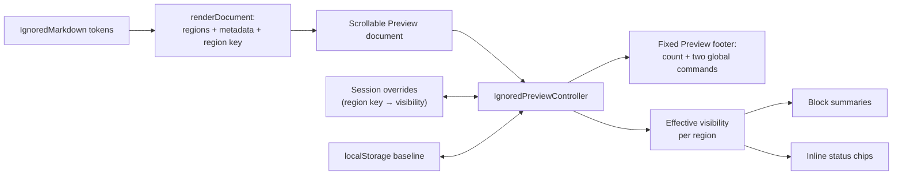

# Ignored Markdown Preview Toggle

> [!NOTE]
> Status: **implemented**, with the glyphs later revised. Each ignored region can be shown or
> hidden on its own, while the footer keeps two commands that override every region at once.

The glyphs have since changed.

> [!IMPORTANT]
> [Collapsing Across the Report](Collapsing%20Across%20the%20Report.md) supersedes this note
> wherever the two disagree about glyphs. A region's control is now a **chevron on the leading
> edge** and `circle-slash` is a **status mark on the trailing edge**, on inline and block regions
> alike — see [D5](#d5--the-ignored-marker-is-the-regions-own-control) below, which records the
> reasoning that was replaced.

## Table of contents

- [Goal and scope](#goal-and-scope)
- [Vocabulary](#vocabulary)
- [Functionality checklist](#functionality-checklist)
- [Writer-facing behavior](#writer-facing-behavior)
- [Architecture](#architecture)
- [Interfaces and responsibilities](#interfaces-and-responsibilities)
- [Key design decisions](#key-design-decisions)
- [Boundary cases](#boundary-cases)
- [Testability](#testability)

## Goal and scope

Ignored Markdown remains visible in Preview by default so a writer can inspect authoring aids and
accidental omissions. A document with several tables, diagrams, or dividers can nevertheless spend
most of its Preview space on content that never becomes dialogue.

This component owns *how much of that content the writer sees*. A report-wide **view baseline**
answers "how do I want to read this project", and a **region override** answers "but keep this one
table open while I work on it". Two footer commands reset every region to one state, so the
writer can always return to a known view in one click.

**In scope:** the fixed Preview footer and its two global commands, per-region visibility, region
identity across re-renders, baseline persistence, compact block and inline representations, hot
reload, and a real configured inline-ignore demo through
[the configuration loader](./Configuration%20Loader.md).

**Out of scope:** changing the handling policy, hiding ignored text in the Source editor, or
per-region handling configuration. This component only decides Preview visibility for content the
compiler has already classified as ignored.

## Vocabulary

| Term | Meaning |
| --- | --- |
| **Ignored region** | One compiler-classified span excluded from dialogue, rendered in Preview as a block or an inline span. |
| **View baseline** | The report-wide default visibility, `shown` or `hidden`. Persisted. |
| **Region override** | One region's deviation from the baseline. Session-only. |
| **Effective visibility** | What a region actually shows: its override when it has one, otherwise the baseline. |
| **Global command** | `Expand all` or `Collapse all`. Sets the baseline **and** clears every override. |
| **Region key** | The content-derived identity that carries an override across re-renders. |

## Functionality checklist

- [x] Keep the Preview footer aligned with the Source editor's `#END` footer.
- [x] Offer `Expand all` and `Collapse all` as two always-available commands.
- [x] Report the count and the current view, including mixed state.
- [x] Disable both commands when the document has no ignored regions.
- [x] Let each ignored block and inline region toggle itself by pointer and keyboard.
- [x] Make a global command override every individual choice.
- [x] Keep a region's choice across the re-render that follows every keystroke.
- [x] Keep a region's choice across a hot reload that leaves that region unchanged.
- [x] Return an edited, split, or newly added region to the baseline.
- [x] Persist the baseline — not the overrides — across reloads.
- [x] Keep Source editor content visible and dimmed in every state.
- [x] Keep static status glyphs distinguishable from the region controls.

## Writer-facing behavior

The two panes end with matching compiler-owned footers:

| Source footer | Preview footer |
| --- | --- |
| `∞  End  #END` | `circle-slash  4 ignored  2 of 4 shown in Preview  [expand-all] [collapse-all]` |

The state prose names the view exactly: `all shown in Preview`, `all hidden in Preview`, or
`2 of 4 shown in Preview` once any region differs from the baseline.

Every region carries its own control on the `circle-slash` marker it already displays. Clicking it
shows or hides that region alone; the footer prose updates to reflect the mixed view. A hidden
document keeps compact anchors where its content was:

```text
circle-slash  Table · 4 lines

Alice: Visit [circle-slash] before sundown.

circle-slash  Code block · 5 lines
circle-slash  Divider
```

The inline chip's tooltip names the kind and source, for example
`Ignored autolink: <https://example.com>`.

## Architecture



## Interfaces and responsibilities

| Type | Responsibility |
| --- | --- |
| `renderDocument` | Emits ignored regions with kind, source-line count, tooltip source, a stable region key, and each region's marker button. |
| `createIgnoredPreviewController` | Owns the baseline, the session overrides, and the footer. Applies effective visibility after every render and handles region and footer clicks. |
| `source-view.ts` | Hosts the Preview shell and refreshes the controller after each render. Unchanged. |
| `styles.css` | Mirrors the `#END` footer, and styles expanded regions, collapsed summaries, inline chips, and the region control's hover and focus states. |

## Key design decisions

### D1 — A footer with two commands, not one toggle

The Source editor already owns a fixed 37.8-pixel `#END` footer, and a same-height Preview footer
makes the split read as two coordinated compiler views. A top toolbar created asymmetric chrome,
while a floating glyph had ambiguous scope.

Once regions can differ, a single toggle has no honest label: from `2 of 4 shown`, "collapse all"
and "expand all" are both reasonable next steps, and a state-derived button would force two clicks
to reach one of them. Two commands are each unambiguous and each reachable in one click.

Both stay enabled whenever the document has any ignored region, even when the view already matches,
because a command also clears overrides. At zero regions the footer reads `0 ignored`, disables
both commands, and keeps the panes aligned.

### D2 — Global commands override every region

`Expand all` and `Collapse all` are commands, not toggles of a shared flag: each sets the baseline
and discards every override. This is the behavior of "Fold All" in an editor and "Collapse All" in
a file tree, and it is what makes mixed state safe to allow at all — however scattered the view
becomes, one click returns it to a state the writer can name.

The alternative, merging a global action into per-region state, produces the ambiguity this
component previously avoided by having no per-region state at all.

### D3 — Collapse Preview only

Source remains the editable truth. Its ignored text stays visible and dimmed so a writer can
locate, select, and change it. Visibility only affects rendered Preview regions.

### D4 — Preserve location and kind

Fully removing ignored content would make the remaining Preview close up around an invisible
omission. A hidden block therefore keeps one line naming its Marked kind and exact source-line
count. The count is mechanical — not a guessed row count — and stays meaningful for any kind.

Inline content cannot become a row without breaking its sentence, so it becomes one circle-slash
chip in place, with a tooltip containing the kind and exact source text.

Ignored HTML is shown as escaped source rather than executed markup. Markdig exposes inline opening
and closing tags as separate tokens; rendering them as HTML after the compiler ignored them would
unbalance Preview DOM. Escaped source also better communicates what was left out.

### D5 — The ignored marker is the region's own control

> [!IMPORTANT]
> **Superseded.** Reusing the status glyph as the control made `circle-slash` mean *press me* here
> and *this is ignored* everywhere else. The control is now a chevron and the status mark is a
> separate `circle-slash` that trails the region. The button semantics below still hold.

Each ignored region already displays a `circle-slash` marker meaning *excluded from dialogue*. That
marker becomes the region's button rather than growing a second glyph beside it, which would double
the width of an inline chip and break the sentence it sits in.

The glyph stays `circle-slash` in both states, because visibility is already self-evident from
whether the content is there; the glyph's job is to say *what kind of region this is*. What makes it
a control instead of a sticker is real button semantics: it is focusable, exposes `aria-expanded`,
names its action ("Hide ignored Table · 4 lines"), and shows hover and focus affordances.

Static status glyphs remain distinguishable at both layers. The conditional-dialogue `question`
marker and the footer's category marker stay non-focusable CSS pseudo-elements, so assistive
technology and pointer users meet exactly one control per region.

Turning a sticker into a control exposes three things a pseudo-element never had to survive. The
marker must **lead its region and stay put**: it sits in a gutter at the region's start in both
states, because a control that moves when clicked forces a reader to chase it across the pane to
undo what they just did. Hiding an inline region therefore collapses the span onto that same
gutter, and the span holds one line box so the marker cannot drop onto the text baseline.

The marker also needs its own stacking level, because a region's own content — a table's cells, for
example — otherwise paints over it and swallows the click. And it has to opt out of the button
styling Pico applies to every `button`: Pico redefines `--pico-background-color` to its accent and
adds a bottom margin, which would tint the marker and grow the footer past the height it shares
with the Source editor's `#END` footer.

### D6 — Ignored content is dimmed, but never below legibility

Ignored content renders at reduced opacity so it reads as set aside. Dimming an accent color that
way pushes it under the contrast floor, so an ignored link takes the muted ink instead: it is not a
destination the dialogue can reach, so the link accent was never carrying useful meaning.

The footer states its view in a muted ink chosen for tinted panel chrome rather than the general
muted color, which holds only against the plain document background.

This matters more than it did for a single global toggle. Previously the only way to read ignored
content was to show all of it at once; now a writer can leave one region shown indefinitely while
the rest stay hidden, so "shown ignored content" is a state the report sits in rather than passes
through.

### D7 — A persisted baseline and session-only overrides

The baseline is how the writer wants to read the served project, so one guarded local-storage key
applies across file switches and survives hot reloads on the same report origin. A fresh origin
starts from the `shown` baseline.

Overrides are working state, not preference: they live in memory, keyed by region key, and clear on
any global command. Persisting them would accumulate keys for regions that no longer exist and
would restore a scattered view days later with no visible cause. Opening another script is a full
page navigation, so a file switch clears overrides without the controller needing a document API.

Overrides deliberately survive the two events that happen constantly while writing: the Preview
re-render after every keystroke, and a hot reload that leaves the region's own text alone.

### D8 — A region is identified by its content, not its position

An override outlives a full DOM replacement, so each region needs a name. `renderDocument` derives
one from the data it already holds: the region's kind, a hash of its exact source text, and an
occurrence counter that separates identical siblings such as two `---` dividers.

| Candidate identity | Rejected because |
| --- | --- |
| Ordinal position | Adding any region above shifts every override onto the wrong neighbor. |
| Source offset | Typing a line above a region moves it, discarding the override for an unrelated edit. |
| Compiler-assigned ID | The compiler emits spans, not identities; adding them would widen this component into the pipeline. |

Content identity also gives the right answer at the edges for free. A region that moves keeps its
key and its override. A region whose own text is edited becomes a different region and returns to
the baseline, which is what a writer expects after rewriting it. A split region yields new keys, and
a deleted region simply leaves an unused entry behind until the next global command.

### D9 — Metadata comes from the rendered compiler spans

`renderDocument` already matches `IgnoredMarkdown` spans to Marked tokens, so it adds kind, line,
tooltip, and key metadata at the point where both the compiler decision and the Markdown token are
known. The controller never classifies source or hardcodes which kinds are ignored.

Marked removes blockquote prefixes before rendering nested tokens, while Markdig diagnostics retain
them on continuation lines. Matching strips only the common container depth; a literal `>` inside
ignored code remains content. Adding the ignored CSS class also recognizes only a real
whitespace-delimited HTML `class` attribute, not `class=` inside an autolink query string.

## Boundary cases

| Case | Behavior |
| --- | --- |
| No ignored regions | Footer remains; `0 ignored`; both commands disabled. |
| Every region matches the baseline | Prose reads `all shown` or `all hidden`; no override is stored. |
| One region differs | Prose reads `2 of 4 shown in Preview`; both commands stay available. |
| Keystroke re-render | Regions keep their overrides through the full DOM replacement. |
| Hot reload leaving a region unchanged | That region keeps its override; changed regions return to the baseline. |
| Region's own text edited | Its key changes, so it returns to the baseline. |
| Two identical regions | The occurrence counter keeps their overrides apart. |
| Region deleted | Its entry is unused and cleared by the next global command. |
| File switch | Full page navigation; the baseline is restored and overrides start empty. |
| Ignored inline among words | One inline chip control preserves surrounding spaces and flow. |
| Ignored content inside a blockquote | Region still matches and collapses; literal quote markers inside code remain. |
| Autolink URL containing `class=` | Link still receives the ignored class and collapses. |
| Ignored Mermaid code block | A shown region renders the authoring diagram; hiding it replaces the whole diagram with its code-block summary. |
| Many ignored regions | Each control is one natural tab stop, in document order. |
| Control under a region's own content | The control keeps its own stacking level, so a table's cells cannot swallow the click. |
| Toggling the same region twice | The control does not move between states, so the pointer can stay still. |
| A shown ignored link | It renders in muted ink rather than a dimmed accent, holding contrast in both themes. |
| Preview pane hidden | Footer hides with its Preview shell. |
| Storage unavailable | Every command still works for the current view; only the baseline fails to persist. |

## Testability

- **Renderer unit tests:** the region key is stable for unchanged source, differs when the source
  changes, and separates identical siblings; each region emits one control carrying its metadata;
  existing kind, line-count, escaped-tooltip, balanced-HTML, blockquote, and class-like autolink
  coverage still holds.
- **Sanitizer unit test:** the mount boundary keeps the compiler-owned control, its key, and its
  pressed state, since the Preview is written through DOMPurify.
- **Controller unit tests:** zero state; baseline persistence; each global command clearing
  overrides; a per-region toggle producing mixed state and mixed prose; overrides surviving a
  re-render and a changed document; accessible names and `aria-expanded` in both states; storage
  failure.
- **Source-view integration:** the fixed footer always exists, a global command and a single
  region control each change only the Preview, and Source stays unchanged.
- **Static browser integration:** the Preview footer matches the `#END` footer's position and
  height, a region control responds to pointer and keyboard and keeps the same box across a
  toggle, a global command overrides an
  individual choice, a hidden inline region stays a chip inside its sentence, Zen hides the whole
  Preview shell, and axe reports no accessibility violations in a mixed view in either theme.
- **Live integration:** a real `dialogue.toml` sets `autolink = "ignore"`; the configured inline
  link and a default-ignored table are driven individually, a global command overrides both, and
  the baseline survives a reload while individual choices do not.
