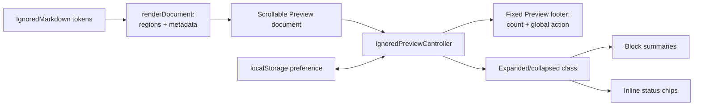

# Ignored Markdown Preview Toggle

> [!NOTE]
> Status: **implemented**. Extends
> [Unmodeled Markdown Highlighting](./Unmodeled%20Markdown%20Highlighting.md) with one global
> Preview control: show every ignored construct in full, or collapse all of them while preserving
> where and what they were.

## Table of contents

- [Goal and scope](#goal-and-scope)
- [Functionality checklist](#functionality-checklist)
- [Writer-facing behavior](#writer-facing-behavior)
- [Architecture](#architecture)
- [Interfaces and responsibilities](#interfaces-and-responsibilities)
- [Key design decisions](#key-design-decisions)
- [Boundary cases](#boundary-cases)
- [Testability](#testability)

## Goal and scope

Ignored Markdown remains visible in Preview by default so a writer can inspect authoring aids and
accidental omissions. A document with several tables, diagrams, or dividers can nevertheless
spend most of its Preview space on content that never becomes dialogue.

This component adds one global toggle for the current Preview. It defaults to expanded; when
collapsed, every ignored block becomes a one-line semantic summary and every ignored inline
becomes a circle-slash chip at its original sentence position.

**In scope:** the fixed Preview footer, global expanded/collapsed state, compact block and inline
representations, persistence across file switches in one served report, hot-reload behavior, and
a real configured inline-ignore demo through
[the configuration loader](./Configuration%20Loader.md).

**Out of scope:** changing the handling policy, hiding ignored text in the Source editor,
per-region expansion, or storing a different state per script.

## Functionality checklist

- [x] Always render a Preview footer matching the Source editor's `#END` footer height.
- [x] Show the ignored-region count and current Preview state.
- [x] Disable the action when the count is zero.
- [x] Default to expanded, preserving current behavior.
- [x] Collapse every ignored block to `Kind · N lines` at its original position.
- [x] Collapse every ignored inline to one circle-slash chip with a source tooltip.
- [x] Keep Source editor content visible and dimmed in either state.
- [x] Persist one view preference across file switches and hot reloads.
- [x] Reapply the state when a recompile changes the ignored regions.
- [x] Verify an ignored inline through a real `dialogue.toml` override.

## Writer-facing behavior

The two panes end with matching compiler-owned footers:

| Source footer | Preview footer |
| --- | --- |
| `∞  End  #END` | `circle-slash  3 ignored  shown in Preview  [collapse-all]` |

When collapsed, the footer reads `3 ignored · hidden in Preview` and the action changes to
`expand-all`. The document retains compact anchors:

```text
circle-slash  Table · 4 lines

Alice: Visit [circle-slash] before sundown.

circle-slash  Code block · 5 lines
circle-slash  Divider
```

The inline chip's tooltip names the kind and source, for example
`Ignored autolink: <https://example.com>`.

## Architecture



## Interfaces and responsibilities

| Type | Responsibility |
| --- | --- |
| `renderDocument` | Emits ignored regions with kind, source-line count, and source tooltip metadata. |
| `createIgnoredPreviewController` | Creates the stable footer and owns global state, guarded persistence, recounting, and reapplication after Preview renders. |
| `source-view.ts` | Hosts a Preview shell: scrollable document above, fixed footer below; refreshes the controller after each render. |
| `styles.css` | Mirrors the `#END` footer dimensions and defines expanded blocks, collapsed summaries, and inline chips. |

## Key design decisions

### D1 — A footer, not a top toolbar

The Source editor already owns a fixed 37.8-pixel `#END` footer. A same-height Preview footer makes
the split read as two coordinated compiler views. A top toolbar created asymmetric chrome, while
a floating glyph had ambiguous scope.

The footer is always present. At zero it says `0 ignored` and disables the action, preserving pane
alignment and making "nothing omitted" an explicit status.

The static browser test compares both footer rows' rendered position and height, pinning the
alignment rather than relying only on matching CSS declarations.

### D2 — Collapse Preview only

Source remains the editable truth. Its ignored text stays visible and dimmed so a writer can
locate, select, and change it. The toggle only manages rendered Preview regions.

### D3 — Preserve location and kind

Fully removing ignored content would make the remaining Preview close up around an invisible
omission. Blocks therefore retain one line naming their Marked kind and exact source-line count.
The count is mechanical—not a guessed row count—and remains meaningful for any ignored kind.

Inline content cannot become a row without breaking its sentence. It becomes one circle-slash chip
in place, with a tooltip containing the kind and exact source text.

Ignored HTML is shown as escaped source rather than executed markup. Markdig exposes inline
opening and closing tags as separate tokens; rendering them as HTML after the compiler ignored
them would unbalance Preview DOM. Escaped source also better communicates what was left out.

### D4 — One persisted view preference

Expanded/collapsed is how the writer wants to view the served project, not a property of one
script. One guarded local-storage key applies across file switches and survives hot reloads on the
same report origin. A fresh origin defaults to expanded.

### D5 — Metadata comes from the rendered compiler spans

`renderDocument` already matches `IgnoredMarkdown` spans to Marked tokens. It adds kind and line
metadata at that point, where both the compiler decision and Markdown token are known. The
controller never classifies source or hardcodes which kinds are ignored.

Marked removes blockquote prefixes before rendering nested tokens, while Markdig diagnostics retain
them on continuation lines. Matching strips only the common container depth; a literal `>` inside
ignored code remains content. Adding the ignored CSS class also recognizes only a real
whitespace-delimited HTML `class` attribute, not `class=` inside an autolink query string.

### D6 — Status glyphs never act; action glyphs never describe status

Each ignored region and the footer's category marker use a static `circle-slash`: it means
excluded from dialogue and is never clickable. Conditional dialogue keeps its static question
marker. The only interactive glyph is the footer button, which uses `collapse-all` while content
is shown and `expand-all` while it is hidden. Footer prose reports current state.

Per-region toggles are deferred. They would introduce mixed state (`3 of 4 shown`), make one
global button's action ambiguous, and require stable region identities across edits, recompiles,
and file switches. This component deliberately keeps one binary Preview preference.

## Boundary cases

| Case | Behavior |
| --- | --- |
| No ignored regions | Footer remains; `0 ignored`; action disabled. |
| Ignored content changes after save | Count and summaries refresh; current state remains. |
| File switch | New document receives the persisted view state. |
| Ignored inline among words | One inline chip preserves surrounding spaces and flow. |
| Several adjacent inline regions | One chip per compiler-projected span. |
| Ignored content inside a blockquote | Region still matches and collapses; literal quote markers inside code remain. |
| Autolink URL containing `class=` | Link still receives the ignored class and collapses. |
| Preview pane hidden | Footer hides with its Preview shell. |
| Narrow stacked layout | Footer stays below the Preview document, matching desktop semantics. |
| Storage unavailable | Toggle still works for the current view; it simply does not persist. |

## Testability

- **Renderer unit tests:** metadata for each supported Marked kind, exact source-line counts, and
  escaped inline tooltip source; separately ignored HTML tags remain balanced; nested blockquote
  prefixes and class-like autolink queries cannot bypass matching.
- **Controller unit tests:** zero/expanded/collapsed footer states, action semantics, persistence,
  refresh after rerender, storage failure, and valid accessible names for collapsed groups.
- **Source-view integration:** the fixed footer always exists, global state applies to new
  regions, Source remains unchanged, and Preview hide/show owns the whole shell.
- **Static browser integration:** the Preview footer matches the `#END` footer's position and
  height, Zen hides the whole Preview shell, narrow layout stays bounded, and axe reports no
  accessibility violations.
- **Live integration:** a real `dialogue.toml` sets `autolink = "ignore"`; one global footer
  controls the configured inline link and a default-ignored table, persists across reload, and
  restores both globally. Axe also checks the collapsed live state.
