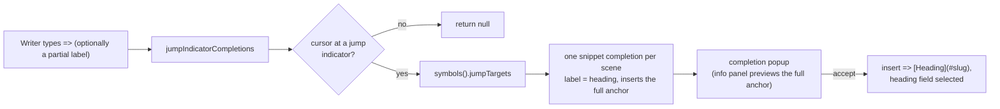

# Jump-Target Completion

> [!NOTE]
> Status: **implemented**. An enhancement to
> [Source Editor Autocompletion](./Source%20Editor%20Autocompletion.md) and
> [Compiler-Projected Editor Semantics](./Compiler-Projected%20Editor%20Semantics.md):
> when the writer types the jump indicator `=>`, offer the script's scenes and, on
> accept, **enrich the whole jump target** — insert `[Heading](#slug)` with the
> heading pre-filled as an editable field. Today completion only fills the `slug`
> *inside* a link the writer has already typed by hand (`](#…)`); this adds the
> earlier, opinionated entry point at `=>` itself.
>
> Like the rest of the visualization tooling, this surface is "vibe-coded" (see the
> [visualization note's](./Compilation%20Visualization.md) maturity caveat); the core
> engine stays the reviewed surface.

## Table of contents

- [Goal & scope](#goal--scope)
- [Ubiquitous language](#ubiquitous-language)
- [Functionality checklist](#functionality-checklist)
- [Design](#design)
  - [Flow](#flow)
  - [Interfaces & abstractions](#interfaces--abstractions)
- [Key design decisions](#key-design-decisions)
- [Error & boundary cases](#error--boundary-cases)
- [Integration](#integration)
- [Testability](#testability)
- [Implementation checklist](#implementation-checklist)

## Goal & scope

A jump is written `=> [Label](#slug)` — a `=>` indicator, then a Markdown link
whose destination is a scene's anchor. Writing it by hand is fiddly and error-prone:
the writer must remember the scene's heading, type the brackets, and slugify the
anchor correctly (a mistyped `#the-markett` is a silent dead link).

Make the jump indicator itself the completion trigger. When the writer types `=>`,
offer **every scene in the script**; accepting one inserts the **complete jump
target** — `[Heading](#slug)` — using the scene's own heading as the label and its
compiler-correct slug as the anchor. The label lands as an **editable field**, so a
writer who wants different link text can adjust it immediately, while the common
case ("jump to this scene") is one keystroke.

This is deliberately **opinionated**: the editor recommends a well-formed anchor
rather than completing exactly what was typed. The heading is a good default label,
and the slug is guaranteed to resolve.

**In scope:** a new Edit-only completion source that fires at the `=>` jump
indicator and inserts a snippet-enriched jump target, drawn from the same
compiler-projected symbols the existing completions use.

**Out of scope:** inline **ghost text** (a grayed preview rendered in the document
as opposed to the completion popup) — CodeMirror's popup is a separate mechanism
from ghost text, so a preview appears in the popup's info panel, not inline
(see [Key design decisions](#key-design-decisions)); **cross-file** jump targets
(the symbol set is same-file scenes plus the `#END` sentinel); and completing a
jump destination *inside* an already-typed `](#…)` link, which the existing slug
source already handles.

## Ubiquitous language

The DSL already names these concepts (see the
[script-language spec](../../guide/script-language.md)); the editor reuses them so
one concept keeps one name across the spec, the code, and the completions.

| Term | Meaning |
| --- | --- |
| **Jump indicator** | The `=>` glyph that opens a jump (the same token the highlighter names `JumpIndicator`). |
| **Jump target** | Where a jump goes: a scene's anchor, written `[Label](#slug)`. The `slug` is the GitHub-style slug of the heading — the anchor the preview links to. |
| **Scene** | A heading-rooted section the writer can jump to. Its heading text is the recommended jump label. |
| **Completion** | A suggestion the editor offers at the cursor (CodeMirror's term). |
| **Field** | A snippet tab-stop (`${1:…}`) the writer can Tab to and edit after accepting. |
| **Symbol** | A name the editor can suggest, drawn from the compiler's resolved symbols in the report payload. |

## Functionality checklist

- [x] Typing the jump indicator `=>` offers **every scene** in the script (plus the
      `#END` sentinel), each labelled by its heading.
- [x] A partial label after `=>` (e.g. `=> pla`) **filters** the offered scenes by
      heading prefix.
- [x] Accepting a scene inserts the **complete jump target** `[Heading](#slug)`,
      slugged exactly as the preview anchors (the compiler-projected `slug`).
- [x] The inserted **heading label is an editable field** — the cursor selects it, so
      the writer can retype the label, then Tab past it; the slug stays fixed.
- [x] A single space always separates `=>` from the inserted link (`=> [..]`, never
      `=>[..]`), regardless of whether the writer typed one.
- [x] The completion is **Edit-only** — inactive in read-only View and in the static
      export.
- [x] The popup's **info panel previews** the full `[Heading](#slug)` that will be
      inserted, so the writer sees the enrichment before accepting.
- [x] The existing slug completion inside a hand-typed `](#…)` link is **unchanged**;
      the two sources complement each other.
- [x] No suggestions and no error on a script with no scenes.

## Design

The feature is one new [CodeMirror](https://codemirror.net/) `CompletionSource`
added to `editor-completions.ts`, beside the four that already exist. It needs **no
new data and no .NET change**: the report payload already carries the compiler's
resolved jump targets (`{ slug, heading }`) via the
[Compiler-Projected Editor Semantics](./Compiler-Projected%20Editor%20Semantics.md)
symbol seam, and the existing slug source already reads them.

Enrichment uses CodeMirror's own `snippetCompletion`: the completion's `apply` is a
snippet template `[${1:Heading}](#slug)`, so accepting inserts the full link with the
heading pre-selected as the first (and only) field. The slug is interpolated
literally — it must stay compiler-correct — while the label is the editable tab-stop.

### Flow

The source fires only at the jump indicator: it matches `=>` immediately before the
cursor, optionally followed by whitespace and a partial label, and stops as soon as
the writer has begun the link itself (`[`), leaving the inside-link case to the slug
source. It then maps each scene to a snippet completion and returns them; CodeMirror
filters by the partial label typed against each heading.

### Interfaces & abstractions

| Type / function | Responsibility | Collaborators |
| --- | --- | --- |
| `jumpIndicatorCompletions(symbols)` | **New.** Completion source firing at `=>`; maps `jumpTargets` to snippet completions that insert `[Heading](#slug)`. | `snippetCompletion`, `DialogueSymbolProvider` |
| `jumpSlugCompletions(symbols)` | The existing source (renamed from `jumpTargetCompletions`), completing a `slug` inside a hand-typed `](#…)` link. | `DialogueSymbolProvider` |
| `dialogueAutocompletion(symbols)` | Registers both jump sources beside the speaker/id/tag sources. | `@codemirror/autocomplete` |
| `DialogueSymbolProvider().jumpTargets` | Compiler-projected `{ slug, heading }` per scene (plus `#END`); already in the payload. | semantic symbol projection |

Renaming `jumpTargetCompletions` → `jumpSlugCompletions` keeps the ubiquitous
language honest: it completes a **slug**, while the new source completes a whole
**jump target**.

## Key design decisions

- **Trigger at the jump indicator, not inside the link.** The whole point is to spare
  the writer from typing the link scaffolding, so completion must fire at `=>` —
  *before* any brackets exist. The existing slug source fires only after `](#`, a
  strictly later point; the two are complementary entry points into the same jump
  target, not duplicates.
- **Enrich with a snippet, heading as an editable field.** Accepting inserts the
  complete `[Heading](#slug)` via `snippetCompletion("[${1:Heading}](#slug)")`. This
  is opinionated — it recommends a well-formed anchor rather than echoing what was
  typed — but not rigid: the heading is a tab-stop the writer can immediately retype.
  *Alternative considered:* a plain string insertion with the cursor at the end.
  Rejected — the snippet gives the same one-keystroke result while leaving the label
  trivially editable, which better fits "recommended, not literal". The **slug is not
  a field**: it must resolve, so it is fixed.
- **Popup preview, not inline ghost text.** The writer's ideal is a grayed inline
  preview of the enriched anchor. CodeMirror's built-in completion **popup** and
  **ghost text** are two separate mechanisms (as in VS Code, where the suggest widget
  and `InlineCompletionItemProvider` are distinct APIs): the popup shows a candidate's
  `label`, `detail`, and `info` — it cannot render the pending insertion as inline
  gray text. So the enrichment is previewed in the popup's **info panel** (the full
  `[Heading](#slug)`), and true inline ghost text is left as a possible follow-up
  (it would need a bespoke decoration widget synced to the selected candidate).
- **Reuse the compiler-projected symbols.** The offered scenes are exactly the
  compiler's resolved jump targets, so a completion can never suggest a scene the
  compiler would not resolve — and no document scan or new payload field is needed.
  The heading text is the recommended label; the `#END` sentinel rides along as
  "End the run".
- **Normalize the separating space.** A jump reads `=> [..]`. The source ensures a
  single space between `=>` and the inserted link even when the writer typed `=>` with
  no trailing space, so the result is always well-formed.

## Error & boundary cases

| Case | Behavior |
| --- | --- |
| Script has no scenes | The source returns `null`; no popup, no error (only `#END` may show). |
| `=>` already followed by a full `[..](#..)` | The `[` ends the indicator match, so this source stays quiet; the slug source may complete inside the link. |
| Partial label matches no scene | CodeMirror filters to nothing; the popup stays closed. |
| Conditional jump `` `cond?` => `` | The indicator is the same `=>`, so completion fires normally after it. |
| `#END` sentinel | Offered as "End the run"; accepting inserts `[End the run](#END)`. |
| Read-only View / static export | The extension is absent (Edit-only), so nothing activates. |

## Integration

The source joins the others inside `dialogueAutocompletion(symbols)`, which
`source-view.ts` already wires into the editor's Edit-only compartment; nothing else
in the report changes, and it stays a single self-contained, offline-capable file. No
.NET, payload, or build change is required — the jump targets already travel in the
report's `symbols`.

## Testability

- **`jumpIndicatorCompletions`** is a `(CompletionContext) => CompletionResult | null`.
  Unit-test it by building an `EditorState` whose document ends at a jump indicator
  (`=>`, `=> pla`, `Alice: hi\n=>`) and asserting the returned `from`/`options` — the
  labels equal the scene headings, each `apply` is a snippet inserting `[Heading](#slug)`,
  and it returns `null` once a `[` is present or when there are no scenes.
- **End-to-end** (Playwright, live server): in Edit mode, type `=>`, accept a scene from
  the popup, and assert the buffer becomes `=> [Heading](#slug)`; confirm nothing
  activates in View.
- Mirror the one-file-per-source layout; extend `editor-completions.test.ts` and the
  existing highlight/completion e2e specs. Target the usual high, meaningful coverage.

## Implementation checklist

- [x] Add `jumpIndicatorCompletions(symbols)` to `editor-completions.ts`: match the
      `=>` indicator, map `jumpTargets` to `snippetCompletion("[${1:heading}](#slug)")`
      completions with an `info` preview, normalize the separating space.
- [x] Rename `jumpTargetCompletions` → `jumpSlugCompletions`; register both in
      `dialogueAutocompletion`.
- [x] Unit tests via `CompletionContext` (trigger, filter, enriched insert, boundary
      cases); Playwright e2e for the accept round-trip.
- [x] Rebuild the committed `dist/report.html`; `CHANGELOG` + reading-guide entry.
