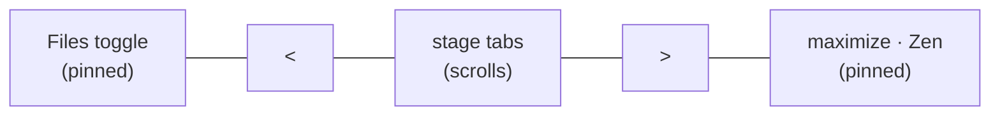

# Live Visualization — Explorer Toggle

> [!NOTE]
> Status: **implemented**.

The Explorer opens expanded on every launch, holding `15rem` of the window whether
or not the reader is navigating files. The cost is paid at every launch; the benefit
— seeing the tree — is usually wanted once. This shuts it by default and gives it a
**pinned Files toggle in the tab bar**, so summoning it is one obvious click rather
than finding a chevron on a hairline divider.

## Table of contents

- [Goal and scope](#goal-and-scope)
- [What it delivers](#what-it-delivers)
- [Where the toggle lives](#where-the-toggle-lives)
  - [The shape it wears](#the-shape-it-wears)
  - [One styling, stated once](#one-styling-stated-once)
- [Why not an activity bar](#why-not-an-activity-bar)
- [What the default should be](#what-the-default-should-be)
- [Independence from the stage scroller](#independence-from-the-stage-scroller)
- [Zen](#zen)
- [The seam](#the-seam)
- [Boundary cases](#boundary-cases)
- [Testability](#testability)
- [Tradeoffs](#tradeoffs)

## Goal and scope

One presentation change to an existing component: how the Explorer is **summoned**
and whether it is **showing to begin with**. The tree's own behavior — browsing,
opening, creating, renaming — is untouched. See
[Live Visualization — File Explorer](./Live%20Visualization%20-%20File%20Explorer.md).

## What it delivers

- [x] A pinned **Files** control in the tab bar that shows and hides the Explorer.
- [x] The control states whether the Explorer is showing, rather than only offering
      an action.
- [x] The Explorer is **shut by default** when a document is open.
- [x] The Explorer is **open by default** in the empty shell.
- [x] An explicit choice is remembered across reloads, in both shells.
- [x] The control is unaffected by the stage row scrolling on a narrow window.
- [x] The control is absent in Zen, which already hides the Explorer.
- [x] The divider keeps resizing and gives back its space while the panel is shut.

## Where the toggle lives

A new pinned slot at the **leading edge** of the tab bar, so the control sits over
the panel it summons.

The tab bar already carries a control of exactly this kind. The Zen button is a
sticky mode rather than a one-shot action, and says so by rendering engaged in the
mode accent. The Files toggle is the same kind of thing and reuses that language, so
the row gains a control rather than a new idea.

It is a **disclosure**, not a mode: a button that shows and hides a named region.
So it carries `aria-expanded` and points at the region with `aria-controls`, and the
engaged styling keys off that state rather than off `aria-pressed`, which would
describe a button that stays pushed rather than a region that is open.

### The shape it wears

The control is a **glyph alone** — the file mark an editor puts on its own file panel,
in the same Feather family, size, and stroke weight the Config tab's gear uses. It shows
no word, because the tab row's width belongs to the **stages**: a word here would spend
that width on a control that is not one, and would crowd the very stage tabs the reader
came for. Wordless, it carries the same 16px glyph as the **icon buttons at the row's
other end** — the Zen and maximize pair.

Its *height*, though, is the **row's rather than its glyph's**: the control stretches to
fill the pinned slot, which fills the row. A button sized to its icon is a small thing to
hit and a cramped thing to ring with a focus outline, and this one is the doorway to a
whole panel. It stops short of the divider that closes the row.

The box grows **upward**, and the glyph does not travel with it. Centered in the taller
box, the glyph floated above the line the Zen and maximize buttons sit on; it is seated
against the box's bottom instead, so all three icons share one line. The bed is likewise
centered on the **glyph** rather than on the box behind it.

One styling serves **every width**. The narrow layout used to reduce a worded control to
a glyph and restate its size; with no word to drop there is nothing to restate, and the
two widths cannot disagree — the same seating puts the glyph on the row's icon line at
both.

The button's box is taller than what it paints: the **bed is inset** inside it. That
separation is what keeps the mark clear of the brand above and the divider below — the
row aligns to its bottom edge, so a control sized to its own chip would grow *upward*
into the logo. The inset leaves air at both ends without shrinking the target.

Open, it wears the two marks an editor's activity bar uses for the panel you are in:
a **leading accent rail** and a **tinted bed**. The rail is drawn as the bed's own
leading edge — an inset shadow rather than a separate positioned bar, so it takes the
bed's height automatically instead of being told it and getting it wrong. The bed is
**square-cut**, which is what lets the rail read as a straight bar: rounding the bed
bends the rail around its corners, and at the 2px a rail is wide even a small radius
turns it into a parenthesis rather than a mark. Its leading edge sits at the header
gutter, which puts the rail under the brand mark rather than inside the control.

It never takes the **underline**: in this row that mark answers "which stage am I on",
and the Explorer is not a stage — a second underlined item would leave that question
ambiguous.

**Showing no word, its name is carried entirely by its tooltip and accessible name**,
and both are built from one constant. That is the tradeoff a glyph makes: the meaning
has to be recoverable by hovering and by a screen reader, because it can no longer be
read off the control.

### One styling, stated once

The row's trailing controls — Zen and maximize — share a single style rule rather than
a copy each. Held apart they drift, and drift here is not cosmetic: the row aligns to
its **bottom** edge, so a control that ends up taller than its neighbours grows
*upward*, into the brand mark above it.

Centering their glyph with flex is what makes that class of fault impossible. The glyph
becomes a flex item, so the inherited line box cannot size the button, and no
counteracting reset is needed to hold it back. A test asserts the Files control carries
those buttons' glyph **on their line**, takes the row's height, clears the brand mark
above and the divider below, keeps its bed square-cut and centered on the glyph, and
stays evenly padded around it.

**One ring, not two.** Pico rings a focused button with a `box-shadow` rather than an
`outline`, so clearing the outline alone leaves that ring in place beneath the square one
this report draws on the bed. The two overlapped while the button was barely taller than
its bed, which hid the fault; once the button grew to the row's height they separated and
the outer, rounded ring reached the brand mark. Both are cleared now, and a test asserts
the button paints no ring of its own.

## Why not an activity bar

VS Code's own idiom is a vertical rail of icons down the far left. Reproducing it
here would **cost a permanent column to reclaim `15rem`**, and with a single icon in
it the rail would be mostly empty. The report exists to show a large drawing; adding
standing chrome to save space argues against itself. The tab bar is already on
screen at every width and already pins controls at both ends.

## What the default should be

Shut when a document is open — the reader asked for that script, so the tree is a
detour.

Open in the **empty shell**, where nothing is open and the tree is not a detour but
the only thing to do: it carries the create-a-script call to action, and the main
pane points at it. Hiding it there would hide the only way forward.

Both shells remember an explicit choice. That requires distinguishing *"chose to
show"* from *"never said"*, so the remembered value becomes an explicit shown/hidden
flag rather than a marker whose absence meant shown.

## Independence from the stage scroller

On a narrow window the stage row scrolls, with `<` and `>` arrows revealing tabs
that do not fit. The Files toggle must not be caught up in that: a control that
scrolls out of reach is worse than a chevron on a divider.

The row's scrolling is confined to the stage nav, and the arrows sit in slots beside
it. A control placed **inside** that nav would scroll away and could hide behind an
arrow; the nav is also labelled as the compiler stages, so a control that is not a
stage does not belong in it on those grounds either.

The toggle therefore gets a slot of its own, a sibling of the nav. Independence then
holds **by construction** rather than by care, and a test asserts it so the control
cannot later be tidied into the strip.

## Zen

Zen already hides the Explorer and its divider. The toggle goes with them: left
visible it would be a control that does nothing, since the panel it summons is
suppressed for as long as Zen lasts.

## The seam

The shared collapsible-panel helper grows two capabilities, both useful beyond this
component:

| Capability | Why |
| --- | --- |
| A **starting state** for when nothing is remembered | So a panel can begin shut without every caller reimplementing the storage dance |
| A **control the caller supplies** | So a panel can be driven by something other than the divider handle |

Everything else — the collapsed class, the remembered choice, the accessible
labelling — stays where it is. The Explorer passes a Files control and a shut
starting state; the inspector, the configured speakers, and the semantic tables keep
the divider handle and their current default, unchanged.

## Boundary cases

| Case | Behavior |
| --- | --- |
| No Explorer (the static export) | No toggle, and the empty slot takes no room in the row |
| A remembered choice from before this change | Honored — a reader who shut the Explorer keeps it shut |
| Never chose, document open | Shut |
| Never chose, empty shell | Open |
| Narrow window, Explorer showing | It stacks above the stage; the toggle still names the panel it opens |
| Zen entered while the Explorer shows | Panel and toggle both disappear; leaving Zen restores them |

## Testability

- **Unit** — the panel helper's starting state and remembered choice, including the
  older remembered value; the control's engaged state tracking the panel.
- **Browser** — the Explorer is shut on arrival with a document open and open in the
  empty shell; the toggle summons and dismisses it; the control keeps its place when
  the stage row scrolls on a narrow window; it is gone in Zen; and the exported
  report carries no control, with its slot taking no room.
- **Alignment** — the control keeps the tabs' height and baseline, starts no higher
  than they do, sets its leading edge at the header gutter, and clears the brand mark.
  Below the stacking width it matches the icon buttons' box, glyph, and centre line.
- **Accessibility** — the report's existing pass is scoped to the source preview, so
  it never sees the tab bar. The control brings its own: an accessibility scan of the
  row in **both** of its states, shut and showing.

## Tradeoffs

- **A reader who never chose loses a panel they used to see.** The remembered value
  now says which state was chosen rather than only recording the hidden one, so
  anyone who *did* choose is unaffected — but someone who simply never touched it
  will find the tree shut on first launch after this change, with one click to bring
  it back.
- **The tab bar gains an item on narrow windows**, where room is tightest. It is one
  small control, and the arrows already hide themselves when the row fits, so the
  cost lands only where the row was going to scroll anyway.
- **Two controls could drift.** Only the Files toggle drives the Explorer now; the
  divider keeps resizing but no longer hides. One control, one story.
