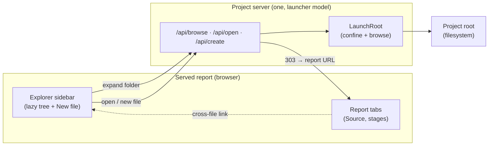

# Live Visualization — File Explorer

> [!NOTE]
> Status: **implemented**. The standalone launcher is folded into the served report
> as a collapsible **Explorer** sidebar, so a writer sees the whole project beside
> the active script. `visualize <script>` now serves through the same project server
> too — the convergence this note deferred, delivered by the
> [Unified Served Shell](./Live%20Visualization%20-%20Unified%20Served%20Shell.md)
> note (see [Decisions](#decisions)). It is the visualization precursor the
> [Cross-file jump resolution](./Cross-File%20Jump%20Resolution.md) note defers
> ("a multi-script project view in the visualization").

## Table of contents

- [Goal and scope](#goal-and-scope)
- [Functionality checklist](#functionality-checklist)
- [Ubiquitous language](#ubiquitous-language)
- [Writer-facing behavior](#writer-facing-behavior)
- [What exists today](#what-exists-today)
- [Architecture](#architecture)
- [Interfaces and responsibilities](#interfaces-and-responsibilities)
- [Key design decisions](#key-design-decisions)
- [Error and boundary cases](#error-and-boundary-cases)
- [Integration](#integration)
- [Testability](#testability)
- [Alternatives not chosen](#alternatives-not-chosen)
- [Decisions](#decisions)

## Goal and scope

A writer working on one script cannot see the rest of the story. To open another
file today they leave the report entirely and return to the
**[launcher](./Live%20Visualization%20-%20File%20Launcher.md)** — a
separate page — pick a file, and land on a fresh report. The context of "which
project am I in, and what else is in it" is lost the moment the report opens.

This note **folds the launcher into the report** as a collapsible **Explorer**
sidebar, VS Code style. Beside the active script it shows the project's file tree
rooted at the launch root; the active script is highlighted; clicking another
script — or following a cross-file link in the source — opens it; and a **New
file** affordance creates a script in place. The report becomes project-aware
instead of single-file.

This is the visualization half of cross-file authoring: the
[cross-file jump](./Cross-File%20Jump%20Resolution.md) note designs the compiler
linker and explicitly defers the project *view*; this note builds that view's
first piece.

**In scope:** a collapsible Explorer sidebar in the **served** report (a
`visualize` session in View or Edit); a lazy, expand/collapse file tree over the
launch root; active-script highlighting; opening another script by click or by a
cross-file source link; **New file** creation; and the server capability that
backs browsing and opening from within a served report.

**Out of scope (deferred):**

- **In-place document switching.** Opening a script **navigates** to its report
  (a fresh render), reusing today's open flow; a smooth in-place swap that keeps
  the active tab and scroll needs a multi-document client model and is a later
  component.
- **Cross-file jump *resolution*.** Following a link *opens the target file*; it
  does not yet validate that the target anchor exists — that is the
  [linker](./Cross-File%20Jump%20Resolution.md)'s job.
- **The static export.** The committed offline `report.html` has no server, so it
  shows no Explorer. Embedding a browsable project snapshot into the export is a
  possible future, not this component.

## Functionality checklist

- [x] Render a collapsible **Explorer** sidebar in a served report (View or Edit),
      absent in the static export.
- [x] Show a lazy, expand/collapse **tree** of the launch root — folders and
      `.dialogue.md` scripts — fetching each folder's children on expand.
- [x] Highlight the **active script** and reveal it in the tree on load.
- [x] Open another script on click, **navigating** to its report (View/Edit
      preserved).
- [x] Open a script from a **cross-file source link** (`chapter-02.md#anchor`) by
      navigating to that script.
- [x] Create a new script (**New file**) at the root or, from a folder's context
      menu, inside that folder — reusing the launcher's name/append/conflict rules,
      then open it in Edit.
- [x] Create a new **folder** (header toolbar, or a folder's context menu).
- [x] **Rename** a script or folder in place (context menu), moving the file or
      folder; when the rename carries the open document, reopen it at its new path.
- [x] Pin the project's **`dialogue.toml`** above the tree and open it in the
      Config tab.
- [x] A VS Code-style **header toolbar** (New File, New Folder, Refresh, Collapse
      Folders) and cursor-anchored right-click **context menus**.
- [x] Serve the report and launcher HTML **uncached** (`Cache-Control: no-store`),
      so a rebuilt bundle is never stale against the live filesystem.
- [x] Confine every path to the root (no `..`, absolute, or symlink escape).
- [x] Remember the sidebar's collapsed/expanded state across reloads.
- [x] Flush or guard unsaved edits before navigating away (Edit mode).

## Ubiquitous language

The vocabulary aligns with the [cross-file jump](./Cross-File%20Jump%20Resolution.md)
note so the view and the compiler speak one language.

| Term | Meaning |
| --- | --- |
| **Project root** | The directory the report is scoped to — the existing launch root (`--root` / the served document's confined root). The Explorer's tree and every path live under it. |
| **Script** | One `.dialogue.md` document — the per-file unit the report renders. |
| **Active script** | The script the current report is showing; highlighted in the tree. |
| **Explorer** | The collapsible sidebar that renders the project tree and its actions (open, new file). |
| **Browse listing** | One directory's immediate children — sub-folders and scripts — as `GET /api/browse` returns them (`BrowseListing`). The unit a tree node expands into. |
| **Navigate-per-file** | Opening a script by loading its report afresh (today's launcher flow), rather than swapping documents in place. |

## Writer-facing behavior

In a served report the Explorer sits on the left, collapsible like the node
inspector on the right:

- The tree is rooted at the project root and lists folders and `.dialogue.md`
  scripts. A folder **expands and collapses**; its children load on first expand.
- The **active script is highlighted**, and the tree opens far enough to reveal it.
- **Clicking a script opens it** — the report navigates to that script (its
  View/Edit mode carried over). **Clicking a folder** toggles it.
- A **cross-file link** in the Source preview (`=> [Meet Bob](chapter-02.md#meet-bob)`)
  opens the target script the same way — the Explorer follows the link like a
  hyperlink. Whether the anchor resolves is the linker's concern, not the
  Explorer's.
- **New file** adds a script in the chosen folder (the launcher's inline
  name field, `.dialogue.md` auto-appended, a name clash offers to open the
  existing file instead), then opens it in Edit.
- **Collapsing** the Explorer gives the graphs and source the full width; the
  choice is remembered across reloads.

Nothing changes for the offline export: with no server there is no Explorer, and
the report renders exactly as it does today.

## What exists today

The pieces are mostly built — as a *separate page*:

- **`LaunchRoot`** (`src/DialogueDown.Visualization.Live/LaunchRoot.cs`) is the
  root-confinement seam: `Resolve` (reject `..`/absolute/symlink escape),
  `ResolveSource` (a confined existing `.dialogue.md`), and `Browse` (one
  directory's folders + scripts as a `BrowseListing`).
- **`LauncherServer`** already exposes `GET /api/browse`, `POST /api/open`,
  `POST /api/create`, and serves the opened report under `/r` — but the launcher
  is its **own page**; opening a script `303`-redirects away to the report.
- **`LiveVisualizationServer`** serves a directly-opened report (`visualize
  <script>`) and has `document`/`events`/`save`/`reload`/`create-config` — but
  **no** browse/open/create.
- The web client's `launcher.ts` renders a **flat, one-folder-at-a-time** listing
  with a working **New file** row, driven by injected `LauncherPorts`
  (`browse`/`open`/`create`) over the `BrowseListing` model.
- The report (`app.ts`) is single-document (`Report.source`/`path`/`mode`) and
  already has a **collapsible panel** primitive (`initCollapsiblePanel`, used for
  the inspector), a **resizer**, and **maximize**.

So the work is a **reframe**: promote browse/open/create to whatever server backs
the served report, and render the tree *inside* the report as a collapsible panel,
reusing the launcher's ports and create UX with a new lazy-tree renderer.

## Architecture

The Explorer is a client panel backed by the existing root-confined endpoints.
Opening a script reuses the launcher's `303`→report flow, so the client model
stays single-document.

Two server entry points serve a report today — the launcher (`LauncherServer`,
report mounted at `/r`) and a direct session (`LiveVisualizationServer`). Only the
launcher browses, opens, creates, and **switches** the active session — and
opening another script is exactly that switch. So the served report **converges on
the launcher's project-server model**: `visualize <script>` pre-opens its script
on that one server, giving every served report the Explorer from a single code
path instead of teaching the direct server to switch sessions a second time. The
standalone launcher page stays the no-script entry; its browse/open/create are now
reachable from inside any report. The Explorer's root is the resolved **serve
root** — `--root` when given, else the document's folder — which already flows into
both paths.

The tree is **lazy**: the sidebar renders the root's listing, and each folder
node fetches its own `BrowseListing` from `GET /api/browse?path=<folder>` when
first expanded. This reuses the existing endpoint unchanged — the launcher's
"browse one folder" is exactly a tree node's "load my children."

## Interfaces and responsibilities

| Type | Side | Responsibility | Collaborators |
| --- | --- | --- | --- |
| `LaunchRoot` | server | Existing root confinement + `Browse`; unchanged, now reused by the served report. | filesystem |
| Project server | server | The one server behind every served report (the launcher's model): `browse` the root, serve the active report, and on `open`/`create` start/switch the session and `303` to it. `visualize <script>` enters it pre-opened. | `LaunchRoot`, session factory |
| `Report.project` (new) | model | The injected served-mode Explorer context: the root's display path and the active script's root-relative path. Absent in the static export, which gates the sidebar. | `Report` |
| `ExplorerPorts` | client | The injected side effects — `browse(path)`, `open(script, mode)`, `create(path)`, `navigate(url)` — reused from the launcher so the tree is unit-testable without a server. | `fetch`, navigation |
| Explorer view | client | Build the collapsible sidebar, render the lazy tree, highlight/reveal the active script, and wire click-to-open and New file. | `ExplorerPorts`, `initCollapsiblePanel` |
| Tree renderer | client | Render one `BrowseListing` as expandable nodes; expand fetches children lazily; a script row opens, a folder row toggles. | `ExplorerPorts` |

The client contract is the existing `BrowseListing` and `LauncherPorts` shapes;
the only new model field is the served-mode `Report.project` context that says
"this report has a browsable root, and here is the active script."

## Key design decisions

- **Server-backed, reusing `LaunchRoot`.** The one filesystem seam already
  confines paths and lists directories; the Explorer reuses it rather than a
  second browsing path. This is the same seam the cross-file `FileSystemProject`
  will use, so view and compiler share one confinement story.
- **One project server (converge on the launcher's model).** Opening a script is
  a session switch, which only the launcher server does; rather than duplicate it
  into the direct server, `visualize <script>` converges on the launcher's
  project-server, so every served report gets the Explorer from one path. This
  retires the two servers' overlap instead of widening it.
- **Served mode only.** Browsing needs a server; the offline export has none, so
  the sidebar is present only when the injected `Report.project` context is — the
  export is unchanged. An embedded snapshot for the static report is deferred.
- **A lazy expand/collapse tree over the existing endpoint.** Each folder loads
  its children on expand via `GET /api/browse?path=`. This turns the launcher's
  flat browser into a VS Code tree with no new endpoint and no whole-project walk.
- **Navigate-per-file, keeping the single-document model.** Opening a script
  reuses the launcher's `open`→`303`→report flow, so the report client stays
  single-document and this component stays small. The smooth in-place swap (and
  the multi-document model it needs) is a deliberate later seam.
- **Switching respects the save mode.** In **Auto** save a pending change flushes
  silently before navigating (the report's existing save-before-navigation); in
  **Manual** the writer is prompted to save or discard first, because choosing
  Manual is choosing to control when content is written.
- **Reuse the launcher's ports and create UX; new renderer only.** `ExplorerPorts`
  and the New file inline field come straight from `launcher.ts`; only the flat
  listing becomes a recursive tree. No new dependency — consistent with the
  client's lean, offline, self-contained conventions.
- **A collapsible left sidebar, mirroring the inspector.** The Explorer uses the
  existing `initCollapsiblePanel` + resizer patterns, on the left, so collapse,
  persistence, and layout match the node inspector on the right.

## Error and boundary cases

| Case | Result |
| --- | --- |
| Path escapes the root (`..`, absolute, symlink) | Rejected by `LaunchRoot` — the endpoint returns not-found; the tree cannot request it. |
| **New file** name already exists | `409`; the file is left untouched and the writer is offered to open it instead (existing launcher behavior). |
| New file name missing the extension | `.dialogue.md` is auto-appended (existing behavior). |
| Open a script that vanished from disk | `open` resolves nothing → not-found; the tree surfaces it and refreshes the listing. |
| Empty root (no scripts or folders) | The tree shows an empty-root hint, with New file still available. |
| Unsaved edits when navigating to another script (Edit) | **Auto** save flushes silently before navigating; **Manual** save prompts to save or discard first — the writer chose Manual to control saving, so the choice stays theirs. Reuses live-edit's save-before-navigation. |
| Static export (no server) | No `Report.project` context → no Explorer; the report is unchanged. |
| Cross-file link whose target file is missing | Navigation lands on an open/not-found outcome; anchor validity is the linker's concern, deferred. |

## Integration

- **Server.** Promote `browse`/`open`/`create` (backed by `LaunchRoot` and the
  session-start-and-redirect logic) to a shared capability both the launcher and
  the direct served report expose.
- **Model.** Add the served-mode `Report.project` context (root display path +
  active script path) to the injected report payload; its presence gates the
  sidebar.
- **Client.** In `app.ts`, build the Explorer as a left collapsible panel
  (`initCollapsiblePanel`) when `Report.project` is present, beside the existing
  tabs/inspector/resizer. Reuse `ExplorerPorts` and the New file field from
  `launcher.ts`; add the recursive tree renderer.
- **Cross-file links.** The Source preview already renders same-file anchor links;
  extend link handling so a file-part target routes through `ExplorerPorts.open`
  instead of a raw anchor jump.
- **Edit safety.** Reuse `live-edit`'s flush-on-navigation so opening another
  script never drops an unsaved change.

## Testability

The pyramid stays bottom-heavy, matching the launcher's existing tests.

- **Unit (Vitest + jsdom):** the tree renderer and Explorer view against injected
  `ExplorerPorts` (no server) — lazy expand fetches children, the active script is
  highlighted and revealed, a script row opens, a folder row toggles, New file's
  name/append/conflict rules, and empty-root. Mirrors `launcher.test.ts`.
- **Server (.NET, `DialogueDown.Visualization.Live.Tests`):** the served report's
  browse/open/create routes over a temp directory — confinement (`..`/absolute/
  symlink rejected), a `409` conflict, and an `open` `303` to the report.
- **End-to-end (Playwright live):** one served session that expands the tree,
  opens another script, and creates a file — reusing `serve-launcher.mjs`, which
  already builds a fixture tree and launches the real CLI.

## Alternatives not chosen

- **Browser File System Access API** (`showDirectoryPicker`). Lets the browser
  read a local directory with no server, even offline — but it is Chromium-only,
  needs a permission gesture, and stands up a *second* filesystem story beside
  `LaunchRoot`/`FileSystemProject`. Rejected: it duplicates the confinement model
  the compiler already needs and abandons Firefox/Safari.
- **Embed a project snapshot in the static export.** Ship the whole tree and every
  source inside `__DD_REPORT__` so the offline `report.html` browses too.
  Rejected *for now*: it bloats the export, cannot create files, and is a
  read-only capture — a reasonable later addition, not the core.
- **A content tab, not a sidebar.** Make "Files" one of the Source/stage tabs.
  Rejected: an explorer is persistent context you keep open *while* reading a tab,
  which is a sidebar, not a mutually-exclusive tab.
- **In-place document swap now.** Fetch the target's model and swap the editor
  document without navigating. Rejected for this component: it needs a
  multi-document client model; navigate-per-file reuses the proven open flow and
  keeps the first step small. Kept as an explicit later seam.

## Decisions

Settled in review:

1. **One project server (converge on the launcher's model).** The Explorer is
   served by the launcher's project server, which browses, opens, creates, and
   switches sessions. Reports opened through the launcher (`visualize`)
   carry the Explorer, and `visualize <script>` was **converged** onto the same
   server by the
   [Unified Served Shell](./Live%20Visualization%20-%20Unified%20Served%20Shell.md)
   note — it retired the separate direct-serve server and rewrote its tests as its
   own focused change rather than riding this one.
2. **Root is the resolved serve root.** `--root` when given, else the document's
   folder — the value already flows into both serve paths, so no new option.
3. **Switching respects the save mode.** Auto flushes silently before navigating;
   Manual prompts to save or discard first, keeping the writer's control.
4. **Explorer in the UI, project in the model.** The sidebar reads "Explorer"
   (VS Code-familiar); the model field, code, and tests use the compiler's
   `project` / `script` vocabulary, aligned with the
   [cross-file jump](./Cross-File%20Jump%20Resolution.md) note.
