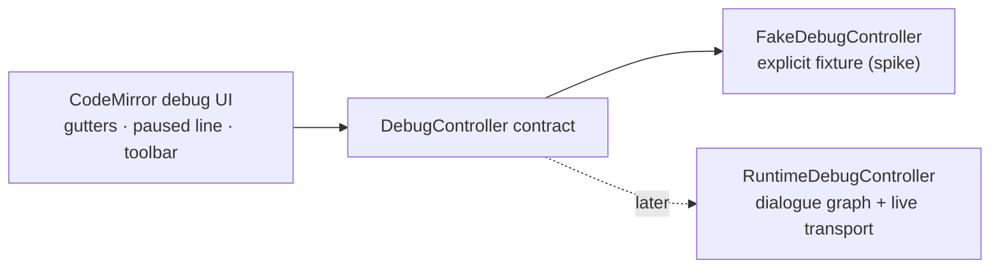
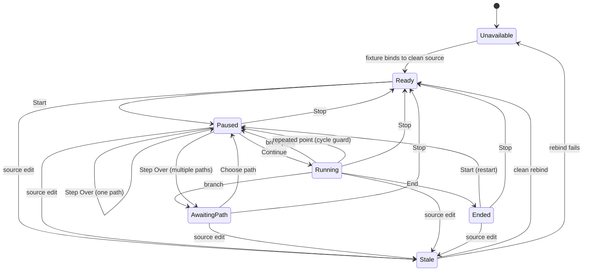

# Live Visualization — Line Debugger Prototype

> [!NOTE]
> Status: **implemented exploration spike — not adopted and not intended to
> merge; visual evaluation pending**. This branch-only prototype evaluates a
> line-debugging experience in the Source editor against an explicit fake debug
> program. It does not execute DialogueDown's dialogue graph, game-system calls,
> guards, weights, or jumps. Its reusable outcome is the editor UI and
> `DebugController` seam; the fake controller is disposable.

## Table of contents

- [Goal and scope](#goal-and-scope)
- [Ubiquitous language](#ubiquitous-language)
- [Functionality checklist](#functionality-checklist)
- [Survey findings](#survey-findings)
- [Interfaces and abstractions](#interfaces-and-abstractions)
- [State and interaction flow](#state-and-interaction-flow)
- [Key design decisions](#key-design-decisions)
  - [D1 — Prototype the UI behind a controller seam](#d1--prototype-the-ui-behind-a-controller-seam)
  - [D2 — Use an explicit fake debug program](#d2--use-an-explicit-fake-debug-program)
  - [D3 — Model requested and verified breakpoints separately](#d3--model-requested-and-verified-breakpoints-separately)
  - [D4 — Keep breakpoint and execution gutters separate](#d4--keep-breakpoint-and-execution-gutters-separate)
  - [D5 — Prototype pausing before an execution point](#d5--prototype-pausing-before-an-execution-point)
  - [D6 — Path selection is explicit and remains paused](#d6--path-selection-is-explicit-and-remains-paused)
  - [D7 — Debug only a clean compiled document](#d7--debug-only-a-clean-compiled-document)
  - [D8 — Keep controls in the Source pane](#d8--keep-controls-in-the-source-pane)
- [Error and boundary cases](#error-and-boundary-cases)
- [Integration](#integration)
- [Testability](#testability)
  - [Controller unit tests](#controller-unit-tests)
  - [CodeMirror extension tests](#codemirror-extension-tests)
  - [Toolbar tests](#toolbar-tests)
  - [Browser test](#browser-test)
- [Evaluation and exit criteria](#evaluation-and-exit-criteria)
- [Deferred real-runtime work](#deferred-real-runtime-work)

## Goal and scope

Evaluate whether DialogueDown's CodeMirror Source editor can support a clear,
pleasant **line-debugging** experience before the real dialogue runtime exists:
set breakpoints, see the paused line, continue, step over one execution point,
choose a fake path at a branch, and stop.

The spike is deliberately **branch-only**. It must not merge as a user-facing
debugger because its controller walks an explicit fixture rather than executing
the compiled dialogue graph. The design therefore separates the durable UI from
the disposable simulation:



**In scope:**

- A dedicated sample dialogue script and matching fake debug program with a
  linear path, a branch, and a loop or jump-like edge.
- A `DebugController` contract whose state drives the toolbar and editor
  decorations.
- **Start**, **Continue**, **Step Over**, and **Stop** execution controls in a
  compact toolbar above the Source editor, plus an accessible **Breakpoint**
  action for the cursor line.
- A line breakpoint gutter with **verified** (filled) and **unverified** (hollow)
  markers.
- A separate execution gutter with an arrow at the paused line, plus a subtle
  full-line paused decoration.
- An inline path picker when the fake program exposes multiple outgoing paths.
- Clean-source behavior: editing stops an active session; requested breakpoints
  survive the edit and rebind after the sample is clean again.
- Unit tests for the controller, breakpoint mapping, CodeMirror extensions, and
  toolbar state; minimal browser coverage for the integrated flow.
- A preview for evaluating the interaction and visual hierarchy.

**Out of scope:**

- Real dialogue-graph traversal, game-system queries/effects, guards, weights,
  choices inferred from an arbitrary script, or actual jump resolution.
- Server commands, SSE debug events, multi-client ownership, or a Debug Adapter
  Protocol implementation.
- Variables, call stacks, expression evaluation, conditional breakpoints, log
  points, exception stops, Pause, Restart, keyboard shortcuts, or persisted
  breakpoints across reloads.
- Merging the prototype branch.

## Ubiquitous language

| Term | Meaning |
| --- | --- |
| **Execution point** | One fake program location that can become the paused location. It carries an id, source line, label, and outgoing paths. |
| **Debug program** | The explicit fixture graph used by the spike. It is not derived from or equivalent to DialogueDown's compiled dialogue graph. |
| **Paused location** | The execution point that would run next. The editor shows its arrow and line decoration. |
| **Path** | One labeled edge from an execution point to another. Multiple paths put the controller in **awaiting path**. |
| **Requested breakpoint** | A source line the user clicked in the breakpoint gutter. It persists even when no execution point starts there. |
| **Verified breakpoint** | A requested breakpoint whose line matches an execution point in the currently bound debug program. |
| **Unverified breakpoint** | A requested breakpoint with no matching execution point. It remains visible as a hollow marker and never silently moves. |
| **Clean source** | Editor content that matches the last compiled report and can safely bind to a debug program. |
| **Stale session** | A session invalidated by a source edit. It cannot continue until the source is clean and the debug program rebinds. |
| **Debug controller** | The UI-facing command/state seam. The fake controller implements it now; the real runtime adapter implements it later. |

## Functionality checklist

- [x] Add the reusable `DebugController` state/command contract.
- [x] Add a dedicated sample script and explicit branching `FakeDebugProgram`.
- [x] Inject the fake controller only for `?debug=fake&fixture=line-debugger-v1`; leave ordinary reports unchanged.
- [x] Start paused on the program's entry execution point.
- [x] Continue until the next verified breakpoint, branch, or End.
- [x] Step over exactly one edge; stop before the target execution point.
- [x] Enter `awaiting-path` when an execution point has multiple outgoing paths.
- [x] Choose a path, move to its target, and remain paused there.
- [x] Stop the session and clear the execution arrow and paused-line decoration.
- [x] Toggle requested breakpoints from a dedicated CodeMirror gutter.
- [x] Offer a keyboard-accessible **Breakpoint** toolbar action for the cursor line.
- [x] Render verified breakpoints as filled red dots and unverified breakpoints as hollow red rings.
- [x] Map requested breakpoint positions through editor changes.
- [x] Render a separate amber execution arrow and paused-line decoration.
- [x] Scroll the paused location into view without moving the user's text selection.
- [x] Show a Source-pane toolbar with the four execution controls, accessible
  Breakpoint action, state text, and inline path picker.
- [x] Disable Start while the source is dirty; editing an active session makes it stale.
- [x] Keep breakpoints after an edit and re-verify them when the sample program rebinds.
- [x] Detect a repeated execution point during one Continue command and pause with a prototype cycle message.
- [x] Label the UI **Prototype · fake program** so it cannot be mistaken for real execution.
- [x] Cover the controller, editor extension, toolbar, invalidation, and integrated happy path with tests.
- [ ] Record the user's visual evaluation and decide whether any code should be carried forward.

## Survey findings

CodeMirror 6 already provides the editor primitives this feature needs:

- Its official [gutter example](https://codemirror.net/examples/gutter/) includes
  a clickable breakpoint implementation built from `gutter`, `GutterMarker`,
  `StateField`, `StateEffect`, and `RangeSet`.
- A breakpoint `RangeSet` can map through `transaction.changes`, so markers follow
  inserted and deleted text.
- `Decoration.line` can add a class to the paused line independently of
  `highlightActiveLine()`, which DialogueDown already uses for the text cursor.
- `EditorView.scrollIntoView` and an externally dispatched transaction can reveal
  a runtime-selected location without rebuilding the editor.

CodeMirror is therefore the **view**, not the debugger. It supplies no execution
model, stepping semantics, breakpoint verification, or path selection.

The [Debug Adapter Protocol](https://microsoft.github.io/debug-adapter-protocol/specification)
provides useful vocabulary without being adopted by this spike: a source
breakpoint is requested at a line, while the debugger reports whether it is
**verified** and may report a resolved location. The prototype adopts the
requested/verified distinction but deliberately does not implement DAP framing,
threads, stacks, or requests.

DialogueDown's current architecture also fits the UI:

- `source-view.ts` already composes CodeMirror extensions and uses state fields
  for compiler-projected editor behavior.
- The Source editor already distinguishes the cursor's gray active line, so the
  debugger can add a separate amber paused line.
- The live server already uses POST commands plus SSE events, which can later
  carry commands and state for a real runtime adapter.
- The in-progress Dialogue Graph design reserves an edge-selector seam for a
  debugger and models execution at script-block granularity, but the graph and
  runtime are not yet available on `main`.

## Interfaces and abstractions

The examples below define intent, not final method-by-method API.

| Type | Responsibility | Lifetime |
| --- | --- | --- |
| `DebugController` | Accept commands and expose immutable debug snapshots to the UI. | Durable seam |
| `DebugSnapshot` | Current status, paused location, available paths, breakpoint bindings, and optional message. | Durable value |
| `DebugLocation` | One source-mapped execution point: stable id, line/range, and display label. | Durable value |
| `DebugPath` | A labeled outgoing path and its target location id. | Durable value |
| `BreakpointBinding` | Requested line plus verified/unverified state. | Durable value |
| `FakeDebugProgram` | Explicit fixture of locations and paths for the dedicated sample. | Spike-only |
| `FakeDebugController` | Deterministic in-browser implementation of `DebugController`. | Spike-only |
| `debugEditorExtension` | CodeMirror state/effects/gutters/decorations for breakpoints and the paused line. | Durable UI |
| `createDebugToolbar` | Source-pane controls, status text, and path picker driven only by controller snapshots. | Durable UI |

Proposed contract shape:

```typescript
type DebugStatus =
    | "unavailable"
    | "ready"
    | "running"
    | "paused"
    | "awaiting-path"
    | "ended"
    | "stale";

interface DebugSnapshot {
    status: DebugStatus;
    location?: DebugLocation;
    paths: readonly DebugPath[];
    breakpoints: readonly BreakpointBinding[];
    controls: {
        start: boolean;
        continue: boolean;
        stepOver: boolean;
        stop: boolean;
    };
    message?: string;
}

interface DebugController {
    snapshot(): DebugSnapshot;
    subscribe(listener: (snapshot: DebugSnapshot) => void): () => void;
    setBreakpoints(lines: readonly number[]): void; // one-based source lines
    start(): void;
    continue(): void;
    stepOver(): void;
    choosePath(pathId: string): void;
    stop(): void;
    sourceChanged(): void;
}

interface FakeDebugController extends DebugController {
    rebind(program: FakeDebugProgram): void;
}
```

The CodeMirror breakpoint field is the **source of truth** for requested
breakpoints. It owns mapped source positions and sends their current one-based
line numbers through `setBreakpoints`; the controller returns verified/unverified
bindings in the snapshot. It never creates or moves a request itself.

`rebind` stays on the spike-only `FakeDebugController`; the durable
`DebugController` describes debugger behavior, not fixture mechanics. A real
adapter will receive new runtime state through its transport rather than a fake
program object.

## State and interaction flow



The fake controller may compute `Continue` synchronously, but it still emits the
`running` snapshot. The toolbar must therefore treat commands as state-driven
rather than relying on synchronous implementation details; a real server-backed
controller will be asynchronous.

## Key design decisions

### D1 — Prototype the UI behind a controller seam

The spike evaluates CodeMirror gutters, paused-line visibility, controls, and
path selection. Those surfaces depend only on `DebugSnapshot` and commands, not
on AST nodes, HTTP, or the fake fixture. The fake controller implements the seam
now; a future runtime adapter can replace it without rewriting the editor UI.

This adds a small abstraction before its production implementation exists, but
the user has named the future runtime explicitly and the seam prevents the spike
from hard-coding simulation logic into `source-view.ts`.

### D2 — Use an explicit fake debug program

The prototype uses one dedicated sample script and one explicit graph of
execution points and paths. It does not infer choices, block controls, guards,
weights, or jumps from the Desugared AST in TypeScript.

Inferring them would duplicate the pending Dialogue Graph and runtime work in the
wrong layer, create a second interpretation of the language, and make the spike
look more correct than it is. The fixture keeps the simulation transparent and
lets the branch exercise a branch and a cycle without claiming runtime fidelity.

Each fixture location binds to one **exact, unique full-line text** in the sample
rather than a raw offset. Line-ending style is irrelevant because binding works
on CodeMirror lines. Rebinding after a clean save can therefore tolerate
unrelated line insertions; a missing or duplicated anchor makes that location
unavailable instead of guessing.

### D3 — Model requested and verified breakpoints separately

Clicking any source line creates a **requested breakpoint**. If an execution
point starts on that line, the binding is verified and appears as a filled dot.
Otherwise, it remains a hollow ring.

The controller never silently moves a breakpoint to the next executable line.
That keeps the user's requested location truthful, avoids surprising movement
across scene boundaries, and leaves a contract compatible with a later
server/runtime resolver. Multi-line execution points bind at their starting line.

Requested breakpoints live in a CodeMirror state field as line-start positions.
Insertions or deletions before a marked line move the request with that line;
deleting the marked line removes the request rather than moving it to an
unrelated survivor. The field sends its current one-based lines to the
controller, which only verifies them against the bound program. While the source
is stale, every remaining request renders unverified. A clean rebind resolves
them again.

### D4 — Keep breakpoint and execution gutters separate

Two narrow gutters precede the existing line-number gutter:

1. **Breakpoint gutter** — filled red dot or hollow red ring; clicking toggles the request.
2. **Execution gutter** — amber arrow on the paused line.

Separate lanes keep both states visible when execution stops on a breakpoint.
They add a small amount of horizontal width, accepted for the clearer state.
The paused line also receives a subtle amber decoration; the existing gray
cursor-active-line treatment remains independent.

### D5 — Prototype pausing before an execution point

The paused location is the execution point that would run next. Start pauses at
the entry. Step Over advances one edge and pauses before its target. Continue
walks until a verified breakpoint, a branch requiring a path, or End.

Stopping before execution is the **prototype hypothesis** because it matches
common debugger expectations: a breakpoint pauses before a line would emit
dialogue or a control line would perform effects. The later runtime design must
confirm this timing against real dialogue delivery and game-system calls.

Continue ignores the breakpoint at the location it is leaving, so it cannot
immediately stop on the same request. On entering a new execution point, a
verified breakpoint wins first and pauses there; outgoing paths are inspected
only when the user next steps or continues from that location. Step Over at End
transitions to `ended`.

The fixture contains a cycle. During one Continue command, the fake controller
tracks visited location ids; revisiting one before a breakpoint or branch pauses
there with **Cycle encountered — step, choose another path, or set a
breakpoint**. This guard prevents a synchronous prototype command from hanging.

The editor scrolls the paused line into view but does not move the text selection
or keyboard focus. Debug navigation must not overwrite the writer's caret.

### D6 — Path selection is explicit and remains paused

When the current execution point exposes multiple outgoing paths, Step Over or
Continue enters `awaiting-path`. The toolbar expands an inline **Choose path**
row with labeled buttons.

Choosing a path moves to its target and remains paused there. It never silently
continues, even if the command that reached the branch was Continue. This makes
the transition observable and avoids hiding a second action inside path
selection. The next Step Over or Continue determines what happens next.

### D7 — Debug only a clean compiled document

The debug program is bound to the last clean source. Start is disabled while the
Source document is dirty. Editing from any bound state marks the session `stale`,
clears the execution arrow, makes every remaining breakpoint unverified, and
shows **Source changed — save and restart**.

Requested breakpoint markers remain and map through the edit. Once the sample
is saved/recompiled and its anchors rebind, the controller returns to `ready` and
re-verifies them.

The editor stays editable; the spike does not lock it during debugging. This
models the expected production behavior without pretending a stale graph is
still executing.

### D8 — Keep controls in the Source pane

A compact toolbar sits directly above CodeMirror:

```text
[Breakpoint] [Start] [Continue] [Step Over] [Stop]  Paused · line 12  Prototype · fake program
```

The path picker expands below this row only in `awaiting-path`. The controller
publishes explicit control capabilities in each snapshot; the expected values
below apply to the four execution controls. **Breakpoint** remains available
whenever the fake debugger is mounted because CodeMirror, not the controller,
owns requested breakpoints:

| Status | Start | Continue | Step Over | Stop | Meaning |
| --- | --- | --- | --- | --- | --- |
| `unavailable` | disabled | disabled | disabled | disabled | Fixture absent or cannot bind an entry. |
| `ready` | enabled | disabled | disabled | disabled | Clean, bound, not running. |
| `running` | disabled | disabled | disabled | enabled | Continue is traversing. |
| `paused` | disabled | enabled | enabled | enabled | A location is selected and would execute next. |
| `awaiting-path` | disabled | disabled | disabled | enabled | A path must be chosen first. |
| `ended` | enabled | disabled | disabled | enabled | Start restarts from entry; Stop returns to ready. |
| `stale` | disabled | disabled | disabled | disabled | Save/recompile/rebind is required. |

The spike adds no F5/F10 shortcuts. Browser refresh and platform shortcuts remain
untouched until the real debugger defines a complete keyboard model.

## Error and boundary cases

| Case | Behavior |
| --- | --- |
| No fake program is bound | Toolbar shows **Prototype unavailable**; all run commands are disabled; breakpoint toggling still works. |
| Empty fake program or missing entry | Status is `unavailable`; Start is disabled; no execution arrow. |
| Breakpoint on a blank, heading, or unrelated line | Hollow unverified marker; Continue never stops there. |
| Multiple requested breakpoints on one line | Collapsed to one request. |
| Paused line also has a breakpoint | Red breakpoint dot and amber execution arrow are both visible in their separate gutters. |
| Continue from the entry with no earlier breakpoint | Runs until the next verified breakpoint, branch, or End; it does not stop at every line. |
| Continue from a paused breakpoint | Ignores that current breakpoint once, then searches forward. |
| Enter a location that is both a breakpoint and a branch | Pauses for the breakpoint first; the next Step Over/Continue enters `awaiting-path`. |
| Step Over at a branch | Enters `awaiting-path`; no path is guessed. |
| Continue at a branch | Enters `awaiting-path`; choosing a path remains paused at its target. |
| Step Over at End | Transitions to `ended`; no arrow remains. |
| Continue enters a cycle with no breakpoint | Pauses on the first repeated location with a cycle message; never loops synchronously forever. |
| Path points to a missing location | Controller enters `ended` with a prototype error message rather than throwing into the UI. |
| Source edit while paused/running/awaiting path | Session becomes `stale`; arrow and line decoration clear; breakpoints remain. |
| Rebind cannot find a fixture anchor | That execution point is unavailable; affected breakpoints become unverified; Start is disabled if the entry is missing. |
| Editor is read-only (View) | Breakpoint gutters and debug controls still work; source text remains non-editable. |
| User switches report tabs while paused | Session remains paused; returning to Source restores the arrow and decoration. |

## Integration

The spike changes only the visualization web client and its test/demo fixtures:

- `source-view.ts` accepts an optional `DebugController`.
- `debug-editor.ts` owns CodeMirror effects, state fields, two gutters, and the
  paused-line decoration.
- `debug-toolbar.ts` renders controls and subscribes to controller snapshots.
- `fake-debug-controller.ts` and a dedicated fixture provide simulated state.
- `debug-controller.ts` owns the durable contract and values.
- The report app injects the fake controller only when the URL carries
  `?debug=fake&fixture=line-debugger-v1`. The fixture id must match a registered
  fake program; unknown or absent ids leave ordinary reports unchanged. If the
  registered fixture cannot bind its exact line anchors, the toolbar shows
  **Prototype unavailable** and never fabricates locations.
- `DebugEditorBridge` defers controller snapshots until the current CodeMirror
  update completes. The fake controller can publish synchronously from a gutter
  update, while CodeMirror forbids reentrant dispatch during that same update.
- `SourceViewHandle.destroy()` releases the editor, scroll synchronization,
  split-divider document listeners, media-query listener, and optional debugger
  subscription. The cleanup was added when integration tests exposed
  CodeMirror measurements surviving the test DOM.

No core C# project, live-server route, report JSON contract, or dependency changes
are required. CodeMirror and the existing icon/tooltip stack are already present.

The later real implementation replaces the fake controller with an adapter over
the runtime and live transport. It will also replace fixture anchor binding with
the dialogue graph's source map. That work must be designed after the Dialogue
Graph component lands.

## Testability

### Controller unit tests

- Start pauses at entry.
- Step Over follows a single path.
- Continue stops at a verified breakpoint.
- Continue ignores the breakpoint it is leaving.
- Step Over and Continue both put the controller in `awaiting-path` at a branch.
- A breakpoint on a branch wins before path selection.
- Choosing a path lands paused at the target.
- A cycle can be stepped repeatedly without recursion.
- Continue detects a repeated location rather than hanging.
- Stop resets the session.
- Source changes make an active session stale.
- Rebind resolves anchors and re-verifies breakpoints.
- Missing targets and anchors surface state/messages rather than uncaught errors.

### CodeMirror extension tests

- Gutter click toggles a requested breakpoint.
- Verified and unverified markers render distinct classes.
- Breakpoint positions map through inserted/deleted lines.
- Deleting the marked line removes its request.
- Paused snapshot adds the arrow and line decoration.
- Clearing/staling the session removes execution visuals but not breakpoints.
- Debug updates do not change the editor selection.

### Toolbar tests

- Controls enable exactly as the state table specifies.
- Status text reflects ready, paused line, awaiting path, ended, and stale.
- Path buttons render only in `awaiting-path` and call `choosePath`.
- The prototype label is always visible when the fake controller is active.

### Browser test

One focused Playwright path on the dedicated sample:

1. Confirm an ordinary report without the fake fixture query has no debugger UI.
2. Open the sample with `?debug=fake&fixture=line-debugger-v1` and confirm the visible prototype label.
3. Set one verified and one unverified breakpoint.
4. Start paused at entry.
5. Step to a branch and choose a path.
6. Continue to the verified breakpoint.
7. Stop and confirm execution visuals clear.
8. Start again, edit the source, and confirm the session becomes stale while breakpoints remain hollow.
9. Save/rebind the sample and confirm Start and breakpoint verification return.

## Evaluation and exit criteria

The built branch satisfies the functional crosscheck:

- **Achieved:** controller seam, explicit fixture, requested/verified
  breakpoints, edit mapping, two gutters, paused-line decoration, toolbar,
  branch selection, cycle guard, clean-source invalidation/rebind, query
  isolation, and the dedicated sample.
- **Changed:** no designed behavior changed. The implementation added deferred
  snapshot dispatch and deterministic Source-view teardown as lifecycle
  requirements discovered during testing. Independent review also hardened
  breakpoint mapping across ordinary/full-buffer edits, prevented same-location
  scroll snapping, preserved paused execution across clean View/Edit switches,
  added a keyboard-accessible breakpoint action, and restored focus after path
  selection.
- **Not implemented:** real runtime behavior remains deferred by design. The
  user-facing visual evaluation and adopt/revise/reject decision are still
  pending.

Automated evidence: **526** frontend unit tests plus **15** infrastructure tests,
**75** static Playwright tests, and **55** live Playwright tests pass. The live
prototype test covers ordinary-report isolation, one verified and one unverified
breakpoint, Start, clean View/Edit switching, Step Over, path selection,
Continue, Stop, edit invalidation, save, and rebind.

The branch is successful when the prototype answers these questions:

1. Are the two gutters readable without crowding line numbers or fold controls?
2. Can a user distinguish cursor-active, breakpoint, and paused-line states in
   light and dark themes?
3. Does the toolbar feel discoverable without taking too much vertical space?
4. Is the requested/verified breakpoint distinction understandable?
5. Does the inline path picker make branch stepping clear?
6. Do breakpoint mapping and clean-source invalidation feel predictable?
7. Is `DebugController` sufficient for a later asynchronous runtime adapter
   without leaking fake-program concepts into the UI?

After preview review, record the result as one of:

- **Adopt the UI design** — keep the durable controller/editor/toolbar code for
  the later runtime branch, but do not merge it yet.
- **Revise and re-evaluate** — change the interaction or visuals in this spike.
- **Reject** — retain only the findings in this note and remove the prototype.

## Deferred real-runtime work

The production debugger requires separate design components:

1. **Debuggable runtime session (core)** — a source-mapped dialogue graph,
   stop-before-node execution, edge selection, game-system effects, breakpoints,
   and Start/Continue/Step Over/Stop semantics.
2. **Live debug adapter** — server commands, SSE state, session ownership, and a
   browser `DebugController` implementation.

Those components must resolve graph source mapping, choices/guards/weights,
detours/call stacks, dirty-source recompilation, multi-client ownership, and
whether production execution also pauses before each node. The prototype
deliberately does not settle those runtime decisions.
