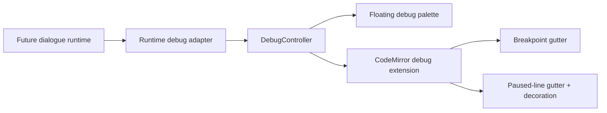
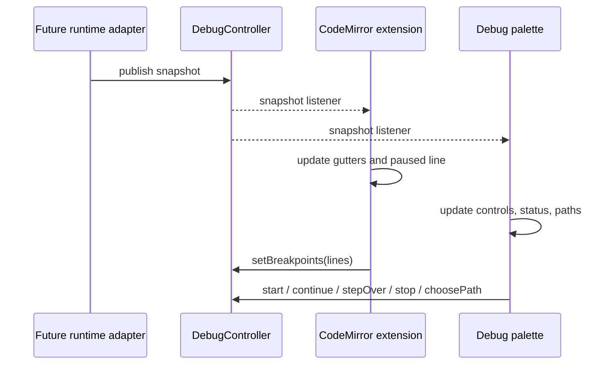

# Live Visualization — Line Debugger UI

> [!NOTE]
> Status: **implemented, dormant**. The Source editor contains the reusable line-debugger
> presentation layer and a transport/runtime-neutral `DebugController` seam. Production
> reports do not supply a controller, so no debugger controls, breakpoint gutters, or
> execution markers render. A test-only fake exercises the contract until the dialogue graph
> and runtime from [#45](https://github.com/pengzhengyi/dialoguedown/issues/45) can drive it.

## Table of contents

- [Goal and scope](#goal-and-scope)
- [Ubiquitous language](#ubiquitous-language)
- [Functionality checklist](#functionality-checklist)
- [Architecture](#architecture)
- [Interfaces and abstractions](#interfaces-and-abstractions)
- [Key design decisions](#key-design-decisions)
  - [D1 — Keep runtime and transport behind `DebugController`](#d1--keep-runtime-and-transport-behind-debugcontroller)
  - [D2 — Keep production UI dormant without a controller](#d2--keep-production-ui-dormant-without-a-controller)
  - [D3 — Let CodeMirror own requested breakpoints](#d3--let-codemirror-own-requested-breakpoints)
  - [D4 — Use compact, separate debug gutters](#d4--use-compact-separate-debug-gutters)
  - [D5 — Float icon-only controls over the Source pane](#d5--float-icon-only-controls-over-the-source-pane)
  - [D6 — Preserve editor intent and lifecycle safety](#d6--preserve-editor-intent-and-lifecycle-safety)
- [Error and boundary cases](#error-and-boundary-cases)
- [Integration seam](#integration-seam)
- [Testability](#testability)
- [Deferred runtime work](#deferred-runtime-work)

## Goal and scope

Provide a polished, reusable Source-editor UI for future line debugging without making
the visualization client understand the dialogue graph, runtime, or server transport.
When a `DebugController` is supplied, CodeMirror can show requested breakpoints, their
verified state, a paused execution line, debugger controls, and path choices. When no
controller is supplied—the only production configuration today—the Source editor behaves
exactly as before.



**In scope:**

- The runtime-neutral `DebugController` command/snapshot contract.
- CodeMirror state for requested breakpoints, verified bindings, and a paused location.
- A breakpoint gutter immediately left of line numbers and a separate execution gutter.
- A floating, draggable, icon-only debugger palette with accessible names and tooltips.
- Start, Continue, Step Over, Stop, breakpoint-at-cursor, status, and path-choice UI.
- Source-edit mapping, focus preservation, resize-aware palette clamping, and deterministic
  teardown.
- Unit tests using a test-only fake controller and browser tests proving ordinary reports
  remain dormant.

**Out of scope:**

- Runtime traversal, guard/weight evaluation, choices, jumps, game-system effects, call
  stacks, variables, or debugger transport.
- Production breakpoint persistence, keyboard shortcuts, conditional breakpoints, log
  points, Pause, Restart, or multi-client ownership.
- Any production route, query flag, sample program, or fake execution entry point.

## Ubiquitous language

| Term | Meaning |
| --- | --- |
| **Debug controller** | The UI-facing command/snapshot seam. A future runtime adapter implements it. |
| **Debug snapshot** | Immutable UI state: status, paused location, available paths, breakpoint bindings, enabled controls, and an optional message. |
| **Requested breakpoint** | A source line selected by the writer. CodeMirror owns and maps it through edits. |
| **Verified breakpoint** | A requested breakpoint that the controller can bind to an executable runtime location. |
| **Unverified breakpoint** | A request with no current executable binding. It stays visible as a hollow ring. |
| **Paused location** | The source-mapped execution point that the runtime reports as stopped. |
| **Debug palette** | The floating Source-pane panel containing debugger controls, status, and path choices. |
| **Dormant** | Compiled and tested, but not mounted because production supplies no controller. |

## Functionality checklist

- [x] Define the reusable `DebugController` contract without graph or transport types.
- [x] Mount debugger UI only when `createSourceView` receives a controller.
- [x] Leave ordinary static and served reports unchanged and debugger-free.
- [x] Toggle requested breakpoints by clicking the gutter or using the accessible cursor-line
  control.
- [x] Render verified breakpoints as filled red dots and unverified ones as hollow rings.
- [x] Keep the breakpoint gutter immediately left of line numbers with hover guidance.
- [x] Render a separate amber execution triangle and paused-line decoration.
- [x] Map breakpoint requests through ordinary edits and full-buffer replacement; remove a
  request when its line is deleted.
- [x] Reveal a newly paused location without moving the writer's selection or repeatedly
  snapping to an unchanged location.
- [x] Provide icon-only Start, Continue, Step Over, Stop, and Breakpoint controls with
  accessible names and `Tippy.js` labels.
- [x] Show path choices inline and restore keyboard focus after a choice.
- [x] Let the palette drag within the Source pane and re-clamp after preview, maximize,
  window-size, or palette-size changes.
- [x] Release CodeMirror, tooltip, observer, drag, media, and document listeners on teardown.
- [x] Keep fake execution code under test support and out of the production bundle.
- [x] Guard production dormancy with source- and bundle-level infrastructure tests.

## Architecture

The durable UI has three layers:

1. **Contract** — `debug-controller.ts` defines commands and immutable snapshots.
2. **Editor extension** — `debug-editor.ts` owns CodeMirror state fields, effects, gutters,
   decorations, breakpoint mapping, tooltip delegation, and controller synchronization.
3. **Palette** — `debug-toolbar.ts` renders controls and path choices, subscribes to
   snapshots, owns tooltips, and manages dragging/clamping.

`source-view.ts` composes those layers only when its optional `debug` option is present.
`app.ts` carries an optional controller to the Source view, but `main.ts` never supplies one.



## Interfaces and abstractions

| Type | Responsibility | Dependency direction |
| --- | --- | --- |
| `DebugController` | Accept debugger commands and publish immutable snapshots. | UI depends on this; it depends on no UI type. |
| `DebugSnapshot` | Status, source-mapped location, paths, bindings, capabilities, and message. | Runtime adapter → UI. |
| `DebugLocation` | Stable location id plus one-based line and source offsets. | Runtime adapter → editor. |
| `DebugPath` | Opaque path id and label; runtime topology stays inside the controller. | Runtime adapter → palette. |
| `BreakpointBinding` | One requested line and its verified state. | Controller → editor. |
| `debugEditor(controller)` | CodeMirror extension for breakpoints and execution visuals. | Depends only on controller snapshots/commands. |
| `createDebugToolbar(controller, options)` | Floating controls, status, path choices, and drag behavior. | Depends only on controller snapshots/commands. |
| `SourceViewOptions.debug` | Optional composition seam. | Future app/runtime wiring → Source view. |

The controller intentionally exposes control capabilities rather than requiring the UI to
infer command legality from status. A later asynchronous server adapter can therefore disable
commands during requests or runtime-specific states without changing the palette.

## Key design decisions

### D1 — Keep runtime and transport behind `DebugController`

The editor never imports graph nodes, runtime types, HTTP clients, or SSE event shapes. It
consumes source-mapped snapshots and sends semantic debugger commands. This keeps the
CodeMirror layer reusable and lets the future live adapter translate server events into the
same contract.

The fake controller used during design evaluation now lives under `src/test-support/`. It is
imported only by tests and is not reachable from the production app.

### D2 — Keep production UI dormant without a controller

`SourceViewOptions.debug` and `runApp(..., debug?)` are optional. With no controller:

- no palette mounts;
- no breakpoint or execution gutter mounts;
- no debugger state/listener exists; and
- the generated report has no user-accessible activation route.

A live browser regression checks that ordinary served reports contain none of the debugger
elements. An infrastructure test also rejects fake activation strings/imports in `main.ts` and
the committed report bundle. Dormancy is a deliberate integration state, not feature-flag
behavior.

### D3 — Let CodeMirror own requested breakpoints

The CodeMirror state field is the source of truth for requested breakpoints because it can map
line-start positions through document transactions. The field sends current one-based lines to
the controller; snapshots return verified/unverified bindings.

Mapping rules preserve writer intent:

- insertions/deletions before a marked line move the request with the line;
- editing the first character does not delete the request;
- full-buffer replacement keeps requests on their line numbers until the runtime rebinds; and
- deleting the marked line—whether CodeMirror consumes the preceding or following newline—
  removes the request instead of moving it to a neighbor.

### D4 — Use compact, separate debug gutters

The gutter order is:

1. execution arrow;
2. breakpoint;
3. line numbers;
4. existing fold and diagnostics gutters.

The breakpoint lane sits directly beside line numbers, matching familiar editor behavior.
Each debug lane is fixed at **11 px**. The breakpoint dot/ring is **8×8 px** and the CSS
execution triangle is **8×10 px**, so responsive root-font changes cannot shrink them.

Separate lanes keep both states visible when execution pauses on a breakpoint. An empty
breakpoint cell reveals a ghost dot and **Click to add breakpoint** tooltip on hover; a marked
cell says **Click to remove breakpoint**.

### D5 — Float icon-only controls over the Source pane

The palette starts near the Source pane's top-right corner and uses icon-only controls.
Accessible names and `Tippy.js` tooltips carry the descriptions; tooltip wrappers keep disabled
controls explainable while native button disabling still prevents activation.

A grab handle moves the palette. Its explicit position is clamped within the Source pane and
rechecked through `ResizeObserver` and window resize events. Preview show/hide,
maximize/restore, window resizing, and path-row expansion cannot leave it clipped outside the
editor. Position persistence is deferred.

### D6 — Preserve editor intent and lifecycle safety

Controller snapshots are deferred until the current CodeMirror update completes, avoiding
reentrant dispatch when a gutter action synchronously publishes a new snapshot.

The editor scrolls only when execution enters a new paused location. Breakpoint verification
updates at the same location do not snap the viewport back. Debug navigation never changes the
text selection or focus.

`SourceViewHandle.destroy()` releases the editor, scroll synchronization, split-divider
document listeners, media-query listener, palette tooltips/drag observers, and debugger
subscriptions.

## Error and boundary cases

| Case | Behavior |
| --- | --- |
| No controller | No debugger DOM or CodeMirror extensions mount. |
| Controller reports unavailable | Palette shows its message and disables runtime commands. |
| Breakpoint on a non-executable line | Hollow unverified marker; never silently moved. |
| Paused line also has a breakpoint | Red breakpoint and amber execution arrow both remain visible. |
| Same paused location receives a new snapshot | Verification/status update applies without scroll snapping. |
| Source line is deleted | Its requested breakpoint is removed. |
| Whole source buffer is replaced | Requested line numbers remain until the controller rebinds. |
| Path choices replace the activated button | Focus moves to the next enabled debugger control. |
| Source pane shrinks or palette grows | Palette re-clamps within the new bounds. |
| Source view is destroyed during drag | Document listeners and body selection state are cleaned up. |

## Integration seam

The production integration points are intentionally small:

```typescript
createSourceView(source, { debug: runtimeDebugController });
runApp(report, sourceOptions, runtimeDebugController);
```

Two source TODO comments point future work at issue #45:

- `debug-controller.ts` — implement the server-backed runtime adapter;
- `app.ts` — inject that adapter after the dialogue graph/runtime can publish source-mapped
  snapshots.

The future adapter should own runtime launch/session state and translate commands/events into
`DebugController`; it should not add graph or transport knowledge to `debug-editor.ts` or
`debug-toolbar.ts`.

## Testability

The test-only fake controller provides deterministic state transitions without entering the
production dependency graph.

Coverage includes:

- controller command/state semantics;
- breakpoint verification and edit mapping;
- both CodeMirror line-deletion shapes;
- gutter ordering, marker geometry, and hover guidance;
- paused-line decoration and no-scroll-snap behavior;
- icon tooltips, control capabilities, path choices, focus recovery, dragging, and clamping;
- Source-view mounting/teardown and accessible breakpoint action; and
- real served-report dormancy.

The frontend gate passes **542** unit tests plus **16** infrastructure tests. The full browser
gate passes **81** static and **55** live Playwright tests.

## Deferred runtime work

Issue [#45](https://github.com/pengzhengyi/dialoguedown/issues/45) must provide or enable:

- source-mapped dialogue graph nodes;
- Start/Continue/Step Over/Stop semantics;
- guard, weight, choice, jump, and game-system effect execution;
- breakpoint binding against compiled runtime locations;
- server command and event transport;
- clean-source invalidation and rebind policy;
- runtime errors, end state, and session ownership; and
- optional breakpoint/palette persistence and keyboard shortcuts.

Until that runtime adapter is implemented and reviewed, the UI remains dormant.
