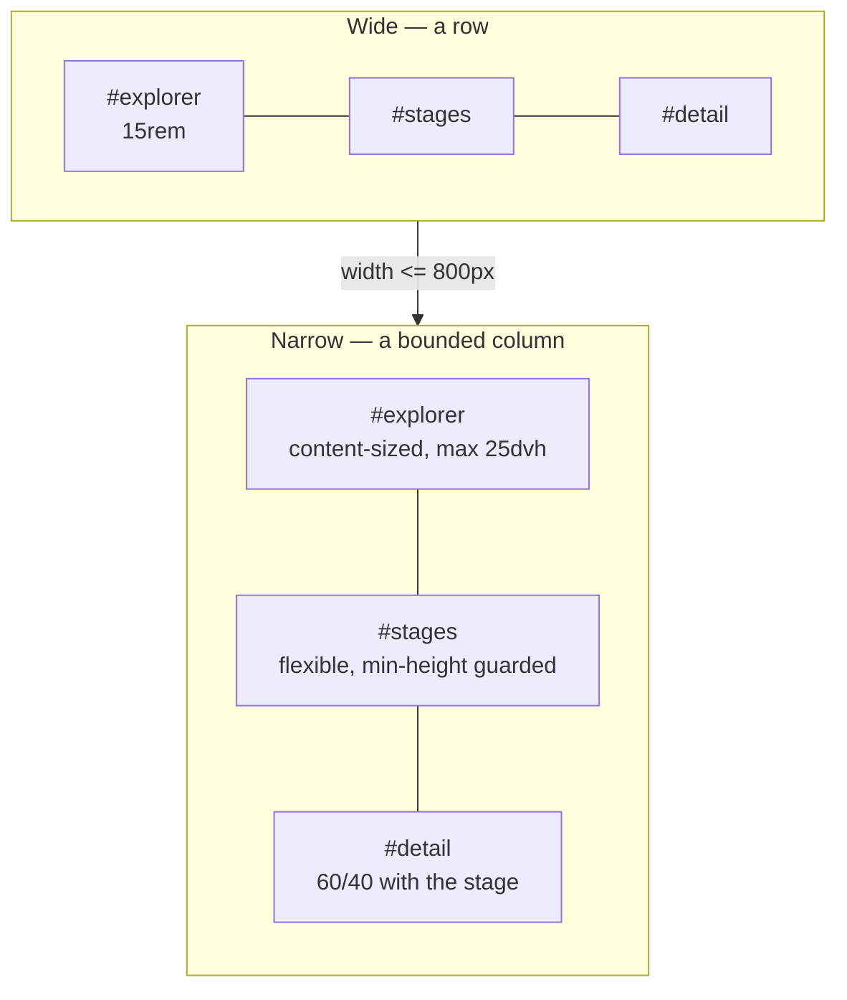

# Live Visualization — Narrow Screen Layout

> [!NOTE]
> Status: **implemented**.

## Goal and scope

Make the report usable on a phone or a narrow window. The report already flipped
`#app` to a column below 800px, but four separate defects meant the stage — the
part the reader came for — was left with a quarter of the window, and the
surrounding chrome painted over it.

This note covers the app shell: the tab row, the Explorer seam, and the vertical
budget. It does not change what any individual tab renders.

## The four defects

Measured on the served report at a 390x780 viewport, the size of a small phone.

| # | Symptom | Root cause | Measured |
| --- | --- | --- | --- |
| 1 | Expanded help paints over the app | `.app-footer` is `flex: 0 0 auto` with no height bound | help panel 1093px tall; `#app` starved to **27px** |
| 2 | The Explorer seam is missing | `#explorer-resizer` keeps `width: 1px` after `#app` turns into a column | seam renders **1x0px**, so its collapse toggle is unreachable |
| 3 | The tab row breaks into lines | `nav.tabs` sets `flex-wrap: wrap`, and the focus controls are absolutely positioned | **3 rows**, 124px of header; Zen and maximize strand on the last row |
| 4 | The stage is unusable | `#explorer` keeps `flex: 0 0 15rem`, which is a *height* in a column | stage gets **184px — 24% of the window** |

Defects 1 and 4 share a shape: in a fixed-height flex column, any sibling that
refuses to shrink starves the one flexible child. `#app` is the flexible child,
so an unbounded footer and a rigid Explorer both come out of the stage's budget.

## Key design decisions

### D1 — The tab row scrolls; it does not collapse into a menu

The tabs are the compiler pipeline: Source, Markdown AST, Dialogue AST,
Desugared AST, Semantic Model. Their **order and adjacency are the information**
— a reader learns the pipeline by seeing the stages laid out in sequence. A
hamburger or overflow menu would hide exactly that, and cost two taps per stage
change plus a new popover with its own focus trap.

So the row becomes a **horizontal scroll strip**: one line, `flex-wrap: nowrap`,
`overflow-x: auto`, with scroll snapping and a fade at the scrollable edge. This
is the conventional answer for a fixed, ordered, medium-length tab set — Material
calls them scrollable tabs, and GitHub's repository nav and VS Code's editor tabs
behave the same way.

Because the strip scrolls, the active tab can sit outside the visible window, so
activating a tab also scrolls it into view.

Clipping the row's cross axis — which keeps a horizontal scroller from sprouting a
vertical scrollbar — also clips the focus ring, because the framework paints it as
a spread shadow *outside* the tab's box and a tab exactly fills the row. The row
therefore carries 3px of vertical padding (overflow is clipped at the padding box)
with a matching negative margin, so the ring is visible and the active tab's
underline still sits flush with the header rule.

### D2 — A scroll strip needs arrows, because not every mouse can scroll sideways

A trackpad makes horizontal scrolling obvious; a plain wheel mouse offers no such
gesture, and on that hardware an off-screen tab is reachable only by tabbing
through it. The row is therefore flanked by arrow buttons, as Material's
scrollable tabs are.

Two details keep them quiet. They **hide entirely** when the row already fits, so
a desktop reader never sees them; and the arrow at a spent end is **disabled
rather than removed**, so pressing repeatedly toward one side never shifts the
other control out from under the cursor.

Their presence narrows the row, which makes ordering matter: the arrows must be
settled *before* the active tab is scrolled into view. Revealing first and
refreshing after leaves the tab clipped by the arrow that has just appeared — a
bug the end-to-end guard caught.

### D3 — The focus controls leave the nav and become a pinned cluster

Zen and maximize were `position: absolute` against the header, which is why they
stranded beside "Semantic Model" once the nav wrapped. They now live in a
`.tabbar-actions` cluster that is a flex sibling of the nav inside a `.tabbar`
row.

This is what keeps them **pinned while the tabs scroll under them** — the whole
point of the scroll strip is that the tabs move and the controls do not. It also
removes two magic offsets (`right: 1.25rem` / `right: 3.35rem`) that had to be
kept in sync with each other by hand.

### D4 — Stacked panels are bounded by the viewport, not by a fixed length

`15rem` is a sensible *width* for a sidebar and a terrible *height* for one: it
does not shrink when there is one file in the tree, and it does not grow when
there are forty. Stacked, the Explorer becomes content-sized with a viewport-
relative cap (`flex: 0 1 auto`, `max-height: 25dvh`), so a one-file project takes
the few rem it needs and a large tree stops at a quarter of the window and
scrolls inside.

A quarter, not a third: on a phone the file list is how the reader *reaches* the
document, not the thing they came to read, so the stage keeps the larger share. A
32dvh cap was measured first and left the stage no better off than the bug did —
248px of stage against 250px of file tree.

### D5 — The help floats when it cannot fit

The footer's help panel gets the same treatment (`max-height: 50dvh`, internal
scroll, `overscroll-behavior: contain`), but a cap alone is not enough on a short
landscape window, where half the viewport is still more than the stage can spare.

So the footer also **shrinks**: it is the reader's transient disclosure, while the
stage is why they opened the report. Two details make that work. The footer needs
`min-height: 0` of its own — its automatic minimum is its content's min-content
height, which a `min-height` on the panel *inside* it cannot reduce. And the
status line opts out of shrinking (`flex: 0 0 auto`), so the help panel absorbs
all of the give and the permanent line is never the part that disappears.

The matching floor belongs on **`#app`, not `#stages`**. A floor on the child
does not hold the parent open — it makes the child overflow the parent and paint
over the footer, which is the bug in a new costume. Measured on a 780x390
landscape window, a floor on `#stages` left it overflowing `#app` by 142px.

Finally, `body` is `overflow: hidden`. Every pane owns its own scroll, so the
document never should; without it, a region that cannot shrink far enough leaks a
page scrollbar over blank space. Overlays are positioned `fixed`, so the clip
does not reach them.

Yielding keeps the layout honest, but it does not make the help *readable*: on a
420px-tall window the panel was squeezed to about one line at a time. Below
`height: 640px` it therefore stops competing for the column altogether and
**floats over the stage**, anchored just above the status line that opened it.
The status line stays visible, so the toggle remains the way to dismiss it, and
the panel carries its own close button that returns focus to that toggle.

Floating is the right shape here rather than a full modal: the reader is
cross-referencing the help against the editor underneath it, so covering the
whole window would defeat the purpose.

### D6 — Narrow defaults stay out of `localStorage`

The collapse controllers persist the reader's choice under a storage key. A
narrow viewport must not write into that: resizing a desktop window would then
silently overwrite a preference the reader set deliberately, and it would follow
them back to a wide screen.

So the narrow layout **never toggles a panel**. It only bounds how much room an
open panel may take. The reader's stored collapse choices mean the same thing at
every width. This follows the same rule Zen mode set — presentation state belongs
in CSS, not in storage.

### D7 — The shell measures in `dvh`

`html, body { height: 100% }` resolves against a viewport that mobile browsers
resize as the URL bar hides, which makes a fixed-height shell jump. The shell now
uses `100dvh`, the unit defined for this case.

## Layout

## Testability

The geometry defects are invisible to unit tests — a `1x0px` seam and a starved
`#app` only exist once a browser has done layout — so each is pinned by a
Playwright assertion on measured geometry at a phone viewport, and each was
confirmed to fail before the fix:

| Guard | Asserts |
| --- | --- |
| Tab row | every tab shares one row's `y` at 390px |
| Focus controls | Zen and maximize stay inside the tab row, right of the tabs |
| Explorer seam | the seam has non-zero height and its toggle is clickable |
| Stage budget | `#stages` keeps a usable share of the window with the help open |
| Focus ring | the row leaves room for a ring painted outside a tab's box |
| Scroll arrows | shown only when the row overflows, disabled at each end, and they move it |
| Floating help | on a short window it overlays the stage, costs it no height, and closes |
| Shell containment | a short landscape window with the help open neither overlaps nor scrolls |

The scroll-into-view behavior is unit-tested against a stubbed `scrollIntoView`,
since jsdom does not lay out or implement it.

Its end-to-end guard deliberately **reloads** rather than clicking. Playwright
scrolls a target into view as part of actionability, so a click-driven assertion
passes even with the reveal deleted; a reload restores the tab from
`sessionStorage` onto a strip that starts at `scrollLeft: 0`, which is the case
the behavior exists for. Each guard here was confirmed to fail with its fix
reverted — that check is what caught this one.
