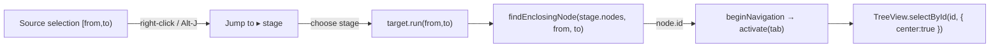

# Live Visualization — Reverse Jump

> [!NOTE]
> Status: **implemented** — the source→node reverse navigation described here ships in the report.

## Goal and scope

Give a writer a way to go **from a place in the Source editor to the matching node
in a later compiler stage** — the reverse of the existing **Jump to source**
(node→source). Right-clicking a selection (or caret) in the Source editor offers a
**Jump to ▸ \<stage\>** submenu; choosing a stage switches to that tab and reveals
the node whose span most tightly encloses the selection, centered in the viewport.

This closes the bidirectional navigation loop. The valuable direction for writers
is source→graph and source→semantic — *"where does this choice, jump, or scene
land in the flow, and does it resolve?"* — and it is precisely the direction that
is **tedious to do by hand**: finding one small node in a large graph is hard,
while a node already shows its source span. Automating the hard direction is where
the value concentrates.

**In scope:** the reverse-navigation action, a nested context-menu affordance in
the Source editor, closest-enclosing-span matching, and reveal-and-center in the
target tab. **Out of scope (planned seam):** a dedicated global keyboard *chord*
(e.g. a leader key then a per-stage digit). A keybinding that merely *opens* the
Jump-to menu at the caret is in scope.

## Functionality checklist

- [x] Right-clicking the Source editor shows a **Jump to** item with a **submenu**
      of the available compiler-stage tabs.
- [x] Choosing a stage switches to that tab (save-safe) and selects the node whose
      span most tightly encloses the current selection, **centered** in view.
- [x] Matching uses the current selection `[from, to)`; with just a caret it uses
      the caret offset. Falls back to the node enclosing `from` when no node
      encloses the whole selection.
- [x] Unavailable stages (a halted compile, no nodes) do not appear as targets;
      every available stage's document root encloses any offset, so a match is
      always found.
- [x] The context menu supports one level of nested submenu with mouse and
      keyboard navigation (open with `ArrowRight`/`Enter`, leave with
      `ArrowLeft`/`Escape`).
- [x] `Alt-J` opens the Jump-to picker at the caret (the entry point of the
      "shortcut series").
- [x] Hovering a stage **previews** its enclosing span in the source with a faint
      highlight, distinct from the live selection; it clears on leave or dismiss.
- [x] The submenu is a **hover-intent flyout** — visible only while the pointer
      rests on the `Jump to` parent or the flyout — and its stage rows carry no
      icon (the label alone reads cleanly).
- [x] Works in a read-only (View) editor as well as Edit — the source is always
      selectable.

## Interfaces and abstractions

| Type / function | Responsibility | Collaborators |
| --- | --- | --- |
| `findEnclosingNode(nodes, from, to)` (`enclosing-node.ts`) | Pure lookup: the tightest span-bearing node enclosing `[from, to)`, else the tightest enclosing `from`, else `null`. | `DisplayNode`, `Span` |
| `ContextMenuItem` (extended, `context-menu.ts`) | Union of an **action** item (`run`) and a **submenu** item (`submenu: ContextMenuItem[]`). | `openContextMenu` |
| `SourceJumpTarget` (`source-view.ts`) | One reverse-jump destination: a stable stage `title`, `run(from, to)` that resolves against the *live* stage and reveals its node, and `preview(from, to)` returning that node's source span for the hover highlight. | `SourceViewOptions.jumpTargets` |
| `jumpToStageByTitle(title, from, to)` (`app.ts`) | Find the enclosing node in the named stage (resolved against the *live* stage set), then `beginNavigation → activate(tab) → view.selectById(id, { center })`. | `findEnclosingNode`, `TreeView`, `activate` |

The Source editor stays decoupled from app internals: it renders the injected
`jumpTargets` titles and calls `run(from, to)` with the current selection. All
stage knowledge and revealing live in `app.ts`.

## Key design decisions

- **Reuse the existing reveal seam.** `TreeView.selectById(id, { center: true })`
  already selects and centers a node by id (the inspector uses it to re-select
  after a rebuild). Reverse jump is therefore *node lookup + the existing
  cross-tab handoff* (`beginNavigation` → `activate`), mirroring `jumpToSource`
  rather than inventing new machinery.
- **Label "Jump to".** The app already says **Jump to source** for cross-stage
  navigation; using **Jump to ▸ \<stage\>** keeps one verb for the whole
  bidirectional pair. (Alternative "View in" was considered; "Jump to" wins on
  vocabulary consistency.)
- **Tightest enclosing span.** Every offset sits inside at least the document-root
  node, so a target almost always exists; the *tightest* enclosing node is the
  most specific and useful. A range selection prefers the tightest node containing
  the whole `[from, to)`; if none does (the selection straddles siblings), it
  falls back to the node containing `from`. Zero-width (synthetic-caret) spans do
  not *enclose*, so they never win.
- **Save-safe navigation.** Leaving the Source tab routes through
  `source.beginNavigation`, exactly like a normal tab switch, so an Auto-save
  flushes or a Manual prompt resolves before the jump.
- **Nested submenu over a flat list.** A `Jump to ▸` flyout groups the stage
  targets under one entry (the user's requested shape and the natural anchor for a
  keyboard series), rather than scattering `Jump to X` items across the top menu.
  It behaves as a **hover-intent** flyout — opening on hover of the parent and
  closing shortly after the pointer leaves both it and the parent — and its stage
  rows are icon-less, since a repeated glyph adds no meaning.
- **Hover preview.** Hovering a stage highlights, in the source, the span its jump
  would reveal — the tightest enclosing node in that stage — via a CodeMirror
  decoration (`jumpPreviewField` + `setJumpPreview`) kept fainter than the live
  selection. It lets a writer see *which* node each stage would land on before
  committing, and clears on leave or when the menu closes.

## Error and boundary cases

- **Unavailable stage** (a halted compile, no nodes) → omitted from the targets.
- **Caret in inter-node whitespace** → resolves to the nearest enclosing ancestor
  (often a scene or the document root); acceptable and still informative.
- **Selection spanning two siblings** → falls back to the node enclosing `from`.
- **Read-only editor** → still selectable; jump works.
- **Stage node set changed by a save** → `run(from, to)` reads the *current* stage
  at call time, never a stale snapshot.

## Integration

`app.ts` builds one `SourceJumpTarget` per available stage and passes the list to
`createSourceView`. The Source editor's `contextmenu` handler (already home to the
surround menu) adds the `Jump to ▸` entry; the `Alt-J` binding opens the same
stage list as a flat picker at the caret.

## Testability

- **`enclosing-node.ts`** — pure and heavily unit-tested: nested spans, ties,
  range vs caret, straddling selections, zero-width spans, empty input.
- **`context-menu.ts`** — unit tests for submenu open/close, keyboard nav, and
  that a leaf `run` still fires.
- **`app` / `source-view`** — a unit test drives a synthetic selection and asserts
  the target `run` resolves the right node id and calls `selectById`.
- **e2e** — right-click the Source editor, open **Jump to**, pick a stage, and
  assert the corresponding node is selected and centered in that tab.

## Deferred

- **Blind keyboard chord.** `Alt-J` opens the Jump-to picker at the caret; a full
  blind chord (a leader then a per-stage digit, jumping with no visible menu) is
  deferred. The picker is data-driven, so the chord can reuse it later.
- **Target ordering.** Stages are listed in pipeline order. A "most specific match
  first" ordering was considered but rejected as less predictable.
