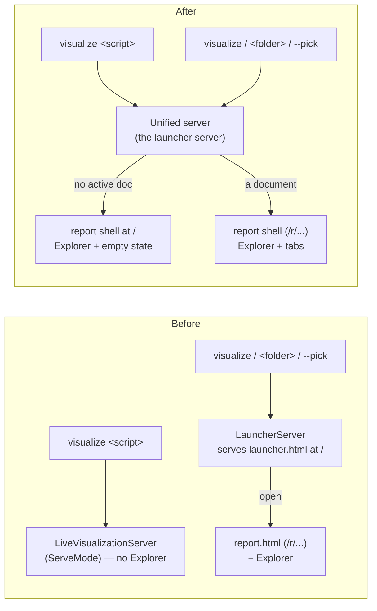

# Live Visualization — Unified Served Shell

> [!NOTE]
> Status: **proposed** — folds the standalone launcher page into the served report
> and converges the two live servers into one. It completes the convergence the
> [File Explorer](./Live%20Visualization%20-%20File%20Explorer.md) note deferred
> (its Decisions #1) and supersedes the standalone
> [File Launcher](./Live%20Visualization%20-%20File%20Launcher.md) as a page: the
> launcher's browse/open/create is now the Explorer sidebar, and its "pick a file
> first" landing is an **empty state** inside the report shell.

## Table of contents

- [Goal and scope](#goal-and-scope)
- [Ubiquitous language](#ubiquitous-language)
- [Functionality checklist](#functionality-checklist)
- [What exists today](#what-exists-today)
- [Architecture](#architecture)
- [Component A — one served shell](#component-a--one-served-shell)
- [Component B — one live server](#component-b--one-live-server)
- [Interfaces and responsibilities](#interfaces-and-responsibilities)
- [Key design decisions](#key-design-decisions)
- [Error and boundary cases](#error-and-boundary-cases)
- [Integration](#integration)
- [Testability](#testability)
- [Open questions](#open-questions)
- [Decisions](#decisions)

## Goal and scope

The live visualization exposes **two navigation surfaces** for the same job — open
a script and read its report:

- The **launcher** (`launcher.html`): a standalone picker page served at `/` that
  browses the launch root, selects a script and a mode, and opens its report.
- The **Explorer** sidebar (in `report.html`): a tree of the same root that opens
  a script by click, creates files and folders, and renames them — a superset of
  the launcher's navigation.

Two pages, two servers, and two client bundles for one workflow is more surface
than the job needs. This note **collapses them into one served shell**: the
report — with its Explorer — is the only page, and the launcher's "no file open
yet" landing becomes an **empty state** inside that shell, modeled on the Config
tab's "create your `dialogue.toml`" call to action.

The work is two components, sequenced:

- **A — one served shell.** The launcher server serves the **report shell** at `/`;
  when no document is active it renders the Explorer beside an empty-state call to
  action. The standalone launcher page, its client module, and its build entry are
  removed.
- **B — one live server.** `visualize <script>` (direct serve) is routed through
  the same launcher/unified server with an initial document, retiring the separate
  `LiveVisualizationServer` and `ServeMode`.

Out of scope: the graceful Ctrl+C shutdown of the SSE stream — a **pre-existing**
launcher-server issue owned by the `fix/visualize-ctrl-c` branch (see
[Integration](#integration)); the deferred in-place document swap (still
navigate-per-file); and any new Explorer capability.

## Ubiquitous language

| Term | Meaning |
| --- | --- |
| **Served shell** | The one report page the server renders — tabs, the Source/Config/graph views, and the Explorer sidebar. Replaces the separate launcher page. |
| **Empty state** | The served shell with **no active document**: the Explorer on the left and a centered "open or create a script" call to action in the main pane. |
| **Active document** | The script the shell currently reports on, or *none* (the empty state). Was always present before this note. |
| **Project** | The root the Explorer browses plus the active document's place in it (`ReportProject`). `ActivePath` becomes **optional** — absent is the empty state. |
| **Unified server** | The launcher server, extended to be the single live server: it serves the shell, browses/opens/creates, **and** starts directly on a given script. |

## Functionality checklist

- [ ] Serve the **report shell** (with the Explorer) at `/` for every launcher
      entry (`visualize`, `visualize <folder>`, `--pick`), replacing the launcher
      page.
- [ ] Render an **empty state** — Explorer plus a centered call to action — when no
      document is active, so a reader opens one from the tree or creates the first.
- [ ] The empty state's **"New dialogue file"** action creates a first script and
      opens it, reusing the Explorer's create flow.
- [ ] Represent **"project present, no active document"** in the model
      (`ReportProject.ActivePath` optional) and render the Explorer with no active
      highlight.
- [ ] `visualize <script>` opens the **same shell** with that script active and the
      Explorer rooted at its folder (or `--root`), via the unified server.
- [ ] Retire `LiveVisualizationServer` and `ServeMode`; the unified server is the
      only live server.
- [ ] Remove the launcher page, its client module and tests, and its build entry;
      the web builds a **single** `report.html`.
- [ ] Preserve every current behavior: hot reload, Live Edit, save modes, config
      tab and create-config, cross-file open, and browser auto-open.

## What exists today

- **CLI routing** (`VisualizeCommand`): `hasScript && !--pick` → `RunServedAsync`
  (direct serve); otherwise → the launcher.
- **Direct serve**: `ServeMode.RunAsync` → a `LiveVisualizationServer` with a single
  fixed `LiveSession`, **no** browse/open/create and **no** `ReportProject`, so a
  directly-served report has **no Explorer**.
- **Launcher serve**: `LauncherServer` serves `launcher.html` at `/` and the report
  at `/r/...`; `Open`/`Create` call `StartSession`, which builds a `LiveSession`,
  sets `session.Project`, and swaps the active document. It already owns
  `/api/document|save|reload|create-config|events` — the same live surface the
  direct server exposes.
- **Client**: `resolveReport()` falls back to `{ stages: [] }`; `app.ts` `build()`
  only activates a tab when `views.length > 0`, so a zero-stage report renders an
  empty shell **without crashing**. The Explorer mounts only when `report.project`
  is present and reads `report.project.activePath` (today **required**).
- **Empty-state precedent**: the Config tab renders `renderNoConfig` — a centered
  explanation and a create button — and `config-create` reloads onto the Config tab
  via a one-shot `sessionStorage` flag.

## Architecture

The launcher server keeps its browse/open/create/rename surface and gains two
things: it **serves the report shell** (not a picker) at `/`, and it can **start on
a given document** for `visualize <script>`. The direct-serve server and its mode
orchestration are deleted.

## Component A — one served shell

**Server.** `LauncherServer`'s `/` route serves the **report shell** instead of the
launcher page. With no active document it renders an *empty* report whose payload
carries the **project** (so the Explorer can browse the root) but no source, stages,
or config, and an absent `ActivePath`. Opening or creating a script through the
Explorer navigates to `/r/<path>/` exactly as today. `LauncherPage` and its
`__LAUNCHER__` slot are removed.

**Model.** `ReportProject.ActivePath` becomes optional (`string?` in C#,
`string | null` in TypeScript). Absent means "no active document" — the empty state.

**Client.** The report shell always mounts the Explorer when `report.project` is
present; the Explorer already tolerates no active script (no highlight, empty
ancestor set). When there is no active document, the main pane shows an **empty
state** — a centered card, modeled on `renderNoConfig`: "No script open — pick one
from the Explorer, or create your first dialogue file," with a **New dialogue file**
button that runs the Explorer's create flow. The launcher module (`launcher.ts`,
`launcher-main.ts`), its page, and its tests are removed; Vite builds a **single**
`report.html` entry.

**Mode.** The launcher's View/Edit mode capsule is dropped: a document opens in the
default mode (`--edit`, else View) and the reader flips the in-report toggle. One
accent-driven control, not two.

## Component B — one live server

`visualize <script>` is routed through the unified server: resolve the root
(`--root`, else the script's folder), start the server rooted there, **start a
session for the script immediately** (the launcher's `StartSession` path), and open
the browser at its report URL. The report gains the Explorer for free.

`LiveVisualizationServer`, `ServeMode`, and `IVisualizeRunner.RunServedAsync` are
retired; the unified server absorbs their single-document responsibilities (session
creation, watchers, config-create, browser open), all of which it already performs
for the launcher path. `RunEmit`/`RunStatic` (the `--emit`/`-o` non-serving paths)
are untouched.

## Interfaces and responsibilities

| Type | Change | Responsibility after |
| --- | --- | --- |
| `LauncherServer` | Serve the report shell at `/`; add a "start with an initial document" entry | The single live server: shell, browse/open/create/rename, and direct start |
| `ReportProject` | `ActivePath` → optional | Carry the root and the active document *or its absence* |
| Unified runner (`LauncherRunner`, extended) | Accept an optional initial script; open the report URL | Start the unified server for every `visualize` serve path |
| `VisualizeCommand` | Route `visualize <script>` to the unified runner | One serve path; `--pick`/no-script open the empty shell |
| `LiveVisualizationServer`, `ServeMode`, `IVisualizeRunner.RunServedAsync` | **Deleted** | — |
| `LauncherPage` (`__LAUNCHER__`) | **Deleted** | — |
| `launcher.ts`, `launcher-main.ts`, `launcher.html` | **Deleted** | — |
| Explorer (`explorer.ts`) | Reused unchanged for browse/open/create/rename | Sole navigation surface; drives the empty-state create |

## Key design decisions

1. **The Explorer is the one navigation surface; the launcher landing becomes an
   empty state.** The Explorer already browses, opens, creates, and renames — a
   superset of the picker. A persistent sidebar plus an empty-state call to action
   is less surface and better context than a separate page, and it matches the
   Config tab's own "create when absent" pattern.
2. **Optional `ActivePath` models "no active document."** The one model change that
   lets the shell render the Explorer over the root with nothing open, rather than a
   second "no document" payload shape.
3. **One live server, reached two ways.** The launcher server already owns the live
   surface; `visualize <script>` starts it on a document instead of standing up a
   parallel server. Deleting the direct server removes a whole subsystem and its
   tests rather than maintaining two.
4. **Drop the mode picker.** The report's runtime View/Edit toggle is the single
   source of truth; the default comes from `--edit`.
5. **One web build.** Collapsing to a single `report.html` entry removes the second
   Vite build, the launcher bundle, and the `__LAUNCHER__` injection.

## Error and boundary cases

- **Empty project (no scripts).** The empty state's create action makes the first
  `.dialogue.md` and opens it; the Explorer's existing empty-tree message still
  shows under the toolbar.
- **`visualize <script>` outside any sensible root.** Root resolution is unchanged
  from today (`--root`, else the script's folder); the script is the active
  document and the Explorer is rooted at that folder.
- **A served report with no project** (a bare library render or static export). No
  Explorer, no empty-state create — unchanged; the empty state is a served-project
  concept only.
- **Reopening after create.** Reuses the Explorer's save-safe navigation (Auto
  flush / Manual prompt) — no new path.

## Integration

- **CLI.** `visualize`, `visualize <folder>`, and `--pick` open the empty shell;
  `visualize <script>` opens it on that script. `--emit`/`-o` are unchanged.
- **`fix/visualize-ctrl-c` overlap (coordinate merge).** That branch fixes a
  **pre-existing** graceful-shutdown bug (the SSE stream holds Ctrl+C shutdown open)
  on *both* servers and the runners. This convergence deliberately **does not touch
  shutdown**: retiring `LiveVisualizationServer`/`ServeMode` makes that branch's
  edits to those files moot, while its `LauncherServer`/runner shutdown fix still
  applies to — and benefits — the surviving unified server. Whichever branch merges
  first, the other resolves the overlap on `LauncherServer.cs`/`LauncherRunner.cs`
  (a delete-vs-edit on the retired files; a content merge on the survivors).

## Testability

- **CLI** (`VisualizeCommandTests`): the direct-serve tests
  (`Visualize_ScriptOnly_…`, `_ScriptWithEdit_`, `_EditWithoutRoot_`,
  `_WithADiscoveredConfig_`) now assert the **unified runner** is called with the
  script and mode; `_Pick_` and `_NoArguments_` open the shell with no initial
  document; `_Export_`/`_Emit…_` are unchanged.
- **Deleted suites**: `ServeModeTests`, `LiveVisualizationServerTests`, and the
  `RunServedAsync` runner test go with their subjects.
- **Server** (`LauncherServerTests`): `/` now serves the report shell (assert the
  report doctype and an empty-project payload); a "start on a document" test covers
  the `visualize <script>` path.
- **Client**: a `main`/`app` unit test builds a **zero-stage project report** and
  asserts the empty-state call to action renders and its button runs create;
  `launcher.test.ts` is removed. The `launcher` live e2e moves to an **Explorer
  empty-state** e2e (open the shell, create the first file, land on its report).

## Open questions

1. **One PR or two?** A (shell merge) is a clean intermediate that leaves
   `visualize <script>` on the direct server; B retires it. Two PRs de-risk B and
   review smaller, but the user asked for "A then B, reviewed at merge-ready" — so
   the default is **one branch, A's commits then B's**, split into two PRs only if B
   proves too entangled.
2. **Keep `--pick` as an alias?** With one navigation surface, `--pick` and
   no-script both open the empty shell, so `--pick` becomes a synonym. Keep it (a
   harmless, documented alias) rather than removing a flag.
3. **Empty-state scope.** Offer only "create your first *script*", not
   "create a `dialogue.toml`" — the Config tab already owns config creation once a
   document is open.

## Decisions

Settled going in (revisited at crosscheck):

1. **Converge, don't maintain two.** This implements the
   [File Explorer](./Live%20Visualization%20-%20File%20Explorer.md) note's
   Decisions #1 (deferred convergence) and retires the standalone launcher page —
   the [File Launcher](./Live%20Visualization%20-%20File%20Launcher.md) note is
   superseded as a *page* while its browse/open/create *behavior* lives on in the
   Explorer.
2. **Shutdown is out of scope.** Owned by `fix/visualize-ctrl-c`; see
   [Integration](#integration).
