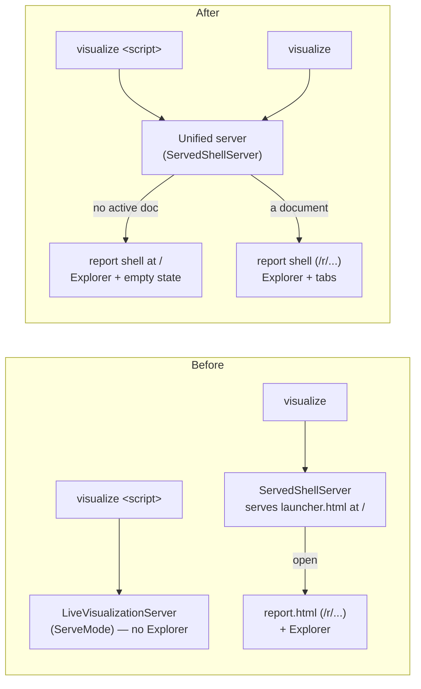

# Live Visualization — Unified Served Shell

> [!NOTE]
> Status: **implemented**. Folds the standalone launcher page into the served
> report and converges the two live servers into one. It completes the convergence
> the [File Explorer](./Live%20Visualization%20-%20File%20Explorer.md) note deferred
> (its Decisions #1) and supersedes the standalone
> [File Launcher](./Live%20Visualization%20-%20File%20Launcher.md) as a page: the
> launcher's browse/open/create is now the Explorer sidebar, and its "pick a file
> first" landing is an **empty state** inside the report shell.

## Table of contents

- [Goal and scope](#goal-and-scope)
- [Ubiquitous language](#ubiquitous-language)
- [Functionality checklist](#functionality-checklist)
- [Architecture](#architecture)
- [Component A — one served shell](#component-a--one-served-shell)
- [Component B — one live server](#component-b--one-live-server)
- [Interfaces and responsibilities](#interfaces-and-responsibilities)
- [Key design decisions](#key-design-decisions)
- [Error and boundary cases](#error-and-boundary-cases)
- [Integration](#integration)
- [Testability](#testability)
- [Decisions](#decisions)

## Goal and scope

The live visualization used to expose **two navigation surfaces** for one job —
open a script and read its report:

- The **launcher** (`launcher.html`): a standalone picker page served at `/` that
  browsed the launch root, selected a script and a mode, and opened its report.
- The **Explorer** sidebar (in `report.html`): a tree of the same root that opens a
  script by click, creates files and folders, and renames them — a superset of the
  launcher's navigation.

Two pages, two servers, and two client bundles for one workflow was more surface
than the job needs. This note **collapsed them into one served shell**: the report —
with its Explorer — is the only page, and the launcher's "no file open yet" landing
is now an **empty state** inside that shell, modeled on the Config tab's "create
your `dialogue.toml`" call to action.

The work landed as two components, in sequence:

- **A — one served shell.** The server renders the **report shell** at `/`; with no
  active document it renders the Explorer beside an empty-state call to action. The
  standalone launcher page, its client module, and its build entry are gone.
- **B — one live server.** `visualize <script>` is routed through the same unified
  server with an initial document, retiring the separate `LiveVisualizationServer`
  and `ServeMode`.

Out of scope: the graceful Ctrl+C shutdown of the SSE stream — a **pre-existing**
server issue owned by the `fix/visualize-ctrl-c` branch (see
[Integration](#integration)); the deferred in-place document swap (still
navigate-per-file); and any new Explorer capability.

## Ubiquitous language

| Term | Meaning |
| --- | --- |
| **Served shell** | The one report page the server renders — tabs, the Source/Config/graph views, and the Explorer sidebar. Replaces the separate launcher page. |
| **Empty state** | The served shell with **no active document**: the Explorer on the left and a centered "open or create a script" call to action in the main pane. |
| **Active document** | The script the shell currently reports on, or *none* (the empty state). |
| **Project** | The root the Explorer browses plus the active document's place in it (`ReportProject`). `ActivePath` is **optional** — absent (omitted from the payload) is the empty state. |
| **Unified server** | The one live server (`ServedShellServer`): it serves the shell, browses/opens/creates/renames, **and** starts directly on a given script. |
| **Pinned document** | The script a served `visualize <script>` starts on. A pinned run redirects `/` to that report; a browse-only run keeps `/` on the empty state. |
| **Served root** | The folder the server hosts as static assets, resolved from the document (its own folder, an ancestor pinned by `--root`, or the smallest covering folder with consent). The report sits at the document's sub-path under it. |

## Functionality checklist

- [x] Serve the **report shell** (with the Explorer) at `/` for every browse entry
      (`visualize`), replacing the launcher page.
- [x] Render an **empty state** — Explorer plus a centered call to action — when no
      document is active, so a reader opens one from the tree or creates the first.
- [x] The empty state's **"New dialogue file"** action creates a first script and
      opens it, reusing the Explorer's create flow.
- [x] Represent **"project present, no active document"** in the model
      (`ReportProject.ActivePath` optional) and render the Explorer with no active
      highlight.
- [x] `visualize <script>` opens the **same shell** with that script active and the
      Explorer rooted at its served root, via the unified server.
- [x] Retire `LiveVisualizationServer` and `ServeMode`; the unified server is the
      only live server.
- [x] Remove the launcher page, its client module and tests, and its build entry;
      the web builds a **single** `report.html`.
- [x] Preserve every current behavior: hot reload, Live Edit, save modes, the Config
      tab and create-config, cross-file open, browser auto-open, and — for a served
      `visualize <script>` — symlink resolution and consent-gated `--render-root`
      asset hosting.

## Architecture

The unified server keeps its browse/open/create/rename surface and gained two
things: it **serves the report shell** (not a picker) at `/`, and it can **start on
a given document** for `visualize <script>`. The direct-serve server and its mode
orchestration are deleted; the document-resolution helpers they used
(`ServeRootResolver`, `SymlinkResolver`, `ServeRoot`, consent) live on in the
unified runner.

## Component A — one served shell

**Server.** `ServedShellServer`'s `/` route serves the **report shell** instead of the
launcher page. With no active document it renders an *empty* report whose payload
carries the **project** (so the Explorer can browse the root) but no source, stages,
or config, and an absent `ActivePath`. Opening or creating a script through the
Explorer navigates to `/r/<path>/` exactly as before. `RenderEmptyShell` on
`CompilationVisualizer` builds that payload; `LauncherPage` and its `__LAUNCHER__`
slot are removed.

**Model.** `ReportProject.ActivePath` is optional: `string?` in C#, and
`activePath?: string` in TypeScript. The serializer omits a null `ActivePath`
(`JsonIgnoreCondition.WhenWritingNull`), so the client sees the field **absent**
(`undefined`), not `null` — the empty state. Client guards that read the active
path tolerate `undefined` (ancestor folders, the parent-path helper).

**Client.** A served empty state is its own entry path, `initEmptyShell` in
`empty-shell.ts`: it runs the app frame, mounts the Explorer over the project on the
left with minimal fetch-based ports (browse/open/create/create-folder/rename), and
shows a centered call to action — modeled on `renderNoConfig`: "No script open —
pick a script from the Explorer on the left, or create your first dialogue file,"
with a **New dialogue file** button that clicks the Explorer's own New File action.
This path deliberately skips the live-session machinery (hot reload, save modes, the
View/Edit toggle) — there is nothing to edit until a script is opened, at which point
navigation to that document's report wires it all. The launcher module
(`launcher.ts`, `launcher-main.ts`), its page, and its tests are removed; Vite builds
a **single** `report.html` entry.

**Mode.** The launcher's View/Edit mode capsule is dropped: a document opens in the
default mode (`--edit`, else View) and the reader flips the in-report toggle. One
accent-driven control, not two.

## Component B — one live server

`visualize <script>` is routed through the unified server. The runner resolves the
**served root** from the document exactly as the direct server did — its own folder,
an ancestor pinned by `--root`, or the smallest folder covering the document and any
images it links above its folder, hosted only with the reader's consent — reusing
`ServeRootResolver`, `SymlinkResolver`, and `ConsoleHostConsent`. It then roots the
unified server there, **starts a session for the script immediately**
(`StartInitialDocument`), and opens the browser on its report URL under the `/r`
mount. The report gains the Explorer for free, and the served root is the tree the
Explorer browses.

A run that pins an initial document redirects `/` to that report, so a reader who
navigates to `/` still lands on it. A browse-only run (`visualize` with no script)
leaves `/` on the empty state even after a script is opened from the tree, so
returning to `/` browses again rather than bouncing to the last-opened report.

`LiveVisualizationServer`, `ServeMode`, and `IVisualizeRunner.RunServedAsync` are
retired; the unified server absorbs their single-document responsibilities (session
creation, watchers, config-create, browser open), all of which it already performed
for the launcher path. `RunEmit`/`RunStatic` (the `--emit`/`-o` non-serving paths)
are untouched.

## Interfaces and responsibilities

| Type | Change | Responsibility after |
| --- | --- | --- |
| `ServedShellServer` | `/` serves the shell (redirecting to the pinned report when one is set); `StartInitialDocument` starts the run's initial script | The single live server: shell, browse/open/create/rename, and direct start |
| `CompilationVisualizer` | `RenderEmptyShell(root, mode)` added | Render the project-only empty shell for a served run |
| `ReportProject` | `ActivePath` → optional | Carry the root and the active document *or its absence* |
| `ServedShellRunner` (`IServedShellRunner`) | `RunAsync(script?, root?, mode, …)` — one method, two branches | Serve the empty shell (no script) or open a document (resolve served root, start it, open `/r/…`) |
| `VisualizeCommand` | Route `visualize <script>` to the unified runner | One serve path; no-script opens the empty shell |
| `ServeRootResolver`, `SymlinkResolver`, `ServeRoot`, `IHostConsent` | Reused by the unified runner | Resolve the served root and the document's real path, with consent |
| `LiveVisualizationServer`, `ServeMode`, `IVisualizeRunner.RunServedAsync` | **Deleted** | — |
| `LauncherPage` (`__LAUNCHER__`) | **Deleted** | — |
| `launcher.ts`, `launcher-main.ts`, `launcher.html` | **Deleted** | — |
| `empty-shell.ts` | **Added** | The empty-state client entry: Explorer plus the create call to action |
| Explorer (`explorer.ts`) | Reused for browse/open/create/rename | Sole navigation surface; drives the empty-state create |

## Key design decisions

1. **The Explorer is the one navigation surface; the launcher landing becomes an
   empty state.** The Explorer already browses, opens, creates, and renames — a
   superset of the picker. A persistent sidebar plus an empty-state call to action
   is less surface and better context than a separate page, and it matches the
   Config tab's own "create when absent" pattern.
2. **Optional `ActivePath` models "no active document."** The one model change that
   lets the shell render the Explorer over the root with nothing open, rather than a
   second "no document" payload shape. Because the serializer omits a null value,
   the field is *absent* on the client (`undefined`), and the guards read it that way.
3. **One live server, reached two ways.** The unified server already owned the live
   surface; `visualize <script>` starts it on a document instead of standing up a
   parallel server. Deleting the direct server removed a whole subsystem and its
   tests rather than maintaining two.
4. **Preserve served-root resolution by reusing it, not reimplementing it.** The
   runner keeps `ServeRootResolver`/`SymlinkResolver`/consent, so symlink resolution
   and consent-gated `--render-root` hosting survive the convergence unchanged; only
   the report's URL moves under the `/r` mount (e.g. `/r/proj/`).
5. **Redirect `/` only for a pinned run.** A served `visualize <script>` redirects
   `/` to its report; a browse-only run keeps `/` on the empty state so it stays a
   home to browse from. One boolean on the server draws the line.
6. **Drop the mode picker.** The report's runtime View/Edit toggle is the single
   source of truth; the default comes from `--edit`.
7. **One web build.** Collapsing to a single `report.html` entry removed the second
   Vite build, the launcher bundle, and the `__LAUNCHER__` injection.

## Error and boundary cases

- **Empty project (no scripts).** The empty state's create action makes the first
  `.dialogue.md` and opens it; the Explorer's existing empty-tree message still
  shows under the toolbar.
- **`visualize <script>` that links images above its folder.** The runner resolves
  the smallest covering folder and asks the reader's consent before hosting it (an
  explicit `--render-root` skips the prompt); a refusal falls back to the document's
  own folder, so those images simply do not load — unchanged from the direct server.
- **A broken or cyclic symlink for the script.** Resolution throws and the run exits
  non-zero with a message, as before.
- **A served report with no project** (a bare library render or static export). No
  Explorer, no empty-state create — unchanged; the empty state is a served-project
  concept only.
- **Inline create teardown.** Submitting the Explorer's inline create with Enter
  removes the focused field, which fires a blur in a real browser; the teardown is
  conditional (a `settled` flag, like the rename field) so it runs once instead of
  throwing and losing the submit. This surfaced through the empty-state call to
  action and is covered by the live e2e.
- **Reopening after create.** Reuses the Explorer's save-safe navigation (Auto flush
  / Manual prompt) — no new path.

## Integration

- **CLI.** `visualize` (no script) opens the empty shell; `visualize <script>` opens
  it on that script. `--emit`/`-o` are unchanged. `--root` pins the served root for
  a script and is the browse root for the empty shell.
- **`fix/visualize-ctrl-c` (integrated).** That branch fixed a **pre-existing**
  graceful-shutdown bug (the SSE stream held Ctrl+C shutdown open) on *both* servers
  and the runners, and merged first as #185. This convergence deliberately **does not
  touch shutdown**, so integrating `main` was mechanical: its edits to the retired
  `LiveVisualizationServer`/`ServeMode` are moot (this branch deletes them), while its
  `WaitForShutdownAsync` and SSE `ApplicationStopping` handling on the surviving
  unified server are preserved — the runner's serve loop awaits `WaitForShutdownAsync`.

## Testability

- **CLI** (`VisualizeCommandTests`): the served tests (`Visualize_ScriptOnly_…`,
  `_ScriptWithEdit_`, `_EditWithoutRoot_`, `_WithADiscoveredConfig_`) assert the
  **unified runner** is called with the script, `--root`, and mode; `_Pick_` and
  `_NoArguments_` open the shell with no initial document; `_Export_`/`_Emit…_` are
  unchanged.
- **Deleted suites**: `ServeModeTests`, `LiveVisualizationServerTests`, and the
  `RunServedAsync` runner test went with their subjects.
- **Server** (`ServedShellServerTests`): the landing test asserts the server serves
  whatever shell HTML it is handed; `StartInitialDocument_RootRedirectsToTheReport`
  covers the pinned `visualize <script>` path (the `/` redirect and the report under
  `/r`).
- **Runner** (`ServedShellRunnerTests`): an invalid root, the no-script empty shell
  (the landing carries a project payload), and a script opening its report under the
  `/r` mount.
- **Client** (`explorer.test.ts`, `empty-shell.test.ts`): the Explorer tolerates an
  absent active path; the empty shell mounts the Explorer and the create call to
  action. `launcher.test.ts` is removed.
- **Live e2e**: the `launcher` spec becomes the **empty-shell** spec (browse the
  tree, open a script into `/r/`, create from the call to action); the render-root
  spec expects the report under `/r/proj/`. Every existing live/config/live-edit
  spec now runs against the unified server unchanged.

## Decisions

Settled in review and confirmed at crosscheck:

1. **Converge, don't maintain two.** This implements the
   [File Explorer](./Live%20Visualization%20-%20File%20Explorer.md) note's
   Decisions #1 (deferred convergence) and retires the standalone launcher page —
   the [File Launcher](./Live%20Visualization%20-%20File%20Launcher.md) note is
   superseded as a *page* while its browse/open/create *behavior* lives on in the
   Explorer.
2. **Shutdown was out of scope.** Fixed separately by #185 and integrated here; see
   [Integration](#integration).
3. **One branch, A's commits then B's.** Reviewed at merge-ready as one pull
   request; B stayed cohesive enough not to warrant splitting.
4. **`--pick` (later removed).** It duplicated the no-script path — both opened the
   empty shell — so the redundant flag was dropped; browse by running `visualize`
   with no script.
5. **The empty state offers only "create your first script."** The Config tab owns
   `dialogue.toml` creation once a document is open.
