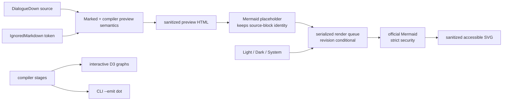

# Mermaid authoring diagrams

> [!NOTE]
> Status: **implemented**. How Mermaid *reaches* the page has since changed: it is no
> longer bundled into the client, but fetched on demand when serving and inlined only
> for a script that draws a diagram when exporting. Sizes quoted below describe the
> bundle as this note shipped it. See increment 16 of the
> [Development Cycle Optimization](Development%20Cycle%20Optimization.md) note.

## Table of contents

- [Goal and scope](#goal-and-scope)
- [Functionality checklist](#functionality-checklist)
- [Ubiquitous language](#ubiquitous-language)
- [Design](#design)
- [Key design decisions](#key-design-decisions)
- [Error and boundary cases](#error-and-boundary-cases)
- [Integration](#integration)
- [Testability](#testability)
- [Open questions](#open-questions)

## Goal and scope

Render an author's fenced `mermaid` blocks as diagrams in every Markdown preview
while keeping them out of compiled dialogue. The browser bundles the official
Mermaid renderer, so live and exported reports stay self-contained and work
offline. Compiler-stage graphs remain the interactive D3 views; the CLI keeps
Graphviz DOT emission and retires its Mermaid renderer.

In scope:

- Mermaid diagrams in the Source preview and the node/region previews.
- Live re-rendering while the author edits a diagram.
- Safe Markdown and SVG insertion, theme-aware diagrams, accessible output, and
  an inline source fallback for invalid Mermaid.
- Removal of `--emit mermaid`, `EmitFormat.Mermaid`, and the C#
  `MermaidRenderer`; `--emit dot` remains.
- Documentation, migration guidance, third-party notices, and release notes.

Out of scope:

- Replacing any compiler-stage D3 graph with Mermaid.
- Validating Mermaid in the compiler or adding Mermaid failures to the Problems
  panel.
- Loading Mermaid from a CDN or requiring Node at report runtime.
- Designing the future serialized dialogue/runtime IR or its exporters.

## Functionality checklist

- [x] A fenced block whose first info-string token is `mermaid`
      (case-insensitive) renders as an SVG diagram in every Markdown preview
      surface.
- [x] Other fenced code blocks keep their ordinary source rendering.
- [x] An ignored Mermaid block keeps the compiler-projected **Ignored** cue around
      its rendered diagram.
- [x] Editing diagram source updates the preview without allowing an older
      asynchronous render to replace newer content.
- [x] Invalid or incomplete Mermaid keeps its source visible and shows a compact,
      local rendering message.
- [x] Diagram colors follow Light, Dark, and System theme changes.
- [x] Diagram output has an accessible name and description where the source
      supplies `accTitle` / `accDescr`, with a useful fallback otherwise.
- [x] Markdown HTML and Mermaid SVG cross explicit sanitization boundaries.
- [x] The report remains one self-contained, offline HTML file when exported, and carries
      Mermaid only for a script that draws a diagram.
- [x] CI holds the client every reader loads, and Mermaid separately, under approved raw limits.
- [x] `--emit dot` behaves unchanged.
- [x] `--emit mermaid` fails with a migration message for one release.
- [x] The C# Mermaid output surface is removed.

## Ubiquitous language

| Term | Meaning |
| --- | --- |
| **Authoring aid** | Markdown that helps the writer but does not become dialogue. A Mermaid block is an authoring aid and is ignored by the default unmodeled-Markdown policy. |
| **Diagram source** | The text inside a fenced `mermaid` block. |
| **Diagram preview** | The SVG Mermaid renders from diagram source inside a Markdown preview. |
| **Markdown preview** | A rendered view of source Markdown: the whole-document Source preview or a node/region preview. |
| **Stage graph** | A compiler-stage visualization rendered by the report's existing D3 graph UI. |
| **Graph text emission** | CLI output of a stage graph for another tool. After this component, DOT is the only graph text emission. |
| **Exporter** | A future adapter that writes a stable serialized dialogue/runtime IR into another format, such as Yarn Spinner or Mermaid. It is not part of this component. |

## Design



Marked remains responsible for Markdown. Its fenced-code renderer recognizes the
normalized language label `mermaid` and emits a diagram placeholder containing
the escaped source. The placeholder preserves the source block's identity so
editor/preview scroll synchronization still pairs a fenced code block with one
preview block.

A browser-side Mermaid preview enhancer owns the asynchronous step. It finds
placeholders after a preview is mounted, renders them through one serialized
queue, and replaces only the placeholder from the current render revision.
Source editing may request another render before the previous one completes; a
detached placeholder or stale revision is ignored.

The existing preview semantics remain authoritative. A Mermaid block that the
compiler marks `IgnoredMarkdown` renders as a diagram inside the same labeled
ignored region that now surrounds an ignored code block. Changing the project
policy changes the cue, not whether the Markdown preview can draw the diagram.

### Preview contract

| Concern | Contract |
| --- | --- |
| Fence match | Normalize the info string, split on whitespace, and compare the first token to `mermaid` case-insensitively. A suffix may carry future metadata; an unlabeled fence never becomes a diagram. |
| Surfaces | Apply the same rule to the whole-document Source preview, the graph inspector's node and region previews, and the Semantic tab's sticky node preview. |
| Valid source | Replace the placeholder's contents with SVG. The source remains available in the editor or the inspector's adjacent **Source** section rather than being duplicated under the diagram. |
| Invalid source | Keep the fenced source in its ordinary `<pre><code>` form and add one local rendering message. |
| Ignored source | Keep the complete ignored-region wrapper around the diagram or fallback, including its title and muted presentation. |
| Accessibility | Prefer Mermaid's `accTitle` / `accDescr`; otherwise label the diagram wrapper **Mermaid diagram**. |
| Scroll identity | Mark the wrapper as a rendered fenced-code block so block-based scroll synchronization continues to pair it with `FencedCode`. |

| Collaborator | Responsibility |
| --- | --- |
| Marked preview renderer (`text.ts`) | Recognize a Mermaid-labeled fence and emit escaped, source-preserving placeholder HTML; leave other code fences alone. |
| Preview HTML boundary | Sanitize Marked output before it reaches `innerHTML`, preserving required preview classes, heading IDs, links, images, and Mermaid placeholders. |
| Mermaid preview enhancer (new) | Configure Mermaid inside the serialized queue, assign unique render IDs, reject stale results, show source fallbacks, and rely on Mermaid's strict SVG sanitization. |
| Preview hosts | Invoke the enhancer after writing Source, node, semantic-detail, or region preview HTML; dispose scheduled work when a host disappears. |
| Theme integration | Notify the enhancer when the effective theme changes, including System-theme media-query changes, so mounted diagrams re-render. |
| CLI visualization | Accept DOT as the only graph text format and explain the retired Mermaid option. |

## Key design decisions

### D1 — Mermaid draws authoring aids, not compiler stages

The report already has an interactive graph language: D3 nodes, routes, regions,
selection, zoom, and inspectors. A second Mermaid view of every tab would add
weight without adding a better interaction.

A fenced Mermaid block has a different job. The writer put it beside the
dialogue to explain a relationship, state flow, or sequence. Drawing that block
in the Markdown preview makes an existing authoring aid useful while the
compiler continues to omit it from speech.

### D2 — Bundle the official Mermaid package

Use the official MIT-licensed `mermaid` package, pinned by `package-lock.json`.
It is the reference implementation and supports the full Mermaid language. A
six-diagram subset would make a `mermaid` fence mean something narrower in
DialogueDown than it means in GitHub, editors, and Mermaid's own tooling.

The cost is deliberate and measured against the current report:

| Build | Raw HTML | Gzip | Change |
| --- | ---: | ---: | ---: |
| Current report | 1.37 MB | 465 KB | — |
| Implemented report with `mermaid@11.16.1` | 4.74 MB | 1.36 MB | +3.37 MB raw / +893 KB gzip |

These numbers come from a disposable copy of the actual Vite project: add the
single Mermaid import, run `npm run build`, then compare `wc -c` and `gzip -c`
for `dist/report.html`. They measure the integrated report, not the package's
published archive.

The package is always bundled. This preserves the report's one-file offline
contract and lets a live editor render the first Mermaid fence immediately,
without a CDN, a server-only asset path, or a second build artifact. The
dependency and its license are added to `web/NOTICE.md`.

The existing report-bundle verification also gains a 5 MB raw size limit. The
implemented 4,742,002-byte report leaves about 258 KB of headroom. Crossing the limit
requires an explicit dependency or threshold review rather than silently making
every report heavier.

### D3 — Recognize an explicit fence on every preview surface

Only a fenced code block whose first normalized language token equals `mermaid`
(case-insensitive) becomes a diagram. Diagram-looking text in an unlabeled code
block stays code.

The rule applies to every Markdown preview. Source, Document-node, code-block
node, region, and semantic-detail views therefore agree on what the same source
means. A shared enhancer prevents each panel from inventing its own lifecycle.

### D4 — Keep Markdown synchronous; enhance diagrams asynchronously

The existing Markdown functions return HTML synchronously and support typing on
every keystroke. They continue to do so. Mermaid enhancement happens after the
HTML is mounted.

The Source preview debounces enhancement for 200 ms while typing; other previews
render immediately. Each host keeps at most one pending batch. A new edit replaces
that pending batch rather than adding an unbounded queue of obsolete renders.
Once a Mermaid call has started it is not aborted; its result is discarded if a
newer host revision exists.

Mermaid calls run through one promise queue because its configuration is global.
Before each serialized batch, the adapter initializes Mermaid with the current
effective theme and locked security settings. Every request carries the preview
host's revision, and only the current, still-connected placeholder may receive
the result.

```text
mountPreview(host, html):
    revision = nextRevision(host)
    host.replaceChildren(sanitizeMarked(html))
    debounceOrRun(host, revision)

renderBatch(host, revision):
    coalesce any pending batch for host
    enqueue globally:
        configure Mermaid for current theme
        for each placeholder:
            result = render(uniqueId(), diagramSource)
            if host revision is current and placeholder is connected:
                mount result
```

### D5 — Make both trust boundaries explicit

Marked does not sanitize its output. DOMPurify 3.4.13, used under its
Apache-2.0 license option, sanitizes all Marked output before mounting it. The
HTML policy:

- remove scripts, event handlers, unsafe URL schemes, and active embeds;
- preserve safe Markdown HTML, heading IDs, preview classes, local image/link
  paths, ignored-region wrappers, and Mermaid placeholders; and
- express required additions as a small explicit allowlist rather than disabling
  sanitization for a preview feature.

Genuine placeholders carry a random per-page capability token generated outside
author-controlled Markdown. The enhancer renders only a placeholder carrying
that exact token, so raw HTML cannot forge the internal Mermaid marker even
though safe `data-*` attributes survive sanitization.

Initialize Mermaid with `startOnLoad: false` and `securityLevel: "strict"`.
Global configuration locks security and theme settings so diagram-local
directives cannot weaken them. Mermaid's strict path already sanitizes the
generated SVG through DOMPurify; the adapter relies on that documented boundary
rather than applying a second generic SVG pass that could remove Mermaid's
markers or styles. Mermaid links, `bindFunctions`, and click callbacks stay
disabled.

### D6 — Re-render for theme; preserve accessibility

Mermaid bakes theme colors into generated SVG. The enhancer derives literal hex
colors from the report's effective theme and re-renders mounted diagrams when
the explicit preference changes or the System color scheme changes. The shared
queue applies the new global Mermaid configuration before that re-render, so two
themes cannot race through Mermaid's process-wide state.

Mermaid's `accTitle` and `accDescr` become SVG accessibility metadata. When they
are absent, the preview wrapper supplies the accessible name **Mermaid diagram**
and retains the source fallback for inspection. Diagrams participate in the
existing axe-based browser checks.

### D7 — Keep DOT emission; retire compiler-stage Mermaid emission

`ddown compile --emit dot` remains the current portable stage-graph output.
The Mermaid enum arm, renderer, tests, README example, and CLI documentation are
removed. For one release, `--emit mermaid` receives a specific validation
message directing writers to preview fenced Mermaid diagrams and graph-tool
users to DOT.

The visualizer is at version 0.1 and explicitly labels its API unstable. Removing
the C# renderer now avoids turning the transient `DisplayGraph` presentation
model into a compatibility promise.

### D8 — Future exporters wait for stable serialized IR

No placeholder exporter interface is added here. Yarn Spinner, Mermaid, JSON, or
other outputs should consume the future stable serialized dialogue/runtime IR,
not the interactive report's `DisplayGraph`. That work gets its own design
component when the IR exists; [#269](https://github.com/pengzhengyi/dialoguedown/issues/269)
tracks it.

## Error and boundary cases

| Case | Behavior |
| --- | --- |
| Empty Mermaid fence | Keep the source block visible with an inline “empty diagram” message. |
| Incomplete syntax while typing | Keep the latest source visible; do not show Mermaid's generated error SVG or add a compiler diagnostic. |
| Unknown diagram type | Show a local rendering message and the source block. |
| Rapid edits | Ignore stale SVG results; only the latest preview revision may mount. |
| Preview replaced or panel closed | Ignore completion for the detached placeholder and release timers/listeners. |
| Several diagrams | Give each a unique render ID and render them through the shared queue. |
| Duplicate diagram source | Render each occurrence independently; IDs remain unique. |
| Huge diagram | Set `maxTextSize` to 50,000 characters and fall back to source when exceeded. |
| Raw HTML around a diagram | Sanitize it at the Marked boundary before Mermaid enhancement. |
| Raw HTML forging a Mermaid marker | Ignore it because it cannot carry the page's private placeholder token. |
| Script or event syntax in a diagram | Mermaid's strict renderer encodes or disables it before the SVG is mounted. |
| Theme changes mid-render | The new theme schedules a newer revision; the old result cannot mount. |
| Static `file://` report | Render normally with bundled code and no storage or network requirement. |
| `--emit mermaid` | Exit nonzero, write no output, and report: “Mermaid stage emission was removed. Use `--emit dot` for compiler graphs; fenced `mermaid` blocks render in the HTML report.” |

## Integration

- **`web/package.json` / lockfile / `NOTICE.md`** — add Mermaid and DOMPurify as
  direct, pinned runtime dependencies and record their MIT notices.
- **Report-bundle verification** — fail CI when generated `report.html` exceeds
  5 MB raw.
- **`text.ts`** — mark explicit Mermaid fences without performing DOM work.
- **`mermaid-placeholder.ts`** — share the page-private marker between the
  Marked renderer and Mermaid enhancer without exposing a forgeable constant.
- **Source and detail preview hosts** — sanitize mounted HTML and invoke the
  shared enhancer after each render.
- **`theme.ts`** — expose the effective-theme change needed by the enhancer,
  including System preference changes.
- **`scroll-sync.ts`** — treat a Mermaid wrapper as the fenced code block it
  replaces so block anchoring remains dense.
- **CLI / visualization .NET projects** — remove the Mermaid renderer and enum
  arm; keep DOT and the temporary migration error.
- **Docs** — update the README, CLI guide, authoring-aids guide, compilation
  visualization note, CLI emit note, design-note index, and changelog.
- **Future work** — [#269](https://github.com/pengzhengyi/dialoguedown/issues/269)
  tracks the stable-IR/exporter design rather than preserving the current
  renderer as a speculative seam.

## Testability

### Unit tests

- Marked recognizes `mermaid` fences case-insensitively and leaves every other
  fence unchanged.
- Sanitization removes scripts, event handlers, and unsafe link/image URLs while
  preserving headings, local assets, ignored regions, and diagram placeholders.
- Raw HTML carrying a guessed Mermaid marker never reaches the renderer.
- The enhancer renders valid source, keeps invalid source, assigns unique IDs,
  coalesces pending host updates, serializes Mermaid calls, and rejects
  stale/detached results.
- The report-bundle infrastructure test fails above 5 MB and reports the measured
  byte count.
- Theme resolution chooses the expected Mermaid configuration and schedules
  re-rendering.
- Scroll-block matching treats the rendered diagram as a fenced code block.
- CLI validation accepts DOT, gives Mermaid its migration message, and rejects
  other unknown formats; DOT output is unchanged.

Mermaid itself is wrapped behind a small browser adapter in unit tests. Tests
substitute the adapter; they do not duplicate Mermaid parsing or layout.

### Browser tests

- Static report: Source and node-detail Mermaid blocks render SVG and pass axe.
- Live Edit: typing, correcting, and rapidly replacing diagram source cannot
  display stale SVG.
- Invalid source: the code and local message remain visible without breaking the
  surrounding preview.
- Light, Dark, and System changes produce legible diagrams.
- Ignored-region presentation still surrounds the rendered diagram.
- Editor/preview scroll synchronization still aligns the Mermaid source block.
- Exported report renders from `file://` with no network request.

### .NET tests

- The Mermaid renderer and enum member are absent.
- DOT stage emission and file/stdout behavior remain covered.
- `--emit mermaid` writes no output and reports the migration guidance.

The final gate remains the documented .NET, frontend, static E2E, live E2E,
format, coverage, and report-bundle verification.

## Open questions

None. Light and dark live previews confirmed that the diagram, invalid-source,
and ignored-region presentation remain legible and unobtrusive. The
one-release migration message is sufficient for the 0.1 public tool.
