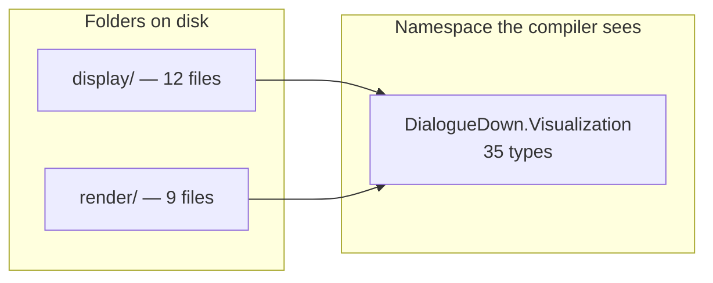

# Namespace Layout

> [!NOTE]
> Status: **implemented**.

- [Goal and scope](#goal-and-scope)
- [Ubiquitous language](#ubiquitous-language)
- [What the rule found, and what it changed](#what-the-rule-found-and-what-it-changed)
- [Functionality checklist](#functionality-checklist)
- [Key design decisions](#key-design-decisions)
  - [D1 — Count types, not files](#d1--count-types-not-files)
  - [D2 — Count authored types regardless of visibility](#d2--count-authored-types-regardless-of-visibility)
  - [D3 — Cap root namespaces, not every namespace](#d3--cap-root-namespaces-not-every-namespace)
  - [D4 — Set the cap at the ratchet, not at a round number](#d4--set-the-cap-at-the-ratchet-not-at-a-round-number)
  - [D5 — No exemption list](#d5--no-exemption-list)
  - [D6 — Anchor the CLI by name, not by a type](#d6--anchor-the-cli-by-name-not-by-a-type)
- [Interfaces and responsibilities](#interfaces-and-responsibilities)
- [Error and boundary cases](#error-and-boundary-cases)
- [Testability](#testability)
- [How each assembly was split](#how-each-assembly-was-split)

## Goal and scope

Add **Group E — namespace layout** to the architecture suite: a rule that fails
when an assembly's **root namespace** holds more than a handful of types. A root
namespace should carry the assembly's façade — the entry points a consumer calls
— while everything else lives in a sub-namespace that names its role.

The suite already guards dependency *direction* (Groups A and B) and type
*shape* (Group D). Nothing guards *layout*, so an assembly can grow into a flat
list of thirty types without a single test noticing.

In scope: one rule over the shipped assemblies, and the refactoring it demands
of the namespaces it catches.

Out of scope: a global cap on every namespace ([D3](#d3--cap-root-namespaces-not-every-namespace)),
and coupling or cohesion metrics.

## Ubiquitous language

| Term | Meaning |
| --- | --- |
| **Root namespace** | An assembly's own namespace — the one equal to its assembly name, such as `DialogueDown.Visualization`. |
| **Sub-namespace** | Any namespace beneath a root, such as `DialogueDown.Visualization.Semantics`. |
| **Authored type** | A non-nested type the project wrote, as opposed to one the compiler generated. |
| **Façade** | The small set of entry points a consumer of an assembly actually calls. |

## What the rule found, and what it changed

Measured by reflecting over the built assemblies, counting authored non-nested
types per namespace. The core was already the model — one type at the root,
everything else named by its stage — and three assemblies were not:

| Assembly | Root types before | After | Sub-namespaces added |
| --- | ---: | ---: | --- |
| `DialogueDown` | 1 | 1 | — |
| `DialogueDown.Cli` | 8 | 8 | — |
| `DialogueDown.ConfigurationLoader` | 11 | 2 | `Readers`, `Toml`, `Errors` |
| `DialogueDown.Visualization.Live` | 31 | 4 | `Launching`, `Serving`, `Files`, `Configuration` |
| `DialogueDown.Visualization` | 35 | 6 | `Display`, `Render`, `Markdown`, `Script` |

`DialogueDown.Visualization` was the furthest from the model despite *looking*
organized — see [D1](#d1--count-types-not-files).

## Functionality checklist

- [x] A rule fails when a root namespace holds more than the cap.
- [x] The failure message names each offending namespace, its count, the cap,
      and example type names, so the fix is obvious without a debugger.
- [x] The rule covers all five shipped assemblies, including the CLI.
- [x] Compiler-generated and nested types never reach the count.
- [x] The three offending assemblies are refactored into sub-namespaces that
      name their roles, and the rule passes.

## Key design decisions

### D1 — Count types, not files

A folder is not a namespace. `DialogueDown.Visualization` keeps `display/` and
`render/` folders — twenty-one files that *look* organized — but every one of
them declares the root namespace:

A rule counting files per folder would score this assembly as tidy and miss the
worst offender in the repository. Counting types per namespace is the only
measure that sees what a consumer sees.

### D2 — Count authored types regardless of visibility

The obvious filter — count only `public` types — makes the rule almost a no-op
here, because the core is deliberately internal. `DialogueDown.Script.Ast` holds
49 types and **none** are public; `DialogueDown.Visualization.Live` holds 31 of
which 7 are. Visibility describes what a consumer may call, not how much a
namespace has to explain, so the count takes every authored type.

Nested types belong to their parent, and compiler-generated types are not the
author's layout, so both are filtered out — the same filtering
`CoreTypeSizeTests` already applies for its method count.

### D3 — Cap root namespaces, not every namespace

A cap on *every* namespace ranks this repository backwards. Its two largest
namespaces are its healthiest:

| Namespace | Types | Reading |
| --- | ---: | --- |
| `DialogueDown.Script.Ast` | 49 | A node vocabulary — every AST type belongs at one level. Splitting it would invent categories the domain does not have. |
| `DialogueDown.Visualization` | 35 | A layer that never got named parts. |

Both exceed any plausible cap, but only one is a problem. A global rule would
have to exempt the first, and the exemption list would end up holding the
largest namespaces while the rule policed only the small ones.

Keying on the **root** namespace separates them precisely. A root namespace is
where types land when nobody decided where they belong, so a crowded one is
evidence of a decision not taken. A deep namespace like `Script.Ast` is the
opposite: someone chose that name, and its size is cohesion rather than drift.

This also matches what an outside reader needs. The root namespace is the first
thing `using DialogueDown.Visualization;` shows them, and thirty-five unrelated
types is a poor first sentence.

### D4 — Set the cap at the ratchet, not at a round number

The cap is **8**: the largest root namespace that is currently healthy
(`DialogueDown.Cli`, which already keeps `Commands` and `Infrastructure`
beneath it). Choosing the ratchet rather than a round number means the rule
encodes a real example from this repository instead of an opinion, and no
currently-good layout has to change to satisfy it.

The consequence is deliberate: `DialogueDown.Cli` sits exactly at the cap, so
the next type added to its root must pick a sub-namespace. That is the rule
working, not the rule misfiring.

### D6 — Anchor the CLI by name, not by a type

Every other assembly is anchored with `typeof(SomeType).Assembly`, which the
compiler checks. The CLI cannot be: it exposes **no public type** — even its
entry point is the internal `Program` that top-level statements generate — and
it shares its internals only with `DialogueDown.Cli.Tests`.

The rule therefore takes a project reference for the build output and loads the
assembly by name. The alternative, widening `InternalsVisibleTo` to the
architecture suite, would grant it every internal type of the CLI to obtain one
piece of information the assembly's name already carries.

### D5 — No exemption list

[D3](#d3--cap-root-namespaces-not-every-namespace) removes the need for one:
the false positive a global cap would produce cannot occur for a root
namespace. Adding an exemption hook now would invite the rule to be silenced
rather than satisfied. If a genuine case ever appears, it is worth a design
conversation and a note update — not a config entry added in passing.

## Interfaces and responsibilities

| Type | Responsibility | Collaborators |
| --- | --- | --- |
| `NamespaceLayoutTests` | Group E. Asserts each assembly's root namespace stays within the cap and reports every offender in one failure. | `Architecture` |
| `Architecture` | (Existing.) Supplies the assemblies each rule scans. Gains the CLI assembly and an `AllAssemblies` collection so a rule can sweep them uniformly. | — |

The rule is plain reflection and LINQ, like `CoreTypeSizeTests`. NetArchTest
cannot express it: its `ICustomRule` sees one type at a time with no view of a
type's siblings, and its slice conditions only check dependencies between
slices, never a slice's size. No .NET or Java architecture library ships a
namespace-population rule.

## Error and boundary cases

| Case | Behavior |
| --- | --- |
| An assembly whose types all sit in sub-namespaces | Root count is 0 — passes. |
| A namespace outside the assembly's own tree, such as the `Microsoft.Extensions.DependencyInjection` namespace the core uses for its service-collection extension | Not a root namespace, so never counted. |
| Types the compiler generates (closures, iterators, records' backing types) | Filtered out. |
| Nested types | Attributed to their parent, not counted separately. |
| Several offenders at once | All reported in one failure message, ordered by size, so one run shows the whole job. |

## Testability

The rule is itself a test, so the question is whether it can fail for the right
reason. It was verified by running it against the tree before any refactoring,
where it named exactly the three assemblies in
[What the rule found](#what-the-rule-found-and-what-it-changed), and again after
each refactoring step, where the fixed assembly dropped out of the message.

## How each assembly was split

Each root namespace kept its façade and gave the rest a name.

| Assembly | Root keeps | Sub-namespaces |
| --- | --- | --- |
| `DialogueDown.Visualization` | The façade (`CompilationVisualizer`, `ReportProject`, `ConfigStatusOverlay`) and the projection seam (`INodeProjection`, `GraphWalk`, `NodeProjectionExtensions`) | `Display`, `Render`, `Markdown`, `Script` — the folders that already existed, now carrying namespaces |
| `DialogueDown.Visualization.Live` | The `visualize` command's entry points (`IVisualizeRunner`, `VisualizeRunner`, `StaticMode`, `EmitMode`) | `Launching` (choosing and opening a source), `Serving` (the loopback servers and live session), `Files` (atomic writes, symlinks, watching), `Configuration` (creating a `dialogue.toml`) |
| `DialogueDown.ConfigurationLoader` | `TomlConfigurationLoader` and the `ConfigurationSourceLocation` a caller reads off an error | `Readers`, `Toml`, `Errors` |

Two choices are worth naming. `DialogueDown.Visualization` needed four
sub-namespaces rather than the two its folders suggested, because `markdown/`
and `script/` were flat in the same way `display/` and `render/` were. And
`DialogueConfigurationException` moved to `.Errors`, following the convention
Group C already enforces on the core: the thrown hierarchy lives together, while
data describing a failure — `ConfigurationSourceLocation` — does not have to.

Namespace moves are source-compatible within the solution but change the public
surface of the visualization assemblies and the configuration loader, so they
are a **breaking change** for any outside consumer, recorded as such in the
changelog.
