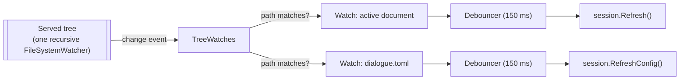

# One Watcher for the Served Tree

> [!NOTE]
> Status: **implemented**. Measured on macOS; the fix helps every platform, but
> the sizes quoted here are macOS numbers.

Opening a script in the served report takes about 330 ms, and roughly **half of
it is spent building a file-system watcher** rather than doing anything the
reader asked for. This note stops building one per document and watches the
served tree through the file provider the server already has.

## Table of contents

- [Goal and scope](#goal-and-scope)
- [Measured baseline](#measured-baseline)
- [Functionality checklist](#functionality-checklist)
- [Ubiquitous language](#ubiquitous-language)
- [Design](#design)
  - [Own the watcher, having tried not to](#own-the-watcher-having-tried-not-to)
  - [Interfaces](#interfaces)
  - [Call sites](#call-sites)
- [Error and boundary cases](#error-and-boundary-cases)
- [Testability](#testability)
- [What this does not do](#what-this-does-not-do)
- [Questions the build settled](#questions-the-build-settled)

## Goal and scope

Make switching the active document cheap by registering the operating-system
watch **once per served run** instead of once per open.

In scope: how the live server learns that the active document or its
configuration changed.

Out of scope: how the client navigates once the server has switched — the browser
still performs a full page load. That is
[#327](https://github.com/pengzhengyi/dialoguedown/issues/327), deliberately kept
separate so this change stays small and its benefit is measurable on its own.

## Measured baseline

Every figure below was measured against the built CLI on macOS, opening a
44-character script, so compilation is not a factor.

| Phase of one open | Cost |
| --- | --- |
| `POST /api/open` — switch the session | 127–178 ms |
| Full page load of the report | ~180 ms |
| **Total** | **329 ms** (288–362) |

The session switch is not compiling anything: `GET /api/document`, which compiles
and serializes the whole document, answers in **2–4 ms**. Timing the watcher
directly finds the cost:

| Operation | Cost |
| --- | --- |
| `new DocumentWatcher(path, …)` — built on **every** open | 122–183 ms |
| Retarget an existing watcher's `Filter` (same folder) | 0.00–0.16 ms |
| Retarget an existing watcher's `Path` (another folder) | **109–143 ms** |

Creating a `FileSystemWatcher` registers with the platform's notification service
— FSEvents on macOS — and that registration, not the file and not the compiler,
is what an open pays for. Retargeting one watcher is only free while the next
script sits in the **same folder**; a project tree has folders, so that is not a
fix.

**Result:** the session switch falls to **1.1–5.9 ms** and a whole open from
329 ms to **146 ms** — a little better than the ~180 ms the phase table predicted,
because the switch is now nearly free rather than merely cheap.

| | Before | After |
| --- | --- | --- |
| `POST /api/open` | 127–178 ms | **1.1–5.9 ms** |
| Click to report | 329 ms | **146 ms** |

The first open still pays the one registration, and nothing after it does.

## Functionality checklist

- [x] The served run registers its operating-system watch **once**, not per open.
- [x] Switching the active document does not create, move, or rebuild a watcher.
- [x] A change to the active document still hot-reloads the report, debounced as
      today, so one editor save produces one reload.
- [x] A change to the active document's `dialogue.toml` still reloads its
      configuration.
- [x] A change to a file that is not being watched raises nothing.
- [x] Creating, deleting, and renaming the watched file are all still noticed.
- [x] Renaming a folder that contains the active document keeps it watched.
- [x] Watches are released when the server shuts down.

## Ubiquitous language

| Term | Meaning |
| --- | --- |
| **Served tree** | The root directory a run serves, and everything under it. Already modeled as `BrowseRoot`. |
| **Watch** | A standing request to be told when one path changes; held by whoever asked, released when disposed. |
| **Active document** | The script the current `LiveSession` is serving. |

## Design

### Own the watcher, having tried not to

One recursive watcher covers the tree, and each event is routed to the watches
registered on that path. Registering a watch is a dictionary write, so switching
documents costs nothing wherever they live.

**The framework's own watcher was tried first and rejected on evidence.**
`PhysicalFileProvider` — which the server already constructs for static files —
keeps one `FileSystemWatcher` per root and hands out a token per path, and it is
every bit as cheap as hoped: the first `Watch` costs 103 ms and every later one
0.00–0.06 ms. It was implemented, and the live end-to-end suite failed.

Two things broke, and both are worth recording because neither is obvious:

1. **It hides sensitive files.** `ExclusionFilters.Sensitive` is the default, so a
   dotfile yields a token that never fires. A dialogue script may perfectly well
   be a dotfile — the test fixtures are — and the report silently stopped
   reloading.
2. **Its notifications do not arrive together.** One save reached the callback as
   two or three notifications up to **786 ms** apart, where the raw watcher's
   arrive 0–1 ms apart. `LiveSession` suppresses its own writes with a *one-shot*
   token, so the first notification consumed the suppression and the rest
   broadcast reloads that discarded the reader's edits.

The first is a flag; the second is a mismatch of meaning. A debounce window wide
enough to gather notifications 786 ms apart would make hot reload feel broken, so
owning the watcher — and with it the exact event stream the session already
relies on — is the honest choice. Static files keeps its own `PhysicalFileProvider`,
which should go on hiding sensitive files and never watches anything.

### Interfaces

| Type | Responsibility | Collaborators |
| --- | --- | --- |
| `TreeWatches` | Keeps one recursive watcher per root and routes each event to the watches on that path. One per served run. | `FileSystemWatcher`, `Debouncer`, `PathComparison` |
| `TreeWatches.Watch(path, onChanged)` | Registers one path, debounced, and returns an `IDisposable` that releases it. Replaces `new DocumentWatcher(path, onChanged)` at every call site. | `Debouncer` |
| `PathComparison` | Compares and normalizes paths the way this machine does — Linux tells case apart, Windows and macOS do not. | — |

`DocumentWatcher` is removed: its debounce moves into the watch, and the
`FileSystemWatcher` it owned is what this note deletes.

### Call sites

Four places manage watchers today; each becomes a watch:

| Site | Today | After |
| --- | --- | --- |
| `Activate` | Builds a document watcher, and a config watcher when the session has a config. | Registers the same two watches. |
| `StartConfigWatcher` | Replaces the config watcher after a config is created. | Replaces the config watch. |
| `Rename` | Disposes the active watcher when the active file (or its folder) is renamed. | Re-registers the watch on the new path — the file is still being edited, so it should still be watched. |
| Server dispose | Disposes both watchers. | Disposes the watches and the provider. |

The `Rename` case is a small behavioral improvement rather than a straight port:
today the active document silently stops being watched after its folder is
renamed, because rebuilding the watcher was expensive enough to skip. Re-pointing
a watch is free, so it can simply keep working.

## Error and boundary cases

| Case | Intended behavior |
| --- | --- |
| An event arrives for a file no one watches | No token matches it, so nothing fires. |
| One save writes the file several times | One reload — the `Debouncer` coalesces the four callbacks the provider delivers. |
| A watch is disposed twice | Second disposal does nothing. |
| The document is deleted, then recreated | Both are reported — a watch is on a path, not a handle. |
| The document is reached through a symlink out of the tree | `visualize <script>` resolves symlinks, so the real file can be anywhere. It gets a watcher for its own folder, kept and reused like the tree's own. |
| The OS event buffer overflows | Every watch is told. Reloading something that may not have changed is cheaper than a report that never updates again. |
| Two spellings of one path, or one path in two cases | `PathComparison` normalizes and compares as this machine does, so a case difference does not silently stop reloads on macOS or Windows while still telling files apart on Linux. |

## Testability

`TreeWatches` is exercised against a real temporary directory: the file system is
the thing under test, so faking it would test nothing.

- Unit: a watched path fires; an unwatched path does not; a burst of writes
  yields one callback; disposal stops notifications; double disposal is safe; two
  watches on one path both fire.
- Integration: the existing served-shell tests already assert that editing the
  active document hot-reloads and that a config edit reloads configuration. They
  should pass unchanged, which is the real regression guard.
- A guard test asserts that watching documents at several depths leaves the run
  with **one** watcher — the property this note exists to establish, and the one
  a future refactor is most likely to break. A second asserts that documents
  outside the tree share one watcher per folder rather than one each.
- A regression test watches a **dotfile** script, because the first
  implementation hid those and stopped reloading them.

The debounce window stays injectable, as `DocumentWatcher` already allows, so
tests need not sleep for the real 150 ms.

## What this does not do

The full page load remains. After this change an open is roughly 180 ms, almost
all of it the browser loading the report again. Removing that is
[#327](https://github.com/pengzhengyi/dialoguedown/issues/327); measurements
suggest the two together would bring an open to about 30 ms, but they are
independent and are kept apart deliberately.

## Questions the build settled

Both questions the note opened are settled.

1. **Name** — `TreeWatches`, as proposed and approved.
2. **Share one provider with static files** — no, and for a better reason than
   the note anticipated: watching and serving want *opposite* answers about
   sensitive files. Serving must keep hiding them; watching must not. They are
   separate objects now, and the static-file provider never watches, so the split
   costs nothing.
