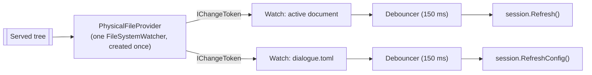

# One Watcher for the Served Tree

> [!IMPORTANT]
> Status: **approved; in progress**. Measured on macOS; the fix is expected to
> help every platform, but the sizes quoted here are macOS numbers.

Opening a script in the served report takes about 330 ms, and roughly **half of
it is spent building a file-system watcher** rather than doing anything the
reader asked for. This note stops building one per document and watches the
served tree through the file provider the server already has.

## Table of contents

- [Goal and scope](#goal-and-scope)
- [Measured baseline](#measured-baseline)
- [Functionality checklist](#functionality-checklist)
- [Ubiquitous language](#ubiquitous-language)
- [Design](#design)
  - [Use the framework's watcher, not our own](#use-the-frameworks-watcher-not-our-own)
  - [Interfaces](#interfaces)
  - [Call sites](#call-sites)
- [Error and boundary cases](#error-and-boundary-cases)
- [Testability](#testability)
- [What this does not do](#what-this-does-not-do)
- [Open questions](#open-questions)

## Goal and scope

Make switching the active document cheap by registering the operating-system
watch **once per served run** instead of once per open.

In scope: how the live server learns that the active document or its
configuration changed.

Out of scope: how the client navigates once the server has switched — the browser
still performs a full page load. That is
[#327](https://github.com/pengzhengyi/dialoguedown/issues/327), deliberately kept
separate so this change stays small and its benefit is measurable on its own.

## Measured baseline

Every figure below was measured against the built CLI on macOS, opening a
44-character script, so compilation is not a factor.

| Phase of one open | Cost |
| --- | --- |
| `POST /api/open` — switch the session | 127–178 ms |
| Full page load of the report | ~180 ms |
| **Total** | **329 ms** (288–362) |

The session switch is not compiling anything: `GET /api/document`, which compiles
and serializes the whole document, answers in **2–4 ms**. Timing the watcher
directly finds the cost:

| Operation | Cost |
| --- | --- |
| `new DocumentWatcher(path, …)` — built on **every** open | 122–183 ms |
| Retarget an existing watcher's `Filter` (same folder) | 0.00–0.16 ms |
| Retarget an existing watcher's `Path` (another folder) | **109–143 ms** |

Creating a `FileSystemWatcher` registers with the platform's notification service
— FSEvents on macOS — and that registration, not the file and not the compiler,
is what an open pays for. Retargeting one watcher is only free while the next
script sits in the **same folder**; a project tree has folders, so that is not a
fix.

**Expected result:** an open falls from ~330 ms to **~180 ms**, and the session
switch itself from ~150 ms to about 2 ms.

## Functionality checklist

- [ ] The served run registers its operating-system watch **once**, not per open.
- [ ] Switching the active document does not create, move, or rebuild a watcher.
- [ ] A change to the active document still hot-reloads the report, debounced as
      today, so one editor save produces one reload.
- [ ] A change to the active document's `dialogue.toml` still reloads its
      configuration.
- [ ] A change to a file that is not being watched raises nothing.
- [ ] Creating, deleting, and renaming the watched file are all still noticed.
- [ ] Renaming a folder that contains the active document keeps it watched.
- [ ] Watches are released when the server shuts down.

## Ubiquitous language

| Term | Meaning |
| --- | --- |
| **Served tree** | The root directory a run serves, and everything under it. Already modeled as `BrowseRoot`. |
| **Watch** | A standing request to be told when one path changes; held by whoever asked, released when disposed. |
| **Active document** | The script the current `LiveSession` is serving. |

## Design

### Use the framework's watcher, not our own

The obvious design — one recursive watcher over the tree, with our own routing of
events to interested paths — is already written, shipped, and battle-tested:
`PhysicalFileProvider` (MIT, part of the .NET runtime, the engine behind
ASP.NET Core static files, configuration reload, and `dotnet watch`). It keeps
**one** `FileSystemWatcher` for its root and hands out an `IChangeToken` per
watched path.

**The server already constructs one** — `ServedShellServer.Configure` gives the
static-file middleware a `PhysicalFileProvider` over the same root. So this costs
no new dependency; it reuses one already on the shelf.

Measured against that provider:

| Operation | Cost |
| --- | --- |
| `new PhysicalFileProvider(root)` | 0.1 ms (the watcher is created lazily) |
| First `Watch(...)` — registers with the OS | 103 ms, **once** |
| Every later `Watch(...)`, including another folder | **0.00–0.06 ms** |

That is exactly the property this note needs, without writing a watcher.

**What it does not give us is debouncing.** Measured: one editor save that writes
the file several times produces **four** callbacks through
`ChangeToken.OnChange`. The framework's own answer is a fixed delay
(`FileConfigurationProvider.ReloadDelay`, 250 ms), which is cruder than the
sliding-window `Debouncer` this repository already has. So the existing
`Debouncer` stays, and keeps doing the job it already does.

Because an `IChangeToken` fires **once** and is then spent, each watch must
re-register after every notification — which is exactly what
`ChangeToken.OnChange` does, so we use it rather than hand-rolling the loop.

### Interfaces

| Type | Responsibility | Collaborators |
| --- | --- | --- |
| `TreeWatches` | Owns the served tree's `PhysicalFileProvider` and hands out watches on paths under it. One per served run. | `PhysicalFileProvider`, `BrowseRoot` |
| `TreeWatches.Watch(path, onChanged)` | Registers one path, debounced, and returns an `IDisposable` that releases it. Replaces `new DocumentWatcher(path, onChanged)` at every call site. | `Debouncer`, `ChangeToken` |

`DocumentWatcher` is removed: its debounce moves into the watch, and the
`FileSystemWatcher` it owned is what this note deletes.

### Call sites

Four places manage watchers today; each becomes a watch:

| Site | Today | After |
| --- | --- | --- |
| `Activate` | Builds a document watcher, and a config watcher when the session has a config. | Registers the same two watches. |
| `StartConfigWatcher` | Replaces the config watcher after a config is created. | Replaces the config watch. |
| `Rename` | Disposes the active watcher when the active file (or its folder) is renamed. | Re-registers the watch on the new path — the file is still being edited, so it should still be watched. |
| Server dispose | Disposes both watchers. | Disposes the watches and the provider. |

The `Rename` case is a small behavioral improvement rather than a straight port:
today the active document silently stops being watched after its folder is
renamed, because rebuilding the watcher was expensive enough to skip. Re-pointing
a watch is free, so it can simply keep working.

## Error and boundary cases

| Case | Intended behavior |
| --- | --- |
| An event arrives for a file no one watches | No token matches it, so nothing fires. |
| One save writes the file several times | One reload — the `Debouncer` coalesces the four callbacks the provider delivers. |
| A watch is disposed twice | Second disposal does nothing. |
| The document is deleted, then recreated | Both are reported — a watch is on a path, not a handle. |
| A change arrives while the watch is re-registering | `ChangeToken.OnChange` re-registers as it fires, and the debounce window is far longer than that gap, so a burst still collapses to one reload. |
| The OS event buffer overflows | `PhysicalFilesWatcher` cancels every token, so watches fire and the report reloads rather than going stale. Handled by the framework. |
| The served root is a network share or a bind mount | `FileSystemWatcher` can miss events there. The provider supports polling (`UsePollingFileWatcher`, or `DOTNET_USE_POLLING_FILE_WATCHER`), so the escape hatch exists without new code. Left off by default: it polls every 4 seconds. |
| Recursion toggles as documents at different depths are watched | The provider raises and lowers `IncludeSubdirectories` from a count of watches needing it, and on macOS a change re-registers. Measured here at **≤0.59 ms**, so it is not the 150 ms problem — but one permanent recursive watch held for the run removes the question entirely, and costs one watch. |

## Testability

`TreeWatches` is exercised against a real temporary directory: the file system is
the thing under test, so faking it would test nothing.

- Unit: a watched path fires; an unwatched path does not; a burst of writes
  yields one callback; disposal stops notifications; double disposal is safe; two
  watches on one path both fire.
- Integration: the existing served-shell tests already assert that editing the
  active document hot-reloads and that a config edit reloads configuration. They
  should pass unchanged, which is the real regression guard.
- A guard test asserts the served run holds **one** `PhysicalFileProvider` and
  that opening many documents registers no further operating-system watcher —
  the property this note exists to establish, and the one a future refactor is
  most likely to break.

The debounce window stays injectable, as `DocumentWatcher` already allows, so
tests need not sleep for the real 150 ms.

## What this does not do

The full page load remains. After this change an open is roughly 180 ms, almost
all of it the browser loading the report again. Removing that is
[#327](https://github.com/pengzhengyi/dialoguedown/issues/327); measurements
suggest the two together would bring an open to about 30 ms, but they are
independent and are kept apart deliberately.

## Open questions

1. **Name.** `TreeWatches` reads as "the watches over the served tree" and avoids
   claiming to be a watcher now that the framework owns that role. `TreeWatcher`
   or `RootWatcher` are alternatives; `ProjectWatcher` risks colliding with
   `ReportProject`, which already means something narrower.
2. **Share the provider with static files, or keep two?** One instance is tidier
   and guarantees a single watcher. Two would be simpler to wire, at the cost of
   a second registration (~100 ms, once) and a second watcher over the same tree.
   The recommendation is to share one.
