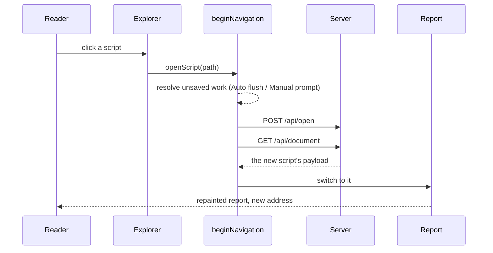

# Opening a Script Without Reloading the Page

> [!IMPORTANT]
> Status: **approved, in progress**. Measurements are macOS, against a served run
> on loopback.

Clicking a script in the Explorer reloads the whole page. The report the reader is
looking at is discarded and rebuilt from nothing, even though the only thing that
changed is which document the server is serving. This note opens the new script
**in place**: fetch its payload, repaint, and move the address bar.

## Table of contents

- [Goal and scope](#goal-and-scope)
- [What a spike measured](#what-a-spike-measured)
- [Functionality checklist](#functionality-checklist)
- [Ubiquitous language](#ubiquitous-language)
- [Design](#design)
  - [Switching is not reloading](#switching-is-not-reloading)
  - [What a switch must re-point](#what-a-switch-must-re-point)
  - [What the reader keeps](#what-the-reader-keeps)
  - [History](#history)
  - [Interfaces](#interfaces)
- [Error and boundary cases](#error-and-boundary-cases)
- [Testability](#testability)
- [Out of scope](#out-of-scope)

## Goal and scope

Open a script from the Explorer by **replacing the report's contents**, not the
page. The reader keeps the window they were working in: no white flash, and the
scroll position, graph zoom, and open tab survive the move.

In scope: opening a script from the Explorer in View and Edit, the address bar,
and Back/Forward.

Out of scope: the first load of a report (still a normal page load), and creating
or renaming scripts, which route through the same seam but carry their own
confirmation flows.

## What a spike measured

A throwaway spike replaced the page load with a payload fetch and a repaint, and
switched back and forth between two scripts:

| | Median | Runs |
| --- | --- | --- |
| Today, full page load | **173 ms** | 158–196 |
| In place | **70 ms** | 62–96 |

Of that 70 ms only **36 ms** is work; the rest is the click and the save-safety
check that already runs today.

| Phase | Cost |
| --- | --- |
| `POST /api/open` — switch the session | 12 ms |
| `GET /api/document` — the new payload (7.9 kB) | 5 ms |
| Repaint the whole report | **19 ms** |

The repaint is the same one hot reload already performs, measured independently at
**20 ms** for a whole document. **Speed is the smaller prize here** — about
100 ms — and the note is worth doing mainly for what the reader keeps.

The spike also settled two fears. Saving after a switch writes the **right file**,
because the server owns which document is active; and undo does not reach back
into the previous script, because replacing the editor's content resets its
history.

## Functionality checklist

- [ ] Clicking a script in the Explorer opens it without a page load.
- [ ] The report shows the new script's source, stages, diagnostics, semantic
      tokens, and reserved targets.
- [ ] The Explorer marks the newly opened script, not the previous one.
- [ ] The address bar shows the new script's report path.
- [ ] The active tab survives the switch.
- [ ] Back returns to the previous script in View, and Forward returns again.
- [ ] Reloading the page after a switch shows the script the address bar names.
- [ ] Switching in Edit adopts the new script as a clean baseline: not dirty, not
      in conflict, and never presented as an external change.
- [ ] Unsaved work is still resolved before the switch, exactly as today.
- [ ] Hot reload keeps working on the newly opened script.

## Ubiquitous language

| Term | Meaning |
| --- | --- |
| **Switch** | Opening a different script into the report the reader already has. |
| **Reload** | The active script changed on disk underneath the reader. |
| **Adopt** | Take a script's on-disk content as the editor's clean baseline. |
| **Active script** | The one the server is serving and the report is showing. |

**Switch and reload are different events.** They look alike — both replace the
document a report is showing — but they mean opposite things to a reader who is
editing: a reload is something that happened *to* them, a switch is something they
asked for. This note keeps them apart, and the distinction drives the design.

## Design

### Switching is not reloading

The client already replaces a whole document in place, in `onReload`. Reusing it
would be wrong. In Edit, `onReload` deliberately refuses to touch the buffer and
raises a **Conflict** instead, because a file changing under an active edit must
never clobber unsaved work. A switch has already resolved that work through
`beginNavigation`, so treating it as a conflict would be both wrong and confusing.

So a switch is its own operation, sharing the parts that genuinely are shared:

### What a switch must re-point

Three things change, and the spike showed the last two are what a naive
implementation forgets.

| | What it means | Today |
| --- | --- | --- |
| **Content** | Source, stages, diagnostics, semantic tokens, reserved targets. | Already possible; the repaint path exists. |
| **Editing state** | The live controller adopts the new script as a clean baseline — not dirty, not in conflict — in **both** modes. | `adoptDisk` does this, but only View reaches it. |
| **Identity** | Which script the report *is*: the Explorer's mark, the path in the chrome, `project.activePath`. | Nothing updates it; the spike left the Explorer marking the previous script. |

Identity is the part with no seam today. `initExplorer` takes the project once and
returns `void`, so nothing can tell it the active script changed. It gains a
handle for that.

### What the reader keeps

A switch is meant to be unobtrusive, so it preserves as much of the reader's
context as the new script allows.

**The active tab survives the switch.** Staying where the reader was is the point
of the change — someone comparing two scripts' dialogue graphs should not be
dropped back to Source on every click. The alternative, resetting to Source, is
defensible for a reader who wants a fresh start, but it makes the common case
worse to protect the rarer one.

**Back lands in View, even from Edit.** Pressing Back is a navigation, not a
request to edit; landing in an editor the reader did not open is the more
surprising outcome, and the one that risks an accidental change.

Scroll position and graph zoom belong to a document, not to the report, so they
reset with the content.

### History

The address bar moves with `pushState`, and a `popstate` listener switches back
when the reader presses Back. The spike's Back was broken precisely because it
pushed without listening.

Because `/r/<path>` is a real server route, a reload at any point still works — the
address bar and the server agree after every switch, so refreshing simply loads
the script the address names.

### Interfaces

| Type | Responsibility | Collaborators |
| --- | --- | --- |
| `switchToScript(path)` | The whole switch: resolve unsaved work, ask the server to change document, fetch the payload, re-point content, editing state, and identity, then push history. | `beginNavigation`, the report, `ExplorerHandle` |
| `ExplorerHandle.setActiveScript(path)` | Re-mark the tree and reveal the newly active script. Returned by `initExplorer`, which returns nothing today. | `ReportProject` |
| `LiveEditController.adoptSwitch(report)` | Adopt a different script as a clean baseline, clearing dirty and conflict. Distinct from `adoptDisk`, which answers a change the reader did not ask for. | — |

## Error and boundary cases

| Case | Intended behavior |
| --- | --- |
| Unsaved work in Manual, and the reader cancels the prompt | The switch does not happen and the address bar does not move — today's behavior, preserved by keeping `beginNavigation` in front. |
| The server cannot open the script (deleted, unreadable) | Report it and stay on the current script, address bar unchanged. A failed switch must not leave a half-repainted report. |
| Two switches in quick succession | The later one wins. `beginNavigation` already carries a token for exactly this; the payload fetch honors it so a slow first response cannot repaint over a newer script. |
| Back to a script that has since been deleted | The server answers as it would to a direct visit; the reader sees the same missing-document banner a page load would show. |
| Switching to the script already open | Harmless: the same payload is fetched and applied, and history records no new entry. |
| Hot reload arrives mid-switch | The reload targets the server's active document, which is already the new one; the debounced repaint lands after the switch and is correct either way. |

## Testability

- **Unit** — `ExplorerHandle.setActiveScript` marks the right row and reveals it;
  `adoptSwitch` leaves the controller clean, not dirty, and not in conflict, from
  both a clean and a conflicted starting state.
- **Integration (live E2E)** — the behavior only exists end to end, so this is
  where the checklist is proved: switching in View and in Edit, the Explorer's
  mark, the address bar, Back and Forward, a reload after a switch, and a hot
  reload on the newly opened script.
- **Regression** — a test that the page does **not** reload during a switch (the
  point of the change), by observing that a value set on `window` survives it.
- The existing live specs assert real navigations today; those assertions change
  shape and are part of the work.

## Out of scope

The **first** load of a report stays a page load. Only switching between scripts
changes.
