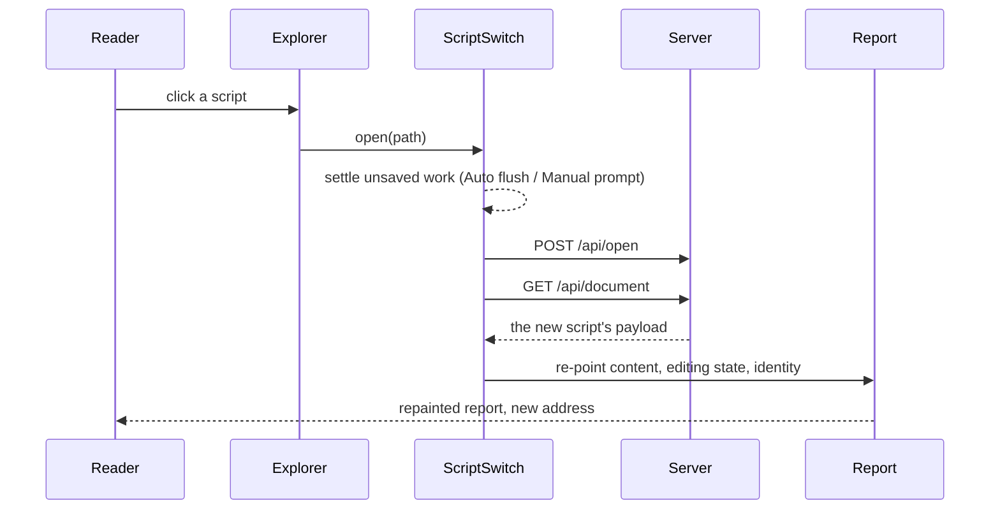

# Opening a Script Without Reloading the Page

> [!NOTE]
> Status: **implemented**. Measurements are macOS, against a served run on loopback.

Clicking a script in the Explorer reloaded the whole page. The report the reader was
looking at was discarded and rebuilt from nothing, even though the only thing that
changed was which document the server was serving. A script now opens **in place**:
its payload is fetched, the report repainted, and the address bar moved.

## Table of contents

- [Goal and scope](#goal-and-scope)
- [What it costs](#what-it-costs)
- [Functionality checklist](#functionality-checklist)
- [Ubiquitous language](#ubiquitous-language)
- [Design](#design)
  - [Switching is not reloading](#switching-is-not-reloading)
  - [What a switch must re-point](#what-a-switch-must-re-point)
  - [What the reader keeps](#what-the-reader-keeps)
  - [History](#history)
  - [Interfaces](#interfaces)
- [Error and boundary cases](#error-and-boundary-cases)
- [Testability](#testability)
- [Out of scope](#out-of-scope)

## Goal and scope

Open a script from the Explorer by **replacing the report's contents**, not the
page. The reader keeps the window they were working in: no white flash, and the
graph zoom and open tab survive the move.

In scope: opening a script from the Explorer in View and Edit, from a cross-file
link in the Source preview, after a rename that carries the open script, the
address bar, and Back/Forward.

Out of scope: the first load of a report, and creating a script — a brand-new file
may compile in a different configuration context, so it starts on a fresh page.

## What it costs

The same move, timed the same way in a browser over twelve interleaved rounds:

| | Median | Runs |
| --- | --- | --- |
| Loading the whole page | **160 ms** | 141–255 |
| In place | **77 ms** | 60–91 |

Of that 77 ms only **~40 ms** is in-page work; the rest is the click and the
save-safety check that already ran before.

| Phase | Cost |
| --- | --- |
| `POST /api/open` — switch the session | 12 ms |
| `GET /api/document` — the new payload (7.9 kB) | 5 ms |
| Repaint the whole report | **19 ms** |

The repaint is the same one hot reload already performs. Both figures are for a
**warm** cache, which is the case that matters: the reader has the report open and
is clicking around it. Serving the client as immutable hashed assets already took
most of the page-load cost away, and this takes about half of what was left, so
**speed is the smaller prize here** — the note is worth doing mainly for what the
reader keeps.

## Functionality checklist

- [x] Clicking a script in the Explorer opens it without a page load.
- [x] The report shows the new script's source, stages, diagnostics, semantic
      tokens, and reserved targets.
- [x] The Explorer marks the newly opened script, not the previous one.
- [x] The address bar shows the new script's report path.
- [x] The active tab survives the switch.
- [x] Back returns to the previous script in View, and Forward returns again.
- [x] Reloading the page after a switch shows the script the address bar names.
- [x] Switching in Edit adopts the new script as a clean baseline: not dirty, not
      in conflict, and never presented as an external change.
- [x] Unsaved work is still resolved before the switch, exactly as before.
- [x] Hot reload keeps working on the newly opened script.
- [x] Undo cannot reach back into the script left behind.

## Ubiquitous language

| Term | Meaning |
| --- | --- |
| **Switch** | Opening a different script into the report the reader already has. |
| **Reload** | The active script changed on disk underneath the reader. |
| **Adopt** | Take a script's on-disk content as the editor's clean baseline. |
| **Active script** | The one the server is serving and the report is showing. |

**Switch and reload are different events.** They look alike — both replace the
document a report is showing — but they mean opposite things to a reader who is
editing: a reload is something that happened *to* them, a switch is something they
asked for. Keeping them apart drives the whole design.

## Design

### Switching is not reloading

The client already replaces a whole document in place, in `onReload`. Reusing it
would be wrong. In Edit, `onReload` deliberately refuses to touch the buffer and
raises a **Conflict** instead, because a file changing under an active edit must
never clobber unsaved work. A switch has already resolved that work, so treating
it as a conflict would be both wrong and confusing.

So a switch is its own operation, sharing the parts that genuinely are shared:

### What a switch must re-point

Four things change, and a naive implementation forgets the last three.

| | What it means | Before |
| --- | --- | --- |
| **Content** | Source, stages, diagnostics, semantic tokens, reserved targets. | Already possible; the repaint path existed. |
| **Editing state** | The live controller adopts the new script as a clean baseline — not dirty, not in conflict — in **both** modes, and the editor drops the undo history the previous script built. | `adoptDisk` did the first part, but only View reached it. |
| **Identity** | Which script the report *is*: the Explorer's mark, the path chip, `project.activePath`. | Nothing updated it. |
| **The event stream** | Which document hot reload reports on. | Bound at connect time, so it kept watching the script left behind. |

Identity and the event stream had no seam. `initExplorer` took the project once and
returned `void`; the path chip wired its tooltip and copy handler per document, so
re-pointing it would have stacked a second of each; and `watchServerEvents` returned
a bare `EventSource` with no way to reconnect.

**Undo belongs to one document.** Replacing an editor's text covers two different
intents. Reverting the same file — a reload, a discard — should still be undoable.
Opening a different file must not be: undoing into another script's text would
leave it in this buffer, and the next save would write it to the wrong path. The
editor therefore has two operations, and opening one clears the history. Clearing
means removing the history extension and putting it back, because `history()`
always returns the same state field — reconfiguring straight to a new one keeps the
old entries.

### What the reader keeps

A switch is meant to be unobtrusive, so it preserves as much of the reader's
context as the new script allows.

**The active tab survives the switch.** Staying where the reader was is the point
of the change — someone comparing two scripts' dialogue graphs is not dropped back
to Source on every click. The alternative, resetting to Source, is defensible for a
reader who wants a fresh start, but it makes the common case worse to protect the
rarer one.

**Back lands in View, even from Edit.** Pressing Back is a navigation, not a
request to edit; landing in an editor the reader did not open is the more
surprising outcome, and the one that risks an accidental change.

Scroll position and graph zoom belong to a document, not to the report, so they
reset with the content.

### History

The address bar moves with `pushState`, carrying the script's path in the history
entry, and a `popstate` listener opens whatever script the entry names. The script
the page loaded is recorded with `replaceState`, so Back reaches the first one too.

Because `/r/<path>` is a real server route, a reload at any point still works — the
address bar and the server agree after every switch, so refreshing simply loads the
script the address names.

### Interfaces

| Type | Responsibility | Collaborators |
| --- | --- | --- |
| `createScriptSwitch(ports, initial)` | The whole switch: settle unsaved work, ask the server to change document, fetch the payload, re-point everything, then move history. `open` adds a history entry; `restore` applies what Back or Forward landed on. | `ScriptSwitchPorts` |
| `ExplorerHandle.setActiveScript(path)` | Re-mark the tree, revealing the script when a collapsed folder hides it. Returned by `initExplorer`, which returned nothing before. | `ReportProject` |
| `ModeController.switchDocument(report, mode)` | Apply an opened script in **either** mode, and land in the mode the caller asks for. Distinct from `onReload`, which raises a conflict in Edit. | `LiveEditController`, `AppController` |
| `LiveEditController.adoptSwitch(source, report)` | Adopt a different script as a clean baseline, clearing dirty and conflict and invalidating a save still in flight. Distinct from `adoptDisk`, which answers a change the reader did not ask for. | — |
| `openDocument(view, source)` | Show a different document in the editor, dropping the previous one's undo history. Its sibling `setDocumentContent` keeps it. | `EditorView` |
| `PathDisplay.setPath(path)` | Re-point the status-bar path chip, reusing its one tooltip and copy handler. | — |
| `ServerEventWatch.resubscribe()` | Reconnect the event stream so hot reload follows the script now open. | `EventSource` |

`ScriptSwitchPorts` keeps the browser out of the sequence — `fetch`, `history`,
`location`, and the report itself are all injected, so the whole switch is unit
tested without a server.

## Error and boundary cases

| Case | Behavior |
| --- | --- |
| Unsaved work in Manual, and the reader cancels the prompt | The switch does not happen and the address bar does not move. |
| The server cannot open the script (deleted, unreadable) | Reported as a banner; the reader stays on the current script, address bar unchanged. Nothing changed on the server, so staying put is safe. |
| Anything fails **after** the server has switched | The new script's page is loaded instead. Slower, never wrong: the address bar and the server agree again. |
| The opened script has a different `dialogue.toml` | A whole page load. The page wired its editors, panes, and controllers from the config its compile applied, so another configuration context needs a fresh page. |
| Two switches in quick succession | The later one wins; a slow earlier payload is dropped rather than repainted over a newer script. |
| The payload names a different active script | Treated as a lost race and loaded as a whole page, so a report is never repainted with another script's content. |
| Back to a script that has since been deleted | The server answers as it would to a direct visit; the reader sees the same missing-document banner a page load would show. |
| Back refused over unsaved work | The browser has already moved the address bar, so it is put back on the script still on screen. |
| Switching to the script already open | Harmless: the same payload is fetched and applied. |
| Hot reload arrives mid-switch | The reload targets the server's active document, which is already the new one. |

## Testability

- **Unit** — the switch sequence against injected ports (supersession, every
  fallback, history); `ExplorerHandle.setActiveScript`; `adoptSwitch` from clean
  and conflicted states, including a save in flight; `switchDocument` in both
  modes; `openDocument` versus `setDocumentContent` against real editor commands;
  and `resubscribe` closing the stream it leaves.
- **Integration (live E2E)** — `script-switch.spec.ts` owns its server, because a
  switch changes the server's active document and every other spec sharing it
  would see that. It proves the checklist end to end, using a value set on
  `window` to tell a switch from a page load — and asserts that value is *gone*
  after a real reload, so the check cannot pass vacuously.

## Out of scope

The **first** load of a report stays a page load, and so does creating a script.
Only opening an existing one changes.
