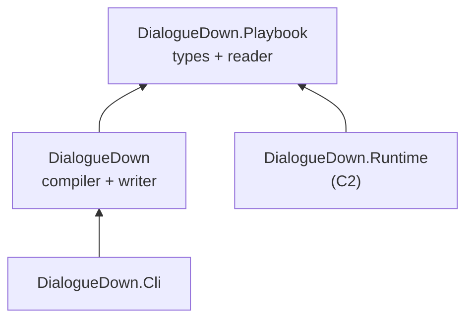
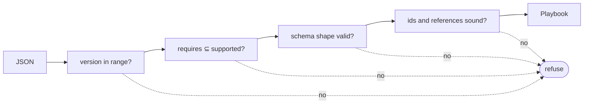

# Playbook format

> [!NOTE]
> Status: **proposed** — not yet implemented. This note designs the first runtime
> component: the **playbook** a compile emits, and the reader that loads one back.
> It implements the artifact half of the
> [Dialogue runtime architecture](./Dialogue%20Runtime%20Architecture.md), which
> owns the cross-cutting decisions this note applies.

## Table of contents

- [Goal and scope](#goal-and-scope)
- [Functionality checklist](#functionality-checklist)
- [Where the types live](#where-the-types-live)
- [The document](#the-document)
- [Mapping the graph](#mapping-the-graph)
- [Reading a playbook](#reading-a-playbook)
- [Key design decisions](#key-design-decisions)
- [Error and boundary cases](#error-and-boundary-cases)
- [Integration](#integration)
- [Testability](#testability)
- [Open questions and deferred work](#open-questions-and-deferred-work)

## Goal and scope

The compiler ends at an `internal DialogueGraph`, so a compiled script cannot
leave the process. This component gives it a portable form: a **playbook**, a
versioned JSON document that a runtime in any language can load.

In scope:

- the playbook types and their JSON encoding;
- the **writer** — `DialogueGraph` to playbook;
- the **reader** — JSON to playbook, refusing anything it cannot play correctly;
- the compatibility header, and the capability names version 0 defines;
- a hand-written JSON Schema that specifies the format;
- `ddown compile --output`.

Out of scope, each owned elsewhere: playing a playbook
([C2](https://github.com/pengzhengyi/dialoguedown/issues/297)), the
`[compatibility]` and `[features]` configuration
([C7](https://github.com/pengzhengyi/dialoguedown/issues/303)), exporters
([C8](https://github.com/pengzhengyi/dialoguedown/issues/304)), source maps, and
binary encoding.

This note assumes the vocabulary and decisions of the
[architecture note](./Dialogue%20Runtime%20Architecture.md) — *playbook*,
*capability*, *effect*, *query* — and does not restate them.

## Functionality checklist

- [ ] Playbook types covering every graph node, edge, and speech fragment.
- [ ] A `format` header carrying `version`, `requires`, and `uses`.
- [ ] JSON encoding with a `kind` discriminator and stable property names.
- [ ] A writer that lowers a `DialogueGraph` into a playbook.
- [ ] A speaker table addressed by stable id.
- [ ] An `entries` table and an `anchors` table.
- [ ] Per-node `queries`: every query key required to leave the node.
- [ ] Compiled option labels, so a menu never peeks at a target node.
- [ ] A reader that round-trips every construct.
- [ ] Refusal on an unsupported version, an unknown required capability, a
      malformed document, or a broken node reference.
- [ ] A hand-written JSON Schema 2020-12 that documents the format and validates
      every golden playbook in CI.
- [ ] `ddown compile --output` writing `<script>.playbook.json`.
- [ ] Golden playbooks for every script in `examples/`.

## Where the types live

The playbook is the contract between a compiler and a runtime, so it belongs to
neither. It gets its own dependency-free assembly:



**The writer lives in `DialogueDown`, not beside the reader**, and that placement
is forced rather than chosen. `CompilationSuccess.Graph` and the entire node and
edge model are `internal`; a writer in `DialogueDown.Playbook` would therefore
have to reference `DialogueDown`, which would make
`Runtime → Playbook → DialogueDown` and drag Markdig, Tomlyn, and the diagnostics
engine into every shipped game. Keeping the writer beside the graph it reads is
what lets the runtime stay small.

The writer still emits only **public** playbook types, so the mapping from
internal graph to public contract stays explicit and reviewable — the property
[#269](https://github.com/pengzhengyi/dialoguedown/issues/269) asked for.

`DialogueDown.Playbook` is an assembly a **game** ends up referencing, through the
runner that reads its playbooks. It therefore multi-targets `net8.0;net10.0` like
the other shipped libraries, so a Godot export keeps loading on Godot's bundled
runtime — see [Target Frameworks](./Target%20Frameworks.md).

Two architecture tests guard the shape:

| Test | Asserts |
| --- | --- |
| `Playbook_DependsOnNothing` | `DialogueDown.Playbook` references no other project and no third-party package |
| `Runtime_DoesNotDependOn_Core` | reserved for C2; stated here because this layout is what makes it possible |

## The document

```json
{
  "$schema": "https://pengzhengyi.github.io/dialoguedown/schema/playbook-0.schema.json",
  "format": { "version": 0, "requires": ["core"], "uses": [] },
  "script": "chapter-01.dialogue.md",
  "entries": { "start": 0 },
  "anchors": { "the-inn": 4 },
  "speakers": [
    { "id": "alice", "name": "Alice", "tags": [{ "name": "mood", "value": "warm" }] },
    { "id": "speaker-1", "default": true }
  ],
  "nodes": [
    {
      "id": 0,
      "kind": "line",
      "speaker": "alice",
      "queries": ["Alice.FavoriteColor"],
      "speech": [
        { "kind": "text", "text": "My favorite color is " },
        { "kind": "query", "key": "Alice.FavoriteColor" },
        { "kind": "text", "text": "." }
      ],
      "out": [{ "kind": "succession", "target": 1 }]
    },
    {
      "id": 1,
      "kind": "choice",
      "ordered": false,
      "queries": ["IsCurious"],
      "out": [
        {
          "kind": "option",
          "target": 2,
          "label": [{ "kind": "text", "text": "Ask about the inn" }],
          "condition": { "kind": "key", "key": "IsCurious" }
        },
        { "kind": "option", "target": 3, "label": [{ "kind": "text", "text": "Say nothing" }] }
      ]
    }
  ]
}
```

### The `format` header

The header answers one question — *should this be loaded at all?* — so it is
grouped rather than scattered across the root. That makes the loader's first check
visible in both the document and the schema, and lets future format-level fields
land without cluttering the top level.

Following glTF, which groups version information under `asset` while leaving
`scenes` and `nodes` at the root, only the header is nested; `entries`, `anchors`,
`speakers`, and `nodes` are all content in different shapes, so wrapping them again
would add a level of nesting to every access and buy nothing. `script` stays at the
root because provenance is not compatibility.

### `entries` and `anchors`

A game does not play a file top to bottom — it starts **a specific conversation**.
Ink exposes `ChoosePathString("knot.stitch")` and Yarn Spinner `SetNode("Start")`;
without an equivalent, a Godot integration has no way in.

The two tables answer different questions:

| Table | Contains | Means |
| --- | --- | --- |
| `anchors` | **every** scene slug | valid jump targets — a host *may* start at any of them |
| `entries` | designated starts | the writer's intended way in, and the only home for the document top, which has no heading and therefore no anchor |

`entries` is a table rather than a single field because a reserved `#START` and
cross-file entry are both deferred but coming, and a table absorbs them additively.
Version 0 holds exactly one entry — the document top, named `start`.

### Speakers are addressed by id

Lines reference a speaker by a stable **string id**, not by array position. This is
deliberately asymmetric with node references
([P5](#p5--node-ids-are-dense-indices)), and the asymmetry is earned: nodes are
numerous, nameless, and machine-referenced thousands of times, while speakers are
few, named, and human-referenced. An id keeps a playbook readable under `jq`, keeps
diffs local when a speaker is inserted, and gives a host the natural key it wants
for binding a portrait, a voice, or a color.

The writer derives the id from the speaker's `@id` when present, otherwise its
name, otherwise a generated `speaker-<n>` for the anonymous default. It asserts
uniqueness and fails loudly on a collision, which the semantic analyzer's speaker
table should already prevent.

## Mapping the graph

The writer's whole job is this mapping. Every row is one test.

### Nodes

| Graph | `kind` | Carries |
| --- | --- | --- |
| `LineNode` | `line` | `speaker`, `speech`, `queries`, `condition?` |
| `ChoiceNode` | `choice` | `ordered` |
| `RandomChoiceNode` | `random-choice` | — |
| `BranchNode` | `branch` | — |
| `ControlNode` | `control` | `effects`, `condition?` |
| `EndNode` | `end` | — (no outgoing edges) |

### Edges

| Graph | `kind` | Carries |
| --- | --- | --- |
| `SuccessionEdge` | `succession` | `target` |
| `OptionEdge` | `option` | `target`, `label`, `condition?` |
| `RandomOptionEdge` | `random-option` | `target`, `weight`, `condition?` |
| `BranchEdge` | `branch` | `target`, `order`, `condition?` |
| `DivertEdge` | `divert` | `target`, `condition?` |

`order` on a branch edge preserves `if`/`elseif`/`else` evaluation order, which is
otherwise lost in a JSON array a reader may not be required to keep ordered.

### Speech fragments

| AST | `kind` | Carries |
| --- | --- | --- |
| `Text` | `text` | `text` |
| `StyledText` | `styled` | `style` (`italic`, `bold`, `strikethrough`), `children` |
| `Link` | `link` | `target`, `label` |
| `Image` | `image` | `source`, `alt` |
| `LineBreak` | `break` | — |
| `Query` | `query` | `key` |
| `DefaultCommand` | `command` | `action` |
| `CustomCommand` | `call` | `name`, `args` |
| `ReservedTag`, `CustomTag` | `tag` | `name`, `value?`, `reserved` |

Fragments nest — `StyledText.Children` and a link or image label are themselves
fragment lists — so the encoding is recursive. Nothing is flattened to a string,
because a host re-renders it: Godot as BBCode, the report as HTML, the CLI as
ANSI.

**Tags stay in the fragment list**, in position, rather than being hoisted beside
the speaker. A tag is a plausible future hook — a host may merely recognize one, or
act on it — and both cases need to know *where* in the line it attached. Hoisting
would discard that for a small saving.

A command inside a line's speech is an **effect**, recovered today by
`LineNode.Effects`. The playbook keeps it in place for the same reason, so a
runtime knows where in the line it fires; C2 decides the ordering contract between
speaking and performing.

### Conditions and weights

Both are objects with a `kind`, never bare scalars, so negation and expressions
stay additive:

```json
"condition": { "kind": "key", "key": "IsCurious" }
"weight":    { "kind": "auto" }
"weight":    { "kind": "number", "percent": 25.0 }
"weight":    { "kind": "query",  "key": "Bob.Affection" }
```

The wire name is **`condition`**, matching the `Condition` AST type and the word
[the guide](../../guide/structure-and-flow.md) uses with writers. The graph's
internal `Guard` property is the same concept under a second name; unifying it is
a follow-up ([#309](https://github.com/pengzhengyi/dialoguedown/issues/309)) rather
than part of this component.

## Reading a playbook

The reader is a gatekeeper before it is a parser. In order:



Every failure is an exception naming the offending value and the expectation.
Nothing degrades, because a skipped condition does not error — it silently tells
the wrong story.

The reader is also where the format's forward compatibility lives: **unknown
object properties are ignored**, so a newer compiler may add optional metadata
without breaking an older reader, while an unknown entry in `requires` is a hard
refusal.

Version 0 defines exactly two capability names:

| Capability | Meaning |
| --- | --- |
| `core` | Everything the compiler emits today. Always present in `requires` |
| `cross-file-jump` | A node reference to another script. **Never emitted yet** — the name and the reader path are defined now so [#59](https://github.com/pengzhengyi/dialoguedown/issues/59) is purely additive |

## Key design decisions

### P1 — The playbook is a designed contract, not a graph dump

The writer maps each internal type onto a public shape by hand. Serializing
`DialogueGraph` directly would be faster to build and would inherit `SourceSpan`,
`SpeakerSymbol`, and every future refactor of compiler internals as a breaking
format change — the coupling
[#269](https://github.com/pengzhengyi/dialoguedown/issues/269) exists to avoid.
An explicit mapping is also a place to put a test per construct.

### P2 — `System.Text.Json` polymorphism with a `kind` discriminator

`[JsonPolymorphic(TypeDiscriminatorPropertyName = "kind")]` plus
`[JsonDerivedType(typeof(LinePlaybookNode), "line")]` round-trips the node, edge,
fragment, condition, and weight unions with no custom converters. The discriminator
is spelled `kind` rather than the library default `$type` because the format is a
public contract, not a .NET serialization detail; a TypeScript reader switches on
the same word.

A hand-written converter is still needed for one thing: a **node reference**, which
is a `number | string` union with no wrapper object. Reading it is a single check
on the token type.

### P3 — The playbook speaks the project's own words

Every wire name is the word the project already uses: `target` for an edge's
destination (`Edge(NodeId Target)`, `Link.Target`, `Jump.Target`), `condition` for
a guard (the `Condition` type, and three notes titled *Conditional …*), and
`queries` for the keys a node needs answered (*query* is the architecture note's
term for a pure read of the world).

Inventing wire names is how a format drifts from the language its users speak.
`queries` also avoids a collision that `requires` would have caused with the
capability list in the header.

### P4 — `queries` is derived, not authored

A node's `queries` is the union of every query key its conditions and speech
fragments require. The writer computes it; the reader **validates** it rather than
trusting it, because a wrong list would make a runtime evaluate a condition against
a missing answer. Deriving it at compile time is what lets a runtime resolve a whole
node in one round trip — the property that makes a remote world affordable.

### P5 — Node ids are dense indices

`nodes[i].id == i` is validated on load, so resolving a local reference is an array
index rather than a dictionary lookup. Keeping the explicit `id` costs a few bytes
and makes the document readable and `jq`-friendly; validating the invariant means a
reordered file is refused rather than silently misplayed.

### P6 — Anchors now, the region tree later

Play needs to answer "which node opens `#the-inn`", which is a flat `anchors`
table. The full `RegionTree` — nesting, `OwnNodes`, scene labels — serves analysis
and presentation, so emitting it now would ship data with no consumer. Adding it
later is additive under an advisory `uses` entry.

### P7 — The schema is the specification; conformance is proven, not generated

A hand-written **JSON Schema 2020-12** is the format's normative structural
specification. It is what a porter reads, so every field carries a `description` —
which a generated schema cannot provide.

The C# types are hand-written too, as sealed records with
`[JsonPolymorphic]`. Neither direction of code generation is worth its cost here:
generating C# *from* the schema produces mutable POCOs and degrades a
`number | string` reference to `object`, and generating the schema *from* C# needs
.NET 9 (this project is net8.0) and yields an undocumented schema.

The two are kept honest by **validating real output**: every golden playbook is
checked against the schema in CI, so a drift in either direction fails the build.
TypeScript types are generated *from the schema* when
[C5b](https://github.com/pengzhengyi/dialoguedown/issues/301) arrives — the payoff
that makes a hand-written spec worth writing.

This splits responsibility cleanly:

> **The schema is normative for structure. The
> [conformance corpus](https://github.com/pengzhengyi/dialoguedown/issues/298) is
> normative for behavior.**

### P8 — No validator ships with the reader

Schema validation stays in authoring, editor tooling, and CI; the reader relies on
typed deserialization plus the explicit semantic checks below. That is what every
comparable format does — glTF ships a **separate** validator tool and its loaders
(Three.js, Babylon, Unity, Godot) never schema-validate; Yarn Spinner's schemas
serve its VS Code extension and CI, not its runtime.

It is also what a schema *cannot* do that decides it. Structure it handles well:
`kind` enums, per-kind required fields, recursive fragments, the `number | string`
union. Relational integrity it cannot express at all — `nodes[i].id == i`,
references landing in range, or "an unknown `requires` refuses while an unknown
`uses` does not". Those need code regardless, so a validator dependency would add
weight without removing work.

Keeping it out also sidesteps a licensing trap worth recording: `JsonSchema.Net`
attaches a EULA to its binaries from v9.0.0 that asks revenue-generating users to
pay, and `Newtonsoft.Json.Schema` is AGPL below a paid tier with a
ten-validations-per-hour cap. Neither is acceptable to inherit into a game.

### P9 — Human-readable by default

The writer pretty-prints. A playbook is meant to be opened, `jq`-ed, and reasoned
about, and readability is worth more than bytes for a file that measures in
kilobytes. A compact mode — and, if it ever proves its value, compression or a
binary encoding — stays available behind a CLI flag, because
[the writer is a seam](./Dialogue%20Runtime%20Architecture.md#d2--json-with-a-formal-schema).

## Error and boundary cases

| Case | Behavior |
| --- | --- |
| `format.version` newer than the reader | Refuse, naming both versions |
| `format.version` older than the reader's floor | Refuse |
| Unknown name in `requires` | Refuse, naming the capability |
| Unknown name in `uses` | **Accept** — advisory by definition |
| Unknown object property | **Ignore** — forward compatibility |
| `nodes[i].id != i` | Refuse |
| Node reference out of range | Refuse |
| External node reference without `cross-file-jump` in `requires` | Refuse |
| `entries` empty, or an entry pointing nowhere | Refuse — a playbook nothing can start is not playable |
| Duplicate speaker id | Refuse; the writer asserts uniqueness before emitting |
| Duplicate anchor | Cannot occur; the compiler already rejects it (`DLG2001`) |
| A script that compiles with **errors** | No playbook is written; `--output` is untouched |
| A script that compiles with **warnings** | A playbook **is** written. Warnings are a smell a compiler tolerates; anything intolerable belongs in the error tier |
| A script with no dialogue | A valid playbook with an entry that reaches `end` |
| Empty `speech` on a line | Cannot occur; the AST rejects empty styled content |

## Integration

| Seam | Change |
| --- | --- |
| `CompilationSuccess` | Unchanged. The writer consumes its `internal` graph inside the same assembly |
| `IPlaybookWriter` | New public seam in `DialogueDown`, registered in `AddDialogueDown` and the CLI composition root, following the `IDialogueGraphBuilder` pattern |
| `CompileCommand` | Writes `<script>.playbook.json` to `--output`, replacing today's no-op and closing [#46](https://github.com/pengzhengyi/dialoguedown/issues/46) |
| CLI presentation | An `InvalidPlaybookException` carries structured detail that the CLI renders in the style of [CLI Diagnostic Rendering](./CLI%20Diagnostic%20Rendering.md). These are load-time failures rather than source diagnostics, so they stay out of the `DLG` code space |
| `DialogueDown.csproj` | References `DialogueDown.Playbook`; the package ships both |
| Central package management | A new project inherits `Directory.Packages.props`; `DialogueDown.Playbook` needs no package at all |
| CI | A `check-jsonschema` step validates every golden playbook against the **local** schema file, so validation never depends on the network |
| Editors | Emitted playbooks carry a versioned `$schema` URL published with the existing GitHub Pages site, so VS Code validates a playbook wherever it lands. See [open questions](#open-questions-and-deferred-work) for zero-config registration |

## Testability

| Level | What it covers |
| --- | --- |
| Unit — writer | One test per row of [Mapping the graph](#mapping-the-graph): each node, edge, fragment, condition, and weight kind |
| Unit — reader | Every refusal in [Error and boundary cases](#error-and-boundary-cases), each asserting the message names the offending value |
| Round-trip | Compile, write, read, and assert the playbook equals the original — the primary safety net, and cheap because both directions land in this component |
| Golden | A committed playbook per `examples/*.dialogue.md`, so a format change is a reviewable diff |
| Schema | Every golden playbook validates against the schema in CI |

Round-trip tests live in `DialogueDown.Tests`, which already sees internals and can
reference both assemblies. Playbook fixtures are built through a shared factory so a
shape change touches one file.

Golden playbooks churn when node ids shift, which is expected: they are a build
artifact nobody hand-edits. The **semantic** regression asset is the transcript
golden that arrives with
[C3](https://github.com/pengzhengyi/dialoguedown/issues/298).

## Open questions and deferred work

- **Zero-config editor support.** A versioned `$schema` URL works wherever a
  playbook lands, but a reader must still know to look. Registering
  `*.playbook.json` with [SchemaStore](https://www.schemastore.org/) would make VS
  Code validate a playbook with no `$schema` key at all — the best experience for a
  non-developer. Tracked in
  [#308](https://github.com/pengzhengyi/dialoguedown/issues/308); it needs the URL
  to be stable first.
- **Unifying `Guard` and `Condition` internally.** The wire format says
  `condition`; the graph still calls the property `Guard`. One concept with two
  names is worth tidying, but it touches the graph and its notes, so it is a
  follow-up ([#309](https://github.com/pengzhengyi/dialoguedown/issues/309)) rather
  than part of this component.
- **Line identity** stays deferred to
  [#305](https://github.com/pengzhengyi/dialoguedown/issues/305). The schema
  reserves an optional `lineId` and version 0 emits nothing, so adding it later is
  a field to populate rather than a shape to change.
