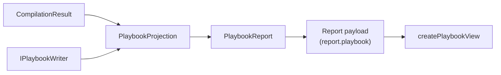

# Implementation note: Playbook tab

> [!NOTE]
> Status: **implemented**. Adds a read-only **Playbook** tab after Dialogue Graph
> showing the compiled playbook — the JSON a runtime loads — beside the header and
> speaker facts a reader would otherwise scroll a long document to find.

## Table of contents

- [Goal and scope](#goal-and-scope)
- [Where it sits](#where-it-sits)
- [Ubiquitous language](#ubiquitous-language)
- [Key design decisions](#key-design-decisions)
  - [DD1 — The report carries the playbook as a document, not a graph](#dd1--the-report-carries-the-playbook-as-a-document-not-a-graph)
  - [DD2 — The tab comes last, after the graph it is compiled from](#dd2--the-tab-comes-last-after-the-graph-it-is-compiled-from)
  - [DD3 — Read-only, because the playbook is compiled rather than authored](#dd3--read-only-because-the-playbook-is-compiled-rather-than-authored)
  - [DD4 — The JSON grammar, which is what tells a key from a value](#dd4--the-json-grammar-which-is-what-tells-a-key-from-a-value)
  - [DD5 — The tab is rebuilt on a recompile, not patched](#dd5--the-tab-is-rebuilt-on-a-recompile-not-patched)
  - [DD6 — The visualization indents; the CLI does not](#dd6--the-visualization-indents-the-cli-does-not)
  - [DD7 — The schema is a link out and a hover, not a URL to read](#dd7--the-schema-is-a-link-out-and-a-hover-not-a-url-to-read)
  - [DD8 — The schema is bundled and resolved on demand, never flattened](#dd8--the-schema-is-bundled-and-resolved-on-demand-never-flattened)
  - [DD9 — A hover shows what a rule covers, in the report's existing wash](#dd9--a-hover-shows-what-a-rule-covers-in-the-reports-existing-wash)
  - [DD10 — The tables are the report's table panels, namespaced apart](#dd10--the-tables-are-the-reports-table-panels-namespaced-apart)
  - [DD11 — The grammar folds; the text answers](#dd11--the-grammar-folds-the-text-answers)
- [Error and boundary cases](#error-and-boundary-cases)
- [Testability](#testability)

## Goal and scope

The report shows every compiler stage but stops at the **Dialogue Graph** — the last
thing the compiler builds in memory. What a game actually loads is the **playbook**,
the versioned JSON the runtime reads. A reader can see the graph a script becomes but
not the artifact it ships as, and must run `ddown compile --emit playbook` and open
the file in another editor to check what a host will receive.

This tab closes that gap. It shows the serialized playbook beside two tables that
answer the questions a reader opens the file for: what a host must provide to run it,
where a playthrough starts, how large it is, and who can speak.

**In scope:** the serialized playbook, a header table, a speaker table, and the
explanation shown when a script does not compile.

**Out of scope:** playing the playbook (see
[Interactive Playthrough](./Interactive%20Playthrough.md)), editing it, and diffing
one playbook against another.

## Where it sits

`PlaybookProjection` sits beside the graph projections in
`DialogueDown.Visualization`: it turns a compile into the report's `playbook`
section using the same `IPlaybookWriter` the CLI's `--emit playbook` uses, so the
tab and the file can never disagree about what a playbook is.

## Ubiquitous language

| Term | Meaning |
| --- | --- |
| **Playbook** | The runtime's artifact: the versioned JSON a host loads and plays. |
| **Playbook report** | The report payload's playbook section — the serialized document plus the facts the tables show. |
| **Header** | The playbook's `format`, `script`, and `entry` fields, and the sizes derived from its nodes and anchors. |

## Key design decisions

### DD1 — The report carries the playbook as a document, not a graph

Every other tab past Source is a **stage**: a node-and-edge `DisplayGraph` built by
`BuildStages`. The playbook is not one — it is a document, and forcing it into a
graph would show a reader a picture of the JSON instead of the JSON.

The **Config tab** is the right analogue and the model followed here: a read-only
editor on the left, tables on the right, a draggable split between them, and a
collapse toggle on the divider. The payload gains a sibling `playbook` field beside
`configuration`, and the tab rides on it.

### DD2 — The tab comes last, after the graph it is compiled from

The tab order is the pipeline order: source, then each stage, ending at Dialogue
Graph. The playbook is what that graph becomes, so it belongs immediately after —
the reader walks the whole compile from text to shipped artifact in one direction.

Because the graph stages are rebuilt wholesale on every recompile, the Playbook tab
is appended *after* the stage loop in both the initial build and the rebuild.

### DD3 — Read-only, because the playbook is compiled rather than authored

Source and Config are editable because a person writes them. Nobody writes a
playbook: it is generated, and an edit to it would be discarded by the next
recompile. The editor is therefore read-only in both View and Edit — the one editor
in the report whose mode never changes — and says so with `aria-readonly`.

`EditorState.readOnly` blocks the **input** path rather than programmatic dispatch,
which is exactly the guarantee wanted: the reader cannot type into it, while the
recompile can replace it.

### DD4 — The JSON grammar, which is what tells a key from a value

The tab first used the `json` mode in `@codemirror/legacy-modes`, already a dependency for the
Config tab's TOML. That mode is a **tokenizer, not a parser**, and it emits one token for a
property name and a string value alike — measured on a rendered playbook, `"script"` and
`"scene.dialogue.md"` carried the same class, so no style could tell them apart. In a document
where every key and most values are quoted, that is the distinction a reader most needs.

`@codemirror/lang-json` wraps the Lezer JSON grammar, which emits `PropertyName` separately and
brings fold ranges with it. Adopting it **shrank the client by 15 KB**: the legacy JavaScript
mode it replaced carries JS and TypeScript too, and dropping its last use let the bundler shake
the whole module out. Better highlighting, free folding, and a smaller download.

The colors follow **VS Code's JSON roles** — a key, a string, a number, and a literal each on
their own hue — which is the convention this palette already states it uses for code-span
semantics, and which already carries VS Code's string (`#a31515`/`#ce9178`) and number
(`#098658`/`#b5cea8`) hues for dialogue tokens. The Markdown hues would not have served: they are
one blue family, and a playbook is nearly all quoted strings, so its parts have to part company on
hue rather than on shade. Punctuation is the one departure, muted instead of VS Code's plain
black: this editor is read, not written, so the braces that give a block its shape recede behind
the data.

The one thing the grammar is *not* used for is reading a line's schema path — see
[DD11](#dd11--the-grammar-folds-the-text-answers).

### DD5 — The tab is rebuilt on a recompile, not patched

The Config tab keeps a handle and patches itself in place, because it sits *before*
the stages and survives their replacement. The Playbook tab sits *after* them, so it
is rebuilt with them.

That trade is deliberate. Patching would preserve scroll position, but a recompile
replaces the JSON anyway, so the preserved offset points somewhere arbitrary. What
readers do value — the split width and the collapse choice — is remembered in
`localStorage` and survives the rebuild regardless. Rebuilding keeps the tab indices
correct for free, where detaching and reattaching would depend on the stage count
never changing.

### DD6 — The visualization indents; the CLI does not

`ddown compile --emit playbook` writes the compact document a host loads. The tab
serializes the same object with `WriteIndented`, because it exists to be read. Both
go through `PlaybookJson.Options`, so only the whitespace differs.

### DD7 — The schema is a link out and a hover, not a URL to read

Every playbook names its schema in a `$schema` field, but a URL sitting in a document is
something to read, not somewhere to go. The header table gains a **Schema** row linking to the
published file, and the editor answers the same question in place: hovering a property shows
what the format says it means, the way an editor does for any `$schema`-linked JSON.

The descriptions are the schema's own, so the tab explains the format without a second copy of
the explanation to keep true.

### DD8 — The schema is bundled and resolved on demand, never flattened

The schema describes the **format**, not this playbook, so it is bundled with the client rather
than sent with each report — a per-report copy would be re-sent on every save to say the same
thing. It is imported straight from `schema/playbook-0.schema.json`, not copied into the client,
so a schema edit reaches the report with nothing to keep in sync. The cost is **17 KB of a
~500 KB budget**.

A path is resolved *through* the schema when the reader hovers, rather than flattened into a
lookup table up front. That is not an optimization but a correctness requirement: the format is
recursive — a fragment holds fragments — so a table of every path does not terminate. Measured
at depth 16 it had already reached 1,470 entries and was still growing.

Two details make the answer specific rather than vague:

- **The document's own `kind` picks the variant.** The format models its variants as a `oneOf`
  tagged by `kind`, and the schema documents each variant as a whole. Reading that tag out of the
  document — from the property's *siblings*, not its children — turns "one piece of what a line
  says" into "plain words, as written".
- **An undocumented leaf reports its enclosing shape,** labelled with that shape's path so the
  answer is never mistaken for the leaf's own. The schema deliberately documents variants rather
  than their `kind`/`text` fields, so without this most hovers would be silent. Measured on a
  52-node playbook, this takes the share of property lines that say something true from **44% to
  100%** — and a path outside the format still describes nothing at all.

### DD9 — A hover shows what a rule covers, in the report's existing wash

A description answers *what this means*; the reader's next question is *how far does it reach* —
does `format` describe the one line or the whole block? While a tooltip is open, the stretch it
applies to is washed in: the enclosing object or array when the property opens one, and the
property's own line when it holds a scalar.

It wears the Source tab's `dd-jump-preview` class, the same faint wash that previews the
enclosing node a Jump-to target lands in. Two surfaces answering "what does this cover?" should
not answer it in two colors.

The wash is raised on the tooltip's `mount` and lifted on its `destroy`, so the two can never
disagree — but both hooks run inside CodeMirror's own update, which refuses a dispatch, so each
is deferred by a task.

### DD10 — The tables are the report's table panels, namespaced apart

The right pane is three `createTablePanel` panels — the Semantic tab's own — so each folds from a
caret, counts its rows, searches from a magnifier, and sorts on any column. They answer the same
kind of question about a different artifact, and a reader who has learned one should not have to
learn the other. **Anchors** is a table in its own right rather than a count in the header: which
scenes a jump can name is a list, and a list of five reads as five rows, not as the number 5.

`createTablePanel` gained a `storagePrefix`. Both tabs show tables called *Speakers* and
*Anchors*, and the remembered collapse key was derived from the title alone — so without the
prefix, folding a panel here would silently fold that tab's too.

### DD11 — The grammar folds; the text answers

A long playbook is unreadable without folding, and a reader who folds headings in the Source
editor and tables in the Config editor expects the same gutter here. The Lezer grammar supplies
the fold ranges, so a block folds between its brackets and a folded line still reads as
`"nodes": [⋯]`.

A line's **schema path** and the **stretch a rule covers** are read from the text instead, in
`playbook-json` (`depthOf`, `opensBlock`, `blockEnd`). That looks like duplication of what a
syntax tree already knows, and it is deliberate: **CodeMirror parses lazily**, so `syntaxTree`
covers only what has been parsed, while the text has no such gap and answers the same way at any
position, however far the reader has scrolled. Folding only ever asks about lines already drawn,
so it can safely rely on the tree; a hover and a wash should not depend on how much of a
1,000-line document the parser has reached.

Reading structure off indentation is sound here for a reason worth stating, because it is
invisible otherwise: the playbook is a **generated** artifact written by `JsonSerializer` with
`WriteIndented`, whose output is exactly regular — two spaces per level, one property or bracket
per line, and no literal newline inside a string. A hand-written JSON file would not be.

## Error and boundary cases

| Case | Behavior |
| --- | --- |
| Script has errors | No playbook exists. The tab shows the reason, mirroring the Dialogue Graph stage, which is unavailable on the same condition. |
| Report built without the compiler | A bare graph render carries no `playbook`, so no tab appears. |
| Recompile carries no playbook | The last one stays, rather than the tab vanishing under the reader. |
| Anonymous default speaker | Named `(anonymous)` rather than shown as an empty cell. |
| Empty `uses` list | Rendered as an em dash, like the Config tab's empty values. |
| A playbook no jump can target | The Anchors panel says so rather than showing an empty grid. |
| A hovered property holding a scalar | The wash covers its line alone, not the block around it. |
| An empty block (`"uses": []`) | Offers no fold: there is nothing between the brackets to hide. |

## Testability

| Level | Covers |
| --- | --- |
| .NET unit | `PlaybookProjection` — metadata, speakers, tag flattening, and the unavailable case. |
| Vitest | `schemaPathAt` — the path of a line, through nested arrays, objects, and a map's own keys. |
| Vitest | `describeSchemaPath` — the format's own words, variant selection by `kind`, the enclosing-shape fallback, and silence outside the format. |
| Vitest | `appliedRange` — an object, an array, a scalar line, and an array element from its bare opener. |
| Vitest | `playbook-json` — the shape primitives a path and a wash are read with. |
| .NET unit | The payload wiring: `RenderHtmlReport` and `SerializeDocument` both embed the playbook. |
| Vitest | `createPlaybookView` — the tables, the anonymous speaker, the em dash, and read-onlyness through the command an editing keystroke runs. |
| Vitest | `runApp` — tab placement after Dialogue Graph, absence without a playbook, rebuild on save, and the help context. |
| Playwright | The tab end to end: real typing is refused, the three panels render and search and fold, the schema link is safe, a hover quotes the schema, and axe reports no violations. |
| Playwright | The wash: it covers the block, it lifts with the tooltip, and it **actually paints** — a decoration whose style is scoped to another pane is present and "visible" while washing nothing. |
| Playwright | The panels' remembered state does not collide with the Semantic tab's same-named ones. |
| Playwright | Folding from the gutter hides a block's members while the rest of the document stays, and the placeholder opens it again. |
| Playwright | A key, a string value, and a number render in three different colors — an assertion the previous tokenizer could not have passed. |
