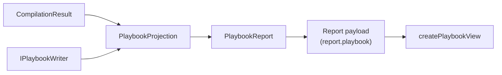

# Implementation note: Playbook tab

> [!NOTE]
> Status: **implemented**. Adds a read-only **Playbook** tab after Dialogue Graph
> showing the compiled playbook — the JSON a runtime loads — beside the header and
> speaker facts a reader would otherwise scroll a long document to find.

## Table of contents

- [Goal and scope](#goal-and-scope)
- [Where it sits](#where-it-sits)
- [Ubiquitous language](#ubiquitous-language)
- [Key design decisions](#key-design-decisions)
  - [DD1 — The report carries the playbook as a document, not a graph](#dd1--the-report-carries-the-playbook-as-a-document-not-a-graph)
  - [DD2 — The tab comes last, after the graph it is compiled from](#dd2--the-tab-comes-last-after-the-graph-it-is-compiled-from)
  - [DD3 — Read-only, because the playbook is compiled rather than authored](#dd3--read-only-because-the-playbook-is-compiled-rather-than-authored)
  - [DD4 — JSON highlighting via the legacy-modes mode already on hand](#dd4--json-highlighting-via-the-legacy-modes-mode-already-on-hand)
  - [DD5 — The tab is rebuilt on a recompile, not patched](#dd5--the-tab-is-rebuilt-on-a-recompile-not-patched)
  - [DD6 — The visualization indents; the CLI does not](#dd6--the-visualization-indents-the-cli-does-not)
- [Error and boundary cases](#error-and-boundary-cases)
- [Testability](#testability)

## Goal and scope

The report shows every compiler stage but stops at the **Dialogue Graph** — the last
thing the compiler builds in memory. What a game actually loads is the **playbook**,
the versioned JSON the runtime reads. A reader can see the graph a script becomes but
not the artifact it ships as, and must run `ddown compile --emit playbook` and open
the file in another editor to check what a host will receive.

This tab closes that gap. It shows the serialized playbook beside two tables that
answer the questions a reader opens the file for: what a host must provide to run it,
where a playthrough starts, how large it is, and who can speak.

**In scope:** the serialized playbook, a header table, a speaker table, and the
explanation shown when a script does not compile.

**Out of scope:** playing the playbook (see
[Interactive Playthrough](./Interactive%20Playthrough.md)), editing it, and diffing
one playbook against another.

## Where it sits

`PlaybookProjection` sits beside the graph projections in
`DialogueDown.Visualization`: it turns a compile into the report's `playbook`
section using the same `IPlaybookWriter` the CLI's `--emit playbook` uses, so the
tab and the file can never disagree about what a playbook is.

## Ubiquitous language

| Term | Meaning |
| --- | --- |
| **Playbook** | The runtime's artifact: the versioned JSON a host loads and plays. |
| **Playbook report** | The report payload's playbook section — the serialized document plus the facts the tables show. |
| **Header** | The playbook's `format`, `script`, and `entry` fields, and the sizes derived from its nodes and anchors. |

## Key design decisions

### DD1 — The report carries the playbook as a document, not a graph

Every other tab past Source is a **stage**: a node-and-edge `DisplayGraph` built by
`BuildStages`. The playbook is not one — it is a document, and forcing it into a
graph would show a reader a picture of the JSON instead of the JSON.

The **Config tab** is the right analogue and the model followed here: a read-only
editor on the left, tables on the right, a draggable split between them, and a
collapse toggle on the divider. The payload gains a sibling `playbook` field beside
`configuration`, and the tab rides on it.

### DD2 — The tab comes last, after the graph it is compiled from

The tab order is the pipeline order: source, then each stage, ending at Dialogue
Graph. The playbook is what that graph becomes, so it belongs immediately after —
the reader walks the whole compile from text to shipped artifact in one direction.

Because the graph stages are rebuilt wholesale on every recompile, the Playbook tab
is appended *after* the stage loop in both the initial build and the rebuild.

### DD3 — Read-only, because the playbook is compiled rather than authored

Source and Config are editable because a person writes them. Nobody writes a
playbook: it is generated, and an edit to it would be discarded by the next
recompile. The editor is therefore read-only in both View and Edit — the one editor
in the report whose mode never changes — and says so with `aria-readonly`.

`EditorState.readOnly` blocks the **input** path rather than programmatic dispatch,
which is exactly the guarantee wanted: the reader cannot type into it, while the
recompile can replace it.

### DD4 — JSON highlighting via the legacy-modes mode already on hand

`@codemirror/legacy-modes` is already a dependency for the Config tab's TOML mode,
and the same package exports a `json` mode. Using it adds **no new dependency** —
which matters, because a bundle-size test gates the client.

### DD5 — The tab is rebuilt on a recompile, not patched

The Config tab keeps a handle and patches itself in place, because it sits *before*
the stages and survives their replacement. The Playbook tab sits *after* them, so it
is rebuilt with them.

That trade is deliberate. Patching would preserve scroll position, but a recompile
replaces the JSON anyway, so the preserved offset points somewhere arbitrary. What
readers do value — the split width and the collapse choice — is remembered in
`localStorage` and survives the rebuild regardless. Rebuilding keeps the tab indices
correct for free, where detaching and reattaching would depend on the stage count
never changing.

### DD6 — The visualization indents; the CLI does not

`ddown compile --emit playbook` writes the compact document a host loads. The tab
serializes the same object with `WriteIndented`, because it exists to be read. Both
go through `PlaybookJson.Options`, so only the whitespace differs.

## Error and boundary cases

| Case | Behavior |
| --- | --- |
| Script has errors | No playbook exists. The tab shows the reason, mirroring the Dialogue Graph stage, which is unavailable on the same condition. |
| Report built without the compiler | A bare graph render carries no `playbook`, so no tab appears. |
| Recompile carries no playbook | The last one stays, rather than the tab vanishing under the reader. |
| Anonymous default speaker | Named `(anonymous)` rather than shown as an empty cell. |
| Empty `uses` list | Rendered as an em dash, like the Config tab's empty values. |

## Testability

| Level | Covers |
| --- | --- |
| .NET unit | `PlaybookProjection` — metadata, speakers, tag flattening, and the unavailable case. |
| .NET unit | The payload wiring: `RenderHtmlReport` and `SerializeDocument` both embed the playbook. |
| Vitest | `createPlaybookView` — the tables, the anonymous speaker, the em dash, and read-onlyness through the command an editing keystroke runs. |
| Vitest | `runApp` — tab placement after Dialogue Graph, absence without a playbook, rebuild on save, and the help context. |
| Playwright | The tab end to end: real typing is refused, both tables render, the panel collapses, and axe reports no violations. |
