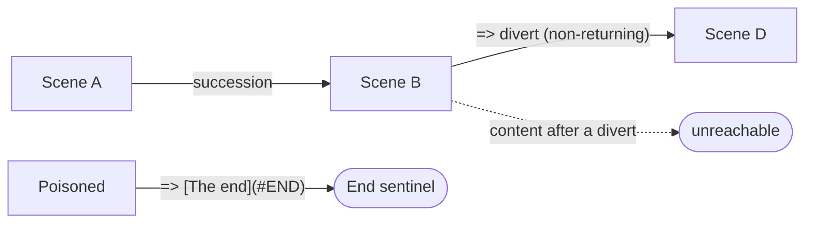

# Progression order

> [!NOTE]
> Status: **proposed**. This note fixes DialogueDown's **progression order** — how
> a reader moves through a script when nothing branches — and the two roles a jump
> can play under it. It also adds one concrete construct, the **`#END`** reserved
> terminator. The actual play-time traversal belongs to the deferred
> [dialogue graph and runtime](https://github.com/pengzhengyi/godot-dialoguedown/issues/45);
> this note settles the *meaning* the graph will implement, plus the compile-time
> resolution, diagnostics, and editor support that can ship now.

## Table of contents

- [Goal and scope](#goal-and-scope)
- [Ubiquitous language](#ubiquitous-language)
- [Prior art](#prior-art)
- [Writer-facing behavior](#writer-facing-behavior)
- [Grammar and semantics](#grammar-and-semantics)
- [Affected stages and seams](#affected-stages-and-seams)
- [Markdown interaction](#markdown-interaction)
- [Diagnostics](#diagnostics)
- [Testability](#testability)
- [Alternatives not chosen](#alternatives-not-chosen)
- [Open questions and deferred work](#open-questions-and-deferred-work)

## Goal and scope

A script needs a **default flow**: what plays after a line, and what happens when a
scene's content runs out. That single choice decides everything downstream — most
importantly, whether a **jump returns**. This note answers it for DialogueDown.

**The model: reading order.** DialogueDown progresses like a document you read —
top to bottom, in **document order**. When a scene's content is exhausted, the
reader **falls through** to the next block in the source, exactly as prose flows
into the next paragraph and a chapter flows into the next chapter. A script with no
jumps plays start to finish with no wiring.

In scope:

- The **reading-order** progression model and its document-order semantics.
- The two jump **roles** it creates: a non-returning **divert** (the existing
  `=>`) and a returning **detour** (concept only here).
- The **`#END`** reserved terminator that stops a run early.
- The compile-time surfaces that can ship without the runtime:
  **`#END` resolution**, **diagnostics**, and **editor support**
  (highlighting and completion).

Out of scope / deferred (see [open questions](#open-questions-and-deferred-work)):

- **Runtime traversal** — actually walking the flow at play time is the deferred
  graph/runtime ([#45](https://github.com/pengzhengyi/godot-dialoguedown/issues/45)).
- **The detour's syntax and return boundary** — its concrete spelling and *where*
  it returns get their own follow-up note; here it is only a named role.
- **`#START` / entry point** — where a run begins (file top vs. a designated start
  vs. a cross-file entry) is deliberately left open.
- **Cross-file** jumps ([#59](https://github.com/pengzhengyi/godot-dialoguedown/issues/59)).

## Ubiquitous language

| Term | Meaning |
| --- | --- |
| **Progression order** | The order a reader moves through a script when nothing branches. DialogueDown's is **reading order**. |
| **Reading order** | Document order — the source top to bottom, which is the pre-order of the heading outline. |
| **Fall-through** | When a scene's content is exhausted, the reader continues to the next block in document order rather than stopping. |
| **Run** | One traversal of the script, from the entry point until it terminates. |
| **Divert** | A **non-returning** jump: control transfers to the target and does not come back. The existing `=>`. |
| **Detour** | A **returning** jump: control transfers to the target, plays it to depletion, then returns and continues reading order. Concept only in this note. |
| **End sentinel** | The terminal node of a run. The reserved anchor **`#END`** resolves to it; reaching it ends the run. |

One vocabulary applies across code, tests, docs, diagnostics, and commits.

## Prior art

Every narrative language answers this same question, and they cluster into two
camps. The lasting lesson: mature reading-order languages make the **default jump
non-returning** and offer a **separate returning** construct, plus an **explicit
terminator**.

| Language | Progression when a scene ends | Non-returning | Returning | Explicit end |
| --- | --- | --- | --- | --- |
| Ink | Reading-order fall-through to the next knot | `->` divert | `->->` tunnel | `-> END` |
| ChoiceScript | Reading-order; scenes chain in `*scene_list` order | `*goto` | `*gosub` / `*return` | `*finish` |
| Ren'Py | Reading-order; labels are bookmarks | `jump` | `call` / `return` | `return` (top) |
| Yarn Spinner | **Section-terminal** — a node ends, nothing follows | `<<jump>>` | `<<detour>>` | (implicit) |
| Twine | **Section-terminal** — a passage ends | link | (manual) | (no link) |

DialogueDown adopts the **reading-order** camp (Ink / ChoiceScript / Ren'Py). It is
the least-surprising model for a script that *looks like a Markdown document*: a
document is meant to be read straight through.

## Writer-facing behavior

A script plays in **document order**. Headings are an outline; their nesting is for
naming and scope, not flow — the reader simply reads the source top to bottom.

```text
# The Crossroads
Guide: The road behind you is closed.

## The Signpost
Guide: A weathered signpost marks three roads.

# The Market
Merchant: Fresh apples!
```

This plays: *The Crossroads* → *The Signpost* (its subsection) → *The Market* — the
document's own order, with no jumps required.

**Diverting (`=>`, non-returning).** A divert sends the reader elsewhere and does
not come back:

```text
Guide: Which way?
=> [To the market](#the-market)
Guide: (never reached — the divert already left)
```

**Ending a run early (`#END`).** Because scenes fall through, a branch that should
*stop* — a bad ending in the middle of the document — needs an explicit terminator.
Divert to the reserved anchor **`#END`**:

```text
# Poisoned
Guard: You drank it. You collapse.
=> [The end](#END)

# The Vault
... (reached only by an explicit jump, never by falling through Poisoned)
```

Reaching the end of the last block also terminates naturally, so `#END` is only for
stopping *early*. There is no `# End` heading to write: `#END` is always available.
Any farewell "ceremony" is just ordinary content written before the terminator.

**Choices rejoin.** After the reader picks an option, that option's body plays, then
control **continues after the choice block** — the branch weaves back into the main
flow. The same holds for a random choice once its option is resolved.

**Detour (returning) — the concept.** A returning **detour** goes to a target, plays
it to depletion, then **returns** and continues reading order — "expand this section
inline, then carry on." It is what makes *multiple jumps on one line* meaningful (do
this, come back, then do that, come back). Its concrete syntax and return boundary
are a separate note; here it exists only as a named role that the diagnostics below
already account for.

## Grammar and semantics

**Progression = document order.** The flow graph's default **succession** edge
connects each block to the next block in source order (the pre-order of the
`SceneHeading` outline). The scene tree from the
[Semantic Analyzer](./Semantic%20Analyzer.md) is a naming/scope view; it does not
change progression.

**Divert is non-returning.** A `=>` transfers control to its target with no return
edge. Anything after a divert on the same run path is unreachable (see
[diagnostics](#diagnostics)).

**`#END` is an uppercase, case-sensitive reserved anchor.** It resolves to the
**End sentinel** — the run's terminal node — and is recognized **before** ordinary
slug lookup. Two facts make the uppercase spelling collision-free by construction:

- Heading slugs are always lowercased (`Slug.From` → `ToLowerInvariant`), so **no
  heading can ever produce the slug `END`**.
- Jump targets are matched verbatim, so a lowercase user anchor (`#end`, from a
  scene titled "End") and the reserved `#END` never coincide.

So `#END` needs no new syntax — it is an ordinary divert to a reserved target — yet
it can never clash with an author's scene. There is no injected heading: `#END`
resolves straight to the sentinel, keeping the Markdown and Dialogue ASTs faithful
to the source. The flow graph still renders an **End** node (the sentinel), so the
terminus stays visible in the visualization.



**Detour is returning** (deferred): a detour adds a return edge, so control resumes
after it once the target depletes. This is the only shape under which trailing
content or a second jump on a line is reachable.

## Affected stages and seams

| Stage | Change |
| --- | --- |
| [Semantic Analyzer](./Semantic%20Analyzer.md) — jump resolution | Recognize the reserved `#END` anchor **before** `AnchorTable` lookup and resolve it to the **End sentinel**; ordinary anchors resolve as today. |
| Validation | Add an **unreachable-after-divert** rule; reframe the existing multiple-jumps rule (see [diagnostics](#diagnostics)). |
| Semantic model | Expose the End sentinel and reserved-anchor resolution so the graph builder and editor projections can consume them. |
| Editor projections (visualization) | Surface `#END` through the **semantic symbol projection** so completion offers it as a divert target, and add a **semantic token** so it highlights as a reserved keyword. See the [Compiler-Projected Editor Semantics](./Compiler-Projected%20Editor%20Semantics.md) note. |
| Flow graph / runtime — **deferred** | The succession/divert/detour **edges** and play-time traversal are the deferred graph/runtime ([#45](https://github.com/pengzhengyi/godot-dialoguedown/issues/45)). This note only fixes their meaning. |

## Markdown interaction

`#END` introduces **no new sigil** — it is the anchor part of an ordinary divert
link, so it consumes no literal character sequence and needs no new escape. In a
plain Markdown preview, `=> [The end](#END)` renders as a link whose fragment
(`#END`, uppercase) matches no lowercased heading id, so it simply scrolls nowhere —
acceptable for a control keyword the compiler interprets specially.

## Diagnostics

Reading order plus a non-returning divert makes two structural checks meaningful.
Both are **warnings** (dead content, not malformed input) and both are purely
structural, so they can ship without the runtime.

- **Unreachable content after a divert (`DLG1003`).** In a line's speech, any
  non-blank fragment after the first divert — trailing text, or a second `=>` — can
  never play, because the divert already left. Warn, spanning the unreachable content.
- **The former "multiple jumps on a line" check is subsumed.** A second jump is just
  unreachable content after the first, so the single rule above covers it — there is
  no separate multiple-jumps diagnostic. Once the returning detour exists, the rule
  keys off the *divert*, since detours legitimately chain.

A divert to an unknown reserved anchor (for example a mistyped `#ENND`) is an
unresolved target, reported like any other missing anchor.

## Testability

- **Pure and structural.** `#END` resolution is a semantic-model unit test (a divert
  to `#END` resolves to the End sentinel, before slug lookup, case-sensitively). The
  diagnostics are structural rule tests over `Line` speech — the same shape as the
  existing jump rules — needing no runtime.
- **Editor.** Component tests assert `#END` is offered by completion and carries its
  semantic token; a thin browser test proves the integration.
- **Deferred.** Play-time traversal (fall-through, divert, detour, termination) is
  tested with the graph/runtime, not here.

## Alternatives not chosen

- **Section-terminal progression (Yarn / Twine).** Every scene ends unless it
  explicitly moves on. Rejected: a straight-through Markdown read would need a jump
  at the end of *every* scene — verbose and unlike reading a document.
- **A returning default `=>`.** Making the default jump deplete-and-return (so
  multiple jumps always chain) was considered. Rejected: no mainstream language does
  it — a one-way jump is the common branching case, so returning is opt-in
  everywhere. DialogueDown keeps `=>` non-returning and adds the detour separately.
- **Lowercase `#end` with an override heading.** Reserving the lowercase slug `end`
  (letting an authored `# End` scene *be* the terminator, with ceremony) was the
  first sketch. Rejected for the uppercase `#END` sentinel: it collides with a real
  `# End` scene and needs an override rule and an INFO diagnostic, where `#END`
  collides with nothing and stays a pure sentinel.
- **`##end` reserved-tag terminator.** Spelling the terminator in the `##` reserved
  namespace avoids the slug question but overloads *reserved tags* (a speaker/line
  annotation) with control flow and breaks the uniform "a jump targets a link"
  grammar.

## Open questions and deferred work

- **Detour syntax and return boundary** — the returning construct's spelling and
  *where* it returns (a heading's subtree is the leading candidate) get their own
  note.
- **`#START` / entry point** — reserving a start sentinel is natural, but its meaning
  (file top vs. a designated start vs. cross-file entry) is unsettled and deferred.
- **Runtime traversal** — fall-through, divert, detour, and termination execute in
  the deferred graph/runtime ([#45](https://github.com/pengzhengyi/godot-dialoguedown/issues/45)).
- **Case-insensitive scene-target matching** — ordinary jump targets are matched
  case-sensitively against lowercased slugs, so a hand-typed `#The-Market` fails to
  resolve. Autocomplete inserts the correct slug, so it rarely bites, but it is a
  latent sharp edge worth its own fix.
