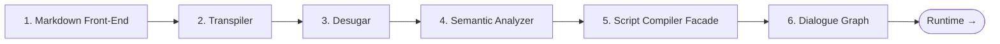
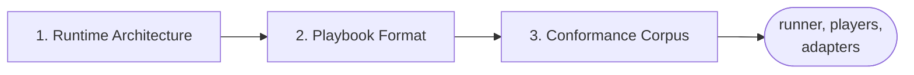
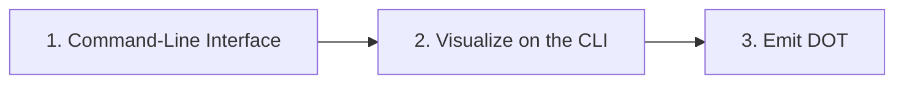
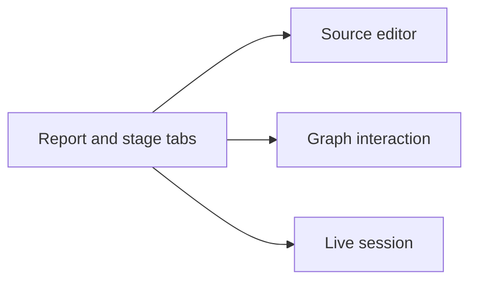

# Implementation notes

Design and rationale notes for DialogueDown's compiler. Each note covers one
component; this README is the **reading guide** to them.

Cross-cutting conventions live in their own notes rather than here, so this file
stays an index. The one every component shares is the
[Error model](./core/Error%20Model.md) — read it alongside the Core notes.

## Table of contents

- [How the notes are laid out](#how-the-notes-are-laid-out)
- [Reading guide](#reading-guide)
  - [Core: the compiler pipeline](#core-the-compiler-pipeline)
  - [Runtime: playing a compiled script](#runtime-playing-a-compiled-script)
  - [Language constructs](#language-constructs)
  - [Configuration](#configuration)
  - [Diagnostics](#diagnostics)
  - [Command-line interface](#command-line-interface)
  - [Visualization](#visualization)
    - [Report and stage tabs](#report-and-stage-tabs)
    - [Source editor](#source-editor)
    - [Graph interaction](#graph-interaction)
    - [Live session](#live-session)
  - [Other notes](#other-notes)

## How the notes are laid out

Each area below is a folder, so the tree matches this guide and a note sits
beside the ones it is read with. Visualization is the largest area by far, so it
is split again by surface.

```text
design-notes/
├── core/           the compiler pipeline, stage by stage
├── runtime/        playing a compiled script
├── language/       one script-language construct per note
├── configuration/  the options seam and its TOML edge
├── diagnostics/    collecting and reporting problems
├── cli/            the ddown command-line tool
├── visualization/
│   ├── report/     the report shell and its stage tabs
│   ├── editor/     the Source editor's highlighting and completions
│   ├── graph/      reading and navigating a rendered graph
│   └── session/    the served shell: watching, editing, browsing
└── other/          spikes and project-level notes
```

## Reading guide

The notes below are grouped by area and ordered for reading. Start with
**Core** — those explain the compiler itself and are worth reading in full.
Read **Command-line interface** or **Visualization** only when you work on that
surface: both document tools built *on top of* the core, so they are optional
for understanding the compiler. Each note keeps a one-line summary and a status
(**Implemented**, **Partially implemented**, **In progress**, **Explored**, or
**Proposed**).

> [!TIP]
> New here? Read the Core notes in order, then the
> [Error model](./core/Error%20Model.md). That is enough to understand and change the
> compiler.

### Core: the compiler pipeline

**Essential — read in full.** These trace a script through the compiler, one
stage per note, in pipeline order; the facade note ties the stages together.



| Order | Note | What it covers | Status |
| --- | --- | --- | --- |
| 1 | [Markdown Front-End](./core/Markdown%20Front-End.md) | Source text → Markdown AST (Markdig adapter) | Implemented |
| 1a | [Unmodeled Markdown Handling](./core/Unmodeled%20Markdown%20Handling.md) | A front-end detail: which unmodeled Markdown is ignored or kept as dialogue text | Implemented |
| 2 | [Markdown to Dialogue AST Transpiler](./core/Markdown%20to%20Dialogue%20AST%20Transpiler.md) | Markdown AST → Dialogue AST | Implemented |
| 3 | [Desugar](./core/Desugar.md) | Dialogue AST → normalized Dialogue AST (jump assembly, default speaker) | Implemented |
| 4 | [Semantic Analyzer](./core/Semantic%20Analyzer.md) | Desugared AST → semantic model (speakers, scenes, resolved jumps) | Implemented |
| 5 | [Script Compiler Facade](./core/Script%20Compiler%20Facade.md) | One `IScriptCompiler` seam over the stages + `AddDialogueDown` DI | Implemented |
| 5a | [Compilation Outcome](./core/Compilation%20Outcome.md) | A facade detail: what one compile produces — a success carrying every artifact, or a failure carrying how far it got | Implemented |
| 6 | [Dialogue Graph](./core/Dialogue%20Graph.md) | Semantic model → the immutable flow graph a runtime walks | Implemented |

| 6 | [Error model](./core/Error%20Model.md) | The cross-cutting convention: collect a diagnostic, throw only when a stage cannot continue | Implemented |

The Error model is a convention every stage adopts rather than a stage itself —
read it alongside the five above.

### Runtime: playing a compiled script

**Read when you work on anything after the graph.** The architecture note fixes
the cross-cutting decisions — the artifact, the execution model, the protocol —
and each component note applies them to one piece.



| Order | Note | What it covers | Status |
| --- | --- | --- | --- |
| 1 | [Dialogue Runtime Architecture](./runtime/Dialogue%20Runtime%20Architecture.md) | The umbrella: the portable playbook, the runner that plays it, and the protocol and seams a host implements | Partially implemented |
| 2 | [Playbook Format](./runtime/Playbook%20Format.md) | Graph → a versioned JSON playbook, and the reader that loads one back | Implemented |
| 3 | [Conformance Corpus](./runtime/Conformance%20Corpus.md) | Language-neutral fixtures every runtime must reproduce, written before the runner so they specify it | Implemented |

### Language constructs

**Read when you add or change a script-language construct.** Each note designs
one writer-facing syntax — its grammar, semantics, Markdown interaction, and
diagnostics — layered on the pipeline above. Read the relevant Core stage notes
first, since a construct threads through them.

| Note | What it covers | Status |
| --- | --- | --- |
| [Progression Order](./language/Progression%20Order.md) | How a script progresses (reading-order fall-through), the divert vs. detour jump roles, and the `#END` terminator | Partially implemented |
| [Random Choice](./language/Random%20Choice.md) | A choice list with per-option `` `%` `` weights that the engine resolves to one option at random | Implemented |
| [Conditions](./language/Conditions.md) | The condition primitive (`` `"key"?` ``) every guard shares — its grammar, how it resolves, and the decisions behind it | Implemented |
| [Conditional Jump](./language/Conditional%20Jump.md) | A condition guarding a jump, so the jump fires only when the query is true | Implemented |
| [Conditional Line](./language/Conditional%20Line.md) | A condition fronting a line, so the line plays only when the query is true | Implemented |
| [Conditional Choice](./language/Conditional%20Choice.md) | A condition guarding a choice option, so a player or random option is offered only when the query is true | Implemented |
| [Unquoted Keys](./language/Unquoted%20Keys.md) | Let a condition (`` `IsAngry?` ``) and a dynamic weight (`` `Luck%` ``) drop the quotes around their key, keeping quotes as the escape | Implemented |
| [Block Controls](./language/Block%20Controls.md) | Connected blockquotes that group mutually-exclusive `if`/`elseif`/`else` branch bodies | Implemented |
| [Control Line](./language/Control%20Line.md) | An effect-only line (a bare jump or a silent command) with no speaker, so an effect is never attributed to the default speaker | Implemented |
| [Cross-File Jump Resolution](./language/Cross-File%20Jump%20Resolution.md) | Resolve a jump that targets a scene in another script (`chapter-02.md#meet-bob`) across a project, via a linker | Explored |

### Configuration

**Read when you configure the compiler or add a config knob.** A cross-cutting core
concern — an immutable `CompilerOptions` seam threaded into the stages — and its file
edge, a satellite that reads a `dialogue.toml` into those options.

| Order | Note | What it covers | Status |
| --- | --- | --- | --- |
| 1 | [Configuration](./configuration/Configuration.md) | The `CompilerOptions` seam: compilation mode, configured speakers, and unmodeled-Markdown handling projected into their stages | Implemented |
| 2 | [Configuration Loader](./configuration/Configuration%20Loader.md) | The TOML edge: reads `dialogue.toml` into a `CompilerOptions`, validating with located errors, in its own satellite assembly | Implemented |
| 3 | [CLI Configuration](./configuration/CLI%20Configuration.md) | Threads a project's `dialogue.toml` through the `dialoguedown` CLI into `compile` and `visualize` (and the report's autocompletion) | Implemented |
| 4 | [Compilation Mode Configuration](./configuration/Compilation%20Mode%20Configuration.md) | Makes the compilation `mode` settable in `dialogue.toml` and shown in the Config tab (CLI `--mode` already ships) | Implemented |

### Diagnostics

**Read when you work on collecting or reporting problems.** A cross-cutting core
concern that lets the compiler describe every problem it finds — errors and
warnings — in a structured, located form, so an author can see them all at once
instead of one throw per run. Start with the umbrella note; focused notes then
cover individual rules and the surfaces that render them.

| Order | Note | What it covers | Status |
| --- | --- | --- | --- |
| 1 | [Diagnostics and Validation](./diagnostics/Diagnostics%20and%20Validation.md) | The whole effort: the diagnostic model, the collect-and-continue collection seam, the validator and rules, and the renderer | Implemented |
| 2 | [Choice Nesting Diagnostic](./diagnostics/Choice%20Nesting%20Diagnostic.md) | A style warning for choice branches nested beyond the recommended depth | Implemented |
| 3 | [Styled Speaker Prefix Diagnostic](./diagnostics/Styled%20Speaker%20Prefix%20Diagnostic.md) | A warning when a styled name (`*Alice*:`) looks like a speaker prefix but is not recognized as one | Implemented |
| 4 | [Dangling Arrow Diagnostic](./diagnostics/Dangling%20Arrow%20Diagnostic.md) | A warning when a `=>` has no link after it, so the intended jump degrades to plain text | Implemented |
| 5 | [Ignored Markdown Diagnostic](./diagnostics/Ignored%20Markdown%20Diagnostic.md) | A neutral note when the front end ignores unmodeled Markdown, such as a table or a divider | Implemented |
| 6 | [CLI Diagnostic Rendering](./diagnostics/CLI%20Diagnostic%20Rendering.md) | Renders collected diagnostics on the `dialoguedown` CLI (rich Errata blocks or greppable one-liners), sets the exit code, and exposes `--mode` | Implemented |

### Command-line interface

**Read when you work on the `dialoguedown` CLI.** These build on the core through
Spectre.Console.Cli; they are not needed to understand the compiler.



| Order | Note | What it covers | Status |
| --- | --- | --- | --- |
| 1 | [Command-Line Interface](./cli/Command-Line%20Interface.md) | The `dialoguedown` CLI: `compile` + `visualize` (Spectre.Console.Cli) | Implemented |
| 2 | [Visualize on the CLI](./cli/Visualize%20on%20the%20CLI.md) | Wire `ddown visualize` to the engine; retire the hand-rolled CLI | Implemented |
| 3 | [Compile CLI — Emit DOT](./cli/Compile%20CLI%20-%20Emit%20DOT.md) | `compile --emit dot` emits each stage's graph as portable Graphviz text | Implemented |

### Visualization

**Read when you work on the interactive report or the live/served session.** An
optional TypeScript client that renders each compiler stage; not needed to
understand the compiler. This is the largest area, so its notes are split four
ways — read only the one you are working in.



#### Report and stage tabs

The report shell and what each tab shows — one per compiler stage, plus the
Configuration tab and the folding contract every surface shares.

| Order | Note | What it covers | Status |
| --- | --- | --- | --- |
| 1 | [Compilation Visualization](./visualization/report/Compilation%20Visualization.md) | Compiler-stage IRs → interactive diagrams (the report foundation) | Implemented |
| 2 | [Compiler Stage Tooltips](./visualization/report/Compiler%20Stage%20Tooltips.md) | Per-stage hover tips on the report tabs | Implemented |
| 3 | [Dialogue AST Visualization Tab](./visualization/report/Dialogue%20AST%20Visualization%20Tab.md) | The transpiler's Dialogue AST as a second graph tab | Implemented |
| 4 | [Desugared AST Visualization Tab](./visualization/report/Desugared%20AST%20Visualization%20Tab.md) | The desugarer's normalized AST as a third tab | Implemented |
| 5 | [Semantic Model Visualization Tab](./visualization/report/Semantic%20Model%20Visualization%20Tab.md) | The semantic model as an analytics tab: scene-tree graph + cross-linked tables | Implemented |
| 14 | [Configuration Tab](./visualization/report/Configuration%20Tab.md) | The applied `dialogue.toml` as a first tab: TOML source beside its configured speakers (Stage 1, read-only) | Implemented |
| 15 | [Configuration Tab — Live Edit](./visualization/report/Configuration%20Tab%20-%20Live%20Edit.md) | Edit the `dialogue.toml` in the report; Save recompiles and refreshes the configured speakers (Stage 2a) | Implemented |
| 16 | [Configuration Tab — Autocompletion](./visualization/report/Configuration%20Tab%20-%20Autocompletion.md) | Schema autocompletion for the editable `dialogue.toml`: the `[[speakers]]` table, its keys, and the reserved tag names (Stage 2b) | Implemented |
| 17 | [Configuration Tab — Create New](./visualization/report/Configuration%20Tab%20-%20Create%20New.md) | Create a `dialogue.toml` in place when a project has none, then drop into the editable Config tab (Stage 3) | Implemented |
| 18 | [Unavailable Stage Tabs](./visualization/report/Unavailable%20Stage%20Tabs.md) | A halted compile renders its unproduced stages as disabled tabs, so a broken script still shows what it did produce | Implemented |
| 31 | [Dialogue Graph Visualization Tab](./visualization/report/Dialogue%20Graph%20Visualization%20Tab.md) | The compiled dialogue graph as a fifth stage tab: every node in graph order, typed edges, and orphans made visible | Implemented |
| 38 | [Collapsing Across the Report](./visualization/report/Collapsing%20Across%20the%20Report.md) | One contract and one glyph for folding on every surface, with each surface keeping its own unit and its own state | Implemented |
| 41 | [Playbook Tab](./visualization/report/Playbook%20Tab.md) | The compiled playbook after Dialogue Graph: the JSON a runtime loads, read-only, beside its header and speaker tables | Implemented |
| 43 | [Saying Nothing Across the Report](./visualization/report/Saying%20Nothing%20Across%20the%20Report.md) | One rule for an absent value in any table cell: an empty cell, and the anonymous speaker named | Implemented |
| 44 | [Tag Capsules](./visualization/report/Tag%20Capsules.md) | One capsule draws a tag on every surface: kind in the fill, identity in a leading dot | Implemented |
| 45 | [Copyable Identifiers](./visualization/report/Copyable%20Identifiers.md) | An `@id`, an anchor, and a jump target copy on click; prose does not | Implemented |
| 46 | [Jumping into the Playbook](./visualization/report/Jumping%20into%20the%20Playbook.md) | A node number, a speaker, and the entry node reveal that place in the JSON | Implemented |

#### Source editor

The authoring surface: what the editor highlights, completes, and marks, all
projected from the compiler rather than a client-side grammar.

| Order | Note | What it covers | Status |
| --- | --- | --- | --- |
| 7 | [Source Editor Autocompletion](./visualization/editor/Source%20Editor%20Autocompletion.md) | Document-aware editor completions behind a symbol-source seam | Implemented |
| 19 | [Diagnostics Overlay](./visualization/editor/Diagnostics%20Overlay.md) | The compiler's diagnostics as a source-editor overlay — squiggles, gutter markers, and doc-linked tooltips — on a reusable LSP-shaped projection | Implemented |
| 20 | [Compiler-Projected Editor Semantics](./visualization/editor/Compiler-Projected%20Editor%20Semantics.md) | Source-editor highlighting and completions projected from the compiler's own parse (semantic tokens + resolved symbols), retiring the client-side grammar | Implemented |
| 21 | [Precise Speaker Tokens](./visualization/editor/Precise%20Speaker%20Tokens.md) | Speaker highlighting split into precise, non-overlapping name, `@id`, and separator tokens, from sub-spans the parser records on the AST | Implemented |
| 22 | [Live Visualization — Heading Anchors](./visualization/editor/Live%20Visualization%20-%20Heading%20Anchors.md) | Copy a scene heading's jump target from a preview link or its bare anchor from an active-line editor hint | Implemented |
| 23 | [Jump-Target Completion](./visualization/editor/Jump-Target%20Completion.md) | Complete the whole `[Heading](#slug)` jump target from the `=>` indicator, via a snippet with the heading as an editable field | Implemented |
| 32 | [Unmodeled Markdown Highlighting](./visualization/editor/Unmodeled%20Markdown%20Highlighting.md) | The editor marks the Markdown its policy ignores, stops muting the blockquotes that carry control blocks, and styles comments as writer-only notes | Implemented |
| 33 | [Front Matter Source Highlighting](./visualization/editor/Front%20Matter%20Source%20Highlighting.md) | Parse canonical leading front matter as YAML in the Source editor instead of ordinary Markdown | Implemented |
| 34 | [Mermaid Authoring Diagrams](./visualization/editor/Mermaid%20Authoring%20Diagrams.md) | Render fenced Mermaid authoring aids in every Markdown preview and retire compiler-stage Mermaid emission | Implemented |
| 35 | [Ignored Markdown Preview Toggle](./visualization/editor/Ignored%20Markdown%20Preview%20Toggle.md) | Show or hide ignored blocks and inline spans per region, under two footer commands that override every region at once | Implemented |
| 36 | [Co-located Diagnostics Presentation](./visualization/editor/Co-located%20Diagnostics%20Presentation.md) | Show every co-located diagnostic while the severest one controls the compact editor marker | Implemented |

#### Graph interaction

Reading and navigating a rendered graph: what it remembers, what it reveals,
and how a scene folds.

| Order | Note | What it covers | Status |
| --- | --- | --- | --- |
| 6 | [Graph Position Preservation](./visualization/graph/Graph%20Position%20Preservation.md) | Per-graph zoom/pan/fold memory and a root-centered default | Implemented |
| 13 | [Live Visualization — Node Inspector](./visualization/graph/Live%20Visualization%20-%20Node%20Inspector.md) | Read a graph node's source and preview, and jump to it in the Source tab | Implemented |
| 30 | [Live Visualization — Reverse Jump](./visualization/graph/Live%20Visualization%20-%20Reverse%20Jump.md) | Jump from a Source selection to the enclosing node in a later stage — a **Jump to ▸ \<stage\>** submenu that reveals and centers the match | Implemented |
| 37 | [Dialogue Graph — Region Fold](./visualization/graph/Dialogue%20Graph%20Region%20Fold.md) | Collapse a scene in the Dialogue Graph to one box the flow still passes through, from a chevron separate from the band's own click | Implemented |

#### Live session

The served shell around the report: watching files, editing and saving them,
browsing the project, and the modes the window can take.

| Order | Note | What it covers | Status |
| --- | --- | --- | --- |
| 8 | [Live Visualization — Hot Reload](./visualization/session/Live%20Visualization%20-%20Hot%20Reload.md) | Watch a script and hot-reload the report from a local server | Implemented |
| 9 | [Live Visualization — File Launcher](./visualization/session/Live%20Visualization%20-%20File%20Launcher.md) | Browse and open a script in the launcher (the uniform `visualize` entry point) | Superseded |
| 10 | [Live Visualization — Live Edit](./visualization/session/Live%20Visualization%20-%20Live%20Edit.md) | Edit the source in the report; compile-as-you-type and save to disk | Implemented |
| 11 | [Live Visualization — View and Edit Modes](./visualization/session/Live%20Visualization%20-%20View%20and%20Edit%20Modes.md) | The current unified model: a served session with a runtime View⇄Edit toggle; static becomes an export | Implemented |
| 12 | [Live Visualization — Autosave](./visualization/session/Live%20Visualization%20-%20Autosave.md) | Persisted Auto/Manual save modes with idle saves, conflict safety, and save-before-navigation | Implemented |
| 24 | [Live Visualization — File Explorer](./visualization/session/Live%20Visualization%20-%20File%20Explorer.md) | Fold the launcher into the served report as a collapsible Explorer sidebar: browse the project tree, open a script by click or cross-file link, and create one | Implemented |
| 25 | [Live Visualization — Unified Served Shell](./visualization/session/Live%20Visualization%20-%20Unified%20Served%20Shell.md) | Collapse the launcher page and the direct-serve server into one shell: the Explorer is the only navigator, no-document shows an empty-state CTA, and `visualize <script>` serves through the same server | Implemented |
| 26 | [Live Visualization — Line Debugger UI](./visualization/session/Live%20Visualization%20-%20Line%20Debugger%20UI.md) | Dormant CodeMirror debugger presentation layer behind a runtime-neutral controller seam | Implemented (dormant) |
| 27 | [Live Visualization — Zen Mode](./visualization/session/Live%20Visualization%20-%20Zen%20Mode.md) | A deeper full screen that also steps the tab's secondary panel aside, leaving the editor or the graph alone | Implemented |
| 28 | [Live Visualization — Narrow Screen Layout](./visualization/session/Live%20Visualization%20-%20Narrow%20Screen%20Layout.md) | The report on a phone: a one-line scrolling tab strip, a turned Explorer seam, and panels bounded by the viewport so the stage keeps its room | Implemented |
| 29 | [Live Visualization — Problems Panel](./visualization/session/Live%20Visualization%20-%20Problems%20Panel.md) | Every diagnostic as a navigable list in a tabbed footer drawer, summarized on the status line so problems are visible from every tab | Implemented |
| 39 | [Live Visualization — Explorer Toggle](./visualization/session/Live%20Visualization%20-%20Explorer%20Toggle.md) | Summon the Explorer from a pinned Files toggle in the tab bar, shut by default when a document is open | Implemented |
| 40 | [Opening a Script Without Reloading the Page](./visualization/session/Opening%20a%20Script%20Without%20Reloading%20the%20Page.md) | Open a script from the Explorer by replacing the report's contents rather than the page, keeping the reader's zoom and open tab | Implemented |
| 42 | [One Watcher for the Served Tree](./visualization/session/One%20Watcher%20for%20the%20Served%20Tree.md) | Watch the served tree once instead of once per document, so switching scripts stops paying for a fresh operating-system registration | Implemented |

### Other notes

**Optional context.** Exploration spikes and one-off documentation-maintenance
passes that sit outside the pipeline and its tools.

| Note | What it covers | Status |
| --- | --- | --- |
| [BBCode Rendering](./other/BBCode%20Rendering.md) | Surveyed: render a line's styled speech as BBCode (Godot), terminal, and web — the `ISpeechFormatter` seam and library options | Explored |
| [Development Cycle Optimization](./other/Development%20Cycle%20Optimization.md) | Implemented: reduce local and CI feedback time through measured, behavior-preserving increments | Implemented |
| [Interactive Playthrough](./other/Interactive%20Playthrough.md) | Explored: play the dialogue as a text adventure to validate branching — a terminal player, a web Play tab, and a Yarn export/run | Explored |
| [Namespace Layout](./other/Namespace%20Layout.md) | Implemented: an architecture rule capping how many types an assembly's root namespace may hold, so a layer cannot flatten into an unnamed list | Implemented |
| [Target Frameworks](./other/Target%20Frameworks.md) | Implemented: multi-target the shipped libraries so a Godot game keeps its runtime while the toolchain moves to .NET 10 LTS | Implemented |
| [README Shipping-Status Refresh](./other/README%20Shipping-Status%20Refresh.md) | A docs-only pass reconciling the README's visualization section with what actually ships | Implemented |
