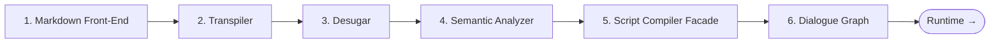
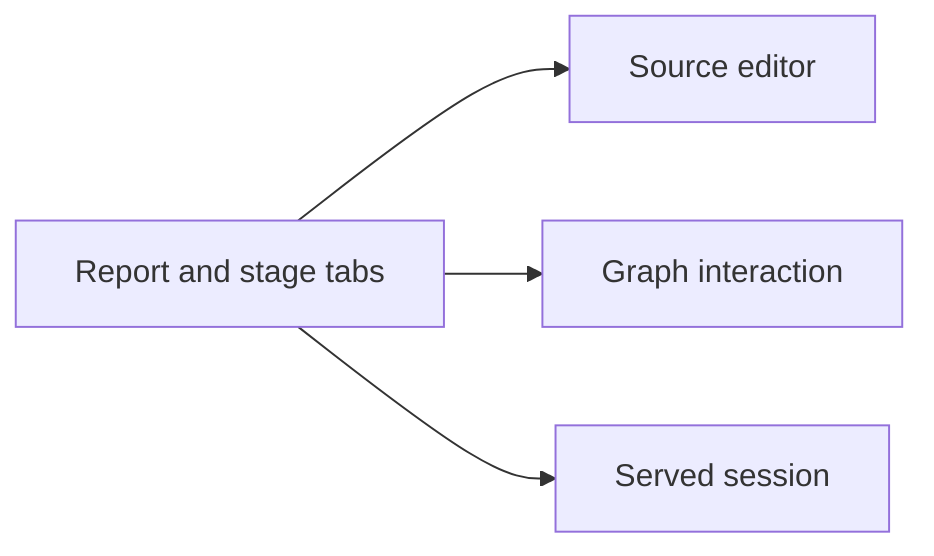

# Implementation notes

Design and rationale notes for DialogueDown's compiler. Each note covers one
component; this README is the **reading guide** to them.

Cross-cutting conventions live in their own notes rather than here, so this file
stays an index. The one every component shares is the
[Error model](./core/Error%20Model.md) — read it alongside the Core notes.

## Table of contents

- [How the notes are laid out](#how-the-notes-are-laid-out)
- [Reading guide](#reading-guide)
  - [Core: the compiler pipeline](#core-the-compiler-pipeline)
  - [Runtime: playing a compiled script](#runtime-playing-a-compiled-script)
  - [Language constructs](#language-constructs)
  - [Configuration](#configuration)
  - [Diagnostics](#diagnostics)
  - [Command-line interface](#command-line-interface)
  - [Visualization](#visualization)
    - [Report and stage tabs](#report-and-stage-tabs)
    - [Source editor](#source-editor)
    - [Graph interaction](#graph-interaction)
    - [Served session](#served-session)
  - [Other notes](#other-notes)

## How the notes are laid out

Each area below is a folder, so the tree matches this guide and a note sits
beside the ones it is read with. Visualization is the largest area by far, so it
is split again by surface.

```text
design-notes/
├── core/           the compiler pipeline, stage by stage
├── runtime/        playing a compiled script
├── language/       one script-language construct per note
├── configuration/  the options seam and its TOML edge
├── diagnostics/    collecting and reporting problems
├── cli/            the ddown command-line tool
├── visualization/
│   ├── report/     the report shell and its stage tabs
│   ├── editor/     the Source editor's highlighting and completions
│   ├── graph/      reading and navigating a rendered graph
│   └── session/    the served shell: serving, editing, browsing
└── other/          spikes and project-level notes
```

## Reading guide

The notes below are grouped by area and ordered for reading. Start with
**Core** — those explain the compiler itself and are worth reading in full.
Read **Command-line interface** or **Visualization** only when you work on that
surface: both document tools built *on top of* the core, so they are optional
for understanding the compiler. Each note keeps a one-line summary and a status
(**Implemented**, **Partially implemented**, **Proposed**, or **Explored — not
adopted**), which matches the status line at the top of the note itself.

> [!TIP]
> New here? Read the Core notes in order, then the
> [Error model](./core/Error%20Model.md). That is enough to understand and change the
> compiler.

Two overlaps in this corpus are on purpose. A guide page and a design note may
share an example — the [guide](../../guide/index.md) teaches the syntax, and a
note repeats an example only where a decision turns on its exact shape. And the
agent instruction files
([`AGENTS.md`](https://github.com/pengzhengyi/dialoguedown/blob/main/AGENTS.md),
[`.github/copilot-instructions.md`](https://github.com/pengzhengyi/dialoguedown/blob/main/.github/copilot-instructions.md))
repeat the build commands so an agent can act without following links. Keep the
overlap and the *claims* single-homed: a number two documents must agree on (a
coverage floor, a threshold) belongs in one of them, with the others pointing at
it.

### Core: the compiler pipeline

**Essential — read in full.** These trace a script through the compiler, one
stage per note, in pipeline order; the facade note ties the stages together.


```mermaid
flowchart LR
    FE["1. Markdown Front-End"] --> TR["2. Transpiler"]
    TR --> DS["3. Desugar"] --> SA["4. Semantic Analyzer"]
    SA --> SF["5. Script Compiler Facade"] --> GR["6. Dialogue Graph"]
    GR --> RT(["Runtime →"])
```

| Order | Note | What it covers | Status |
| --- | --- | --- | --- |
| 1 | [Markdown Front-End](./core/Markdown%20Front-End.md) | Source text → Markdown AST (Markdig adapter) | Implemented |
| 1a | [Unmodeled Markdown Handling](./core/Unmodeled%20Markdown%20Handling.md) | A front-end detail: which unmodeled Markdown is ignored or kept as dialogue text | Implemented |
| 2 | [Markdown to Dialogue AST Transpiler](./core/Markdown%20to%20Dialogue%20AST%20Transpiler.md) | Markdown AST → Dialogue AST | Implemented |
| 3 | [Desugar](./core/Desugar.md) | Dialogue AST → normalized Dialogue AST (jump assembly, control lines) | Implemented |
| 4 | [Semantic Analyzer](./core/Semantic%20Analyzer.md) | Desugared AST → semantic model (speakers, scenes, resolved jumps) | Implemented |
| 5 | [Script Compiler Facade](./core/Script%20Compiler%20Facade.md) | One `IScriptCompiler` seam over the stages, `AddDialogueDown` DI, and the success-or-failure result of a compile | Implemented |
| 6 | [Dialogue Graph](./core/Dialogue%20Graph.md) | Semantic model → the immutable flow graph a runtime walks | Implemented |

| — | [Error model](./core/Error%20Model.md) | The cross-cutting convention: collect a diagnostic, throw only when a stage cannot continue | Implemented |

The Error model is a convention every stage adopts rather than a stage itself —
read it alongside the six pipeline stages above.

### Runtime: playing a compiled script

**Read when you work on anything after the graph.** The architecture note fixes
the cross-cutting decisions — the artifact, the execution model, the protocol —
and each component note applies them to one piece.


```mermaid
flowchart LR
    RA["1. Runtime Architecture"] --> PF["2. Playbook Format"]
    PF --> RR["3. Playbook Reader Rules"]
    RR --> CC["4. Conformance Corpus"]
    CC --> SPT["5. Speech as Plain Text"]
    SPT --> RN["6. Runner"]
    RN --> AW["7. Asking the World"]
    AW --> SL["8. Speaking a Line"]
    SL --> RUN(["players, adapters"])
```

| Order | Note | What it covers | Status |
| --- | --- | --- | --- |
| 1 | [Dialogue Runtime Architecture](./runtime/Dialogue%20Runtime%20Architecture.md) | The umbrella: the portable playbook, the runner that plays it, and the protocol and seams a host implements | Partially implemented |
| 2 | [Playbook Format](./runtime/Playbook%20Format.md) | Graph → a versioned JSON playbook, and the reader that loads one back | Implemented |
| 3 | [Playbook Reader Rules](./runtime/Playbook%20Reader%20Rules.md) | The reader's structural rules beyond the schema: a node's ways out, and a `branch`'s arm order | Implemented |
| 4 | [Conformance Corpus](./runtime/Conformance%20Corpus.md) | Language-neutral fixtures every runtime must reproduce, and the harness that runs them against the reference reader and runner | Implemented |
| 5 | [Speech as Plain Text](./runtime/Speech%20as%20Plain%20Text.md) | One public flattening of a line's fragments to plain text, shared by the conformance harness, the report, and a host's fallback rendering | Implemented |
| 6 | [Runner](./runtime/Runner.md) | The C# runner: the play state, the step that advances it, waiting on the host for a command, and the refusals | Partially implemented |
| 7 | [Asking the World](./runtime/Asking%20the%20World.md) | How the runner asks the world: `Resolve` answered by `Supply`, for conditions, block conditions, and queries in speech | Implemented |
| 8 | [Speaking a Line](./runtime/Speaking%20a%20Line.md) | How the runner plays a line's words and commands in written order, stopping inside the line only before a query written after a command | Implemented |

### Language constructs

**Read when you add or change a script-language construct.** Each note designs
one writer-facing syntax — its grammar, semantics, Markdown interaction, and
diagnostics — layered on the pipeline above. Read the relevant Core stage notes
first, since a construct threads through them.

| Note | What it covers | Status |
| --- | --- | --- |
| [Progression Order](./language/Progression%20Order.md) | How a script progresses (reading-order fall-through), the divert and detour jump roles, and the `#END` terminator | Partially implemented |
| [Random Choice](./language/Random%20Choice.md) | A choice list with per-option `` `%` `` weights that the engine resolves to one option at random | Implemented |
| [Conditions](./language/Conditions.md) | The condition (`` `key?` ``) and every place it attaches — a line, a jump, a choice option — with its grammar and how each resolves | Implemented |
| [Unquoted Keys](./language/Unquoted%20Keys.md) | Let a condition (`` `IsAngry?` ``) and a dynamic weight (`` `Luck%` ``) drop the quotes around their key, keeping quotes as the escape | Implemented |
| [Symbol Escape](./language/Symbol%20Escape.md) | One literal-punctuation rule: a backslash escapes the next character, so `#word` and `=>` are written as prose | Implemented |
| [Block Controls](./language/Block%20Controls.md) | Connected blockquotes that group mutually-exclusive `if`/`elseif`/`else` branch bodies | Implemented |
| [Control Line](./language/Control%20Line.md) | An effect-only line (a bare jump or a silent command) with no speaker, so an effect is never attributed to the default speaker | Implemented |
| [Cross-File Jump Resolution](./language/Cross-File%20Jump%20Resolution.md) | Resolve a jump that targets a scene in another script (`chapter-02.dialogue.md#meet-bob`) across a project, via a linker | Proposed |

### Configuration

**Read when you configure the compiler or add a config knob.** A cross-cutting core
concern — an immutable `CompilerOptions` seam threaded into the stages — and its file
edge, a satellite that reads a `dialogue.toml` into those options.

| Order | Note | What it covers | Status |
| --- | --- | --- | --- |
| 1 | [Configuration](./configuration/Configuration.md) | The `CompilerOptions` seam: compilation mode, configured speakers, and unmodeled-Markdown handling projected into their stages | Implemented |
| 2 | [Configuration Loader](./configuration/Configuration%20Loader.md) | The TOML edge: reads `dialogue.toml` into a `CompilerOptions`, validating with located errors, in its own satellite assembly | Implemented |
| 3 | [CLI Configuration](./configuration/CLI%20Configuration.md) | Threads a project's `dialogue.toml` through the `ddown` CLI into `compile` and `visualize` (and the report's autocompletion) | Implemented |
| 4 | [Compilation Mode Configuration](./configuration/Compilation%20Mode%20Configuration.md) | Makes the compilation `mode` settable in `dialogue.toml` and shown in the Config tab | Implemented |

### Diagnostics

**Read when you work on collecting or reporting problems.** A cross-cutting core
concern that lets the compiler describe every problem it finds — errors and
warnings — in a structured, located form, so an author can see them all at once
instead of one throw per run. Start with the umbrella note; focused notes then
cover individual rules and the surfaces that render them.

| Order | Note | What it covers | Status |
| --- | --- | --- | --- |
| 1 | [Diagnostics and Validation](./diagnostics/Diagnostics%20and%20Validation.md) | The whole effort: the diagnostic model, the collect-and-continue collection seam, the validator and rules, and the renderer | Implemented |
| 2 | [Choice Nesting Diagnostic](./diagnostics/Choice%20Nesting%20Diagnostic.md) | A style warning for choice branches nested beyond the recommended depth | Implemented |
| 3 | [Styled Speaker Prefix Diagnostic](./diagnostics/Styled%20Speaker%20Prefix%20Diagnostic.md) | A warning when a styled name (`*Alice*:`) looks like a speaker prefix but is not recognized as one | Implemented |
| 4 | [Dangling Arrow Diagnostic](./diagnostics/Dangling%20Arrow%20Diagnostic.md) | A warning when a `=>` has no link after it, so the intended jump degrades to plain text | Implemented |
| 5 | [Ignored Markdown Diagnostic](./diagnostics/Ignored%20Markdown%20Diagnostic.md) | A neutral note when the front end ignores unmodeled Markdown, such as a table or a divider | Implemented |
| 6 | [CLI Diagnostic Rendering](./diagnostics/CLI%20Diagnostic%20Rendering.md) | Renders collected diagnostics on the `ddown` CLI (rich Errata blocks or greppable one-liners), sets the exit code, and exposes `--mode` | Implemented |

### Command-line interface

**Read when you work on the `ddown` CLI.** These build on the core through
Spectre.Console.Cli; they are not needed to understand the compiler.

| Order | Note | What it covers | Status |
| --- | --- | --- | --- |
| 1 | [Command-Line Interface](./cli/Command-Line%20Interface.md) | The `ddown` CLI: `compile` and `visualize`, and the Live server as a library | Implemented |
| 2 | [Compile CLI — Emit DOT](./cli/Compile%20CLI%20-%20Emit%20DOT.md) | `compile --emit dot` emits each stage's graph as portable Graphviz text | Implemented |
| 3 | [Compile CLI — Fix Mode](./cli/Compile%20CLI%20-%20Fix%20Mode.md) | `compile --fix` applies a diagnostic's preferred fix in place, then verifies by recompiling | Implemented |

### Visualization

**Read when you work on the interactive report or the served session.** An
optional TypeScript client that renders each compiler stage; not needed to
understand the compiler. This is the largest area, so its notes are split four
ways — read only the one you are working in, starting from its first row.


```mermaid
flowchart LR
    RP["Report and stage tabs"] --> ED["Source editor"]
    RP --> GR["Graph interaction"]
    RP --> SS["Served session"]
```

#### Report and stage tabs

The report shell and what each tab shows — one per compiler stage, plus the
Playbook and Config tabs and the conventions every table shares.

| Note | What it covers | Status |
| --- | --- | --- |
| [Compilation Visualization](./visualization/report/Compilation%20Visualization.md) | The report's architecture: every stage tab, the payload, the projections and renderers, unavailable stages, and stage tooltips | Implemented |
| [AST Stage Tabs](./visualization/report/AST%20Stage%20Tabs.md) | The Dialogue AST and desugared AST as two graph tabs from one projection | Implemented |
| [Semantic Model Visualization Tab](./visualization/report/Semantic%20Model%20Visualization%20Tab.md) | The semantic model as an analytics tab: scene-tree graph and cross-linked tables | Implemented |
| [Dialogue Graph Visualization Tab](./visualization/report/Dialogue%20Graph%20Visualization%20Tab.md) | The compiled dialogue graph: every node in graph order, typed edges, and orphans made visible | Implemented |
| [Playbook Tab](./visualization/report/Playbook%20Tab.md) | The compiled playbook a runtime loads, read-only, beside its header, speaker, anchor, and node tables | Implemented |
| [Playbook Nodes Table](./visualization/report/Playbook%20Nodes%20Table.md) | Every node as one row that reads as a sentence: its kind in the graph's color, what it holds, and where it leads | Implemented |
| [Playbook Summary Segments](./visualization/report/Playbook%20Summary%20Segments.md) | A node's summary sent as labeled segments, so the client draws each part by its role | Implemented |
| [Navigating the Playbook](./visualization/report/Navigating%20the%20Playbook.md) | From a table into the JSON, and from a reference in the JSON to the definition it names | Implemented |
| [Configuration Tab](./visualization/report/Configuration%20Tab.md) | The applied `dialogue.toml`: view, edit with autocompletion, and create one in place | Implemented |
| [Table Cell Conventions](./visualization/report/Table%20Cell%20Conventions.md) | One rule per cell concern across every table: an absent value, a tag capsule, and what copies on click | Implemented |
| [Collapsing Across the Report](./visualization/report/Collapsing%20Across%20the%20Report.md) | One contract and one glyph for folding on every surface, with each surface keeping its own unit and state | Implemented |

#### Source editor

The authoring surface: what the editor highlights, completes, and marks, all
projected from the compiler rather than a client-side grammar.

| Note | What it covers | Status |
| --- | --- | --- |
| [Compiler-Projected Editor Semantics](./visualization/editor/Compiler-Projected%20Editor%20Semantics.md) | Highlighting tokens and completions projected from the compiler's own parse | Implemented |
| [Diagnostics Overlay](./visualization/editor/Diagnostics%20Overlay.md) | Diagnostics as squiggles, gutter markers, and tooltips on an LSP-shaped projection, with co-located diagnostics ordered once | Implemented |
| [Diagnostic Quick Fixes](./visualization/editor/Diagnostic%20Quick%20Fixes.md) | A diagnostic's suggested repair offered as an editor action | Implemented |
| [Heading Anchors](./visualization/editor/Heading%20Anchors.md) | Copy a scene heading's jump target from a preview link or an active-line hint | Implemented |
| [Unmodeled Markdown Highlighting](./visualization/editor/Unmodeled%20Markdown%20Highlighting.md) | The editor marks the Markdown its policy ignores and styles comments as writer-only notes | Implemented |
| [Front Matter Source Highlighting](./visualization/editor/Front%20Matter%20Source%20Highlighting.md) | Leading front matter highlighted as YAML | Implemented |
| [Ignored Markdown Preview Toggle](./visualization/editor/Ignored%20Markdown%20Preview%20Toggle.md) | Show or hide ignored blocks and inline spans per region, or all at once | Implemented |
| [Construct Marks in the Source Preview](./visualization/editor/Construct%20Marks%20in%20the%20Source%20Preview.md) | The rendered preview marks the compiler's constructs in the editor's own vocabulary | Implemented |
| [Mermaid Authoring Diagrams](./visualization/editor/Mermaid%20Authoring%20Diagrams.md) | Fenced Mermaid authoring aids rendered in every Markdown preview, loaded on demand | Implemented |
| [Line Debugger UI](./visualization/editor/Line%20Debugger%20UI.md) | A CodeMirror debugger presentation layer behind a runtime-neutral controller seam; the runtime adapter is not built | Partially implemented |

#### Graph interaction

Reading and navigating a rendered graph: what it remembers, what it reveals,
and how a scene folds.

| Note | What it covers | Status |
| --- | --- | --- |
| [Graph Position Preservation](./visualization/graph/Graph%20Position%20Preservation.md) | Per-graph zoom, pan, and fold memory, and a root-centered default | Implemented |
| [Node Inspector](./visualization/graph/Node%20Inspector.md) | Read a graph node's source and preview, and jump to it in the Source tab | Implemented |
| [Jump to Stage](./visualization/graph/Jump%20to%20Stage.md) | From a Source selection to the enclosing node in a later stage, via **Jump to ▸ \<stage\>** | Implemented |
| [Dialogue Graph Region Fold](./visualization/graph/Dialogue%20Graph%20Region%20Fold.md) | Collapse a scene in the Dialogue Graph to one box the flow still passes through | Implemented |
| [Region-Aware Graph Layout](./visualization/graph/Region-Aware%20Graph%20Layout.md) | Give every scene its own run of rows, so no two scene bands cross | Implemented |
| [Keyboard Navigation](./visualization/graph/Keyboard%20Navigation.md) | Navigate a graph by its edges, with a keymap per tab shape | Implemented |

#### Served session

The served shell around the report: the server, editing and saving, browsing the
project, and the window's chrome.

| Note | What it covers | Status |
| --- | --- | --- |
| [Served Shell](./visualization/session/Served%20Shell.md) | The one loopback server behind `ddown visualize`: its routes, roots, security, View and Edit, and the watcher | Implemented |
| [Live Edit and Autosave](./visualization/session/Live%20Edit%20and%20Autosave.md) | Editing the source in the report and saving it: Auto and Manual modes, conflicts, and save-before-navigation | Implemented |
| [Explorer](./visualization/session/Explorer.md) | The project tree, the Files toggle, and opening a script without reloading the page | Implemented |
| [Chrome and Layout](./visualization/session/Chrome%20and%20Layout.md) | Zen mode, the narrow-screen layout, and the Problems panel | Implemented |
| [Served Client Packaging](./visualization/session/Served%20Client%20Packaging.md) | How the served page loads its client: hashed assets, and Mermaid fetched on demand | Implemented |

### Other notes

**Optional context.** Exploration spikes and project-level notes that sit outside
the pipeline and its tools.

| Note | What it covers | Status |
| --- | --- | --- |
| [Target Frameworks](./other/Target%20Frameworks.md) | Multi-target the shipped libraries so a Godot game keeps its runtime while the toolchain moves to .NET 10 | Implemented |
| [Namespace Layout](./other/Namespace%20Layout.md) | An architecture rule capping how many types an assembly's root namespace may hold | Implemented |
| [Enum Wire Names](./other/Enum%20Wire%20Names.md) | Every JSON enum wire name pinned by a hand-written converter, so no shipped build needs a .NET 9+ package | Implemented |
| [Development Cycle Optimization](./other/Development%20Cycle%20Optimization.md) | Local and CI feedback time, cut through measured, behavior-preserving increments | Implemented |
| [BBCode Rendering](./other/BBCode%20Rendering.md) | Render a line's speech fragments as BBCode (Godot), terminal, and web text | Proposed |
| [Interactive Playthrough](./other/Interactive%20Playthrough.md) | Play a script as a text adventure to check its branching; what the exploration found | Explored — not adopted |
