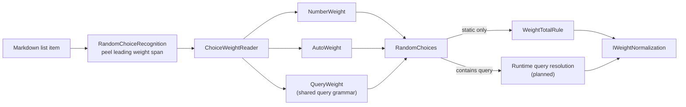

# Random choice

> [!NOTE]
> Status: **implemented**. The static construct shipped in
> [issue #141](https://github.com/pengzhengyi/dialoguedown/issues/141), and
> the compiler now recognizes a game-state query as a runtime-calculated weight
> under the same random-choice syntax and normalization policy. Executing a random
> choice — static or dynamic — awaits the
> [runtime](https://github.com/pengzhengyi/dialoguedown/issues/45).

## Table of contents

- [Goal and scope](#goal-and-scope)
- [Functionality checklist](#functionality-checklist)
- [Ubiquitous language](#ubiquitous-language)
- [Writer-facing behavior](#writer-facing-behavior)
- [Grammar](#grammar)
- [Weight resolution](#weight-resolution)
- [Prior art](#prior-art)
- [Architecture](#architecture)
- [Interfaces and responsibilities](#interfaces-and-responsibilities)
- [Key design decisions](#key-design-decisions)
- [Markdown interaction](#markdown-interaction)
- [Diagnostics](#diagnostics)
- [Error and boundary cases](#error-and-boundary-cases)
- [Testability](#testability)
- [Implementation crosscheck](#implementation-crosscheck)
- [Alternatives not chosen](#alternatives-not-chosen)
- [Open questions and deferred work](#open-questions-and-deferred-work)

## Goal and scope

A writer often wants *variety* rather than a *decision*: a condition who greets you
one of several ways, a crowd that reacts unpredictably, a coin that lands one of
two ways. Today the only branch in DialogueDown is a **player choice** — a list
whose options are offered to the player. There is no way to say "let the engine
pick one of these for me, and make some outcomes more likely than others."

A **random choice** fills that gap. It reuses the familiar choice list, but each
option leads with a **weight** — a code span ending in `%`. When any option in a
list carries a weight, the whole list becomes a random choice: at runtime the
engine selects exactly one option by weight and runs its body. The player sees
no menu.

This note covers the construct's complete writer contract: static, auto, and
dynamic query weights; compile-time modeling and diagnostics; and the runtime
resolution policy. The compiler extension accepts and preserves query weights
now. Executing a random choice remains part of the planned runtime
([issue #45](https://github.com/pengzhengyi/dialoguedown/issues/45)).

## Functionality checklist

- [x] Recognize a leading weight code span (`` `N%` ``, `` `%` ``) on a choice
      option before game-call classification.
- [x] Build a dedicated `RandomChoices` node (of `RandomOption`s) when any
      option is weighted, leaving `Choices`/`Choice` unchanged otherwise.
- [x] Model a `NumberWeight` (explicit percentage) and an `AutoWeight` (equal
      share of the leftover) as a closed `ChoiceWeight`.
- [x] Make every `ChoiceWeight` a spanned AST node so tooling can point at the
      exact weight code span.
- [x] Recognize `` `"Query"%` `` by reusing the existing query grammar and model
      it as `QueryWeight`.
- [x] Defer all total validation for a group containing `QueryWeight` until
      runtime.
- [x] Resolve weights through an injectable normalization strategy, so the
      arithmetic is tested and swapped in isolation from parsing.
- [x] Report `DLG1104` when an option in a random choice has no weight.
- [x] Report `DLG1105` for an invalid weight value (a negative or non-numeric code span).
- [x] Report `DLG3003` when static weights do not total 100%, and normalize.
- [x] Report `DLG2010` when static weights sum to zero (no option can be selected).
- [x] Report `DLG3004` when a random choice offers only one option.
- [x] Preserve source spans for the weight span, its owning option, and the
      group.
- [x] Add the construct to the writer-facing specification and the gallery.
- [x] Leave the ordinary player-choice list unchanged when no option is weighted.

## Ubiquitous language

| Term | Meaning |
| --- | --- |
| **Random choice** | A choice group the engine resolves by selecting one option at random by weight; the selected option's body runs. No player menu is shown. |
| **Choice weight** | The leading code span ending in `%` on an option that gives its relative selection probability. |
| **Explicit weight** | A numeric weight, `` `N%` `` — a concrete percentage. |
| **Auto weight** | A bare `` `%` `` — claims an equal share of the percentage left over after the explicit weights. |
| **Dynamic weight** | `` `"Query"%` `` — a query whose runtime numeric result becomes the option's explicit weight. |
| **Query weight** | The AST form of a dynamic weight: the query key plus the exact source span of its code span. |
| **Leftover** | `max(0, 100 − sum of explicit weights)`, divided equally among the auto weights. |
| **Normalization** | Dividing every resolved weight by their total so the probabilities sum to 1; owned by a swappable strategy so it can be tested and replaced in isolation. |

The domain term is **random choice** everywhere: the AST distinction, the
diagnostics, the specification, commits, and the changelog.

## Writer-facing behavior

A choice list becomes a random choice as soon as one option leads with a weight:

```markdown
The coin spins in the air.

- `50%` It lands heads.
- `50%` It lands tails.
```

Weights are **relative**: they are normalized by their sum, so equal numbers
mean equal odds regardless of the total. A bare `` `%` `` is an **auto** weight —
it takes an equal share of whatever percentage the explicit weights leave:

```markdown
- `70%` Guard: Halt! Who goes there?
- `%`   Guard: ...oh, it's you.
```

Here the auto weight resolves to the remaining 30%. Several autos split the
leftover equally, so `` `%` `` + `` `%` `` is a plain 50/50, and `` `50%` `` +
`` `%` `` + `` `%` `` gives 50/25/25. All-auto lists are a convenient uniform
random:

```markdown
- `%` The crow caws.
- `%` The crow tilts its head.
- `%` The crow ignores you.
```

An option's body is an ordinary choice body, so a random choice nests and
carries dialogue exactly like a player choice:

```markdown
- `80%` Merchant: Fresh apples!
    - Alice: I'll take one.
- `20%` Merchant: ...bad day for business.
```

In a plain Markdown preview each weight shows as inline code (`50%`) at the start
of the option — readable, and clearly not spoken text.

### Dynamic query weights

A quoted query followed by `%` calculates the weight from game state at runtime:

```markdown
- `"Bob's Affection"%` Alice: Hello, Bob.
- `"Christina's Affection"%` Alice: Hello, Christina.
```

This is the existing query syntax plus a percent sign. The query must resolve to
a finite, non-negative number. The runtime treats that result as an explicit
weight, then applies the same auto and normalization policy as a static random
choice.

Dynamic weights compile today: the Dialogue AST preserves the query key and
source span as a `QueryWeight`, and the report shows the structure. Selection
waits for the runtime.

## Grammar

A weight is the first inline of an option: a code span whose content ends with a
literal `%`.

```ebnf
RandomChoices     = WeightedItem , { WeightedItem } ;
WeightedItem     = WeightSpan , ChoiceBody ;
WeightSpan       = "`" , WeightValue , "%" , "`" ;
WeightValue      = [ Number | QuotedString ] ; (* empty => auto; quoted => query weight *)
Number           = Digit , { Digit } , [ "." , { Digit } ] ;
```

A list is a **random choice** if and only if at least one of its items begins
with a `WeightSpan`. A well-formed random choice is *all* `WeightedItem`s; an
item that omits its weight is the recovery case reported as
[`DLG1104`](#diagnostics). The trailing `%` is the recognition signal: no game
call ends in `%`, so a leading `` `…%` `` code span is unambiguous (see
[Markdown interaction](#markdown-interaction)).

## Weight resolution

Resolution turns source weights into normalized probabilities. The compiler
applies the policy immediately only when every weight is static. A group
containing any `QueryWeight` preserves its unresolved AST and defers the whole
policy to runtime: a compile-time partial total would be misleading.

At runtime:

1. **Resolve explicit values.** A `NumberWeight` contributes its number. A
   `QueryWeight` reads game state and must produce a finite, non-negative number.
   A missing, non-numeric, negative, NaN, or infinite result is a runtime error;
   the runtime selects no option.
2. **Distribute the leftover to autos:** `leftover = max(0, 100 − explicit)`,
   where `explicit` includes both numeric and resolved query weights. Each auto
   receives `leftover ÷ autoCount`.
3. **Total** all resolved weights.
4. **Reject a zero total.** No option can be selected. This mirrors
   [`DLG2010`](#diagnostics) for static weights.
5. **Warn on drift.** If the total is more than 0.5 from 100, report the actual
   total, then continue. This mirrors [`DLG3003`](#diagnostics); the tolerance
   keeps deliberate rounding such as three `` `33.3%` `` weights quiet.
6. **Normalize:** divide every resolved weight by the total so the probabilities
   sum to 1. Weights remain relative; they need not total 100 to work.

The existing injectable normalization policy remains the single definition of
auto distribution and sum normalization. The future runtime resolves
`QueryWeight` values before invoking that policy.

## Prior art

First-class weighted randomness is rare in interactive-fiction languages — most
offer only *uniform* random selection and ask authors to fake weights by
repeating lines. That makes a readable weight syntax a genuine improvement, but
it also means there is little precedent for the notation itself.

| Tool | Random selection | Native weights | How authors weight today |
| --- | --- | --- | --- |
| [Yarn Spinner](https://yarnspinner.dev/docs/yarn/02-fundamentals/12-line-groups/) | Line groups (`=>`) pick one line at random. | No (as of 3.x). | Duplicate a line to raise its odds. |
| [Ink](https://github.com/inkle/ink/blob/master/Documentation/WritingWithInk.md) | Shuffle `{~ a\|b\|c }` picks one, cycling before repeats. | No. | Duplicate an option, or `RANDOM(min,max)` with conditionals. |
| [Ren'Py](https://www.renpy.org/doc/html/python.html) | Python `renpy.random` / `random.choices`. | Yes, via Python `weights=`. | Call `random.choices` with a weight list in Python. |

Lessons carried into this design:

- **Weights are worth making first-class.** Duplication (Yarn, Ink) is noisy and
  caps the granularity at whole copies; a percentage is exact and scannable.
- **Relative weights normalized by the sum** are the established mental model
  (Ren'Py's `random.choices`, and the duplication trick is just integer
  weighting). DialogueDown adopts the same relative model but lets the author
  *see* the intended percentages.
- **Dynamic values are resolved before selection.** Yarn and Ink express this
  through variables plus explicit random logic rather than first-class weighted
  syntax. Python's `random.choices` accepts runtime numeric values, but requires
  them to be finite and non-negative, with at least one positive value.
- **A percent sign reads as a probability** to a non-technical writer, and it is
  the one punctuation none of the surveyed tools claimed — so it is a clean,
  self-explanatory marker for DialogueDown to define.

## Architecture



Recognition happens in the **transpiler**. `RandomChoiceRecognition` peels a
leading weight code span before the ordinary inline walk can classify it as a
game call. `ChoiceWeightReader` reads a number, an auto, or a quoted query. The
quoted form must reuse the same query grammar as a speech query; duplicating
quoted-string parsing would let the two forms drift.

Each weight preserves the exact code-span source location as a `ScriptNode`.
That gives diagnostics, AST visualization, semantic-token highlighting, and the
future runtime one authoritative location. A `RandomOption` traverses its weight
before its body.

The **weight-total** rules run at compile time only for a fully static group.
When a `QueryWeight` is present, the group is structurally valid but unresolved;
the future runtime resolves every query, validates the values, and invokes the
same normalization policy.

## Interfaces and responsibilities

| Type | Responsibility |
| --- | --- |
| `ChoiceGroup` | The abstract base shared by `Choices` and `RandomChoices` — a branch that offers several options. It lets a pass that cares about any branch group (the choice-nesting depth check) query one type, while the two stay distinct records. |
| `RandomChoices` | A `ChoiceGroup` for the whole construct: the ordered `RandomOption`s the engine resolves to one. Separate from `Choices` so the player choice stays unchanged and the visualization and runtime handle it distinctly. |
| `RandomOption` | One option in a random choice: its spanned `ChoiceWeight` and body blocks. Traversal yields the weight before the body. |
| `ChoiceWeight` | A spanned `ScriptNode` base for `NumberWeight`, `AutoWeight`, and `QueryWeight`; tooling can point at the exact weight code span. |
| `NumberWeight` | A finite, non-negative literal percentage plus its source span. |
| `AutoWeight` | A bare `%` plus its source span; resolved after explicit numeric and query weights. |
| `QueryWeight` | A game-state query key plus its source span. The runtime numeric result becomes an explicit weight. |
| `IWeightNormalization` | The injectable policy that fills autos, normalizes resolved values, and reports the raw total; consumed by static validation now and the runtime later. |
| `ChoiceWeightReader` | Reads all three weight forms and reuses the existing query grammar for the quoted form. |
| `SemanticTokenProjection` | A weight is a Markdown code span the editor already colors, so no dedicated weight token is projected. Query-key completion stays deferred until a game-state symbol source exists. |
| `DiagnosticCatalog` | Own `DLG1104`, `DLG1105`, `DLG2010`, `DLG3003`, and `DLG3004`. |
| `WeightTotalRule` | Validates only fully static groups. A group containing `QueryWeight` defers zero/drift checks to runtime. |
| `SingleOptionRandomChoiceRule` | A structural rule that warns (`DLG3004`) when a random choice offers only one option, since it is always selected and the weight has no effect. |

## Key design decisions

### D1 — Weights imply a random choice (implicit marking)

Any option carrying a weight makes the whole list a random choice. There is no
separate marker keyword, heading, or bullet style. This matches the minimal
writer example, keeps the surface Markdown-native, and needs no new token. The
trailing `%` on a leading code span is a strong, unambiguous signal, so the
weights *are* the marker.

The cost is that one stray weight changes the list's nature. Decision **D2**
contains that cost by requiring every option in a random choice to be weighted.

### D2 — Every option in a random choice must be weighted

Once a list is random, an option with no weight marker is a `DLG1104` error. An
unweighted option in a random list is almost always a mistake — a forgotten
`` `%` `` — and silently guessing a probability for it would be surprising. Being
explicit matches the rest of the language. For error recovery the analyzer treats
the missing weight as an auto so downstream stages still receive a well-formed
tree.

A bare `` `%` `` auto weight is the deliberate, visible way to say "share the
rest," so writers never need an implicit blank.

### D3 — Relative weights, normalized by the sum, with a drift warning

Weights are relative and normalized by their total, so `50/50`, `1/1`, and
`10/10` all mean even odds. This is the established model (Ren'Py, and integer
duplication generalized). Percentages are still the friendliest way to *write*
relative weights, so the author writes what they mean, and the compiler warns
(`DLG3003`) only when the numbers do not add up — a nudge, not a rejection.

### D4 — Auto weights fill the leftover

A bare `` `%` `` resolves to an equal share of `max(0, 100 − sum of explicit)`.
This gives writers a "rest" primitive familiar from layout systems (CSS `fr`,
flexible space): pin the important odds explicitly and let the remainder divide
evenly. All-auto lists are a natural uniform random.

### D5 — Recognize in the transpiler, warn in structural validation

Peeling the weight belongs in `BlockBuilder` because that is the only place with
the raw leading inline before game-call classification claims it. The
total-drift warning belongs in a structural rule over the desugared AST, next to
the choice-nesting rule, because it is a whole-group property best computed once
the tree is normalized. Splitting recognition from the aggregate check keeps each
concern small and mirrors the existing diagnostics architecture.

### D6 — A dedicated `RandomChoices` node, not a flag on `Choices`

A random choice is a *different construct* from a player choice: the engine
resolves it to one option and shows no menu, so the runtime renders it in a
completely different way, and the visualization projects it as its own node kind.
Overloading `Choices` with an `IsRandom` flag and `Choice` with an optional
weight would blur two behaviors into one type and force every consumer to branch
on the flag.

Instead the transpiler emits a dedicated `RandomChoices` block of
`RandomOption`s, leaving `Choices`/`Choice` untouched. Downstream stages
pattern-match the node type, so the two behaviors stay cleanly separated for
desugar, the semantic model, the graph, the runtime, and the report. The group
mirrors `Choices` (plural), while its items are `RandomOption`s rather than
`Choice`s: in this language "choice" means a *player* selection, and the player
never selects here — the engine does — so the neutral "option" is the honest name.

The two group records do share an abstract `ChoiceGroup` base — both *are* a
branch offering options — so a pass that treats any branch group uniformly (the
choice-nesting depth check) can query one type. This is a shared supertype, not
a merge: `Choices` and `RandomChoices` remain distinct records, so it does not
reintroduce the branching-on-a-flag problem above.

### D7 — Every weight is a spanned AST node

`ChoiceWeight` becomes a `ScriptNode` with the exact code-span location.
`NumberWeight`, `AutoWeight`, and `QueryWeight` are the closed variants, so every
consumer handles the complete set exhaustively.

The source span is not incidental metadata. It lets the Dialogue AST report show
the weight as its own node, lets the compiler project a precise editor token,
and gives a future runtime error the exact query weight that failed. Keeping a
separate `WeightSpan` on `RandomOption` would split one concept across two
objects; using the whole option span would underline unrelated speech.

### D8 — A query weight reuses the query grammar

`` `"Bob's Affection"%` `` is a query plus a percent sign, not a new expression
language. The weight reader strips the trailing `%` and delegates the quoted
portion to the same grammar used by a speech query. Only a query is valid:
commands followed by `%` remain invalid weights.

The AST stores the query key in `QueryWeight`; it does not copy a speech `Query`
node because a weight is not an inline game call and must participate in the
`ChoiceWeight` hierarchy.

### D9 — Weight normalization is an injectable strategy

Turning weights into probabilities — summing, filling autos, normalizing by the
total, and the zero-total uniform fallback — lives behind an `IWeightNormalization`
seam, not inline in `BlockBuilder` or `WeightTotalRule`. This keeps the arithmetic
a pure, table-testable unit independent of parsing, lets the compile-time warning
and the future runtime share one definition, and leaves room to swap the policy
(for example, a strict "must total 100" variant) without touching recognition.

The strategy takes non-negative weights as a precondition — recognition rejects a
negative weight as `DLG1105` before it reaches the AST — and fails fast on a
violation, so its output probabilities are always valid.

For a dynamic group, the runtime first resolves each `QueryWeight` to a numeric
explicit value and validates that it is finite and non-negative. Only then does
it invoke the shared normalization policy. An invalid query value is an error;
the runtime selects no option rather than guessing zero or falling back to a
uniform distribution.

## Markdown interaction

`` `50%` `` is an ordinary CommonMark **code span**. A plain Markdown preview
renders it as inline code at the start of the list item, which reads naturally as
a label on the option. The construct collides with no other Markdown syntax.

No valid game call ends in `%`, so the trailing sign unambiguously distinguishes
a weight from a speech query or command. In particular, `` `"key"` `` is a
speech query, while `` `"key"%` `` is a query weight. The forms share the quoted
query grammar but occupy different AST contexts.

**Literal text.** The weight is special *only* as the first inline of a
choice-list item. Elsewhere — mid-speech, in paragraphs, in a non-choice list —
a code span ending in `%` is untouched. In the rare case a writer wants a literal
leading `` `100%` `` code span on a choice option, they can put any text before
it so the code span is no longer the option's weight prefix.

## Diagnostics

| Code | Title | Category | Severity | When |
| --- | --- | --- | --- | --- |
| `DLG1104` | Missing weight in a random choice | Syntax | Error | An option in a random choice has no leading weight span. |
| `DLG1105` | Invalid choice weight | Syntax | Error | A weight value is not a non-negative number, a quoted query, or a bare `%` (e.g. `` `-10%` `` or `` `abc%` ``). |
| `DLG2010` | Random choice weights sum to zero | Semantic | Error | A fully static random choice's weights all resolve to 0, so no option can be selected. |
| `DLG3003` | Choice weights do not total 100% | Style | Warning | A fully static random choice's weights do not total ≈100% (within 0.5, and not all zero); the odds are normalized anyway. |
| `DLG3004` | Single-option random choice | Style | Warning | A random choice offers only one option, so it is always selected and the weight has no effect. |

`DLG1104`/`DLG1105` sit in the `DLG11xx` line/inline-surface band alongside the
game-call diagnostics. `DLG2010` is the next free semantic code; a zero total is
a meaning-level fault, not a token-level one. `DLG3003` and `DLG3004` are the
next free style codes after `DLG3002` (`DLG3001` remains unused; ignored
unmodeled Markdown is the syntax-stage `DLG1114`).

## Error and boundary cases

| Case | Behavior |
| --- | --- |
| No option weighted | Ordinary player choice; unchanged. |
| Some options weighted, one bare | `DLG1104` on the bare option; recover it as an auto. |
| Single weighted option | Valid, but always selected, so `DLG3004` warns that the weight has no effect. |
| All auto (`` `%` `` everywhere) | Uniform random. |
| Explicit total < 100, no autos | `DLG3003`; normalize by the sum. |
| Explicit total within 0.5 of 100 (e.g. three `` `33.3%` `` → 99.9) | No warning. |
| Explicit total > 100 | Autos resolve to 0%; `DLG3003`; normalize by the sum. |
| Every weight 0 (`` `0%` ``), sum 0 | `DLG2010` error; the strategy recovers to a uniform distribution. |
| Negative weight (`` `-10%` ``) | `DLG1105`. |
| Non-numeric, non-query value (`` `abc%` ``) | `DLG1105`. |
| Non-integer (`` `33.3%` ``) | Allowed; normalized. |
| Quoted query weight (`` `"q"%` ``) | Accepted as `QueryWeight`; compile-time total checks are deferred. |
| Query returns a missing, non-numeric, negative, NaN, or infinite value | Runtime error; select no option. |
| Static + query + auto | Resolve the query, subtract all explicit values from 100, split the non-negative remainder across autos, then normalize. |
| Resolved dynamic total is zero | Runtime error equivalent to `DLG2010`; select no option. |
| Resolved dynamic total differs from 100 by more than 0.5 | Runtime warning equivalent to `DLG3003`; normalize and continue. |
| Nested random choice | Composes recursively; the choice-nesting rule (`DLG3002`) still applies. |
| Ordered vs unordered list | Both may be random; a random choice shows no menu, so list ordering is not observed. |

## Testability

- **Recognition (transpiler):** each weight form (`` `50%` ``, `` `%` ``, and
  `` `"q"%` ``) is peeled into the right spanned `ChoiceWeight`; the query form
  shares the speech-query grammar; the option body keeps its remaining inlines.
- **AST traversal:** a `RandomOption` yields its weight before its body, and each
  weight preserves the exact code-span source location.
- **Normalization strategy (isolated):** feed weight lists straight to
  `IWeightNormalization` and assert the probabilities, raw total, auto
  distribution, over-100 totals, the zero-total uniform recovery, and a
  fail-fast on a negative weight — no parsing involved.
- **Dynamic runtime contract:** resolve query values through a fake game-state
  source and cover valid decimals, missing/non-numeric values, negative and
  non-finite values, mixed autos, zero total, and drift warnings.
- **Diagnostics:** `DLG1104`, `DLG1105`, `DLG2010`, and `DLG3003` fire on the
  right inputs with located spans, and a well-formed random choice produces none.
- **Boundaries:** every row in the table above, especially auto distribution,
  over-100 totals, and the zero-total error.
- **Composition:** a nested random choice inside a player choice (and vice
  versa) builds correctly and still triggers the nesting rule when deep.
- **Visualization/editor:** Dialogue and Desugared AST projections show all
  weight variants; the semantic-token projection highlights the exact weight
  span. Query-key completion remains absent until the compiler receives a
  game-state symbol source.

Use multi-line raw string literals for the script fixtures so the weights and
indentation are visible.

## Implementation crosscheck

The static random choice shipped as recorded below. The compiler now recognizes
and preserves a dynamic query weight; executing it awaits the runtime.

| Bucket | Result |
| --- | --- |
| **Achieved (static)** | Recognition (`RandomChoices`/`RandomOption`, weight peeling, the `ChoiceGroup` base), the `NumberWeight`/`AutoWeight` model, the injectable normalization strategy, the five static diagnostics (`DLG1104`, `DLG1105`, `DLG2010`, `DLG3003`, `DLG3004`), the ≈100 tolerance, the single-option warning, nesting-depth counting, the report AST projection, and the writer spec + gallery all match the design. |
| **Changed (static)** | `DLG3003` shows the actual total and uses a 0.5 tolerance (the note originally said only "approximately 100"). A single-option group became its own `DLG3004` warning rather than "no diagnostic". The two group records gained a shared `ChoiceGroup` base so the nesting rule can query one type. |
| **Achieved (dynamic recognition)** | `ChoiceWeight` is a spanned `ScriptNode`; a `QueryWeight` reuses the query grammar; static total checks skip a group containing a query weight; and the report renders the query weight. Resolving, validating, and normalizing query values at selection time awaits the [runtime](https://github.com/pengzhengyi/dialoguedown/issues/45). |

## Alternatives not chosen

| Alternative | Why not |
| --- | --- |
| An explicit marker (heading, tag, or distinct bullet) to declare a random list | More to type and remember; the weights already mark the list unambiguously. |
| Bare integer weights without `%` (e.g. `` `3` ``) | A leading integer code span is far more likely to be intended as text; `%` reads as a probability and is unambiguous. |
| Silent normalization with no warning | Hides a likely authoring slip (weights that do not add up); the warning is advisory, not a rejection. |
| Silently interpret a zero total (uniform, or all-zero) | Ambiguous — a mistake or a misread as uniform; the explicit principle rejects it as `DLG2010` so the writer resolves the intent. |
| Reject totals that are not exactly 100 | Over-strict; relative weights are a feature, and normalization makes any positive total valid. |
| Treat an unweighted option in a random list as an implicit auto | Silently guesses a probability; a bare `` `%` `` already expresses "share the rest" explicitly. |
| A `bool IsRandom` flag on `Choices` plus a weight field on `Choice` | Blurs two behaviors (player menu vs engine pick) into one type and forces every consumer to branch on a flag; a dedicated `RandomChoices` node keeps them cleanly separated (D6). |
| Normalize inline in the builder or the validation rule | Couples the arithmetic to parsing, makes it hard to test in isolation, and duplicates it for the runtime; an injectable strategy is unit-testable and shared (D9). |
| Reject a query weight until the runtime ships | Writers could not author dynamic scripts, and the AST shape would change later; accepting and preserving `QueryWeight` now keeps scripts and the tree stable. |
| Resolve a query weight at compile time | Game state is unknown until the game runs, so a compile-time total would be fictional; static checks skip a dynamic group and the runtime validates instead. |

## Open questions and deferred work

- **Runtime execution of query weights** — the compiler accepts and preserves a
  `QueryWeight`, but resolving its query to a number, validating that the value is
  finite and non-negative, and drawing the weighted sample all need the runtime.
  Tracked with the [runtime work](https://github.com/pengzhengyi/dialoguedown/issues/45).
- **Weighted player menu** — weights that bias a *shown* menu (for previews or
  autoplay) are explicitly out of scope; this construct always resolves to one
  option with no menu.
- **Runtime selection semantics** — how the engine draws the sample, and whether
  a draw is re-rolled on replay, belongs to the runtime and graph work, not this
  note.
