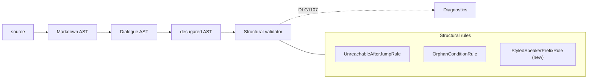

# Styled speaker prefix diagnostic

> [!NOTE]
> Status: **proposed**
> ([issue #168](https://github.com/pengzhengyi/godot-dialoguedown/issues/168)).
> Warn when a line looks like a speaker prefix, but its name is Markdown-styled, so
> the compiler does not recognize it — today the line is silently unattributed.

## Table of contents

- [Goal and scope](#goal-and-scope)
- [Functionality checklist](#functionality-checklist)
- [Ubiquitous language](#ubiquitous-language)
- [Writer-facing behavior](#writer-facing-behavior)
- [Why it happens today](#why-it-happens-today)
- [Architecture](#architecture)
- [Interfaces and responsibilities](#interfaces-and-responsibilities)
- [Detection](#detection)
- [Key design decisions](#key-design-decisions)
- [Error and boundary cases](#error-and-boundary-cases)
- [Integration](#integration)
- [Testability](#testability)
- [Alternatives not chosen](#alternatives-not-chosen)
- [Decisions](#decisions)

## Goal and scope

A writer who types `*Alice*: Hello` almost always means **Alice** to speak the
line, with her name shown in italics. DialogueDown does not read it that way: the
styling stops the name from being recognized as a speaker prefix, so the line
becomes **unattributed** (the default speaker), and the styled "Alice" plus
": Hello" become the spoken text. Worst of all, this happens **silently** — no
error, no warning.

This note adds a **warning** that catches the likely mistake: when a line's styled
leading run *would* parse as a speaker prefix if it were unstyled, report it and
tell the writer to remove the emphasis.

**In scope:** a structural style/surface warning over the desugared Dialogue AST,
its detection rule, its `DLG1107` descriptor, the writer-facing guidance, and the
generated error-code entry.

**Out of scope:** changing how a speaker prefix is *parsed* (styled prefixes stay
unrecognized — we warn, we do not silently promote them); any new syntax; and
rule configuration (no TOML knob).

## Functionality checklist

- [ ] Add `DLG1107` as a `Syntax` diagnostic with `Warning` severity.
- [ ] Detect a line with **no recognized speaker** whose styled leading run parses
      as a speaker prefix once flattened to plain text.
- [ ] Cover italic, bold, and strikethrough names (`*Alice*:`, `**Alice**:`,
      `~~Alice~~:`), including bold-italic.
- [ ] Require the terminating `:` to sit **outside** the styled run, so a
      fully-styled line (`*Alice: hi*`) does not trigger.
- [ ] Point the diagnostic at the would-be prefix (line start through the `:`).
- [ ] Apply inside choice options too (any `Line`, not only top-level speech).
- [ ] Register the rule in every default compiler composition root.
- [ ] Add the generated error-code reference entry and a short writer-facing note.

## Ubiquitous language

| Term | Meaning |
| --- | --- |
| **Speaker prefix** | The `Name #tag @id:` at the start of a line that declares or references who speaks it (existing concept, parsed by `SpeakerPrefixParser`). |
| **Styled speaker prefix** | A would-be speaker prefix whose name is wrapped in Markdown styling (`*Alice*:`), which the transpiler does not recognize because styling breaks the leading plain-text run. |
| **Unattributed line** | A `Line` with no recognized speaker (`Speaker` is `null`); desugar fills the default speaker downstream. |
| **Would-be prefix** | The leading run of a line flattened to plain text up to and including the first `:`. If it parses as a speaker prefix, styling is the only reason recognition failed. |
| **Styled run** | A leading `StyledText` fragment (italic, bold, or strikethrough) — the Dialogue AST's record that some speech text carries a style. |

## Writer-facing behavior

The warning fires on a line whose styled name would have been a speaker:

```markdown
*Alice*: Hello there.        → DLG1107: styled speaker prefix
**Bob** #gruff: What now?    → DLG1107 (bold name, with a tag)
~~Ghost~~: ...               → DLG1107 (strikethrough name)
```

It does **not** fire when the line is genuinely something else:

```markdown
Alice: Hello there.          plain prefix — recognized, no warning
*It was a cold night.*       styled narration, no name#colon shape
*Alice: hi*                  the whole line is italic (colon inside styling)
```

The message names the offending text and points at the fix:

> **DLG1107** — This line looks like a speaker prefix (`*Alice*:`) but the styling
> keeps it from being recognized, so the line is unattributed. Remove the emphasis
> to declare the speaker (`Alice:`).

The line still compiles unchanged — this is advisory, not an error.

## Why it happens today

Speaker prefixes are peeled in `LineBuilder.PeelSpeaker()`, which only runs when
the paragraph's first inline is plain text:

```csharp
if (_remaining[0] is not TextInline leading) { return null; }
```

`*Alice*: Hello` parses to `EmphasisInline("Alice")` + `TextInline(": Hello")`, so
the first inline is emphasis, the peel bails, and the line has no speaker. The
`SpeakerPrefixParser` grammar (which needs `name … :` inside one text run) is
never reached. Nothing downstream flags it.

## Architecture

Line-surface advisories in DialogueDown are **structural validation rules** over
the desugared Dialogue AST, not diagnostics emitted while transpiling — the same
home as `DLG1003` (unreachable content after a jump) and `DLG1106` (a condition
guarding nothing). This diagnostic joins them as one more rule.



The Dialogue AST preserves styling as a `StyledText` fragment (a `SpeechStyle`
plus child fragments plus a span), so a rule can see the styled leading run and
reconstruct the writer's plain text — the emphasis has not been thrown away.

## Interfaces and responsibilities

| Type | Responsibility | Collaborators |
| --- | --- | --- |
| `StyledSpeakerPrefixRule` | The new rule: walk each `Line`, detect a styled would-be prefix, report `DLG1107`. Extends `DiagnosticRule`. | `DialogueTreeIndex`, `SpeakerPrefixParser` |
| `DiagnosticCatalog.StyledSpeakerPrefix` | The `DLG1107` descriptor (Syntax, Warning). | — |
| `StructuralValidatorFactory` | Register the rule in the default rule set, so both composition roots run it. | `StructuralValidator` |
| `SpeakerPrefixProbe` | A small shared probe over `SpeakerPrefixParser.Prefix` that answers "does this plain text begin with a speaker prefix?" — reused by the rule (and available to the transpiler) so validation does not reach into transpiler internals. | `SpeakerPrefixParser` |

## Detection

For each `Line` the rule runs this test:

1. **Skip attributed lines.** If `Line.Speaker` is not `null`, the line already
   names a speaker — nothing to warn about.
2. **Require styling at the front.** The leading run of `Line.Speech`, up to the
   first `:`, must contain at least one `StyledText` fragment. No styling means an
   ordinary unattributed line, not a mistake this rule owns.
3. **Flatten the would-be prefix.** Concatenate the plain text of the leading
   fragments (a `StyledText` contributes its children's text; `Text` its content)
   up to and including the first `:` that sits **outside** any styled run.
4. **Parse it.** Run the shared `SpeakerPrefixProbe` (over `SpeakerPrefixParser`)
   on the flattened text. If it matches, the styling is the only reason
   recognition failed → report `DLG1107` spanning the would-be prefix, with the
   flattened text as the message argument.

Probing through the real grammar means the rule and the transpiler agree exactly
on what a "speaker prefix" is, so the warning never disagrees with recognition.

## Key design decisions

- **A validation rule, not a transpiler diagnostic.** Line-surface advisories that
  still compile live in the structural validator (`DLG1003`, `DLG1106`), keeping
  the transpiler focused on building. This diagnostic follows that convention.
- **`Syntax` / `Warning` (`DLG1107`).** The line is valid Markdown that still
  compiles, so it is not an error; but it is a malformed *speaker-prefix surface*,
  which is the `DLG11xx` syntax family (`DLG1101`, tags without a speaker), not a
  readability `DLG3xxx` style rule.
- **Probe through the real grammar.** Detection asks the authoritative question —
  "would this have parsed as a prefix?" — instead of a look-alike heuristic that
  could drift from real recognition. A small shared `SpeakerPrefixProbe` wraps
  `SpeakerPrefixParser`, so the rule reuses the grammar without a validation →
  transpiler-internals dependency.
- **The `:` must be outside the styling.** Requiring the terminating colon in a
  plain fragment means the *name* is styled, but the writer still typed a normal
  `:` — the strong "styled speaker" signal — and excludes a deliberately
  fully-italic line like `*Alice: hi*`.
- **Warn, never rewrite.** We do not silently promote a styled prefix to a
  speaker: that would drop or move the writer's styling and surprise them. A
  warning keeps Markdown semantics and lets the writer decide.

## Error and boundary cases

| Input | Result |
| --- | --- |
| `*Alice*: hi` / `**Alice**: hi` / `_Alice_: hi` | `DLG1107` — styled name, plain colon. |
| `~~Ghost~~: ...` | `DLG1107` — strikethrough is styling too. |
| `**Alice** #gruff: hi` | `DLG1107` — flattened `Alice #gruff:` parses (name + tag). |
| `Alice: hi` | No warning — recognized speaker, `Speaker` is not `null`. |
| `*Alice: hi*` | No warning — the `:` is inside the styled run (whole-line italic). |
| `*It was cold.*` | No warning — no `name:` shape flattens out. |
| `*the great*: hi` | No warning — `the great` is not a valid speaker name, so the flattened text does not parse. |
| `A*l*ice: hi` | `DLG1107` — styling appears in the leading run before the colon, even though the first fragment is plain `Text("A")`. |
| `` `"key"?` *Alice*: hi `` | `DLG1107` — the condition guard is peeled first; the styled prefix is still detected in the remaining speech. |
| `*Alice*: hi` inside a choice option | `DLG1107` — a choice option is a `Line`, so the rule covers it. |

## Integration

- Add `DLG1107` to `DiagnosticCatalog`.
- Add `StyledSpeakerPrefixRule` to `StructuralValidatorFactory.CreateDefault()`.
- Reuse the grammar through a shared `SpeakerPrefixProbe` over
  `SpeakerPrefixParser`, called from the rule, rather than a direct
  validation → transpiler-parser reference.
- Add the generated **error-code reference** entry for `DLG1107` (trigger/fix
  docs, as every `DLG` code carries) and a short **writer-facing** note in the
  script-language guide that a speaker's name must be unstyled.

## Testability

The rule is pure over the desugared AST and needs no I/O, so it stays
bottom-heavy on unit tests, built through the existing pipeline/object-mother
helpers that compile a source string to the tree.

- **Unit (`StyledSpeakerPrefixRuleTests`):** each styled form warns; a plain
  prefix does not; a fully-styled line (colon inside) does not; a styled non-name
  does not; a styled prefix with a tag warns; a styled prefix inside a choice
  warns; a conditional line with a styled prefix warns; the reported span covers
  the would-be prefix.
- **Integration:** one end-to-end compile asserting the `DLG1107` code and its
  location for `*Alice*: hi`, plus that a plain `Alice: hi` stays clean.

## Alternatives not chosen

- **Emit it while transpiling** (in `LineBuilder`/`SpeakerBuilder`). Rejected: it
  puts an advisory in the builder, against the convention that line-surface
  advisories are validation rules.
- **Silently promote a styled prefix to a speaker.** Rejected: it would drop or
  relocate the writer's styling and change Markdown meaning without consent; a
  warning is safer and reversible.
- **Error severity.** Rejected: the line is valid Markdown that compiles; a hard
  error would block a legitimate (if unusual) authoring choice.
- **A look-alike heuristic** instead of the real parser. Rejected: it risks
  drifting from what actually counts as a prefix, producing warnings that
  contradict recognition.

## Decisions

Settled in review:

1. **Category — `Syntax` / `DLG1107` / Warning.** A malformed speaker-prefix
   surface (beside `DLG1101`) that still compiles, so it warns rather than errors.
2. **Any styling before the colon triggers it** — including partial-name styling
   like `A*l*ice:`, not only a fully styled leading fragment.
3. **Strikethrough counts** — `~~Ghost~~:` warns like italic and bold.
4. **Detection goes through a shared `SpeakerPrefixProbe`** over
   `SpeakerPrefixParser`, so the rule reuses the authoritative grammar without a
   validation → transpiler-internals dependency.
