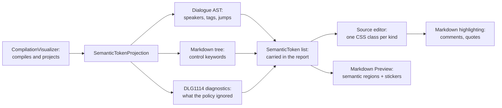

# Unmodeled Markdown Highlighting

> [!NOTE]
> Status: **implemented**. Extends
> [Compiler-Projected Editor Semantics](./Compiler-Projected%20Editor%20Semantics.md) so the
> editor shows what a construct's fate is — ignored, or dialogue — instead of muting the
> blockquotes that carry control blocks and coloring ignored material as if it played.

## Table of contents

- [Goal and scope](#goal-and-scope)
- [Functionality checklist](#functionality-checklist)
- [Ubiquitous language](#ubiquitous-language)
- [Writer-facing behavior](#writer-facing-behavior)
- [Architecture](#architecture)
- [Interfaces and responsibilities](#interfaces-and-responsibilities)
- [Key design decisions](#key-design-decisions)
- [Error and boundary cases](#error-and-boundary-cases)
- [Integration](#integration)
- [Testability](#testability)
- [Alternatives not chosen](#alternatives-not-chosen)

## Goal and scope

A DialogueDown script is Markdown, but not all of it becomes dialogue. A table is **ignored** —
left out of the dialogue entirely — while the blockquote beside it may be a control block that
branches the story. The editor colors both as ordinary Markdown, and mutes the blockquote, so
the liveliest construct in the language reads as the most inert and the absent one reads as if
it plays.

This component makes the editor show that difference, layered on Markdown highlighting rather
than replacing it.

**In scope:** one semantic-token kind for Markdown the policy ignores; styling it as visibly
absent; removing the blockquote muting; and styling Markdown comments, which the editor's own
parser already recognizes.

**Out of scope:** changing what is kept or ignored — the policy is unchanged and
this component only *shows* it. `dialogue.toml` handling overrides are loaded by
[#47](https://github.com/pengzhengyi/dialoguedown/issues/47); because the
projection follows `DLG1114`, an override changes the highlighting without a
second client-side policy. Front matter is a separate invariant metadata region,
designed in [Front Matter Source Highlighting](./Front%20Matter%20Source%20Highlighting.md).

## Functionality checklist

- [x] Add a token kind for Markdown the policy **ignores**.
- [x] Derive it from the policy's own decision, not a second classification.
- [x] Cover block and inline constructs alike.
- [x] Reach constructs nested in a list item or blockquote.
- [x] Style ignored material as present in the file but absent from the dialogue, in both Source
      and Preview.
- [x] Stop muting blockquotes, so a control block reads as live dialogue.
- [x] Mark a conditional blockquote with a question sticker, from its compiler-projected control
      keyword.
- [x] Style Markdown comments as the writer-only notes they are.
- [x] Leave dialogue constructs' existing tokens untouched.

## Ubiquitous language

This component adds no vocabulary of its own. `UnmodeledNodeKind` and `UnmodeledNodeHandling`
live in `DialogueDown.Configuration` — they are the words a project writes in `dialogue.toml`,
and configuration is a foundation layer that must not depend on Markdown. The editor names each
fate with the same word the author configures it with, so a color on screen and a line in
`dialogue.toml` mean the same thing.

| Term | Meaning |
| --- | --- |
| **Unmodeled construct** | Markdown DialogueDown does not model as dialogue, classified as an `UnmodeledNodeKind`. |
| **Ignore** | The construct is left out of the dialogue entirely, like a comment. Reported as `DLG1114`. |
| **Keep** | The construct's source text becomes dialogue text, exactly as written — its text, not its structure. |
| **Comment** | An HTML comment. Always left out, unconditionally, before the policy is consulted — so it is never reported. |

## Writer-facing behavior

Given a script:

```markdown
# The Tavern

<!-- reminder: rewrite this scene -->

| Rumor | Source |
| --- | --- |
| The bridge is out | The miller |

> `if` `Thirsty?`
>
> Innkeeper: You look parched.

<div class="portrait"></div>
```

| Construct | Fate | How it reads |
| --- | --- | --- |
| The comment | Never compiled | Light gray and italic — a note to the writer |
| The table | Ignored | Dark gray inside an eye-marked region; the region glows on hover |
| The `if` quote | Dialogue | Fully colored inside a question-marked region — it plays |
| The `<div>` | Kept | Ordinary dialogue text, because that is exactly what it becomes |

The blockquote is the point of the change: today it is the dimmest thing on screen, though it is
the only one of the four that branches the dialogue.

## Architecture

The projection already reads both trees — the Dialogue AST for dialogue constructs and the
Markdown tree for block-control keywords. Ignored constructs are a third source, and the
compiler already located every one of them while reporting `DLG1114`.



## Interfaces and responsibilities

| Type | Responsibility | Collaborators |
| --- | --- | --- |
| `TokenKind` | Gains `IgnoredMarkdown`. | — |
| `SemanticTokenProjection` | Emits a token for each ignored construct, from the reported spans. | `LocatedDiagnostic`, `DiagnosticCatalog` |
| `IUnmodeledNodeHandlingPolicy` | Unchanged: still the single authority on a kind's fate. | `UnmodeledNodeKind` |
| `semantic-tokens.ts` | Maps the new kind to its CSS class. | `styles.css` |
| `text.ts` | Marks rendered Markdown from ignored and control-keyword source spans. | `marked` |
| `source-view.ts` | Maps tokens through edits, mirrors ignored regions in Preview, stops muting blockquotes, and styles comments. | the Markdown highlight style |

## Key design decisions

### DD1 — Project what the policy decides; style natively what Markdown already knows

The editor projects a construct's fate from the compiler **only when that fate can vary**.

What the handling policy decides is variable: a project can configure it through
[#47](https://github.com/pengzhengyi/dialoguedown/issues/47), so the editor cannot know a
table's fate without asking the compiler. That is projected.

A Markdown **comment**, by contrast, is always left out, unconditionally — there is nothing to
learn from the compiler. It is also ordinary CommonMark, which the editor's own parser already
recognizes: `@lezer/markdown` maps `Comment` and `CommentBlock` to the `comment` highlight tag.
Projecting it would duplicate work the client already does and spend payload bytes stating an
invariant.

This sharpens the "compiler is the single source of truth" principle inherited from
[Compiler-Projected Editor Semantics](./Compiler-Projected%20Editor%20Semantics.md): the
compiler is the authority on **DialogueDown's grammar and its configuration**, not on plain
Markdown the client can already parse correctly.

### DD2 — Recover ignored spans from the diagnostic the front end already reports

An ignored construct leaves nothing behind in the Markdown tree — being left out is what
`Ignore` means — so it cannot be found by inspecting the tree. It can be found by inspecting
what the compiler *said*: every ignored construct is reported as `DLG1114` with its exact span,
the note added for [#227](https://github.com/pengzhengyi/dialoguedown/issues/227).

The projection reads those diagnostics. This keeps one authority — the handler decides and
reports; the editor draws what was reported — and a project that configures the policy colors
correctly with no change here.

The tradeoff: the highlighting depends on that diagnostic being produced, so demoting or
suppressing `DLG1114` would silently take the coloring with it. A test pins the pair together so
it cannot happen unnoticed.

### DD2a — The diagnostics reach the projection as an optional argument

`Project` takes the compile's located diagnostics as a trailing optional parameter, so a caller
that only wants dialogue tokens — the projection's existing tests among them — is unchanged, and
a caller that has diagnostics passes them. The compile that renders a report always has them.

The coupling to `DLG1114` is made in code rather than by a literal: the
projection compares against `DiagnosticCatalog.IgnoredUnmodeledMarkdown.Code`,
so the code cannot drift from the catalog silently.

### DD3 — Kept material is styled as dialogue, because that is what it becomes

`Keep` means the construct's source text *becomes dialogue text, exactly as written*. Text that
will be said should therefore look like text that will be said. A distinct tint would assert
"this is special" precisely where the compiler's position is that it is now ordinary — the
color would contradict the semantics rather than reveal them.

This also means the design needs no way to recognize kept constructs, which is fortunate: a
flattened construct is byte-for-byte indistinguishable from ordinary text in the Markdown tree,
so recognizing it would have required a new record threaded out of the parse for no reader
benefit.

### DD4 — Stop muting blockquotes; mark control regions from existing tokens

The fix is to delete `{ tag: tags.quote, color: "var(--md-muted)" }`, not to add a token that
re-colors quotes. In DialogueDown a blockquote is always live: a marker-headed quote is a
control block, and any other quote is a transparent wrapper whose contents are dialogue. Its
*contents* already carry their own tokens — speaker, tags, control keyword — and the mute was
the only thing overriding them. Removing it lets the existing projection show through, with no
new token and no new span arithmetic.

The Preview adds a question sticker only when an existing `ControlKeyword` token lands inside
the rendered blockquote. It does not recognize `if` strings in TypeScript. This preserves the
same boundary as DD1: the compiler decides DialogueDown grammar; the client renders it.

### DD5 — Use semantic regions and a two-level gray hierarchy

Ignored material is **dark gray**; a comment is **lighter gray and italic**. Both survive a
colorblind reader and both themes, where new hues in an already thirteen-color legend would not.
The difference in opacity carries intent: comments are expected writer-only notes, while ignored
Markdown stays more legible because it may be an accidental omission the writer needs to inspect.
A strikethrough was rejected after preview because it added visual noise across multi-line tables
and code blocks.

Opacity alone was also rejected for Preview: it was too easy to overlook, and an adjacent badge
did not say which content it covered. The final design wraps each ignored rendered construct in a
region with a persistent closed-eye sticker and left rail. Hovering brightens the rail and adds
the same soft tint and glow blockquotes already use. A conditional blockquote gets a question
sticker in the same corner. The stickers add no separate row, so the document's vertical flow is
unchanged.

The Preview regions are still policy-driven. `renderDocument` receives the same
`IgnoredMarkdown` spans as Source and matches them to Marked's source tokens; it does **not**
dim every `table`, `pre`, or `hr`. When configuration changes a kind from `Ignore` to `Keep`, its
token disappears and both panes return it to full strength.

## Error and boundary cases

| Case | Behavior |
| --- | --- |
| An ignored table, code block, or divider | One ignored token over the construct's span; Source and Preview show the same opacity, and Preview encloses it in an eye-marked region. |
| Raw HTML kept as dialogue text | No token — it reads as the dialogue text it becomes. |
| An HTML comment, block or inline | Styled by the editor's Markdown parser; never projected. |
| An ignored construct inside a list item or blockquote | Tokenized — the diagnostic carries its span wherever it sat. |
| A conditional blockquote | Its contents keep their own colors; its existing control-keyword token adds the question sticker in Preview. |
| A non-conditional blockquote | No question sticker; its contents keep their own colors. |
| A project that configures the policy | Follows the configured fate, with no change here. |
| An ignored construct in a script that fails to compile | Reported and colored as far as the front end ran; later stages add nothing here. |

## Integration

- **Report payload.** One more `TokenKind` value; the payload shape is unchanged.
- **LSP.** The kind rides the same legend a language server would publish, so the projection is
  reused unchanged when it arrives.
- **Source editor.** One CSS class following the existing `dd-tok-*` convention, plus two lines
  in the Markdown highlight style.
- **Markdown Preview.** The same semantic spans add ignored/control region classes and codicon
  stickers. Spans map through unsaved edits until the next compile.
- **Diagnostics overlay.** An ignored construct also carries its `DLG1114` note; the two agree
  because they come from the same report.

## Testability

- **Unit — projection:** an ignored construct emits a token over the reported span; a script with
  no ignored construct emits none; nesting is covered.
- **Unit — the DD2 coupling:** a test asserts an ignored construct produces both the diagnostic
  and the token, so demoting one cannot silently break the other.
- **Unit — client:** the new kind maps to its class, alongside every existing kind.
- **Unit — Markdown layer:** `markdownHighlightStyle` is asserted to leave a blockquote unstyled
  and to style a comment, so neither decision can be undone by reflex.
- **Unit — Preview renderer:** ignored tables, code blocks, dividers, raw HTML, and autolinks are
  wrapped only when their projected spans are supplied; kept Markdown stays full-strength.
- **Integration — Source view:** setting and clearing semantic tokens adds and removes ignored
  Preview regions, a control-keyword token marks its enclosing blockquote, and ranges map through
  unsaved edits.

## Alternatives not chosen

| Alternative | Why not |
| --- | --- |
| Re-run the policy inside the projection | Two authorities on one question, and an ignored node is no longer in the tree to classify ([DD2](#dd2--recover-ignored-spans-from-the-diagnostic-the-front-end-already-reports)). |
| Thread a record of every fate out of the parse | A second transport for something the diagnostic already carries, to distinguish kept text that should not be distinguished ([DD3](#dd3--kept-material-is-styled-as-dialogue-because-that-is-what-it-becomes)). |
| A projected token kind for comments | Duplicates what the editor's Markdown parser already recognizes, for a fate that never varies ([DD1](#dd1--project-what-the-policy-decides-style-natively-what-markdown-already-knows)). |
| Re-color blockquotes with a new token | The mute was the problem; the contents already have their own colors ([DD4](#dd4--stop-muting-blockquotes-mark-control-regions-from-existing-tokens)). |
| Opacity alone in Preview | Too easy to overlook; a semantic region preserves flow while making coverage explicit ([DD5](#dd5--use-semantic-regions-and-a-two-level-gray-hierarchy)). |
| A badge on its own row | Breaks the Markdown's vertical rhythm and does not clearly enclose the content it labels. |
