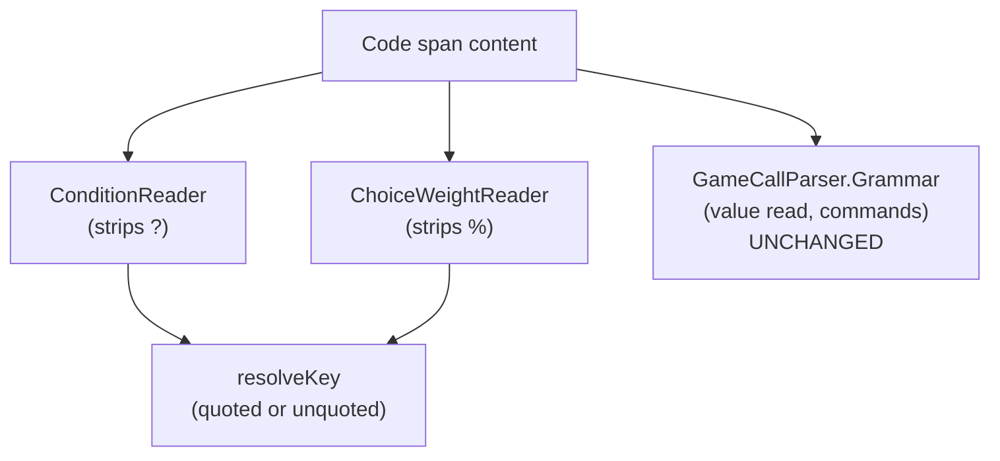

# Unquoted keys

> [!NOTE]
> Status: **proposed**, not yet implemented. This note refines the syntax of the
> **query key** shared by the [Conditional Jump](./Conditional%20Jump.md),
> [Conditional Line](./Conditional%20Line.md),
> [Conditional Choice](./Conditional%20Choice.md), and
> [Random Choice](./Random%20Choice.md) notes; read those first for the condition
> and weight they build on.

## Table of contents

- [Unquoted keys](#unquoted-keys)
  - [Table of contents](#table-of-contents)
  - [Goal and scope](#goal-and-scope)
  - [Functionality checklist](#functionality-checklist)
  - [Ubiquitous language](#ubiquitous-language)
  - [Writer-facing behavior](#writer-facing-behavior)
  - [Grammar](#grammar)
  - [Key resolution](#key-resolution)
  - [Prior art](#prior-art)
  - [Architecture](#architecture)
  - [Key design decisions](#key-design-decisions)
    - [D1 — Only a sigil-terminated form may be unquoted](#d1--only-a-sigil-terminated-form-may-be-unquoted)
    - [D2 — Quotes are the escape, detected by shape](#d2--quotes-are-the-escape-detected-by-shape)
    - [D3 — A weight is a number first, a key second](#d3--a-weight-is-a-number-first-a-key-second)
    - [D4 — The game-call grammar is untouched](#d4--the-game-call-grammar-is-untouched)
    - [D5 — An unquoted key may contain spaces](#d5--an-unquoted-key-may-contain-spaces)
  - [Markdown interaction](#markdown-interaction)
  - [Diagnostics](#diagnostics)
  - [Error and boundary cases](#error-and-boundary-cases)
  - [Testability](#testability)
  - [Open questions and deferred work](#open-questions-and-deferred-work)

## Goal and scope

A game-state **key** is written in quotes today: `` `"IsAngry"?` `` guards a jump,
line, or choice, and `` `"Luck"%` `` weights a random option. Writers find the
quotes unnatural — a key reads like a plain question or phrase, and the quotes are
punctuation they must remember to add and to balance.

This note lets a writer **drop the quotes** on a key where it is safe to do so:

```markdown
`IsAngry?` => [The guard blocks you](#blocked)
```

The quotes remain valid — an unquoted key is an *optional shorthand*, not a
replacement — and they stay **required** wherever dropping them would be
ambiguous.

Scope:

- Accept an **unquoted key** in the two **sigil-terminated** forms: a
  **condition** (`?`) and a **weight** (`%`).
- Keep the **value read** (`` `"key"` ``) quoted, since it has no terminator.
- Keep quotes as the **escape** for a key that must contain a trailing `?` or `%`.

Out of scope:

- **Unquoted value reads** — deliberately excluded; see
  [D1](#d1--only-a-sigil-terminated-form-may-be-unquoted).
- **Unquoted command names or arguments** — a command already names itself with
  parentheses; this note does not touch the game-call grammar (see
  [D4](#d4--the-game-call-grammar-is-untouched)).
- **Dropping the code span** — a key still lives inside a code span; a bare
  `IsAngry?` in prose is not a condition. The backtick is what marks the span
  as game-state, not speech.

## Functionality checklist

- [ ] Recognize a **condition** whose key is unquoted: `` `IsAngry?` `` reads the
      key `IsAngry`.
- [ ] Recognize a **weight** whose key is unquoted: `` `Luck%` `` reads the key
      `Luck` as a dynamic weight.
- [ ] Keep accepting the **quoted** form of both, unchanged.
- [ ] Keep the **value read** quoted-only; a bare `` `IsAngry` `` stays *not a game
      call*.
- [ ] Treat a trailing `?`/`%` as the **operator**; a key that ends in a literal
      `?`/`%` is written quoted (`` `"Rainy?"?` ``).
- [ ] Preserve a numeric weight: `` `50%` `` is the number 50, not the key `50`;
      a negative numeric weight (`` `-5%` ``) stays an **invalid weight**, not a key.
- [ ] Trim insignificant whitespace around the key and the sigil; keep spaces
      *inside* an unquoted key.
- [ ] Present the unquoted form as the **recommended default** in the writer guide,
      with quotes documented as the escape.
- [ ] Leave the source span of the condition, the weight, and the key correct.

## Ubiquitous language

| Term             | Meaning                                                                           |
| ---------------- | --------------------------------------------------------------------------------- |
| **Key**          | The opaque string the game resolves — the argument of a query.                    |
| **Quoted key**   | A key written in straight double quotes: `"IsAngry"`.                             |
| **Unquoted key** | A key written without quotes: `IsAngry`. New in this note.                        |
| **Sigil**        | The trailing operator inside a code span: `?` (condition) or `%` (weight).        |
| **Value read**   | A query that inserts the key's value into speech (`` `"key"` ``); has *no* sigil. |
| **Condition**    | A boolean read that guards a jump, line, or choice (`` `key?` ``).                |
| **Weight**       | A dynamic random-choice weight computed from a key (`` `key%` ``).                |

The **sigil** is the pivot of this note: it terminates the key and names the
operation, so the key before it needs no quotes to mark where it ends.

## Writer-facing behavior

A key may be written **quoted or unquoted** wherever a sigil follows it:

| Form       | Quoted (still valid)          | Unquoted (new)   | Reads                     |
| ---------- | ----------------------------- | ---------------- | ------------------------- |
| Condition  | `` `"IsAngry"?` ``            | `` `IsAngry?` `` | key `IsAngry`             |
| Weight     | `` `"Luck"%` ``               | `` `Luck%` ``    | key `Luck`                |
| Value read | `` `"Alice.FavoriteColor"` `` | — always quoted  | key `Alice.FavoriteColor` |

The unquoted key is *everything before the sigil*, with surrounding whitespace
trimmed and spaces inside kept — so a natural phrase works:

```markdown
`Is Alice happy?` => [She smiles and waves you in](#welcome)
```

Quotes are the **escape**. To make a key that itself ends in `?` or `%`, quote it,
so the sigil after the closing quote is unmistakably the operator:

```markdown
`"Rainy?"?` => [Wait out the storm](#the-inn)
```

Here the key is the literal `Rainy?` and the trailing `?` is the condition. Without
the quotes, `` `Rainy?` `` would read the key `Rainy`.

**Recommendation.** Prefer the **unquoted** form for a condition and a dynamic
weight — it reads as a natural phrase and is the form this guide uses by default.
Reach for quotes only to **escape**: a key that ends in a literal `?`/`%`, a key
that contains a `"`, or a value read (which is always quoted).

## Grammar

```ebnf
(* A key is quoted or unquoted; only a quoted key may contain the sigil. *)
Key         = QuotedString | UnquotedKey ;
UnquotedKey = NonSigilText ;  (* trimmed, non-empty; may contain spaces *)

Condition = "`" , Key , "?" , "`" ;
Weight    = "`" , [ Number | Key ] , "%" , "`" ;   (* empty => auto weight *)
Query     = "`" , QuotedString , "`" ;             (* value read: quoted only *)
```

`Number` wins over `Key` in a weight (see
[D3](#d3--a-weight-is-a-number-first-a-key-second)). A value read has no sigil, so
it admits only a `QuotedString`.

## Key resolution

Recognition already strips the sigil and hands the remaining text to a key reader.
This note changes only that reader — from *"the text must be a quoted string"* to
*"the text is a quoted or an unquoted key"*:

```text
codeSpan content
  └─ trim, split off trailing sigil (? or %)
       └─ remaining text ──► resolveKey
                               ├─ looks like "..."  → QuotedKey(inner)
                               └─ otherwise         → UnquotedKey(text)   (non-empty)
```

The same `resolveKey` serves the condition and the weight, so the two forms accept
keys identically. A value read never calls it — it keeps its quoted-string reader.

## Prior art

| Language     | State reference                      | Lesson                                                                                                 |
| ------------ | ------------------------------------ | ------------------------------------------------------------------------------------------------------ |
| Yarn Spinner | `<<if $spoke_to_guard>>`             | A `$`-sigil variable is **unquoted**; quotes are for string literals.                                  |
| Ink          | `{knows_about_wager: ...}`           | A condition names a variable **unquoted**, no delimiters.                                              |
| Ren'Py       | `if angry:`                          | Python identifiers — **unquoted** variable names.                                                      |
| TOML         | `bare-key = 1` vs `"quoted key" = 1` | **Unquoted for the common case, quoted to escape special characters** — the closest structural analog. |

Two takeaways shape this note. First, every dialogue engine references game state
with an **unquoted** name; a quoted variable is the unusual choice, which is why
writers balk at it here. Second, TOML shows the clean split we adopt: an unquoted
key for the ordinary case, a quoted key to escape characters the unquoted form
cannot express.

DialogueDown diverges from the engines in one deliberate way: an unquoted key
**may contain spaces** (`Is Alice happy`). Those engines forbid spaces because a
key is a *program variable*; here a key is an opaque **label** the game resolves,
and the trailing sigil already delimits it, so a natural phrase is safe (see
[D5](#d5--an-unquoted-key-may-contain-spaces)).

## Architecture

The change is small and localized, because the sigil readers already isolate the
key before validating it. Two readers gain the unquoted form; nothing else moves.



| Type                 | Responsibility                                           | Change                                         |
| -------------------- | -------------------------------------------------------- | ---------------------------------------------- |
| `ConditionReader`    | Read a `` `key?` `` code span into a `Condition`.        | Accept an unquoted key.                        |
| `ChoiceWeightReader` | Read a `` `…%` `` code span into a `ChoiceWeight`.       | Accept an unquoted key for the dynamic weight. |
| *Key resolution*     | Turn the text before the sigil into a key.               | New shared shape: quoted **or** unquoted.      |
| `GameCallParser`     | Recognize a value read, default command, custom command. | **None** — value reads stay quoted.            |

## Key design decisions

### D1 — Only a sigil-terminated form may be unquoted

A **condition** and a **weight** end in a sigil (`?`, `%`); a **value read** does
not. The sigil is a terminator: it marks where the key ends and what operation
applies, so the text before it is unambiguously the key. A value read has no such
terminator, so an unquoted value read would be ambiguous the moment its key ended
in `?` or `%` — is `` `Is Alice happy?` `` a value read of the key `Is Alice happy?`
or a condition on `Is Alice happy`?

Rather than resolve that with a precedence rule the writer must learn, we simply
**do not offer** an unquoted value read. The rule is one sentence: *a key may drop
its quotes only when a sigil follows it.* This also **preserves a safety net** — a
bare `` `Typo` `` with no sigil stays *not a game call* and is reported, instead of
silently becoming a value read of a misspelled key.

### D2 — Quotes are the escape, detected by shape

Because the sigil is stripped first, the key text stands alone. If it has the shape
of a quoted string (`"…"`), the inner text is the key; otherwise the raw text is the
key. So `` `X?` `` and `` `"X"?` `` both mean the key `X`, and `` `"Rainy?"?` `` means
the literal key `Rainy?`. Quotes never *change* a key — they only let it carry a
character (a trailing `?`/`%`) the unquoted form would read as the operator.

The quoted form has **no escape for an inner `"`** — it wraps any run of non-quote
characters, matching the existing value-read grammar. A key that must contain a `"`
is therefore written **unquoted**, where the `"` is an ordinary character
(`` `He said "hi"?` `` → key `He said "hi"`). Text that opens a quote but is not one
clean `"…"` string (`` `"a"b"?` ``) is not treated as quoted; it is read as the raw
unquoted key `"a"b"`. Since a key is opaque, every non-empty text resolves to *some*
key — there is no "malformed key" to report, only the empty one.

### D3 — A weight is a number first, a key second

A weight's text may be a **number** (`50`), a **key**, or empty (an auto weight).
The reader tries the number first, so `` `50%` `` stays the number 50 rather than a
key named `50`. A value that *parses as a number but is out of range* — a negative
percentage like `` `-5%` `` — stays an **invalid weight**, the same error it is
today, rather than falling through to a key named `-5`. Only text that is *not*
numeric becomes an unquoted key.

### D4 — The game-call grammar is untouched

An unquoted key is recognized inside the sigil readers, **before** the game-call
grammar runs. The grammar that distinguishes a value read from a command is
unchanged, so a custom command (`` `JoinClub("Alice")` ``) cannot be misread as an
unquoted key — its parentheses still name it a command. Keeping the value read
quoted is what makes this isolation possible: there is no unquoted, sigil-less form
for a bare identifier to collide with.

### D5 — An unquoted key may contain spaces

An unquoted key is *raw text before the sigil*, so it may contain spaces, dots,
apostrophes, and other punctuation — `Is Alice happy`, `Alice.FavoriteColor`,
`Alice's luck`. A key is an opaque label the game resolves, not a program
identifier, and the sigil already delimits it, so no identifier grammar is needed.
The only characters an unquoted key cannot carry are a **trailing** `?`/`%` (the
operator) and a backtick (which closes the code span); quotes express both.

## Markdown interaction

Nothing changes for Markdown. A key still lives inside an inline **code span**, so
an ordinary Markdown preview renders `` `IsAngry?` `` as monospace — visibly not
speech — exactly as it renders the quoted form today. Dropping the quotes only
removes two characters from inside the span; it does not change how Markdown
tokenizes it.

## Diagnostics

No new diagnostic code. The change **widens** what the two sigil readers accept, so
inputs that are errors today because they are unquoted (`` `IsAngry?` ``) become
valid. Existing diagnostics are preserved:

- A **value read** that is unquoted (`` `IsAngry` ``) still reports *not a game call*
  (`DLG1102`) — value reads are quoted-only.
- An **invalid weight** (`` `-5%` ``, `` `1/2%` ``) still reports its existing weight
  diagnostic; a non-numeric, non-empty weight is now a key rather than an error, but
  a numeric-but-invalid one is unchanged (see
  [D3](#d3--a-weight-is-a-number-first-a-key-second)).
- An **orphan condition** (`DLG1106`) is unaffected — an unquoted condition with
  nothing to guard is still an orphan.

## Error and boundary cases

| Input                     | Reads as                        | Why                                  |
| ------------------------- | ------------------------------- | ------------------------------------ |
| `` `IsAngry?` ``          | condition, key `IsAngry`        | unquoted key + sigil                 |
| `` `Is Alice happy?` ``   | condition, key `Is Alice happy` | spaces kept                          |
| `` `"Rainy?"?` ``         | condition, key `Rainy?`         | quotes escape the inner `?`          |
| `` `He said "hi"?` ``     | condition, key `He said "hi"`   | a `"` in a key is literal (unquoted) |
| `` `"a"b"?` ``            | condition, key `"a"b"`          | not one clean `"…"` → raw key        |
| `` `?` ``                 | *not a condition*               | empty key                            |
| `` `IsAngry` ``           | *not a game call* (`DLG1102`)   | value reads are quoted-only          |
| `` `Luck%` ``             | weight, key `Luck`              | unquoted key + sigil                 |
| `` `50%` ``               | weight, number 50               | number wins over key                 |
| `` `-5%` ``               | *invalid weight*                | numeric but out of range             |
| `` `%` ``                 | auto weight                     | empty weight                         |
| `` `JoinClub("Alice")` `` | custom command                  | grammar untouched                    |

## Testability

- **`ConditionReader`** — unit tests for the unquoted key, the quoted key, the
  quoted escape of an inner `?`, whitespace trimming, spaces inside a key, and the
  empty-key rejection.
- **`ChoiceWeightReader`** — unit tests for the unquoted key weight, the
  number-before-key precedence, the negative-number invalid weight, the auto
  weight, and the quoted key.
- **Builders** — a conditional jump, line, and choice, and a dynamic random
  weight, each written **unquoted**, compile to the same AST as the quoted form
  (equivalence tests), confirming the widening does not change downstream shape.
- **Value read** — a bare `` `IsAngry` `` still reports *not a game call*, guarding
  the quoted-only rule.

## Open questions and deferred work

- **Unquoted value reads** stay out of scope by [D1](#d1--only-a-sigil-terminated-form-may-be-unquoted);
  revisit only if a terminator is ever added to the value read.
