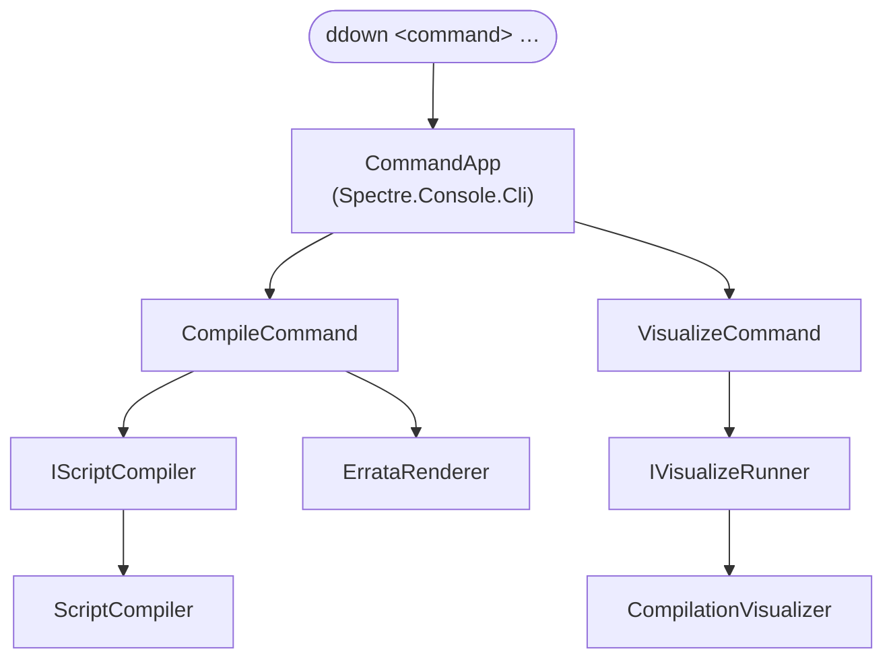

# Implementation note: command-line interface

> [!NOTE]
> Status: **implemented**.
> The `ddown` CLI: a Spectre.Console.Cli host with `compile` and `visualize`
> subcommands, both doing real work behind the `IScriptCompiler` seam — `compile`
> compiles and renders its diagnostics, `visualize` renders or serves a report. It
> installs as a `dotnet tool` whose command is `ddown`.
>
> **Maturity caveat.** Unlike the core library, this CLI was built quickly
> ("vibe-coded") with lighter design review. It is well-tested and works, but its
> abstractions are not yet battle-hardened and may be refined as it sees real use.

## Table of contents

- [Goal and scope](#goal-and-scope)
- [Ubiquitous language](#ubiquitous-language)
- [Where it sits](#where-it-sits)
- [Functionality checklist](#functionality-checklist)
- [Interfaces and abstractions](#interfaces-and-abstractions)
- [Key design decisions](#key-design-decisions)
- [Error and boundary cases](#error-and-boundary-cases)
- [Integration](#integration)
- [Testability](#testability)
- [Resolved decisions](#resolved-decisions)

## Goal and scope

Give DialogueDown a real **command-line front-end** instead of a hand-rolled
parser that grows with every feature. This component owns the command host, the
subcommands, and the seam through which compilation plugs in.

**In scope:**

- A `ddown` executable built on **Spectre.Console.Cli** (`CommandApp`), with
  built-in `--help`, per-command help, and `--version`.
- Two subcommands, each with strongly-typed settings and argument validation:
  - `compile <script>` — compile a script, render its diagnostics with source
    context, and choose the exit code; `--output` writes the playbook, and
    `--emit` projects one stage as text.
  - `visualize <script>` — render the compilation report, serve it for a live
    session, or export it.
- A **compilation seam** (`IScriptCompiler`) that both commands depend on, so
  `visualize` **consumes** compilation rather than re-implementing it.
- Dependency injection so commands receive their collaborators and tests can
  substitute them.
- The project wired into the solution and CI, and packaged as a `dotnet tool`
  whose command is `ddown`.

**Out of scope:** the compiler and the report themselves — the CLI is a front-end
over the library's seams and never compiles Markdown itself.

## Ubiquitous language

These terms are used verbatim in the note, code, tests, and CLI help.

| Term | Meaning |
| --- | --- |
| **Script** | A `.dialogue.md` source file — the thing a command acts on. (The visualization context calls the same file a *document*; they are the same artifact across contexts.) |
| **Command** | A CLI subcommand: `compile` or `visualize`. |
| **Settings** | A command's strongly-typed arguments and options (a Spectre `CommandSettings` subclass). |
| **Compile** | Run the compiler pipeline over a script's source (`source → Markdown AST → … → dialogue graph`). |
| **Compilation result** | The compiled form of a script: its stage artifacts, the playbook, and the collected diagnostics. |
| **Script compiler** (`IScriptCompiler`) | The seam that compiles a script. Both commands depend on it; the library provides the implementation. |

## Where it sits

The CLI is a thin **front-end** over the library. It owns argument parsing,
help/version, and process exit codes; it delegates the real work to the
compilation seam. Commands never compile Markdown themselves.

Both commands sit on seams: `compile` renders the diagnostics the compiler
returns, and `visualize` delegates to the visualization component — **consuming
compilation, not self-invoking it**.

## Functionality checklist

- [x] `ddown` with no arguments prints help (exit `0`).
- [x] `ddown --help` lists the `compile` and `visualize` commands.
- [x] `ddown --version` prints the tool version.
- [x] `ddown compile --help` / `visualize --help` show each command's usage.
- [x] `compile <script>` compiles, renders the diagnostics with source context,
      and exits `65` for a script or config error, `0` otherwise.
- [x] `compile --output <path>` writes the playbook; `--emit <stage>` projects one
      stage.
- [x] `visualize <script>` renders a report; `--watch` serves a live session, and
      `--root` scopes the project.
- [x] A missing file or a non-`.dialogue.md` argument fails with a clear message
      before any compilation is attempted.
- [x] An unknown command or option fails with Spectre's usage error.
- [x] Both commands resolve `IScriptCompiler` through DI (substitutable in tests).

## Interfaces and abstractions

| Type | Responsibility | Collaborators |
| --- | --- | --- |
| `Program` / `CliRunner` | Composition root: build the DI container, configure the app, and run it. Excluded from coverage (wiring exercised end-to-end). | `CommandApp`, `TypeRegistrar`, `CliServices`, `CliConfigurator` |
| `CliConfigurator` | Configure the app: name, version, the subcommands, and the exception handler that maps exceptions to a clean message and an exit code. | `IConfigurator`, `ExitCodes` |
| `CliServices` | Register the CLI's services (the `IScriptCompiler` seam) for injection. | `IServiceCollection` |
| `TypeRegistrar` / `TypeResolver` | Adapt Spectre's `ITypeRegistrar`/`ITypeResolver` onto `Microsoft.Extensions.DependencyInjection`, so commands get constructor-injected services. | `IServiceCollection` |
| `CompileCommand` + `CompileSettings` | The `compile` command shell: `<script>` argument, validate, then invoke the seam. | `IScriptCompiler` |
| `VisualizeCommand` + `VisualizeSettings` | The `visualize` command shell: `<script>` argument, validate, then invoke the seam. | `IScriptCompiler` |
| `IScriptCompiler` | The seam: `Compile(source) → CompilationResult`. The single place compilation happens. | `CompilationResult` |
| `CompilationResult` | The compiled form of a script: its stage artifacts and diagnostics. | — |
| `IErrataRenderer` / `ErrataRenderer` | Render the located diagnostics to an `IAnsiConsole` — rich Errata blocks with source context when interactive, one-liners otherwise — plus a summary. | `IAnsiConsole`, `LocatedDiagnostic` |
| `IVisualizeRunner` | The visualization seam `visualize` delegates to: render a report, export one, or serve a live session. | `CompilationVisualizer` |
| `ScriptArgument` (validation) | Reject a missing file or wrong extension with a clear message, shared by both commands. | — |
| `ExitCodes` | The process exit codes in one place (`Success`, `Error`, `DataError`, `UsageError`, `NotImplemented`). | — |

## Key design decisions

### D1 — Spectre.Console.Cli over a hand-rolled parser

The CLI is becoming a first-class surface, so it deserves a real framework rather
than growing a bespoke parser. **Spectre.Console.Cli** gives a strongly-typed
command/settings model, automatic `--help`/`--version`, subcommands, validation,
and a DI seam; paired with **Spectre.Console** it also unlocks modern, readable
output (tables, color, prompts) for later. It is MIT-licensed, widely adopted, and
first-class **testable** (see [Testability](#testability)). The one trade-off is
its pre-1.0 (0.x) versioning — minor bumps can carry small API changes — accepted
because the CLI API has been stable for years and this avoids reinventing a parser.

### D2 — One strongly-typed command per subcommand

Each subcommand is a `Command<TSettings>` with its own `CommandSettings` class
declaring arguments and options. The settings type is the command's contract:
validation lives there (`Validate()`), and tests assert on the parsed settings.
This keeps parsing declarative and the command body focused on behavior.

### D3 — Dependency injection via a type registrar

Commands receive collaborators (`IScriptCompiler`, `IAnsiConsole`) by constructor
injection. A small `TypeRegistrar`/`TypeResolver` bridges Spectre onto
`Microsoft.Extensions.DependencyInjection`. This is what makes commands testable in
isolation — a test swaps in a fake compiler or a `TestConsole` — and lets later
components register the real compiler without touching command code.

### D4 — A compilation seam both commands depend on

`IScriptCompiler` is the single seam through which a script is compiled. **Both**
commands depend on it: `compile` runs it and reports the outcome, `visualize`
renders its stages. Encoding this up front means `visualize` **relies on
compilation rather than self-invoking** it — the dependency direction the
architecture wants. A **single app-level exception handler** (in
`CliConfigurator`) turns a framework or command exception into a friendly message
and an exit code, so the commands stay trivial and the failure UX lives in one
place.

### D5 — Commands validate, then route

A command is thin: it parses and **validates** its `<script>` argument (exists,
`.dialogue.md`), resolves its collaborator, and hands off. All real behavior —
compiling, rendering diagnostics, writing a playbook, serving a report — lives
behind a seam, so a command body changes only when its options do.

### D6 — Naming: `dialoguedown`, short alias `ddown`

The command is **`dialoguedown`** (matches the library and repository), with a
short alias **`ddown`** for everyday use. The project is `DialogueDown.Cli`, and
the packaged tool's command name is `ddown` (D8).

### D7 — Exit codes are meaningful

A small, named set in one place (`ExitCodes`): `0` success, `64` usage error
(a bad argument or an unknown command/option, following `EX_USAGE`), `65` a data
error (`EX_DATAERR` — the script or the configuration was wrong), `70`
not-implemented (`EX_SOFTWARE`, reserved for a capability that is not built yet),
and `1` for an unexpected error. The app-level exception handler maps framework
and command exceptions onto these — a validation or parse failure to `64`, a
compile that found errors to `65` — rather than leaking a stack trace.

### D8 — Packaging as a `dotnet tool`

The project sets `PackAsTool` and `ToolCommandName` to `ddown`, so it installs as
a global or local `dotnet tool` — the natural home for the `ddown` alias. See the
[setup guide](../../../guide/cli.md) for the install commands.

### D9 — This CLI supersedes the hand-rolled `visualize` parser

An earlier `visualize` entry point was built on `System.CommandLine`. That
hand-rolled parser is **retired**: `visualize` now lives on this `CommandApp`,
delegating to the visualization component through `IVisualizeRunner`. One CLI,
one parser.

## Error and boundary cases

| Case | Intended behavior |
| --- | --- |
| No arguments | Print root help; exit non-zero. |
| `--help` / `command --help` | Print help for the app / the command; exit `0`. |
| `--version` | Print the version; exit `0`. |
| Missing file / not `.dialogue.md` | Clear message naming the argument; exit non-zero **before** compiling. |
| Unknown command or option | Spectre usage error (with suggestions); non-zero. |
| Valid script, `compile` | Compiles, renders the diagnostics, and exits `65` when the script has errors, `0` otherwise. |
| Valid script, `visualize` | Renders the report (or serves the live session) and exits `0`. |

## Integration

- **Solution & CI.** `DialogueDown.Cli` and `DialogueDown.Cli.Tests` join
  `DialogueDown.sln`. CI already builds and tests the **solution**
  (`dotnet build/test DialogueDown.sln`) and runs coverage over it, so the new
  projects are covered without workflow changes.
- **Core library.** The CLI references `DialogueDown`, which implements
  `IScriptCompiler`; the compilation seam is the boundary between them.
- **Visualization component.** Renders `visualize` — the report, the live session,
  and the exports — consuming `IScriptCompiler` through the CLI's runner seam.
- **Error model.** The commands surface the library's
  [error model](../core/Error%20Model.md) (`ScriptCompilationException` and its
  kinds) as friendly messages, and a compile that found errors as the errata
  report.

## Testability

The whole point of the framework choice is testability without a real terminal.

- **`CommandAppTester`** (from the `Spectre.Console.Cli.Testing` package — split
  from `Spectre.Console.Cli`) runs a command in-process and returns the **exit
  code**, captured **output**, and the parsed **settings** — so tests assert
  behavior end-to-end (help, version, validation, exit codes, the not-implemented
  path) with no process spawn. It captures the app's configured console, so the
  exception handler writes to the resolver-provided `IAnsiConsole` for output to be
  visible in tests.
- **Substitutable seam.** Tests register a fake `IScriptCompiler` (returns a canned
  result, or throws) to drive command behavior independently of the real compiler
  — proving the DI wiring and the command's handling of success and failure.
  Because the seam is `internal`, the CLI project also exposes internals to
  `DynamicProxyGenAssembly2` so NSubstitute (Castle DynamicProxy) can mock it.
- **Coverage.** The composition root (`Program`, `CliRunner`) is excluded as wiring
  exercised end-to-end; everything else — commands, settings, validation, the
  handler, the renderer, the seam, and the DI bridge — is covered by focused tests.
- **Stack.** xUnit + NSubstitute + `Spectre.Console.Cli.Testing` (matched Spectre
  `0.55.0` set), mirroring the repo's existing test setup (one test file per source
  file, parallel-friendly).

## Resolved decisions

- **Exit-code values.** Adopted the sysexits-style set in `ExitCodes`: `0` success,
  `64` usage, `65` data error, `70` not-implemented, `1` unexpected error (see D7).
- **Core reference.** The CLI references the `DialogueDown` core library, for a
  stable project graph; the compilation seam is the boundary.
