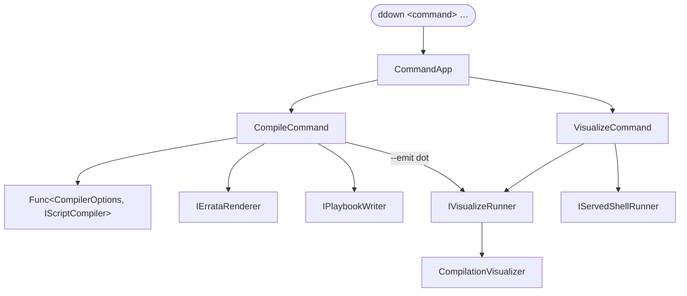

# Command-Line Interface

> [!NOTE]
> Status: **implemented**. `ddown`, a Spectre.Console.Cli host installed as a
> `dotnet tool`, with two commands: `compile` checks a script, renders its
> diagnostics, and writes a playbook or a stage export; `visualize` opens, serves, or
> exports the compilation report. The user-facing reference is the
> [command-line guide](../../../guide/cli.md).

## Table of contents

- [Ubiquitous language](#ubiquitous-language)
- [Where it sits](#where-it-sits)
- [Commands](#commands)
- [Interfaces and abstractions](#interfaces-and-abstractions)
- [Key design decisions](#key-design-decisions)
- [Error and boundary cases](#error-and-boundary-cases)
- [Testability](#testability)

## Ubiquitous language

| Term | Meaning |
| --- | --- |
| **Script** | A `.dialogue.md` file — what a command acts on. |
| **Command** | A subcommand: `compile` or `visualize`. |
| **Settings** | A command's typed arguments and options (a Spectre `CommandSettings`). |
| **Runner** | `IVisualizeRunner` / `IServedShellRunner`: the visualization seams `visualize` delegates to. |

## Where it sits


```mermaid
flowchart TD
    User(["ddown &lt;command&gt; …"]) --> App["CommandApp"]
    App --> Compile["CompileCommand"]
    App --> Visualize["VisualizeCommand"]
    Compile --> Factory["Func&lt;CompilerOptions, IScriptCompiler&gt;"]
    Compile --> Errata["IErrataRenderer"]
    Compile --> Writer["IPlaybookWriter"]
    Compile -->|"--emit dot"| Runner["IVisualizeRunner"]
    Visualize --> Runner
    Visualize --> Served["IServedShellRunner"]
    Runner --> Viz["CompilationVisualizer"]
```

The CLI parses arguments, resolves configuration, maps outcomes to exit codes, and
delegates everything else. It never compiles Markdown itself.

## Commands

```bash
ddown compile scene.dialogue.md                       # playbook → stdout, diagnostics → stderr
ddown compile scene.dialogue.md -o scene.playbook.json # nothing is written when errors exist
ddown compile scene.dialogue.md --emit dot -o stages.dot
ddown compile scene.dialogue.md --fix
ddown compile scene.dialogue.md --mode best-effort
ddown visualize scene.dialogue.md                     # served session, View mode
ddown visualize scene.dialogue.md --edit              # served session, Edit mode
ddown visualize scene.dialogue.md -o report.html      # static export
ddown visualize                                       # the file launcher
```

| Option | Command | Owner note |
| --- | --- | --- |
| `--config <path>` | both | [CLI Configuration](../configuration/CLI%20Configuration.md) |
| `--mode <mode>` | compile | [CLI Diagnostic Rendering](../diagnostics/CLI%20Diagnostic%20Rendering.md) |
| `--emit <playbook\|dot>`, `-o` | compile | [Compile CLI — Emit DOT](./Compile%20CLI%20-%20Emit%20DOT.md), [Playbook Format](../runtime/Playbook%20Format.md) |
| `--fix` | compile | [Compile CLI — Fix Mode](./Compile%20CLI%20-%20Fix%20Mode.md) |
| `--edit`, `--root`, `--port`, `--no-open`, `-o` | visualize | [View and Edit Modes](../visualization/session/Served%20Shell.md) |

## Interfaces and abstractions

| Type | Responsibility |
| --- | --- |
| `Program` / `CliRunner` | Composition root: build the container, configure the app, run it. |
| `CliConfigurator` | App name, commands, help examples, and the exception handler that maps exceptions to exit codes. |
| `CliServices` | Register the compiler factory, playbook writer, errata renderer, configuration resolver, and runners. |
| `TypeRegistrar` / `TypeResolver` | Bridge Spectre's resolver onto `Microsoft.Extensions.DependencyInjection`. |
| `CompileCommand` + `CompileSettings` | Validate, resolve options, compile, render, write, or route `--emit dot`. |
| `VisualizeCommand` + `VisualizeSettings` | Validate and route to a runner. |
| `ScriptArgument` | Shared validation: the file exists and ends in `.dialogue.md`. |
| `ExitCodes` | `Success` 0, `Error` 1, `UsageError` 64, `DataError` 65, `NotImplemented` 70. |

## Key design decisions

### D1 — Spectre.Console.Cli, not a hand-rolled parser

It gives typed commands and settings, generated `--help` and `--version`, validation,
a DI seam, and in-process testing, and it pairs with Spectre.Console for output. It is
MIT-licensed; its 0.x versioning is accepted because the API has been stable for years.

### D2 — One typed command per subcommand

Each command is a `Command<TSettings>`; validation lives in the settings'
`Validate()`, so parsing stays declarative and the command body is behavior only.

### D3 — Commands are thin and injected

A command validates its `<script>`, resolves its collaborators by constructor
injection, and hands off. Tests swap in a substitute compiler factory, runner, or a
`TestConsole` without a real terminal.

### D4 — One app-level exception handler

`CliConfigurator` maps a parse or validation failure to `64`, a
`DialogueConfigurationException` to `65`, `NotImplementedException` to `70`, and
anything else to `1`, printing a clean message instead of a stack trace. A compile
that found errors returns `65` itself.

### D5 — One process entry point; the Live project is a library

`DialogueDown.Visualization.Live` keeps the ASP.NET `Microsoft.NET.Sdk.Web` SDK for
its server but builds as a library (`OutputType=Library`). `DialogueDown.Cli`
references it and owns the only entry point, so there is one CLI and one parser, and
the server is driven through the injected runner seams.

### D6 — Packaged as `ddown`

The project sets `PackAsTool` and `ToolCommandName=ddown`, so it installs as a global
or local `dotnet tool`. The command is `ddown` everywhere.

## Error and boundary cases

| Case | Behavior |
| --- | --- |
| No arguments | Help; exit `0`. |
| `--help`, `<command> --help`, `--version` | Printed; exit `0`. |
| Missing file, or not `.dialogue.md` | A message naming the argument; exit `64` before compiling. |
| Unknown command or option | Spectre usage error with suggestions; exit `64`. |
| `compile` with errors / without | Errata; exit `65` / `0`. |
| Malformed `dialogue.toml` | Located message; exit `65`. |

## Testability

- `CommandAppTester` (from `Spectre.Console.Cli.Testing`) runs a command in process
  and returns the exit code, output, and parsed settings — help, version, validation,
  and exit codes are tested with no process spawn.
- Tests register substitutes for the compiler factory and runners; the CLI exposes
  internals to `DynamicProxyGenAssembly2` so NSubstitute can mock its internal seams.
- `Program` and `CliRunner` are excluded from coverage as wiring exercised end to end.
