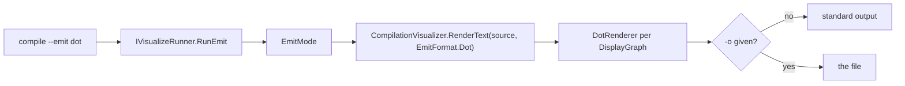

# Compile CLI — Emit DOT

> [!NOTE]
> Status: **implemented**. `ddown compile --emit dot` writes every compiler stage's
> display graph as Graphviz DOT text, to standard output or one `-o` file. It is a
> diagnostics export, not a dialogue interchange format.

## CLI surface

```bash
ddown compile scene.dialogue.md --emit dot            # every stage to standard output
ddown compile scene.dialogue.md --emit dot -o scene.dot
```

The output is one stream of several `digraph` definitions, each preceded by a
`// <stage title>` comment; a consumer that wants separate files splits on those
headers.

## Design



`CompilationVisualizer.RenderText` builds the same stages as the HTML report and
joins each stage's DOT under its header. `EmitMode` validates the script before
writing anything.

## Key design decisions

### D1 — Emission is non-interactive and lives on `compile`

Like writing a playbook, `--emit dot` needs a script, returns an exit code, and never
starts a server, so it belongs on `compile` beside the other exports. `CompileCommand`
routes it before the playbook path. `visualize --emit` is a hidden option that fails
with a message pointing to `compile`.

### D2 — DOT stays on the display graph

DOT is a thin formatter over the report's `DisplayGraph`, useful for external layout
tools. It does not claim to serialize executable dialogue, so a runtime exporter will
not inherit the report's presentation model; the executable format is the
[playbook](../runtime/Playbook%20Format.md).

### D3 — No Mermaid stage export

The report's interactive stage views already cover compiler visualization. Authors
use Mermaid for diagrams inside the script, which render in the report's Markdown
previews (see [Mermaid Authoring Diagrams](../visualization/editor/Mermaid%20Authoring%20Diagrams.md)).
`--emit mermaid` is rejected with a pointer to both.

## Error and boundary cases

| Case | Behavior |
| --- | --- |
| `--emit` unknown | Usage error: `Use 'playbook' or 'dot'.` |
| `--emit mermaid` | Usage error pointing to `--emit dot` for compiler graphs and to the report for fenced Mermaid blocks. |
| `--emit dot` with `--fix` | Usage error (see [Fix Mode](./Compile%20CLI%20-%20Fix%20Mode.md)). |
| Missing or invalid script | Nonzero exit; no partial output. |
| An empty stage | Its header and a valid, empty `digraph`. |
| `-o` given | Written only to the file. |
| Special characters in labels | Escaped for DOT quoted strings. |

## Testability

- `CompileSettings` / `CompileCommand`: `dot` routes to `RunEmit`; unknown values and
  `mermaid` fail without invoking a runner.
- `CompilationVisualizer.RenderText`: every stage has a header and a `digraph`.
- `DotRenderer`: nodes, edges, attributes, escaping.
- `EmitMode`: standard output versus file, and no output on a validation failure.
